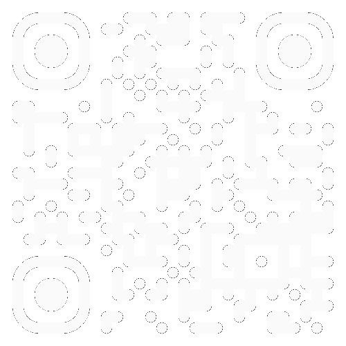

# Deep Learning for Audio Data

Note:
    - Seminar Deep Learning for Audio Data

<!-- .slide: data-state="no-header" -->
---

## Lecturer

    

        <figure style="text-align: center;">
            
            <figcaption>
                <strong>Fares Schulz</strong> 
                <a href="mailto:fares.schulz@tu-berlin.de" class="small">fares.schulz@tu-berlin.de</a>
            </figcaption>
        </figure>
    

    

        <strong style="margin-bottom: 0.5em;">Research Interests</strong>
        

            
•Neural Networks for Audio Effects and Synthesis

            
•Real-Time Audio Environments

            
•Mixed-Signal Audio Processing

        

        <strong style="margin: 1em 0 0.5em 0;">Research Associate Audio Communication Group</strong>
        

            
Lead of:

            
•Research Team Computer Music and Neural Audio Systems

            
•Electronic Studio of TU Berlin

        

    

---

## Course Topic

- Mathematical and algorithmic fundamentals of machine learning with focus on deep learning and neural networks
- Methods for data exploration, preprocessing and augmentation
- Training, evaluation, export and inference of deep learning models
- Setup and optimization of deep learning workflows, pipelines and lifecycles

  
Emphasis on: Creative applications of deep learning in the music production domain

---

## Deep Learning

    
    <figcaption><a href="https://www.edureka.co/blog/ai-vs-machine-learning-vs-deep-learning/" style="margin-top: 30px; display: inline-block;">Atul. (2025). <em>AI vs Machine Learning vs Deep Learning</em>. Edureka.</a></figcaption>

---

## Types of Learning

    

        <h3>Supervised Learning</h3>
        

            Learn from input-output pairs with external labels, where the algorithm is trained on a dataset containing both features and their corresponding correct answers.
        

        

            
Common Applications:

            Classification and regression tasks
        

    

    

        <h3>Unsupervised Learning</h3>
        

            Learn from unlabeled data to discover hidden patterns and structures without explicit guidance or target variables (includes self-supervised learning).
        

        

            
Common Applications:

            Clustering, dimensionality reduction, and generative models
        

    

    

        <h3>Reinforcement Learning</h3>
        

            Learn through trial-and-error interaction with an environment, optimizing actions based on rewards and penalties received.
        

        

            
Common Applications:

            Robotics, gaming, and autonomous systems
        

    

---

## Course Structure

    

        <ul>
            <li>Lectures: Theoretical foundations</li>
            <li>Jupyter Notebooks: Practical implementations in Python</li>
            <li>Projects: Hands-on experience with deep learning in audio</li>
        </ul>
        <strong>Where?</strong>
        <ul>
            <li>Resources: Slides and notebooks available on the course repository</li>
            <li>Project selection: On ISIS</li>
        </ul>
    

    

        <figure>
            

                <!-- Light theme QR code -->
                
                <!-- Dark theme QR code -->
                
                <figcaption><a href="https://github.com/faressc/dl4ad" class="small">github.com/faressc/dl4ad</a></figcaption>
            

        </figure>
    

Note:
    - New branch at the end of the semester

---

## Dates and Deadlines

<table style="width: 100%;">
    <thead>
        <tr>
            <th>Date</th>
            <th>Topic</th>
        </tr>
    </thead>
    <tbody>
        <tr>
            <td class="date">16.10.2025</td>
            <td>Introduction</td>
        </tr>
        <tr>
            <td class="date">23.10.2025</td>
            <td>Machine Learning Fundamentals</td>
        </tr>
        <tr class="fragment custom appear-table highlight">
            <td class="date">26.10.2025</td>
            <td>Course Application Deadline</td>
        </tr>
        <tr>
            <td class="date">30.10.2025</td>
            <td>Multi-layer Perceptrons</td>
        </tr>
        <tr>
            <td class="date">06.11.2025</td>
            <td>Convolutional and Recurrent Neural Networks</td>
        </tr>
        <tr>
            <td class="date">13.11.2025</td>
            <td>Preprocessing / Training Deep Architectures</td>
        </tr>
        <tr>
            <td class="date">20.11.2025</td>
            <td>Autoencoders / Transformers</td>
        </tr>
        <tr>
            <td class="date">27.11.2025</td>
            <td>Bayesian Inference</td>
        </tr>
        <tr>
            <td class="date">04.12.2025</td>
            <td>Variational Inference</td>
        </tr>
    </tbody>
</table>

<table style="width: 100%;">
    <thead>
        <tr>
            <th>Date</th>
            <th>Topic</th>
        </tr>
    </thead>
    <tbody>
        <tr>
            <td class="date">11.12.2025</td>
            <td>Variational Autoencoder</td>
        </tr>
        <tr class="fragment custom appear-table highlight">
            <td class="date">18.12.2025</td>
            <td>Project Pitches (14:00 - 18:00)</td>
        </tr>
        <tr>
            <td class="date">08.01.2026</td>
            <td>Adversarial Training</td>
        </tr>
        <tr>
            <td class="date">15.01.2026</td>
            <td>Diffusion Models</td>
        </tr>
        <tr>
            <td class="date">22.01.2026</td>
            <td>Real-Time Inference</td>
        </tr>
        <tr>
            <td class="date">29.01.2026</td>
            <td>Tricks of the Trade</td>
        </tr>
        <tr>
            <td class="date">05.02.2026</td>
            <td>Office Hours</td>
        </tr>
        <tr class="fragment custom appear-table highlight">
            <td class="date">12.02.2026</td>
            <td>Project Presentations (14:00 - 18:00)</td>
        </tr>
        <tr class="fragment custom appear-table highlight">
            <td class="date">31.03.2026</td>
            <td>Final Project Submission</td>
        </tr>
    </tbody>
</table>

---

## Course Application

    

        <strong>Application Deadline:</strong> 26.10.2025
    

    

        <strong>How to Apply:</strong> Send a confirmation email to <a href="mailto:fares.schulz@tu-berlin.de">fares.schulz@tu-berlin.de</a>
    

    

        <strong>What to Include:</strong>
        <ul>
            <li>Your full name</li>
            <li>Your matriculation number</li>
            <li>Course of Study</li>
            <li>University Email Address</li>
            <li>Evidence of completion of the modules "Signale und Systeme" or "Digitale Signalverarbeitung" (e.g. excerpt from certificate of grades)</li>
        </ul>
    

    

        <strong>Note:</strong> The course is limited to 16 participants (4 groups of 4). Selection will be based on a lottery. After receiving confirmation, enroll in MOSES until 6. November 2025.
    

---

## Assessment – ML4AD

**Project Presentation** (1/3 Grade) – *Date:* 18.12.2025

<ul class="small">
    <li>10-minute presentation per group and 5-minute Q&A session</li>
</ul>

**Git repository** (1/3 Grade) – *Deadline:* 31.03.2026

<ul class="small">
    <li>README with clear, step-by-step instructions for running your code</li>
    <li>Environment setup file (<code>requirements.txt</code>, <code>env.yml</code>, or <code>pyproject.toml</code>)</li>
    <li>Well-commented source code</li>
</ul>

**Project Paper** (1/3 Grade) – *Deadline:* 31.03.2026

<ul class="small">
    <li>Maximum 4 pages</li>
    <li>Use the <a href="https://www.ieee.org/conferences/publishing/templates.html">IEEE conference template</a></li>
</ul>

---

## Module Information

- This course is part of the module *Machine Learning and Big Data Processing with Audio and Music* [11005](https://moseskonto.tu-berlin.de/moses/modultransfersystem/bolognamodule/beschreibung/anzeigen.html?number=11005) (6 ECTS)
- The module consists of:
    - *Music Information Retrieval und Machine Learning für Audio* [13702](https://moseskonto.tu-berlin.de/moses/veranstaltungen/lehrveranstaltungsvorlagen/anzeigen.html?veranstaltungsvorlage=13702)
    - *Deep Learning for Audio Data* [13575](https://moseskonto.tu-berlin.de/moses/veranstaltungen/lehrveranstaltungsvorlagen/anzeigen.html?veranstaltungsvorlage=13575)
- AKT students can take this course as part of *Wahlpflichtbereich Vertiefung*

### Grading

- Project in Deep Learning for Audio Data (2/3 Grade)

- Lecture excercises in Music Information Retrieval und Machine Learning für Audio (1/3 Grade)

---

## Prerequisites

- Python Knowledge – [Python and Numpy Refresher](https://colab.research.google.com/github/cs231n/cs231n.github.io/blob/master/python-colab.ipynb)
- Linear Algebra – [Linear Algebra Review](https://see.stanford.edu/materials/aimlcs229/cs229-linalg.pdf) / [UDL Book Appendix B](https://github.com/udlbook/udlbook)
- Calculus – [Calculus Review](https://people.uncw.edu/hermanr/pde1/pdebook/CalcRev.pdf) / [UDL Book Appendix B](https://github.com/udlbook/udlbook)
- Probability Theory– [Probability Theory Review](https://see.stanford.edu/materials/aimlcs229/cs229-prob.pdf) / [UDL Book Appendix C](https://github.com/udlbook/udlbook)
- Statistics – [Statistics Cheat Sheet](https://stanford.edu/~shervine/teaching/cme-106/cheatsheet-statistics) / [UDL Book Appendix C](https://github.com/udlbook/udlbook)

**Digital Signal Processing**

    
Successful completion of the modules <em>Signale und Systeme</em> <a href="https://moseskonto.tu-berlin.de/moses/modultransfersystem/bolognamodule/ansehen.html?nummer=40700">40700</a>, <em>Digitale Signalverarbeitung</em> <a href="https://moseskonto.tu-berlin.de/moses/modultransfersystem/bolognamodule/ansehen.html?nummer=10002">10002</a> or similar is required.

Note: If you don't know if your course counts, drop me an email.

---

## Additional Resources

- [Creative Machine Learning](https://github.com/acids-ircam/creative_ml) – Prof. Philippe Esling
- [Understanding Deep Learning](https://github.com/udlbook/udlbook) – Simon J.D. Prince
- [Machine Learning Specialization](https://www.coursera.org/specializations/machine-learning-introduction) – Andrew Ng
- [Deep Learning Specialization](https://www.coursera.org/specializations/deep-learning) – Andrew Ng
- [Milestone Paper Overview](https://github.com/faressc/dl4ad/blob/main/extras/milestone_paper_overview.md)

**TU Berlin Modules**

- *Machine Learning I/II* ([40550](https://moseskonto.tu-berlin.de/moses/modultransfersystem/bolognamodule/ansehen.html?nummer=40550)/[40551](https://moseskonto.tu-berlin.de/moses/modultransfersystem/bolognamodule/ansehen.html?nummer=40551))
- *Deep Learning I/II* ([41071](https://moseskonto.tu-berlin.de/moses/modultransfersystem/bolognamodule/ansehen.html?nummer=41071)/[41072](https://moseskonto.tu-berlin.de/moses/modultransfersystem/bolognamodule/ansehen.html?nummer=41072))

---

# History of Deep Learning

---

## Mathematical Foundations

<!-- Calculus & Optimization Timeline -->

    

        
Calculus & Linear Algebra

        
Basis for optimization algorithms and machine learning model operations

    

    

        

        

            

                
1676

                
Chain Rule

                
Leibniz, G. W.

            

        

        

        

        

            

                
1805

                
Least Squares

                
Legendre, A. M.

            

        

        

        

        

            

                
1809

                
Normal Equations

                
Gauss, C. F.

            

        

        

        

        

            

                
1847

                
Gradient Descent

                
Cauchy, A. L.

            

        

        

        

        

            

                
1858

                
Eigenvalue Theory

                
Cayley & Hamilton

            

        

        

        

        

            

                
1901

                
PCA

                
Pearson, K.

            

        

        

    

<!-- Probability & Statistics Timeline -->

    

        
Probability & Statistics

        
Basis for Bayesian methods, statistical inference, and generative models

    

    

        

        

            

                
1763

                
Bayes' Theorem

                
Bayes, T.

            

        

        

        

        

            

                
1812

                
Bayesian Probability

                
Laplace, P. S.

            

        

        

        

        

            

                
1815

                
Gaussian Distribution

                
Gauss, C. F.

            

        

        

        

        

            

                
1830

                
Central Limit Theorem

                
Various

            

        

        

        

        

            

                
1922

                
Maximum Likelihood

                
Fisher, R.

            

        

        

    

<!-- Information & Computation Timeline -->

    

        
Information & Computation

        
Foundations of algorithmic thinking and information theory

    

    

        

        

            

                
1843

                
First Computer Algorithm

                
Lovelace, A.

            

        

        

        

        

            

                
1936

                
Turing Machine

                
Turing, A.

            

        

        

        

        

            

                
1947

                
Linear Programming

                
Dantzig, G.

            

        

        

        

        

            

                
1948

                
Information Theory

                
Shannon, C.

            

        

        

    

---

## Deep Learning Evolution

<!-- Neural Networks & Architectures Timeline -->

    

        
Architectures & Layers

        
Evolution of network architectures and layer innovations

    

    

        

        

            

                
1943

                
Artificial Neurons

                
McCulloch & Pitts

            

        

        

        

        

            

                
1957

                
Perceptron

                
Rosenblatt, F.

            

        

        

        

        

            

                
1965

                
Deep Networks

                
Ivakhnenko & Lapa

            

        

        

        

        

            

                
1979

                
Convolutional Networks

                
Fukushima, K.

            

        
 
        

        

        

            

                
1982

                
Recurrent Networks

                
Hopfield

            

        

        

        

        

            

                
1997

                
LSTM

                
Hochreiter & Schmidhuber

            

        

        

        

        

            

                
2006

                
Deep Belief Networks

                
Hinton, G. et al.

            

        

        

        

        

            

                
2012

                
AlexNet

                
Krizhevsky et al.

            

        

        

    

<!-- Training & Optimization Timeline -->

    

        
Training & Optimization

        
Methods for efficient learning and gradient-based optimization

    

    

        

        

            

                
1967

                
Stochastic Gradient Descent

                
Amari, S.

            

        

        

        

        

            

                
1970

                
Automatic Differentiation

                
Linnainmaa, S.

            

        

        

        

        

            

                
1986

                
Backpropagation

                
Hinton et al.

            

        

        

        

        

            

                
1992

                
Weight Decay

                
Krogh & Hertz

            

        

        

        

        

            

                
2010

                
ReLU & Xavier Init

                
Nair, Hinton & Glorot

            

        

        

        

        

            

                
2012

                
Dropout

                
Hinton, G. et al.

            

        

        

    

<!-- Software & Datasets Timeline -->

    

        
Software & Datasets

        
Tools, platforms, and milestones that enabled practical deep learning

    

    

        

        

            

                
1997

                
Deep Blue

                
IBM

            

        

        

        

        

            

                
1998

                
MNIST Dataset & LeNet 5

                
LeCun, Y. et al.

            

        

        

        

        

            

                
2002

                
Torch Framework

                
Torch Team

            

        

        

        

        

            

                
2007

                
CUDA Platform

                
NVIDIA

            

        

        

        

        

            

                
2009

                
ImageNet Dataset

                
Deng, J. et al.

            

        

        

        

        

            

                
2011

                
Siri

                
Apple Inc.

            

        

        

    

---

## Modern Deep Learning

<!-- Layers & Architectures Timeline -->

    

        
Architectures & Models

        
Advanced architectures and generative models transforming AI capabilities

    

    

        

        

            

                
2014

                
VAEs & GANs

                
Kingma & Goodfellow

            

        

        

        

        

            

                
2015

                
ResNet & Diffusion

                
He et al. & Sohl-Dickstein et al.

            

        

        

        

        

            

                
2016

                
Style Transfer & WaveNet

                
Gatys & van den Oord

            

        

        

        

        

            

                
2017

                
Transformers

                
Vaswani et al.

            

        

        

        

        

            

                
2021

                
ViT & CLIP

                
Dosovitskiy & Radford

            

        

        

        

        

            

                
2022

                
DiT (Diffusion Transformer)

                
Peebles & Xie

            

        

        

        

        

            

                
2023

                
Mamba

                
Gu & Dao

            

        

        

    

<!-- Training & Optimization Timeline -->

    

        
Training & Optimization

        
Advanced learning techniques and representation learning breakthroughs

    

    

        

        

            

                
2013

                
Word2Vec

                
Mikolov, T. et al.

            

        

        

        

        

            

                
2014

                
Attention Mechanism

                
Bahdanau, D. et al.

            

        

        

        

        

            

                
2015

                
BatchNorm & Adam

                
Ioffe & Kingma

            

        

        

        

        

            

                
2016

                
Layer Normalization

                
Ba, J. L. et al.

            

        

        

        

        

            

                
2020

                
DDPM

                
Ho, J. et al.

            

        

        

    

<!-- Software & Applications Timeline -->

    

        
Software & Applications

        
Practical deployment and mainstream adoption of deep learning systems

    

    

        

        

            

                
2016

                
AlphaGo

                
Silver, D. et al.

            

        

        

        

        

            

                
2017

                
PyTorch

                
Paszke, A. et al.

            

        

        

        

        

            

                
2018

                
GPT-1

                
Radford & Devlin

            

        

        

        

        

            

                
2020

                
GPT-3

                
Brown, T. B. et al.

            

        

        

        

        

            

                
2022

                
ChatGPT & Stable Diffusion

                
OpenAI & Stability AI

            

        

        

        

        

            

                
2023

                
LLaMA

                
Touvron, H. et al.

            

        

        

    

---

# Modern Neural Audio Systems

---

## Overview

---

---

## Setup

---

## References
