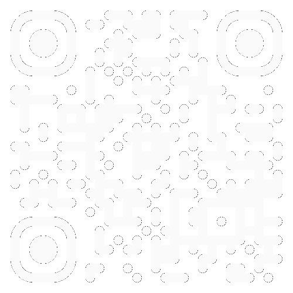

# Machine Learning for Audio Data

Note:
    - Seminar Machine Learning for Audio Data

<!-- .slide: data-state="no-header" -->
---

## Lecturer

    

        <figure style="text-align: center;">
            
            <figcaption>
                <strong>Fares Schulz</strong> 
                <a href="mailto:fares.schulz@tu-berlin.de" class="small">fares.schulz@tu-berlin.de</a>
            </figcaption>
        </figure>
    

    

        <strong style="margin-bottom: 0.5em;">Research Interests</strong>
        

            
•Neural Networks for Audio Effects and Synthesis

            
•Real-Time Audio Environments

            
•Mixed-Signal Audio Processing

        

        <strong style="margin: 1em 0 0.5em 0;">Research Associate Audio Communication Group</strong>
        

            
Lead of:

            
•Research Team Computer Music and Neural Audio Systems

            
•Electronic Studio of TU Berlin

        

    

---

## Course Topic

- Mathematical and algorithmic fundamentals of machine learning with focus on deep learning and neural networks
- Methods for data exploration, preprocessing and augmentation
- Training, evaluation, export and inference of deep learning models
- Setup and optimization of machine learning workflows, pipelines and lifecycles

  
Emphasis on: Creative applications of deep learning in the music production domain

---

## Deep Learning

    
    <figcaption><a href="https://www.edureka.co/blog/ai-vs-machine-learning-vs-deep-learning/" style="margin-top: 30px; display: inline-block;">Atul. (2025). <em>AI vs Machine Learning vs Deep Learning</em>. Edureka.</a></figcaption>

---

## Types of Learning

    

        <h3>Supervised Learning</h3>
        

            Learn from input-output pairs with external labels, where the algorithm is trained on a dataset containing both features and their corresponding correct answers.
        

        

            
Common Applications:

            Classification and regression tasks
        

    

    

        <h3>Unsupervised Learning</h3>
        

            Learn from unlabeled data to discover hidden patterns and structures without explicit guidance or target variables (includes self-supervised learning).
        

        

            
Common Applications:

            Clustering, dimensionality reduction, and generative models
        

    

    

        <h3>Reinforcement Learning</h3>
        

            Learn through trial-and-error interaction with an environment, optimizing actions based on rewards and penalties received.
        

        

            
Common Applications:

            Robotics, gaming, and autonomous systems
        

    

---

## Course Structure

    

        <ul>
            <li>Lectures: Theoretical foundations</li>
            <li>Jupyter Notebooks: Practical implementations in Python</li>
            <li>Projects: Hands-on experience with deep learning in audio</li>
        </ul>
        <strong>Where?</strong>
        <ul>
            <li>Resources: Slides and notebooks available on the course repository</li>
            <li>Project selection: On ISIS</li>
        </ul>
    

    

        <figure>
            

                <!-- Light theme QR code -->
                
                <!-- Dark theme QR code -->
                
                <figcaption><a href="https://github.com/faressc/dl4ad" class="small">github.com/faressc/dl4ad</a></figcaption>
            

        </figure>
    

Note:
    - New branch at the end of the semester

---

## Dates and Deadlines

<table style="width: 100%;">
    <thead>
        <tr>
            <th>Date</th>
            <th>Topic</th>
        </tr>
    </thead>
    <tbody>
        <tr>
            <td class="date">16.10.2025</td>
            <td>Introduction / Machine Learning Fundamentals I</td>
        </tr>
        <tr>
            <td class="date">23.10.2025</td>
            <td>Machine Learning Fundamentals II</td>
        </tr>
        <tr class="fragment custom appear-table highlight">
            <td class="date">26.10.2025</td>
            <td>Course Application Deadline</td>
        </tr>
        <tr>
            <td class="date">30.10.2025</td>
            <td>Neural Networks</td>
        </tr>
        <tr>
            <td class="date">06.11.2025</td>
            <td>Convolutional and Recurrent Neural Networks</td>
        </tr>
        <tr>
            <td class="date">13.11.2025</td>
            <td>Preprocessing / Training Deep Architectures</td>
        </tr>
        <tr>
            <td class="date">20.11.2025</td>
            <td>Autoencoders / Transformers</td>
        </tr>
        <tr>
            <td class="date">27.11.2025</td>
            <td>Bayesian Inference</td>
        </tr>
        <tr>
            <td class="date">04.12.2025</td>
            <td>Variational Inference</td>
        </tr>
    </tbody>
</table>

<table style="width: 100%;">
    <thead>
        <tr>
            <th>Date</th>
            <th>Topic</th>
        </tr>
    </thead>
    <tbody>
        <tr>
            <td class="date">11.12.2025</td>
            <td>Variational Autoencoder</td>
        </tr>
        <tr class="fragment custom appear-table highlight">
            <td class="date">18.12.2025</td>
            <td>Project Pitches</td>
        </tr>
        <tr>
            <td class="date">08.01.2026</td>
            <td>Adversarial Training</td>
        </tr>
        <tr>
            <td class="date">15.01.2026</td>
            <td>Diffusion Models</td>
        </tr>
        <tr>
            <td class="date">22.01.2026</td>
            <td>Real-Time Inference</td>
        </tr>
        <tr>
            <td class="date">29.01.2026</td>
            <td>Tricks of the Trade</td>
        </tr>
        <tr>
            <td class="date">05.02.2026</td>
            <td>Office Hours</td>
        </tr>
        <tr class="fragment custom appear-table highlight">
            <td class="date">12.02.2026</td>
            <td>Project Presentations (14:00 - 18:00)</td>
        </tr>
        <tr class="fragment custom appear-table highlight">
            <td class="date">31.03.2026</td>
            <td>Final Project Submission</td>
        </tr>
    </tbody>
</table>

---

## Course Application

    

        <strong>Application Deadline:</strong> 26.10.2025
    

    

        <strong>How to Apply:</strong> Send a confirmation email to <a href="mailto:fares.schulz@tu-berlin.de">fares.schulz@tu-berlin.de</a>
    

    

        <strong>What to Include:</strong>
        <ul>
            <li>Your full name</li>
            <li>Your matriculation number</li>
            <li>Course of Study</li>
            <li>University Email Address</li>
            <li>Evidence of completion of the modules "Signale und Systeme" or "Digitale Signalverarbeitung" (e.g. excerpt from certificate of grades)</li>
        </ul>
    

    

        <strong>Note:</strong> The course is limited to 16 participants (4 groups of 4). Selection will be based on a lottery.
    

---

## Assessment

**Project Presentation** (1/3 Grade) – *Date:* 18.12.2025

<ul class="small">
    <li>10-minute presentation per group and 5-minute Q&A session</li>
</ul>

**Git repository** (1/3 Grade) – *Deadline:* 31.03.2026

<ul class="small">
    <li>README with clear, step-by-step instructions for running your code</li>
    <li>Environment setup file (<code>requirements.txt</code>, <code>env.yml</code>, or <code>pyproject.toml</code>)</li>
    <li>Well-commented source code</li>
</ul>

**Project Paper** (1/3 Grade) – *Deadline:* 31.03.2026

<ul class="small">
    <li>Maximum 4 pages</li>
    <li>Use the <a href="https://www.ieee.org/conferences/publishing/templates.html">IEEE conference template</a></li>
</ul>

---

## Module Information

- This course is part of the module [Machine Learning and Big Data Processing with Audio and Music](https://moseskonto.tu-berlin.de/moses/modultransfersystem/bolognamodule/beschreibung/anzeigen.html?number=11005) (6 ECTS)
- The module consists of:
    - [Big Data Processing with Audio and Music](https://moseskonto.tu-berlin.de/moses/veranstaltungen/lehrveranstaltungsvorlagen/anzeigen.html?veranstaltungsvorlage=13702)
    - [Machine Learning for Audio Data](https://moseskonto.tu-berlin.de/moses/veranstaltungen/lehrveranstaltungsvorlagen/anzeigen.html?veranstaltungsvorlage=13575)
- AKT students can take this course as part of "Wahlpflichtbereich Vertiefung"

---

## Prerequisites

- Python Knowledge – [Python and Numpy Refresher](https://colab.research.google.com/github/cs231n/cs231n.github.io/blob/master/python-colab.ipynb)
- Linear Algebra – [Linear Algebra Review and Reference](https://see.stanford.edu/materials/aimlcs229/cs229-linalg.pdf)
- Calculus – [Calculus Review](https://people.uncw.edu/hermanr/pde1/pdebook/CalcRev.pdf)
- Probability Theory– [Probability Theory Review](https://see.stanford.edu/materials/aimlcs229/cs229-prob.pdf)
- Statistics – [Statistics Cheat Sheet](https://stanford.edu/~shervine/teaching/cme-106/cheatsheet-statistics)

**Digital Signal Processing**

    
Successful completion of the modules <a href="https://moseskonto.tu-berlin.de/moses/modultransfersystem/bolognamodule/ansehen.html?nummer=40700">40700</a> Signale und Systeme, <a href="https://moseskonto.tu-berlin.de/moses/modultransfersystem/bolognamodule/ansehen.html?nummer=10002">10002</a> Digitale Signalverarbeitung or similar is required.

Note: If you don't know if your course counts, drop me an email.

---

## Additional Resources

- [Creative Machine Learning Course](https://github.com/acids-ircam/creative_ml) – Prof. Philippe Esling
- [Understanding Deep Learning](https://github.com/udlbook/udlbook) – Simon J.D. Prince
- [Machine Learning Specialization](https://www.coursera.org/specializations/machine-learning-introduction) – Andrew Ng
- [Deep Learning Specialization](https://www.coursera.org/specializations/deep-learning) – Andrew Ng
- [Milestone Paper Overview](https://github.com/faressc/dl4ad/blob/main/extras/milestone_paper_overview.md)

**TU Berlin Modules**

- Machine Learning I/II ([40550](https://moseskonto.tu-berlin.de/moses/modultransfersystem/bolognamodule/ansehen.html?nummer=40550)/[40551](https://moseskonto.tu-berlin.de/moses/modultransfersystem/bolognamodule/ansehen.html?nummer=40551))
- Deep Learning I/II ([41071](https://moseskonto.tu-berlin.de/moses/modultransfersystem/bolognamodule/ansehen.html?nummer=41071)/[41072](https://moseskonto.tu-berlin.de/moses/modultransfersystem/bolognamodule/ansehen.html?nummer=41072))

---

## Brief Machine Learning History

---

## State-of-the-art use cases

---

# Machine Learning

---
