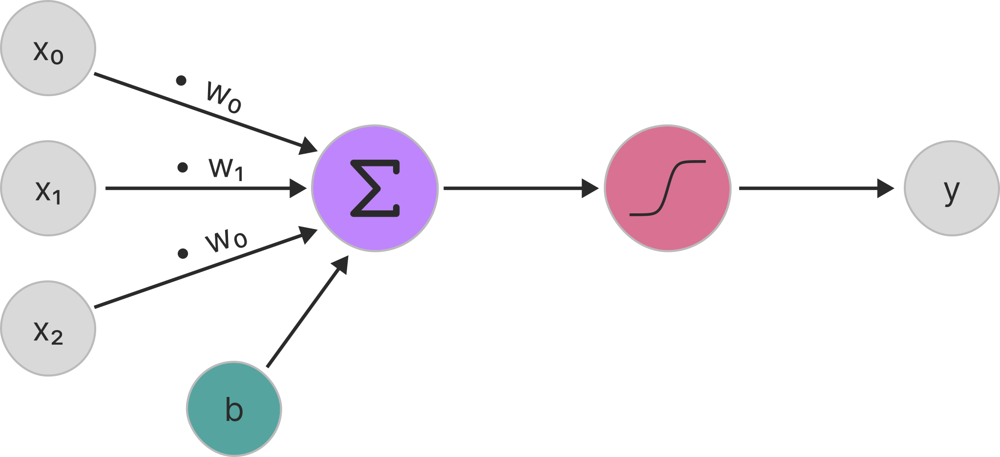

<h1>History of<br>Neural Audio Systems</h1>

---

## Mathematical Foundations

<div class="timeline-container" style="flex-direction: row;">
    <div style="width: 20%;">
        <div class="timeline-title">Calculus & Linear Algebra</div>
        <div class="timeline-text">Basis for optimization algorithms and machine learning model operations</div>
    </div>
    <div class="timeline" style="width: 80%; --start-year: 1676; --end-year: 1951;" data-timeline-fragments-select="1676:0,1805:1,1809:2,1847:3,1858:4,1901:5">
        {{TIMELINE:timeline_calculus_linear_algebra}}
    </div>
</div>

<div class="fragment appear-vanish" data-fragment-index="0" style="margin-top: 20px;">
    <p><strong>Chain Rule:</strong> For composite functions $f(g(x))$, the derivative is:</p>
    <p style="text-align: center; margin: 20px 0;">
        $$\frac{df}{dx} = \frac{df}{dg} \cdot \frac{dg}{dx}$$
    </p>
</div>

<div class="fragment appear-vanish" data-fragment-index="1" style="margin-top: 20px;">
    <p><strong>Least Squares:</strong> Method to find the best-fitting curve by minimizing the sum of squared residuals:</p>
    <p style="text-align: center; margin: 20px 0;">
        $$\min_{\boldsymbol{\beta}} \sum_{i=1}^{n} (y_i - f(\mathbf{x}_i, \boldsymbol{\beta}))^2$$
    </p>
    <p style="text-align: center; margin: 10px 0;">
        where $y_i$ are observed values, $f(\mathbf{x}_i, \boldsymbol{\beta})$ are predicted values, and $\boldsymbol{\beta}$ are parameters
    </p>
</div>

<div class="fragment appear-vanish" data-fragment-index="2" style="margin-top: 20px;">
    <p><strong>Normal Equations:</strong> Closed-form solution for linear regression by setting the gradient to zero:</p>
    <p style="text-align: center; margin: 20px 0;">
        $$\boldsymbol{\beta} = (\mathbf{X}^T \mathbf{X})^{-1} \mathbf{X}^T \mathbf{y}$$
    </p>
    <p style="text-align: center; margin: 10px 0;">
        where $\mathbf{X}$ is the data matrix (observations $ \times $ features), $\mathbf{y}$ is the target vector, and $\boldsymbol{\beta}$ are the optimal parameters
    </p>
</div>

<div class="fragment appear-vanish" data-fragment-index="3" style="margin-top: 20px;">
    <p><strong>Gradient Descent:</strong> Iterative optimization algorithm that updates parameters $\boldsymbol{\theta}$ by moving in the direction opposite to the gradient:</p>
    <p style="text-align: center; margin: 20px 0;">
        $$\boldsymbol{\theta}_{t+1} = \boldsymbol{\theta}_t - \eta \nabla_{\boldsymbol{\theta}} L(\boldsymbol{\theta}_t)$$
    </p>
    <p style="text-align: center; margin: 10px 0;">
        where $\eta$ is the learning rate and $\nabla_{\boldsymbol{\theta}} L$ is the gradient of the loss function
    </p>
</div>

<div class="fragment appear-vanish" data-fragment-index="4" style="margin-top: 20px;">
    <p><strong>Eigenvalue Theory:</strong> For a square matrix $\mathbf{A}$, eigenvalues $\lambda$ and eigenvectors $\mathbf{v}$ satisfy:</p>
    <p style="text-align: center; margin: 20px 0;">
        $$\mathbf{A}\mathbf{v} = \lambda \mathbf{v}$$
    </p>
    <p style="text-align: center; margin: 10px 0;">
        where $\mathbf{v} \neq \mathbf{0}$ is an eigenvector and $\lambda$ is the corresponding eigenvalue (scalar)
    </p>
</div>

<div class="fragment appear-vanish" data-fragment-index="5" style="margin-top: 20px;">
    <p><strong>Principal Component Analysis (PCA):</strong> Dimensionality reduction technique that finds orthogonal directions of maximum variance:</p>
    <p style="text-align: center; margin: 20px 0;">
        $$\mathbf{w}_1 = \arg\max_{\|\mathbf{w}\|=1} \text{Var}(\mathbf{X}\mathbf{w}) = \arg\max_{\|\mathbf{w}\|=1} \mathbf{w}^T \mathbf{\Sigma} \mathbf{w}$$
    </p>
    <p style="text-align: center; margin: 10px 0;">
        where $\mathbf{X}$ is the data matrix, $\mathbf{\Sigma}$ is the covariance matrix, and $\mathbf{w}$ are the principal components (eigenvectors)
    </p>
</div>

---

## Mathematical Foundations

<div class="timeline-container" style="flex-direction: row;">
    <div style="width: 20%;">
        <div class="timeline-title">Calculus & Linear Algebra</div>
        <div class="timeline-text">Basis for optimization algorithms and machine learning model operations</div>
    </div>
    <div class="timeline" style="width: 80%; --start-year: 1676; --end-year: 1951;">
        {{TIMELINE:timeline_calculus_linear_algebra}}
    </div>
</div>

<div class="timeline-container" style="flex-direction: row;">
    <div style="width: 20%;">
        <div class="timeline-title">Probability & Statistics</div>
        <div class="timeline-text">Basis for Bayesian methods, statistical inference, and generative models</div>
    </div>
    <div class="timeline" style="width: 80%; --start-year: 1676; --end-year: 1951;" data-timeline-fragments-select="1763:0,1815:3,1830:6,1922:9">
        {{TIMELINE:timeline_probability_statistics}}
    </div>
</div>

<div class="timeline-container" style="flex-direction: row;">
    <div style="width: 20%;">
        <div class="timeline-title">Information & Computation</div>
        <div class="timeline-text">Foundations of algorithmic thinking and information theory</div>
    </div>
    <div class="timeline" style="width: 80%; --start-year: 1676; --end-year: 1951;">
        {{TIMELINE:timeline_information_computation}}
    </div>
</div>

<div class="fragment appear-vanish image-overlay" data-fragment-index="1" style="text-align: center; width: 60%;">
<p><strong>Bayes' Theorem:</strong> Relates conditional probabilities and forms the foundation of Bayesian inference:</p>
<p style="text-align: center; margin: 20px 0;">
    $$P(A|B) = \frac{P(B|A) \cdot P(A)}{P(B)}$$
</p>
<p style="text-align: center; margin: 10px 0;">
    where $P(A|B)$ is the posterior probability, $P(B|A)$ is the likelihood, $P(A)$ is the prior, and $P(B)$ is the evidence
</p>
</div>

<div class="fragment" data-fragment-index="2"></div>

<div class="fragment appear-vanish image-overlay" data-fragment-index="4" style="text-align: center; width: 60%;">
<p><strong>Gaussian (Normal) Distribution:</strong> Continuous probability distribution characterized by mean $\mu$ and variance $\sigma^2$:</p>
<p style="text-align: center; margin: 20px 0;">
    $$f(x) = \frac{1}{\sqrt{2\pi\sigma^2}} e^{-\frac{(x-\mu)^2}{2\sigma^2}} = \mathcal{N}(\mu, \sigma^2)$$
</p>
<p style="text-align: center; margin: 10px 0;">
    where $\mu$ is the mean (center) and $\sigma^2$ is the variance (spread) of the distribution
</p>
</div>

<div class="fragment" data-fragment-index="5"></div>

<div class="fragment appear-vanish image-overlay" data-fragment-index="7" style="text-align: center; width: 60%;">
<p><strong>Central Limit Theorem (CLT):</strong> The average of many independently sampled random variables approaches a normal distribution, <em>regardless of the original distribution</em>:</p>
<p style="text-align: center; margin: 20px 0;">
    $$\bar{X} \xrightarrow{d} \mathcal{N}\left(\mu, \frac{\sigma^2}{n}\right) \text{ as } n \to \infty$$
</p>
<p style="text-align: center; margin: 10px 0;">
    where $\bar{X} = \frac{1}{n}\sum_{i=1}^{n} X_i$ is the sample mean, $\mu$ is the population mean, $\sigma^2$ is the population variance, and $n$ is the sample size
</p>
</div>

<div class="fragment" data-fragment-index="8"></div>

<div class="fragment appear-vanish image-overlay" data-fragment-index="10" style="text-align: center; width: 60%;">
<p><strong>Maximum Likelihood Estimation (MLE):</strong> Method to estimate parameters by maximizing the likelihood function:</p>
<p style="text-align: center; margin: 20px 0;">
    $$\hat{\boldsymbol{\theta}}_{\text{MLE}} = \arg\max_{\boldsymbol{\theta}} \mathcal{L}(\boldsymbol{\theta} | \mathbf{x}) = \arg\max_{\boldsymbol{\theta}} \prod_{i=1}^{n} P(x_i | \boldsymbol{\theta})$$
</p>
<p style="text-align: center; margin: 10px 0;">
    where $\boldsymbol{\theta}$ are the parameters to estimate, $\mathcal{L}$ is the likelihood function, and $\mathbf{x}$ is the observed data
</p>
</div>

<div class="fragment" data-fragment-index="11"></div>

Notes:

<div style="font-size: 0.85em;">

- **Turing Machine (1936)**: Alan Turing's abstract computational model established theoretical limits of computation and introduced the concept of a universal machine capable of simulating any other computation
- **Linear Programming (1947)**: George Dantzig's simplex algorithm enabled systematic optimization of linear objective functions under constraints, becoming foundational for operations research and constrained optimization in machine learning
- **Information Theory (1948)**: Claude Shannon's mathematical framework quantified information and uncertainty through entropy ($H(X) = -\sum p(x) \log p(x)$), establishing fundamental limits for data compression and transmission that underpin modern loss functions and information measures in deep learning

</div>

---

## Early History of Neural Networks

<div class="timeline-container" style="flex-direction: row;">
    <div style="width: 20%;">
        <div class="timeline-title">Architectures & Layers</div>
        <div class="timeline-text">Evolution of network architectures and layer innovations</div>
    </div>
    <div class="timeline" style="width: 80%; --start-year: 1943; --end-year: 2012;" data-timeline-fragments-select="1943:0,1957:1,1965:2,1979:3,1982:4,1989:5,2006:6,2012:7">
        {{TIMELINE:timeline_early_nn_architectures}}
    </div>
</div>

<div class="fragment appear-vanish" data-fragment-index="0" style="text-align: center; margin-top: 60px;">
    
    <div class="reference" style="margin-top: 10px; text-align: center;">
        McCulloch, W. S., & Pitts, W. (1943). A logical calculus of the ideas immanent in nervous activity. The bulletin of mathematical biophysics, 5(4), 115-133.
    </div>
</div>

<div class="fragment appear-vanish" data-fragment-index="1" style="text-align: center; margin-top: 60px;">
    
</div>

<div class="fragment appear-vanish" data-fragment-index="2" style="text-align: center; margin-top: 20px;">
    
    <div class="reference" style="margin-top: 10px; text-align: center;">
        https://www.cudocompute.com/topics/neural-networks/introduction-to-recurrent-neural-networks-rnns
    </div>
</div>

<div class="fragment appear-vanish" data-fragment-index="3" style="text-align: center; margin-top: 20px;">
    
    <div class="reference" style="margin-top: 10px; text-align: center;">
        Fukushima, K. (1980). Neocognitron: A self-organizing neural network model for a mechanism of pattern recognition unaffected by shift in position. Biological Cybernetics, 36(4), 193–202. https://doi.org/10.1007/BF00344251
    </div>
</div>

<div class="fragment appear-vanish" data-fragment-index="4" style="text-align: center; margin-top: 20px;">
    
    <div class="reference" style="margin-top: 10px; text-align: center;">
        https://www.cudocompute.com/topics/neural-networks/introduction-to-recurrent-neural-networks-rnns
    </div>
</div>

<div class="fragment appear-vanish" data-fragment-index="5" style="text-align: center; margin-top: 20px;">
    
    <div class="reference" style="margin-top: 10px; text-align: center;">
        https://www.mql5.com/de/articles/15182
    </div>
</div>

<div class="fragment appear-vanish" data-fragment-index="6" style="text-align: center; margin-top: 20px;">
    
    <div class="reference" style="margin-top: 10px; text-align: center;">
        https://www.analyticsvidhya.com/blog/2022/03/an-overview-of-deep-belief-network-dbn-in-deep-learning/
    </div>
</div>

<div class="fragment appear-vanish" data-fragment-index="7" style="text-align: center; margin-top: 60px;">
    
    <div class="reference" style="margin-top: 10px; text-align: center;">
        Krizhevsky, A., Sutskever, I., & Hinton, G. E. (2012). Imagenet classification with deep convolutional neural networks. Advances in neural information processing systems, 25.
    </div>
</div>

Notes:

<div style="font-size: 0.85em;">

- In 1943, McCulloch and Pitts created the first mathematical model of an artificial neuron
- Demonstrated neurons could be modeled as binary threshold units performing logical operations (AND, OR, NOT)
- Proved networks of artificial neurons could compute any logical or arithmetic function
- Provided the first formal argument that the brain could be understood as a computing device
- In 1957, the perceptron was introduced by Frank Rosenblatt
- It was a simple model that could learn to classify inputs into different categories, by adjusting weights based on errors
- These errors were calculated from prelabeled data, which is called supervised learning
- Later, the multi-layer perceptron was developed, allowing for more complex representations of data
- In 1979, convolutional neural networks were introduced - replacing the multiplications with convolution operations
- And three years later - Hopfield networks were proposed, introducing recurrent connections - temporal dynamics
- Then the backpropagation algorithm enabled training of multi-layer networks - efficiently computing gradients
- Before the deep learning era, Deep Belief Networks were proposed as a way to pre-train deep networks layer by layer
- Finally, in 2012, AlexNet demonstrated the power of large deep convolutional networks on image classification tasks - marking the beginning of the deep learning revolution

</div>

---

## Early History of Neural Networks

<div class="timeline-container" style="flex-direction: row;">
    <div style="width: 20%;">
        <div class="timeline-title">Architectures & Layers</div>
        <div class="timeline-text">Evolution of network architectures and layer innovations</div>
    </div>
    <div class="timeline" style="width: 80%; --start-year: 1943; --end-year: 2012;">
        {{TIMELINE:timeline_early_nn_architectures}}
    </div>
</div>

<div class="timeline-container" style="flex-direction: row;">
    <div style="width: 20%;">
        <div class="timeline-title">Training & Optimization</div>
        <div class="timeline-text">Methods for efficient learning and gradient-based optimization</div>
    </div>
    <div class="timeline" style="width: 80%; --start-year: 1943; --end-year: 2012;" data-timeline-fragments-select="1967:0,1986:3,2010:6">
        {{TIMELINE:timeline_early_nn_training}}
    </div>
</div>

<div class="timeline-container" style="flex-direction: row;">
    <div style="width: 20%;">
        <div class="timeline-title">Software & Datasets</div>
        <div class="timeline-text">Tools, platforms, and milestones that enabled practical deep learning</div>
    </div>
    <div class="timeline" style="width: 80%; --start-year: 1943; --end-year: 2012;" data-timeline-fragments-select="1998:9,2009:12">
        {{TIMELINE:timeline_early_nn_software}}
    </div>
</div>

<div class="fragment appear-vanish image-overlay" data-fragment-index="1" style="text-align: center; width: 60%;">

```python
# Initialize parameters
θ = initialize_parameters()
learning_rate = 0.01
num_epochs = 100

# Training loop
for epoch in range(num_epochs):
    # Shuffle training data
    shuffle(training_data)
    
    # Iterate through each training example
    for (x_i, y_i) in training_data:
        # Compute gradient for single example
        gradient = compute_gradient(loss(θ, x_i, y_i))
        
        # Update parameters
        θ = θ - learning_rate * gradient
```

</div>

<div class="fragment" data-fragment-index="2"></div>

<div class="fragment appear-vanish image-overlay" data-fragment-index="4" style="text-align: center; width: 60%;">
    
    <div class="reference" style="margin-top: 10px; text-align: center;">
        https://www.linkedin.com/pulse/backpropagation-neural-networks-brain-behind-deep-learning-ali-v8fsf
    </div>
</div>

<div class="fragment" data-fragment-index="5"></div>

<div class="fragment appear-vanish image-overlay" data-fragment-index="7" style="text-align: center; width: 60%;">
    
    <div class="reference" style="margin-top: 10px; text-align: center;">
        https://machinelearningmastery.com/rectified-linear-activation-function-for-deep-learning-neural-networks/
    </div>
</div>

<div class="fragment" data-fragment-index="8"></div>

<div class="fragment appear-vanish image-overlay" data-fragment-index="10" style="text-align: center; width: 60%;">
    
    <div class="reference" style="margin-top: 10px; text-align: center;">
        https://de.wikipedia.org/wiki/MNIST-Datenbank#/media/Datei:MnistExamples.png
    </div>
</div>

<div class="fragment" data-fragment-index="11"></div>

<div class="fragment appear-vanish image-overlay" data-fragment-index="13" style="text-align: center; width: 80%;">
    
    <div class="reference" style="margin-top: 10px; text-align: center;">
        https://blog.roboflow.com/introduction-to-imagenet/
    </div>
</div>

<div class="fragment" data-fragment-index="14"></div>

Notes:

- MNIST dataset of handwritten digits - 70,000 images
- ImageNet over 14 million images with hand-annotated labels

---

## Early History of Neural Audio Systems

<div class="timeline-container" style="flex-direction: column; gap: 10px;">
    <div style="display: flex; justify-content: space-between; align-items: flex-start;">
        <div style="width: 20%;">
            <div class="timeline-title">Key Milestones</div>
            <div class="timeline-text">Significant developments in neural audio systems</div>
        </div>
        <div style="display: flex; flex-direction: column; justify-content: space-between; align-items: flex-start; width: 80%; gap: 20px;">
            <div class="timeline timeline-secondary" style="width: 98%; --start-year: 1957; --end-year: 2012;">
                {{TIMELINE:timeline_early_milestones}}
            </div>
            <div class="timeline timeline-purple" style="width: 98%; --start-year: 1957; --end-year: 2012;" data-timeline-fragments-select="1960:0,1989:2,1999:5,2009:6">
                {{TIMELINE:timeline_early_audio_key_milestones}}
            </div>
        </div>
    </div>
</div>

<div class="fragment appear-vanish" data-fragment-index="0" style="margin-top: 20px;">
    <h3>Least Mean Square Filtering<br>
    <span style="font-weight: normal; font-size: 0.6em; font-height: 0.6em;">(Widrow & Hoff)</span></h3>
    <ul>
        <li>Adaptive filtering algorithm for noise cancellation and echo suppression</li>
        <li>Uses <strong>stochastic gradient descent</strong> to minimize error between desired and actual output</li>
        <li>SGD = Foundation for later neural network training methods</li>
    </ul>
</div>

<div class="fragment" data-fragment-index="1"></div>

<div class="fragment appear-vanish image-overlay" data-fragment-index="3" style="text-align: center; top: 100%;">
    
    <div class="reference" style="margin: 10px; text-align: center;">
        Todd, P. M. (1989). A Connectionist Approach to Algorithmic Composition. Computer Music Journal, 13(4), 27–43.
    </div>
</div>

<div class="fragment" data-fragment-index="4"></div>

<div class="fragment appear-vanish" data-fragment-index="5" style="margin-top: 60px;">
    <h3>Neural Networks for Piano Transcription
    <br><span style="font-weight: normal;">(Matija Marolt)</span></h3>
    <ul>
        <li>Division of audio signals into frequency bands</li>
        <li>One Multilayer Perceptron (MLP) for each band</li>
    </ul>
</div>

<div class="fragment appear-vanish" data-fragment-index="6" style="margin-top: 20px;">
    <h3>Unsupervised Audio Feature Learning with Deep Belief Networks<br>
    <span style="font-weight: normal;">(Lee et al.)</span></h3>
    <ul>
        <li>Learning of audio features from unlabeled data - unsupervised learning</li>
        <li>Outperformed traditional hand-crafted features in many classification tasks</li>
    </ul>
</div>

Notes:

<div style="font-size: 0.85em;">

- Now let's look at some key milestones in neural audio systems during this early history
- Already in 1960, Widrow and Hoff introduced the Least Mean Square filtering algorithm
- Then 27 years later, neural networks were applied to phoneme recognition
- In 1989, Peter Todd used RNNs for symbolic music generation
- In the same year, there have been first attempts to use gradient descent for musical DSP
- In 1997, neural networks were used the first time for modeling analog effects
- Music transcription with neural networks dates back to 1999, with Matija Marolt's work on piano transcription
- Finally in 2009, Lee et al. demonstrated the effectiveness of deep belief networks for learning audio features with unsupervised learning - unlabeled data
- These features outperformed traditional hand-crafted features in many classification tasks

---

## Early History of Neural Audio Systems

<div class="timeline-container" style="flex-direction: column; gap: 10px;">
    <div style="display: flex; justify-content: space-between; align-items: flex-start;">
        <div style="width: 20%;">
            <div class="timeline-title">Key Milestones</div>
            <div class="timeline-text">Significant developments in neural audio systems</div>
        </div>
        <div style="display: flex; flex-direction: column; justify-content: space-between; align-items: flex-start; width: 80%; gap: 20px;">
            <div class="timeline timeline-secondary" style="width: 98%; --start-year: 1957; --end-year: 2012;">
                {{TIMELINE:timeline_early_milestones}}
            </div>
            <div class="timeline timeline-purple" style="width: 98%; --start-year: 1957; --end-year: 2012;" data-timeline-fragments-color-0="1960:0,1989.2:0,1997:0" data-timeline-fragments-color-1="1987:1,1999:1,2009:1" data-timeline-fragments-color-2="1989:2">
                {{TIMELINE:timeline_early_audio_key_milestones}}
            </div>
        </div>
    </div>
</div>

<div class="tiles-grid">
    <div class="tile fragment color-0" data-fragment-index="0">
        <h3>Gradient Descent Based<br>Digital Signal Processing</h3>
        <div class="tile-description">
            Use gradient descent to optimize parameters of digital signal processing algorithms for tasks like audio effects modeling and synthesis.
        </div>
    </div>
    <div class="tile fragment color-1" data-fragment-index="1">
        <h3>Feature Extraction with<br>Neural Networks</h3>
        <div class="tile-description">
            Use neural networks to automatically learn and extract relevant features from audio data for tasks like classification, transcription, and analysis.
        </div>
    </div>
    <div class="tile fragment color-2" data-fragment-index="2">
        <h3>Symbolic Music Generation<br>with Neural Networks</h3>
        <div class="tile-description">
            Use neural networks to generate symbolic music representations, such as music notation or MIDI sequences, for composition and arrangement tasks.
        </div>
    </div>
</div>

<div class="image-overlay fragment" data-fragment-index="3" style="position: absolute; width: 60%; padding: 60px; text-align: center;">
  <p>What about <strong>neural audio synthesis</strong>?</p>
</div>

Notes:

- I would like to highlight that these early works can be categorised into three main areas.
- First, gradient descent based digital signal processing - using gradient descent to optimize parameters of DSP algorithms
- Second, feature extraction with neural networks - using neural networks to automatically learn and extract relevant features
- And the third category is symbolic music generation with neural networks
- But what about neural audio synthesis?

---

## The Deep Learning Era

<!-- Layers & Architectures Timeline -->
<div class="timeline-container" style="flex-direction: row;">
    <div style="width: 20%;">
        <div class="timeline-title">Deep architectures</div>
        <div class="timeline-text">Deep architectures and generative models transforming AI capabilities</div>
    </div>
    <div class="timeline" style="width: 80%; --start-year: 2013; --end-year: 2023; " data-timeline-fragments-select="2013:0,2014:1,2015:2,2017:4,2021:6,2022:8">
        {{TIMELINE:timeline_deep_architectures}}
    </div>
</div>

<div class="fragment appear-vanish" data-fragment-index="0" style="text-align: center; margin-top: 20px;">
    
    <div class="reference" data-fragment-index="1" style="margin-top: 10px; text-align: center;">
        https://theaisummer.com/Autoencoder/
    </div>
</div>

<div class="fragment appear-vanish" data-fragment-index="1" style="text-align: center; margin-top: 60px;">
    
    <div class="reference" data-fragment-index="1" style="margin-top: 10px; text-align: center;">
        https://www.linkedin.com/pulse/what-generative-adversarial-networks-gans-sushant-babbar-qpc9c
    </div>
</div>

<div class="fragment appear-vanish" data-fragment-index="2" style="text-align: center; margin-top: 100px;">
    
    <div class="reference" data-fragment-index="1" style="margin-top: 10px; text-align: center;">
        Ho, J., Jain, A., & Abbeel, P. (2020). Denoising diffusion probabilistic models. Advances in neural information processing systems, 33, 6840-6851.
    </div>
</div>

<div class="fragment" data-fragment-index="3"></div>

<div class="fragment appear-vanish image-overlay" data-fragment-index="5" style="text-align: center; top: 130%;">
    
    <div class="reference" data-fragment-index="1" style="margin: 10px; text-align: center;">
        Vaswani, A., Shazeer, N., Parmar, N., Uszkoreit, J., Jones, L., Gomez, A. N., ... & Polosukhin, I. (2017). Attention is all you need. Advances in neural information processing systems, 30.
    </div>
</div>

<div class="fragment appear-vanish image-overlay" data-fragment-index="7" style="text-align: center; top: 130%;">
    
    <div class="reference" data-fragment-index="1" style="margin: 10px; text-align: center;">
        Radford, A., Kim, J. W., Hallacy, C., Ramesh, A., Goh, G., Agarwal, S., ... & Sutskever, I. (2021). Learning transferable visual models from natural language supervision. In International conference on machine learning (pp. 8748-8763). PmLR.
    </div>
</div>

<div class="fragment appear-vanish" data-fragment-index="8" style="text-align: center; top: 120%;">
    
    <div class="reference" data-fragment-index="1" style="margin: 10px; text-align: center;">
        https://digialps.com/stability-ais-new-open-source-ai-creation-stable-audio-2-0-takes-on-suno-ai/
    </div>
</div>

<div class="fragment" data-fragment-index="6"></div>

Notes:

<div style="font-size: 0.85em;">

- Well, for neural audio synthesis we need the inventions of the deep learning era - first an overview of key milestones in deep learning in general
- In 2013, Variational Autoencoders were introduced - ability to generate new data points by sampling from a learned distribution - the latent distribution
- Learn in an unsupervised manner to encode input data into a compressed representation and then decode it back to the original input
- In 2014, Generative Adversarial Networks were proposed - two neural networks competing against each other
- In 2015, Diffusion models were introduced - iterative denoising process to generate high-quality samples
- The year 2017 was the year Transformers revolutionized sequence modeling with self-attention mechanisms
- In 2021, CLIP demonstrated the power of multi-modal learning by connecting images and text
- Two encoders that map images and text into a shared latent space - by using contrastive learning the images and text are mapped close to each other in the latent space
- It could for example classify images, without ever being trained on that specific task
- In 2022, Diffusion Transformers combined the strengths of diffusion models and transformers
- And finally in 2023, Mamba was introduced - a new architecture for sequence modeling

</div>

---

## The Deep Learning Era

<!-- Layers & Architectures Timeline -->
<div class="timeline-container" style="flex-direction: row;">
    <div style="width: 20%;">
        <div class="timeline-title">Deep architectures</div>
        <div class="timeline-text">Deep architectures and generative models transforming AI capabilities</div>
    </div>
    <div class="timeline" style="width: 80%; --start-year: 2013; --end-year: 2023;">
        {{TIMELINE:timeline_deep_architectures}}
    </div>
</div>

<div class="timeline-container" style="flex-direction: row;">
    <div style="width: 20%;">
        <div class="timeline-title">Training & Optimization</div>
        <div class="timeline-text">Advanced learning techniques and representation learning breakthroughs</div>
    </div>
    <div class="timeline" style="width: 80%; --start-year: 2013; --end-year: 2023;" data-timeline-fragments-select="2013:0,2014:3,2015:6">
        {{TIMELINE:timeline_deep_training}}
    </div>
</div>

<!-- Word2Vec Overlay -->
<div class="fragment appear-vanish image-overlay" data-fragment-index="1" style="text-align: center; width: 70%;">
    
    <div class="reference" data-fragment-index="1" style="margin: 10px; text-align: center;">
        Mikolov, T., Sutskever, I., Chen, K., Corrado, G. S., & Dean, J. (2013). Distributed representations of words and phrases and their compositionality. Advances in neural information processing systems, 26.
    </div>
</div>
<div class="fragment" data-fragment-index="2"></div>

<!-- Attention Mechanism Overlay -->
<div class="fragment appear-vanish image-overlay" data-fragment-index="4" style="text-align: center;">
    
    <div class="reference" data-fragment-index="1" style="margin: 10px; text-align: center;">
        Bahdanau, D., Cho, K., & Bengio, Y. (2016). Neural Machine Translation by Jointly Learning to Align and Translate (No. arXiv:1409.0473). arXiv. https://doi.org/10.48550/arXiv.1409.0473
    </div>
</div>
<div class="fragment" data-fragment-index="5"></div>

<div class="fragment appear-vanish image-overlay" data-fragment-index="7" style="width: 80%;">
    <div style="font-size: 0.85em; line-height: 1;">
        <p style="margin-bottom: 15px;"><strong>Adaptive Moment Estimation</strong> - combines momentum and RMSprop:</p>
        <p style="margin-bottom: 10px;"><strong>First moment (momentum):</strong></p>
        <p style="text-align: center; margin-bottom: 15px;">$$\mathbf{m}_t = \beta_1 \mathbf{m}_{t-1} + (1-\beta_1)\nabla_{\boldsymbol{\theta}}L$$</p>
        <p style="margin-bottom: 10px;"><strong>Second moment (RMSprop):</strong></p>
        <p style="text-align: center; margin-bottom: 15px;">$$\mathbf{v}_t = \beta_2 \mathbf{v}_{t-1} + (1-\beta_2)(\nabla_{\boldsymbol{\theta}}L)^2$$</p>
        <p style="margin-bottom: 10px;"><strong>Bias correction:</strong></p>
        <p style="text-align: center; margin-bottom: 15px;">$$\hat{\mathbf{m}}_t = \frac{\mathbf{m}_t}{1-\beta_1^t}, \quad \hat{\mathbf{v}}_t = \frac{\mathbf{v}_t}{1-\beta_2^t}$$</p>
        <p style="margin-bottom: 10px;"><strong>Parameter update:</strong></p>
        <p style="text-align: center;">$$\boldsymbol{\theta}_{t+1} = \boldsymbol{\theta}_t - \alpha \frac{\hat{\mathbf{m}}_t}{\sqrt{\hat{\mathbf{v}}_t} + \epsilon}$$</p>
    </div>
</div>

<div class="fragment" data-fragment-index="8"></div>

<div class="timeline-container" style="flex-direction: row;">
    <div style="width: 20%;">
        <div class="timeline-title">Software & Applications</div>
        <div class="timeline-text">Practical deployment and mainstream adoption of deep learning systems</div>
    </div>
    <div class="timeline" style="width: 80%; --start-year: 2013; --end-year: 2023;">
        {{TIMELINE:timeline_deep_software}}
    </div>
</div>

Notes:

<div style="font-size: 0.85em;">

- Well, for neural audio synthesis we need the inventions of the deep learning era - first an overview of key milestones in deep learning in general
- In 2013, Variational Autoencoders were introduced - ability to generate new data points by sampling from a learned distribution - the latent distribution
- Learn in an unsupervised manner to encode input data into a compressed representation and then decode it back to the original input
- In 2014, Generative Adversarial Networks were proposed - two neural networks competing against each other
- In 2015, Diffusion models were introduced - iterative denoising process to generate high-quality samples
- The year 2017 was the year Transformers revolutionized sequence modeling with self-attention mechanisms
- In 2021, CLIP demonstrated the power of multi-modal learning by connecting images and text
- Two encoders that map images and text into a shared latent space - by using contrastive learning the images and text are mapped close to each other in the latent space
- It could for example classify images, without ever being trained on that specific task
- In 2022, Diffusion Transformers combined the strengths of diffusion models and transformers
- And finally in 2023, Mamba was introduced - a new architecture for sequence modeling

</div>

---

## Deep Neural Audio Systems

<div class="timeline-container" style="flex-direction: column; gap: 10px;">
    <div style="display: flex; justify-content: space-between; align-items: flex-start;">
        <div style="width: 20%;">
            <div class="timeline-title">Key Milestones</div>
            <div class="timeline-text">Significant developments in deep neural audio systems</div>
        </div>
        <div style="display: flex; flex-direction: column; justify-content: space-between; align-items: flex-start; width: 80%; gap: 20px;">
            <div class="timeline timeline-secondary" style="width: 98%; --start-year: 2013; --end-year: 2024;">
                {{TIMELINE:timeline_deep_milestones}}
            </div>
            <div class="timeline timeline-purple" style="width: 98%; --start-year: 2013; --end-year: 2024;" data-timeline-fragments-select="2016:1,2017:2,2019:3,2021:5,2022:6,2024:8">
                {{TIMELINE:timeline_deep_audio_key_milestones}}
            </div>
        </div>
    </div>
</div>

<div class="fragment appear-vanish" data-fragment-index="0" style="text-align: center; margin-top: 20px;">
    
    <div class="reference" data-fragment-index="1" style="margin-top: 10px; text-align: center;">
        Oord, A. van den, Dieleman, S., Zen, H., Simonyan, K., Vinyals, O., Graves, A., Kalchbrenner, N., Senior, A., & Kavukcuoglu, K. (2016). WaveNet: A Generative Model for Raw Audio (No. arXiv:1609.03499). https://doi.org/10.48550/arXiv.1609.03499
    </div>
</div>

<div class="fragment appear-vanish" data-fragment-index="1" style="text-align: center; margin-top: 20px;">
    
    <div class="reference" data-fragment-index="1" style="margin-top: 10px; text-align: center;">
        Oord, A. van den, Dieleman, S., Zen, H., Simonyan, K., Vinyals, O., Graves, A., Kalchbrenner, N., Senior, A., & Kavukcuoglu, K. (2016). WaveNet: A Generative Model for Raw Audio (No. arXiv:1609.03499). https://doi.org/10.48550/arXiv.1609.03499
    </div>
</div>

<div class="fragment appear-vanish" data-fragment-index="2" style="text-align: center; top: 100%;">
    
        <div class="reference" data-fragment-index="1" style="margin: 10px; text-align: center;">
            Engel, J., Resnick, C., Roberts, A., Dieleman, S., Norouzi, M., Eck, D., & Simonyan, K. (2017, July). Neural audio synthesis of musical notes with wavenet autoencoders. In International conference on machine learning (pp. 1068-1077). PMLR.
        </div>
</div>

<div class="fragment appear-vanish" data-fragment-index="3" style="text-align: center; top: 100%;">
    
        <div class="reference" data-fragment-index="1" style="margin: 10px; text-align: center;">
            Engel, J., Hantrakul, L. (Hanoi), Gu, C., & Roberts, A. (2019, September 25). DDSP: Differentiable Digital Signal Processing. International Conference on Learning Representations.
        </div>
</div>

<div class="fragment" data-fragment-index="4"></div>


<div class="fragment appear-vanish" data-fragment-index="5" style="text-align: center; top: 100%;">
    
        <div class="reference" data-fragment-index="1" style="margin: 10px; text-align: center;">
            Caillon, A., & Esling, P. (2021). RAVE: A variational autoencoder for fast and high-quality neural audio synthesis (No. arXiv:2111.05011). arXiv. http://arxiv.org/abs/2111.05011
        </div>
</div>

<div class="fragment appear-vanish image-overlay" data-fragment-index="7" style="text-align: center; top: 110%;">
    
    <div class="reference" data-fragment-index="1" style="margin: 10px; text-align: center;">
        Elizalde, B., Deshmukh, S., Al Ismail, M., & Wang, H. (2023, June). Clap learning audio concepts from natural language supervision. In ICASSP 2023-2023 IEEE International Conference on Acoustics, Speech and Signal Processing (ICASSP) (pp. 1-5). IEEE.
    </div>
</div>

<div class="fragment appear-vanish" data-fragment-index="8" style="text-align: center; top: 120%;">
    
    <div class="reference" data-fragment-index="1" style="margin: 10px; text-align: center;">
        https://digialps.com/stability-ais-new-open-source-ai-creation-stable-audio-2-0-takes-on-suno-ai/
    </div>
</div>

Notes:

<div style="font-size: 0.85em;">

- We left the neural audio systems before the deep learning era, saying that there was no neural audio generation yet
- But that changed with the WaveNet model in 2016
- WaveNet used a clever trick in convolutional neural networks to model raw audio waveforms - it used so-called dilated convolutions to increase the receptive field of the network
- This allowed the model to capture long-range dependencies in audio signals, resulting in high-quality and realistic audio generation
- In 2017, Engel et al. introduced Neural Synthesis with WaveNet Autoencoders - a model that could generate musical notes by learning a latent representation of audio
- In 2019, the same team (Google Magenta) further advanced the field with Differentiable Digital Signal Processing (DDSP) - combining neural networks with traditional signal processing techniques
- Basically, they were predicting the parameters of an additive synthesizer with deep learning
- The key to this approach is that the synthesis process is differentiable, allowing for end-to-end training of the model
- In 2020, Steinmetz et al. proposed an approach for automatic mixing based on differentiable effects
- In 2021, Caillon and Esling introduced RAVE - a real-time audio synthesis model using variational autoencoders
- What works for images and text, should also work for audio - in 2022, CLAP was introduced - a model that learns audio concepts from natural language supervision
- And finally in 2024, Stable Audio Open was released - a model based on diffusion transformers for high-quality text-to-audio generation

---


<h1 style="font-size: 1.5em; margin-block: 20% 10%;">OUR RECENT RESEARCH CONTRIBUTIONS</h1>

<div style="text-align: center; margin-top: 40px; font-size: 0.7em; color: var(--fs-text-muted-color);">
    Selected work from the Computer Music and Neural Audio Systems Research Team<br>
    Audio Communication Group<br>
    Technische Universität Berlin
</div>

Notes:

- Ok, this was my overview of the academic field from its origins to the present day
- This area is receiving growing interest from research groups worldwide
- From us, as well
- So I'd like to show you three of our recent contributions in the years 2024 and 2025
- By "us" I refer to the Computer Music and Neural Audio Systems Research Team at the Audio Communication Group

---

<h2>Anira <span style="color: var(--fs-text-muted-color); font-weight: 400; font-size: 0.8em">(Ackva, V.* & Schulz, F.*)</span></h2>

<div style="font-size: 0.9em;">

<div style="text-align: center; margin: 40px 0;">
    <strong style="font-size: 1em; display: block; margin-bottom: 15px;">
        ANIRA: An Architecture for Neural network Inference in Real-time Audio applications
    </strong>
    <div style="font-size: 0.95em; color: var(--fs-text-muted-color); font-style: italic;">
        → C++ Library that bridges the gap between neural audio research and real-time applications
    </div>
</div>

<div>
    <h4 style="margin: 60px 0 0 0;">Key Contributions</h4>
    <ul>
        <li>Enables <strong>real-time safe</strong> neural network integration in DAWs and audio plugins</li>
        <li>Provides a framework for benchmarking neural networks in real-time scenarios</li>
        <li>Paper: <strong>First benchmark</strong> of neural audio effects models with different backends in real-time audio contexts</li>
    </ul>
</div>

<!-- <div class="fragment appear-vanish flex" data-fragment-index="1" style="display: flex; justify-content: space-between; align-items: flex-start; gap: 40px; margin-top: 0px;">
    <div style="flex: 1; text-align: center;">
        
        <div style="color: var(--fs-text-muted-color); margin-top: 10px;">
            Documentation:<br><a href="https://anira-project.github.io/anira/">https://anira-project.github.io/anira/</a>
        </div>
    </div>
    <div style="flex: 1; text-align: center;">
        
        <div style="color: var(--fs-text-muted-color); margin-top: 10px;">
            Paper published at 2024 IEEE 5th International Symposium on the Internet of Sounds (IS2)
        </div>
    </div>
</div> -->

<div class="highlight" style="text-align: center; padding: 20px; margin-top: 60px;">
    <strong>Open-source • Extensive documentation • Permissive licensing</strong>
</div>

<div class="reference" style="font-size: 0.75em;">
    Ackva, V., & Schulz, F. (2024). ANIRA: An Architecture for Neural Network Inference in Real-Time Audio Applications. <em>2024 IEEE 5th International Symposium on the Internet of Sounds (IS2)</em>, 1–10. https://doi.org/10.1109/IS262782.2024.10704099
</div>

</div>

Notes:

<div style="font-size: 0.85em;">

- The first contribution is ANIRA - an architecture for neural network inference in real-time audio applications - a project mainly by my colleague Valentin Ackva and me
- Inference is the process of using a trained neural network to make predictions on new data
- ANIRA is a C++ library that tries to bridge the gap between neural audio research and real-time applications
- It has two major focus areas - first the real-time safe integration of neural networks into DAWs, audio plugins and audio applications in general
- The second focus area is the performance evaluation of neural networks in audio applications
- For this ANIRA provides a framework for benchmarking neural networks in real-time scenarios
- And our paper was the first benchmark of neural audio effects models with different backends in real-time audio contexts
- Finally, ANIRA is open-source, has extensive documentation and permissive licensing

</div>

---

<h2>Neural Proxies for Sound Synthesizers<br><span style="color: var(--fs-text-muted-color); font-weight: 400; font-size: 0.8em">(Combes, P., Weinzierl, S., Obermayer, K.)</span></h2>

<div style="font-size: 0.9em;">

<div style="text-align: center; margin: 40px 0;">
    <div style="font-size: 0.95em; color: var(--fs-text-muted-color); font-style: italic;">
        → How can we integrate non-differential synthesizers in deep learning pipelines for automatic synthesizer programming?
    </div>
</div>

<div>
    <h4 style="margin: 60px 0 0 0;">Key Contributions</h4>
    <ul>
        <li>Method for training neural proxies for arbitrary synthesizers</li>
        <li>Evaluation of pretrained audio feature extraction models as proxy training representations</li>
        <li>Evaluation of method on synthesizer sound matching task</li>
    </ul>
</div>

<!-- <div class="fragment appear-vanish flex" data-fragment-index="4" style="display: flex; justify-content: space-between; align-items: flex-start; gap: 40px; margin-top: 0px;">
    <div style="flex: 1; text-align: center;">
        
        <div style="color: var(--fs-text-muted-color); margin-top: 10px;">
            Repository:<br><a href="https://github.com/pcmbs/synth-proxy/">https://github.com/pcmbs/synth-proxy/</a>
        </div>
    </div>
    <div style="flex: 1; text-align: center;">
        
        <div style="color: var(--fs-text-muted-color); margin-top: 10px;">
            Paper published at Journal of the Audio<br>Engineering Society, 73(9), 561–577.
        </div>
    </div>
</div> -->

<div class="highlight" style="text-align: center; padding: 20px; margin-top: 60px;">
    <strong>Open-source</strong>
</div>

<div class="reference" style="font-size: 0.75em;">
    Combes, P., Weinzierl, S., & Obermayer, K. (2025). Neural Proxies for Sound Synthesizers: Learning Perceptually Informed Preset Representations. <em>Journal of the Audio Engineering Society, 73(9)</em>, 561–577. https://doi.org/10.17743/jaes.2022.0219
</div>

</div>

<div class="image-overlay fragment appear-vanish" data-fragment-index="0" style="position: absolute; text-align: center; width: 62%; padding: 40px;">
    
    <div style="color: var(--fs-text-muted-color); margin-top: 10px;">
        Training of a neural proxy to mimic the behavior of a<br>non-differentiable synthesizer
    </div>
</div>

<div class="fragment" data-fragment-index="1"></div>

<div class="image-overlay fragment appear-vanish" data-fragment-index="2" style="position: absolute; width: 82%; text-align: center; padding: 40px;">
    
    <div style="color: var(--fs-text-muted-color); margin-top: 10px;">
        Training of a synthesizer sound matching system using the neural proxy
    </div>
</div>

<!-- <div class="fragment" data-fragment-index="3"></div> -->

Notes:

<div style="font-size: 0.85em;">

- The next contribution is Neural Proxies for Sound Synthesizers, primarily led by my colleague Paulo Combes
- The central question: how can we integrate non-differentiable synthesizers into deep learning pipelines for automatic synthesizer programming?
- In deep learning everything needs to be differentiable for our backpropagation algorithm to work
- This is why neural audio synthesis models like DDSP rely on differentiable synthesizers
- However, many high-quality synthesizers are non-differentiable, which limits their use in deep learning workflows
- Paulo's solution: neural proxies - differentiable neural networks that mimic non-differentiable synthesizer behavior
- The training process uses an audio feature extraction model (g()) to extract features from synthesizer output
- Then a neural network (f()) is trained to map synthesizer parameters to these extracted features
- The paper also provides extensive evaluation of different audio feature extraction models as proxy training representations
- Finally, the method was evaluated on synthesizer sound matching tasks
- Using the neural proxy (f()) to train a network (e()) that predicts synthesizer parameters for a given target sound

</div>

---

<h2>pGESAM <span style="color: var(--fs-text-muted-color); font-weight: 400; font-size: 0.8em">(Limberg, C.*, Schulz, F.*, Zhang, Z., Weinzierl, S.)</span></h2>

<div style="font-size: 0.9em;">

<div style="text-align: center; margin: 40px 0;">
    <strong style="font-size: 1em; display: block; margin-bottom: 15px;">
        pGESAM: pitch-conditioned GEnerative SAmple Map
    </strong>
    <div style="font-size: 0.95em; color: var(--fs-text-muted-color); font-style: italic;">
        → How can musicians find the perfect samples in an effective and creative way?<br>
        → How can we generate samples that can be played expressively throughout different pitches?
    </div>
</div>

<div>
    <h4 style="margin: 60px 0 0 0;">Key Contributions</h4>
    <ul>
        <li>Framework for successful generation of 4 second one-shot samples from 3 data-points</li>
        <li>Effective pitch-timbre disentanglement via semi-supervised learning (2D timbre, 1D pitch)</li>
        <li>Extensive evaluation on NSynth dataset</li>
    </ul>
</div>

<!-- <div class="fragment appear-vanish flex" data-fragment-index="2" style="display: flex; justify-content: space-between; align-items: flex-start; gap: 40px; margin-top: 0px;">
    <div style="flex: 1; text-align: center;">
        
        <div style="color: var(--fs-text-muted-color); margin-top: 10px;">
            Web Demo:<br><a href="https://pgesam.faresschulz.com/">https://pgesam.faresschulz.com/</a>
        </div>
    </div>
    <div style="flex: 1; text-align: center;">
        
        <div style="color: var(--fs-text-muted-color); margin-top: 10px;">
            Paper published at 28th International Conference on Digital Audio Effects (DAFx25)
        </div>
    </div>
</div> -->

<div class="highlight" style="text-align: center; padding: 20px; margin-top: 60px;">
    <strong>Open-source • Web Demonstration</strong>
</div>

<div class="reference" style="font-size: 0.75em;">
    Limberg, C., Schulz, F., Zhang, Z., & Weinzierl, S. (2025). Pitch-Conditioned Instrument Sound Synthesisfrom an Interactive Timbre Latent Space. <em>28th International Conference on Digital Audio Effects (DAFx25)</em>, 1–8. https://dafx.de/paper-archive/2025/DAFx25_paper_58.pdf
</div>

</div>

<div class="image-overlay fragment appear-vanish" data-fragment-index="0" style="position: absolute; width: 82%; text-align: center;">
    
</div>

<div class="fragment" data-fragment-index="1"></div>

Notes:

<div style="font-size: 0.85em;">

- The last contribution is pGESAM - pitch-conditioned Generative Sample Map - a collaboration primarily between Christian Limberg and me
- Two central questions:
- How can musicians find the perfect samples in an effective and creative way?
- How can we generate samples that can be played expressively throughout different pitches?
- Key contributions: a framework generating 4-second one-shot samples from just 3 data points
- Three floats input, 4-second audio output
- These dimensions are disentangled - independent control over timbre (2D) and pitch (1D)
- Architecture overview: neural audio codec extracts embeddings (e), VAE learns low-dimensional timbre representation with disentangled pitch, pitch/timbre-conditioned transformer generates audio embeddings autoregressively
- Extensive evaluation on NSynth dataset demonstrates effectiveness
- Now I want to show you a quick demo of the pGESAM framework with our interactive web application

</div>

---

<h1>OUTLOOK</h1>

---

## Future Directions in Neural Audio Systems

<div style="display: flex; justify-content: space-between; gap: 40px; margin-top: 40px; font-size: 0.9em;">

<div style="flex: 1;">

<strong style="font-size: 1.1em;">Deep Learning & Model Architectures</strong>

- Advanced sequence modeling for extended, coherent audio generation
- Methods for explainability and interpretability of neural audio models
- Synthetic data generation with generative models

</div>

<div style="flex: 1;">

<strong style="font-size: 1.1em;">Deployment & Real-time Performance</strong>

- Real-time inference optimization for low-latency audio processing
- Efficient model compression for resource-constrained devices
- Sample-rate agnostic architectures for flexible synthesis

</div>

<div style="flex: 1;">

<strong style="font-size: 1.1em;">Creative & Artistic Applications</strong>

- Improved control mechanisms for user-guided generation and processing
- Multi-modal conditioning for richer, more expressive outputs
- Enhanced embodiment in neural musical instruments

</div>

</div>

Notes:

<div style="font-size: 0.85em;">

- In the deep learning research area there is active work on long-term coherent generation, model explainability, and synthetic data creation
- For real-time contexts, inference optimization, model compression, and sample-rate agnostic architectures are important topics
- Finally, for creative applications, there is research in enhanced user control and better multi-modal conditioning, which would hopefully lead to more embodiment of neural musical instruments

</div>

---

# Setup Python<br>Environment
