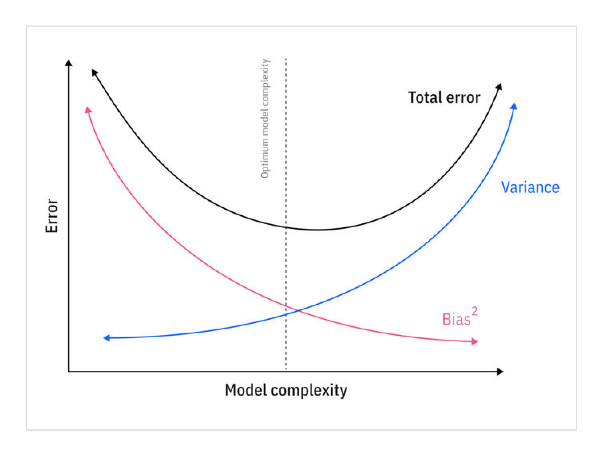
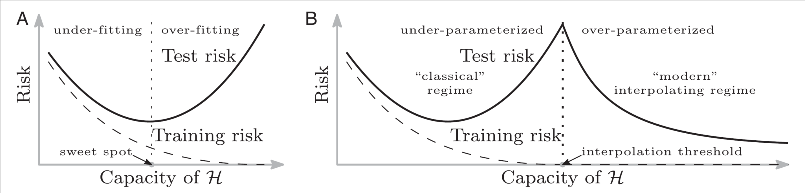

# Machine Learning<br>Fundamentals

---

## Mathematical Foundations

<div class="timeline-container" style="flex-direction: row;">
    <div style="width: 20%;">
        <div class="timeline-title">Calculus & Linear Algebra</div>
        <div class="timeline-text">Basis for optimization algorithms and machine learning model operations</div>
    </div>
    <div class="timeline" style="width: 80%; --start-year: 1676; --end-year: 1951;" data-timeline-fragments-select="1676:0,1805:0,1809:0,1847:0,1951:0">
        {{TIMELINE:timeline_calculus_linear_algebra}}
    </div>
</div>

<div class="timeline-container" style="flex-direction: row;">
    <div style="width: 20%;">
        <div class="timeline-title">Probability & Statistics</div>
        <div class="timeline-text">Basis for Bayesian methods, statistical inference, and generative models</div>
    </div>
    <div class="timeline" style="width: 80%; --start-year: 1676; --end-year: 1951;" data-timeline-fragments-select="1815:0">
        {{TIMELINE:timeline_probability_statistics}}
    </div>
</div>

<div class="timeline-container" style="flex-direction: row;">
    <div style="width: 20%;">
        <div class="timeline-title">Information & Computation</div>
        <div class="timeline-text">Foundations of algorithmic thinking and information theory</div>
    </div>
    <div class="timeline" style="width: 80%; --start-year: 1676; --end-year: 1951;" data-timeline-fragments-select="1843:0,1936:0,1947:0,1948:0">
        {{TIMELINE:timeline_information_computation}}
    </div>
</div>

<div class="fragment" data-fragment-index="1"></div>

---

## Early History of Neural Networks

<div class="timeline-container" style="flex-direction: row;">
    <div style="width: 20%;">
        <div class="timeline-title">Architectures & Layers</div>
        <div class="timeline-text">Evolution of network architectures and layer innovations</div>
    </div>
    <div class="timeline" style="width: 80%; --start-year: 1943; --end-year: 2012;">
        {{TIMELINE:timeline_early_nn_architectures}}
    </div>
</div>

<div class="timeline-container" style="flex-direction: row;">
    <div style="width: 20%;">
        <div class="timeline-title">Training & Optimization</div>
        <div class="timeline-text">Methods for efficient learning and gradient-based optimization</div>
    </div>
    <div class="timeline" style="width: 80%; --start-year: 1943; --end-year: 2012;" data-timeline-fragments-select="1967:0,1970:0,1986:0">
        {{TIMELINE:timeline_early_nn_training}}
    </div>
</div>

<div class="timeline-container" style="flex-direction: row;">
    <div style="width: 20%;">
        <div class="timeline-title">Software & Datasets</div>
        <div class="timeline-text">Tools, platforms, and milestones that enabled practical deep learning</div>
    </div>
    <div class="timeline" style="width: 80%; --start-year: 1943; --end-year: 2012;">
        {{TIMELINE:timeline_early_nn_software}}
    </div>
</div>

<div class="fragment" data-fragment-index="1"></div>

---

## The Deep Learning Era

<!-- Layers & Architectures Timeline -->
<div class="timeline-container" style="flex-direction: row;">
    <div style="width: 20%;">
        <div class="timeline-title">Deep architectures</div>
        <div class="timeline-text">Deep architectures and generative models transforming AI capabilities</div>
    </div>
    <div class="timeline" style="width: 80%; --start-year: 2013; --end-year: 2023;">
        {{TIMELINE:timeline_deep_architectures}}
    </div>
</div>

<div class="timeline-container" style="flex-direction: row;">
    <div style="width: 20%;">
        <div class="timeline-title">Training & Optimization</div>
        <div class="timeline-text">Advanced learning techniques and representation learning breakthroughs</div>
    </div>
    <div class="timeline" style="width: 80%; --start-year: 2013; --end-year: 2023;">
        {{TIMELINE:timeline_deep_training}}
    </div>
</div>

<div class="timeline-container" style="flex-direction: row;">
    <div style="width: 20%;">
        <div class="timeline-title">Software & Applications</div>
        <div class="timeline-text">Practical deployment and mainstream adoption of deep learning systems</div>
    </div>
    <div class="timeline" style="width: 80%; --start-year: 2013; --end-year: 2023;">
        {{TIMELINE:timeline_deep_software}}
    </div>
</div>

---

## Machine Learning Definition

<div style="font-size: 0.9em;">

**Definition**: Learning a function that maps inputs to outputs based on labeled training examples.

**Goal**: Minimize the difference between predicted and actual outputs.

**Mathematical Formulation**:

- Given a dataset $D = \lbrace(\mathbf{x}_i, \mathbf{y}_i)\rbrace$ for $i = 1, \ldots, N$, where $\mathbf{x}_i \in \mathcal{X}$ are input features and $\mathbf{y}_i \in \mathcal{Y}$ are corresponding labels and $N$ is the number of samples.

- Find a function $$f_{\boldsymbol{\theta}}: \mathcal{X} \to \mathcal{Y}$$ parameterized by $$\boldsymbol{\theta}$$ that minimizes the empirical risk:

<div class="formula">
$$
\hat{R}(\boldsymbol{\theta}) = \frac{1}{N} \sum_{i=1}^N \ell(f_{\boldsymbol{\theta}}(\mathbf{x}_i), \mathbf{y}_i)
$$
</div>

where $$\ell$$ is a single sample loss function (e.g., absolute loss for regression, hinge loss for classification).

</div>

---

## Machine Learning Definition

<div style="text-align: center;">
    <video width="70%" data-autoplay loop muted controls>
        <source src="assets/videos/02-machine_learning_fundamentals/1080p60/EmpiricalRiskMinimization.mp4" type="video/mp4">
        Your browser does not support the video tag.
    </video>
</div>

---

## Defining the Function Space

<div style="font-size: 0.8em;">

<ul>
    <li>$f_{\boldsymbol{\theta}} \in \mathcal{F}_{\Theta}$: A specific function parameterized by $\boldsymbol{\theta}$ belongs to the function space $\mathcal{F}_{\Theta}$.</li>
    <li>$\boldsymbol{\theta} \in \Theta$: The parameters $\boldsymbol{\theta}$ come from the parameter space $\Theta$ (e.g., $\Theta = \mathbb{R}^d$ for $d$ parameters).</li>
    <li>$\mathcal{F}_{\Theta} = \lbrace f_{\boldsymbol{\theta}} : \boldsymbol{\theta} \in \Theta\rbrace$: The family of all functions obtained by varying $\boldsymbol{\theta}$ over $\Theta$.</li>
</ul>

**Examples of Function Spaces**:

<ul>
    <li>$\mathcal{F}$: All possible functions $\mathcal{X} \to \mathcal{Y}$ (infinite, intractable)</li>
    <li>$\mathcal{F}_1^{(1)}$: Linear functions in 1 variable, $\Theta = \mathbb{R}^2$, $f_{\boldsymbol{\theta}}(x) = \theta_0 + \theta_1 x$</li>
    <!-- <li>$\mathcal{F}_d^{(1)}$: Polynomial functions of degree $d$ in 1 variable, $\Theta = \mathbb{R}^{d+1}$, $f_{\boldsymbol{\theta}}(x) = \theta_0 + \theta_1 x + \ldots + \theta_d x^d$</li> -->
    <li>$\mathcal{F}_1^{(n)}$: Linear functions in $n$ variables, $\Theta = \mathbb{R}^{n+1}$, $f_{\boldsymbol{\theta}}(\mathbf{x}) = \theta_0 + \theta_1 x_1 + \ldots + \theta_n x_n$</li>
    <li>$\mathcal{F}_{\text{logistic}}$: Logistic functions, $\Theta = \mathbb{R}^3$, $f_{\boldsymbol{\theta}}(x) = \frac{\theta_0}{1 + e^{-\theta_1(x - \theta_2)}}$ (S-shaped curves for growth/saturation)</li>
    <li>$\mathcal{F}_d^{(n)}$ Polynomial functions of degree $d$ in $n$ input variables, $\Theta = \mathbb{R}^{\binom{n+d}{d}}$
</ul>

**Important**: For a fixed number of variables $n$, we have $\mathcal{F}_1^{(n)} \subset \mathcal{F}_2^{(n)} \subset \ldots \subset \mathcal{F}_d^{(n)} \subset \mathcal{F}$ — more complex models have larger function spaces and can represent more patterns, but require more data to learn effectively.

</div>

---

## Finding the Optimal Parameters

<div style="font-size: 0.85em;">
<strong>Objective</strong>: Find the optimal parameters $\boldsymbol{\theta}^*$ that minimize the empirical risk over the parametrized function family $\mathcal{F}_{\Theta} = \lbrace f_{\boldsymbol{\theta}} : \boldsymbol{\theta} \in \Theta\rbrace$:
<div class="formula">
$$
\boldsymbol{\theta}^* = \argmin\limits_{\boldsymbol{\theta} \in \Theta} \hat{R}(\boldsymbol{\theta}) = \argmin\limits_{\boldsymbol{\theta} \in \Theta} \frac{1}{N} \sum_{i=1}^N \ell(f_{\boldsymbol{\theta}}(\mathbf{x}_i), \mathbf{y}_i)
$$
</div>

The loss function $$\ell$$ quantifies the difference between the predicted output $$f_{\boldsymbol{\theta}}(\mathbf{x}_i) = \hat{\mathbf{y}}_i$$ and true label $$\mathbf{y}_i$$.

**Examples of loss functions**:

<ul>
    <li><strong>L1 loss function</strong>: 
        $$\ell_1(\hat{\mathbf{y}}_i, \mathbf{y}_i) = \lVert \hat{\mathbf{y}}_i - \mathbf{y}_i \rVert_1 
        \quad \implies \quad 
        \hat{R} = \mathcal{L}_{1} = \text{MAE} = \frac{1}{N} \sum_{i=1}^N \lVert \hat{\mathbf{y}}_i - \mathbf{y}_i \rVert_1$$
    </li>
    <li><strong>L2 loss function</strong>: 
        $$\ell_2(\hat{\mathbf{y}}_i, \mathbf{y}_i) = \lVert \hat{\mathbf{y}}_i - \mathbf{y}_i \rVert_2^2 
        \quad \implies \quad 
        \hat{R} = \mathcal{L}_{2} = \text{MSE} = \frac{1}{N} \sum_{i=1}^N \lVert \hat{\mathbf{y}}_i - \mathbf{y}_i \rVert_2^2$$
    </li>
    <li><strong>Hinge loss function</strong>: $\ell_{\text{hinge}}(\hat{y}_i^{\text{pre-}\sigma}, y_i)$
        $$
        \begin{aligned}
         = \max(0, 1 - y_i \hat{y}_i^{\text{pre-}\sigma}) \implies \hat{R} = \mathcal{L}_{\text{hinge}} = \frac{1}{N} \sum_{i=1}^N \max(0, 1 - y_i \hat{y}_i^{\text{pre-}\sigma}) \text{ for } y_i \in \{-1, 1\}
        \end{aligned}
        $$
    </li>
</ul>

</div>

---

## Residual Errors

<div style="font-size: 0.85em;">

- We assume the true dataset is distributed according to the function $f^*$ plus noise $\epsilon$

<div class="formula">
$$
y_i = f^*(\mathbf{x}_i) + \epsilon_i\text{, }
$$
</div>

where $\epsilon_i$ represents inherent noise or randomness in the data generation process. E.g., normal distribution:

<div class="formula">
$$
\epsilon_i \sim \mathcal{N}(0, \sigma^2) = \frac{1}{\sqrt{2\pi\sigma^2}} e^{-\frac{\epsilon_i^2}{2\sigma^2}}
$$
</div>

- Residual errors measure the difference between predictions and observations:

<div class="formula">
$$
\begin{aligned}
r_i & = y_i - f_{\boldsymbol{\theta}}(\mathbf{x}_i)\\
r_i & = \underbrace{[f^*(\mathbf{x}_i) - f_{\boldsymbol{\theta}}(\mathbf{x}_i)]}_{\text{approximation error}} + \underbrace{\epsilon_i}_{\text{irreducible noise}}
\end{aligned}
$$
</div>

</div>

<div class="image-overlay fragment highlight" style="width: 70%">
Even with the optimal parameters $\boldsymbol{\theta}^*$ and infinite training data, the residual errors $r_i$ may not reach zero due to: (1) irreducible noise $\epsilon_i$ (always present), and (2) approximation error when $f^* \notin \mathcal{F}_{\Theta}$ (model class limitation).
</div>

---

## Over- and Underfitting

**Balancing Model Complexity**:

- **Overfitting**: Even when $f^* \in \mathcal{F}_{\Theta}$, using overly complex models (e.g., high-degree polynomials) can lead to fitting noise rather than the underlying pattern, resulting in poor generalization to new data.

- **Underfitting**: When $f^* \notin \mathcal{F}_{\Theta}$, the model class is too restrictive to capture the true data-generating process, leading to high approximation error on both training and new data.

The goal is to select a function space $\mathcal{F}_{\Theta}$ that balances expressiveness with generalization capability.

---

## Over- and Underfitting

<div style="text-align: center;">
    <video width="70%" data-autoplay loop muted controls>
        <source src="assets/videos/02-machine_learning_fundamentals/1080p60/QuadraticRegressionOverUnderfit.mp4" type="video/mp4">
        Your browser does not support the video tag.
    </video>
</div>

---

## Datasets

<div style="font-size: 0.9em;">

The dataset $D$ is composed of three disjoint subsets:

<div class="formula">
$$
\begin{aligned}
D &= D_{\text{train}} \cup D_{\text{val}} \cup D_{\text{test}}\\
D_{\text{train}} \cap D_{\text{val}} &= D_{\text{train}} \cap D_{\text{test}} = D_{\text{val}} \cap D_{\text{test}} = \emptyset
\end{aligned}
$$
</div>

- **Training set** $D_{\text{train}}$: Learn model parameters $\boldsymbol{\theta}$
- **Validation set** $D_{\text{val}}$: Model selection, hyperparameter tuning (e.g. choice of function space $\mathcal{F}_{\Theta}$) — cross-validation commonly used here
- **Test set** $D_{\text{test}}$: Final performance evaluation — **use only once** after model selection is complete — reported in research papers — ideally from a different distribution than training/validation to assess generalization

<div class="highlight">
<strong>Critical</strong>: Never use test set during development!
</div>

</div>

---

## Training vs. Validation Error

<div style="text-align: center;">
    <video width="70%" data-autoplay loop muted controls>
        <source src="assets/videos/02-machine_learning_fundamentals/1080p60/QuantileRegressionOverUnderfitWithValidation.mp4" type="video/mp4">
        Your browser does not support the video tag.
    </video>
</div>

---

## Bias-Variance Tradeoff

<div style="font-size: 0.83em;">

**What's the reason for the mean square residual error mathematically?**

Assuming an expected prediction squared error over different training sets $D$ and noise realizations $\epsilon$:

<div class="formula">
$$
\mathbb{E}_{D,\epsilon} \left[ (y - f_{D,\boldsymbol{\theta}}(\mathbf{x}))^2 \right]
$$
</div>

, where $y = f^*(\mathbf{x}) + \epsilon$, $\epsilon \sim \mathcal{N}(0, \sigma^2)$ and $f_{D,\boldsymbol{\theta}}(\mathbf{x})$ model prediction with parameters $\boldsymbol{\theta}$ trained on dataset $D$.

This can be decomposed into three components:

<div class="formula">
$$
\underbrace{\left( \mathbb{E}_D \left[ f_{D,\boldsymbol{\theta}}(\mathbf{x}) \right] - f^*(\mathbf{x}) \right)^2}_{\text{Bias}^2} + \underbrace{\mathbb{E}_D \left[ \left( f_{D,\boldsymbol{\theta}}(\mathbf{x}) - \mathbb{E}_D \left[ f_{D,\boldsymbol{\theta}}(\mathbf{x}) \right] \right)^2 \right]}_{\text{Variance}} + \underbrace{\sigma^2}_{\text{Irreducible noise}}
$$
</div>

<span>Note:</span> Full derivation in the [extras section](https://faressc.github.io/dl4ad/extras/mathematical_derivations/02_machine_learning_fundamentals.md).

---

## Bias-Variance Tradeoff Visualization

<div style="text-align: center;">
    <video width="70%" data-autoplay loop muted controls>
        <source src="assets/videos/02-machine_learning_fundamentals/1080p60/BiasVarianceTradeoff.mp4" type="video/mp4">
        Your browser does not support the video tag.
    </video>
</div>

---

## Bias-Variance Tradeoff Traditional Plot

<div style="text-align: center;">
    
    <div class="reference">https://www.ibm.com/think/topics/bias-variance-tradeoff/</div>
</div>

---

## Regularization

<div style="font-size: 0.9em;">
To prevent overfitting, we can add a regularization term to the empirical risk minimization objective:

<div class="formula">
$$
\boldsymbol{\theta}^* = \argmin\limits_{\boldsymbol{\theta} \in \Theta} \left( \hat{R}(\boldsymbol{\theta}) + \lambda \mathcal{R}(\boldsymbol{\theta})\right)
$$
</div>

where $\mathcal{R}(\boldsymbol{\theta})$ is the regularization term (e.g., L1 or L2 norm) and $\lambda$ is a hyperparameter that controls the strength of the regularization.

**Common Regularization Terms**:
<ul>
    <li><strong>L2 Regularization (Ridge)</strong>: $\mathcal{R}(\boldsymbol{\theta}) = \lVert \boldsymbol{\theta} \rVert_2^2 = \sum_{j=1}^{p} \theta_j^2$, with $p$ denoting the number of parameters, encourages smaller parameter values, leading to smoother functions.</li>
    <li><strong>L1 Regularization (Lasso)</strong>: $\mathcal{R}(\boldsymbol{\theta}) = \lVert \boldsymbol{\theta} \rVert_1 = \sum_{j=1}^{p} |\theta_j|$, encourages sparsity in the parameters, leading to simpler models.</li>
</ul>

</div>

---

## Modern Risk Curves

<div style="text-align: center;">
    
    <div class="reference">Belkin, M., Hsu, D., Ma, S., & Mandal, S. (2019). Reconciling modern machine-learning practice and the classical bias–variance trade-off. Proceedings of the National Academy of Sciences, 116(32), 15849–15854. https://doi.org/10.1073/pnas.1903070116</div>
</div>

---

## Modern Risk Curves: Double Descent

<div style="font-size: 0.85em !important;">

**Phenomenon**: As model capacity increases, test risk first decreases, then spikes at the interpolation threshold, and finally decreases again in the overparameterized regime

| Regime | Model Cap. | Generalization Behavior |
|--------|---------|------------------------|
| **Underparameterized** | < Data complexity | Classical U-curve: bias-variance tradeoff |
| **Interpolation Threshold** | ≈ Training samples | **Peak risk!** Only one way to fit data → worst generalization |
| **Overparameterized** | ≫ Training samples | Second descent: Many solutions → inductive bias picks the ones that generalize well |

**Bottom Line**: Modern deep learning challenges classical understanding — overparameterized models can generalize well despite fitting training data perfectly — e.g. optimization algorithms implicitly regularize by finding simple solutions among many possible interpolations

</div>

---

## Gradient Descent

<div style="font-size: 0.83em;">

**Goal**: Find parameters that minimize the empirical risk:

<div class="formula">
$$
\boldsymbol{\theta}^* = \argmin\limits_{\boldsymbol{\theta} \in \Theta} \hat{R}(\boldsymbol{\theta})
$$
</div>

**Gradient descent iteratively updates**:
<div class="formula">
$$
\boldsymbol{\theta}_{t+1} = \boldsymbol{\theta}_t - \eta \nabla_{\boldsymbol{\theta}} \hat{R}(\boldsymbol{\theta}_t), \text{ for } t = 0, 1, 2, \ldots, T
$$
</div>

where $\eta > 0$ is the learning rate and $T$ is the total number of iterations.

- **Convergence**: Steepest descent → critical point where $\nabla_{\boldsymbol{\theta}} \hat{R}(\boldsymbol{\theta}^*) = 0$
- **Critical points**: Local minima (stable, target) / Maxima (unstable, avoided) / Saddle points (unstable, avoided)
- **Note**: GD with appropriate $\eta$ converges to local minima or saddle points, not maxima (SGD adds noise that helps escape saddle points)

</div>

---

## Gradient Descent Algorithm

<div style="font-size: 0.85em;">

```python
def gradient_descent(theta_initial, learning_rate, max_iterations, 
                     compute_gradient, tolerance=1e-6):
    """
    Gradient Descent optimization algorithm.
    
    Args:
        theta_initial: Initial parameters (numpy array), typically sampled 
                 from N(0, 0.1) for each parameter
        learning_rate: Learning rate η > 0
        max_iterations: Maximum number of iterations T
        compute_gradient: Function that computes ∇_θ R̂(θ)
        tolerance: Convergence tolerance δ (optional)
    
    Returns:
        theta_star: Optimized parameters θ*
    """
    theta = theta_initial.copy()
    
    for t in range(max_iterations):
        # Compute gradient at current parameters
        g = compute_gradient(theta)
        
        # Update parameters
        theta = theta - learning_rate * g
        
        # Check convergence criterion
        if np.linalg.norm(g) < tolerance:
            break
    
    return theta
```

**Key considerations**: Learning rate $\eta$ controls step size — too large may overshoot, too small may converge slowly

</div>

---

## Gradient Descent Visualization

<div style="text-align: center;">
    <video width="70%" data-autoplay loop muted controls>
        <source src="assets/videos/02-machine_learning_fundamentals/1080p60/LossLandscapeVisualization.mp4" type="video/mp4">
        Your browser does not support the video tag.
    </video>
</div>

---

## Variants of Optimization Algorithms

<div style="font-size: 0.85em;">

**Gradient Descent (GD)**: Full-batch updates using entire dataset to compute gradients

<div class="formula">
$$
\boldsymbol{\theta}_{t+1} = \boldsymbol{\theta}_t - \eta \nabla_{\boldsymbol{\theta}} \hat{R}(\boldsymbol{\theta}_t) = \boldsymbol{\theta}_t - \frac{\eta}{N} \sum_{i=1}^{N} \nabla_{\boldsymbol{\theta}} \ell(f_{\boldsymbol{\theta}_t}(\mathbf{x}_i), \mathbf{y}_i)
$$
</div>

**Stochastic Gradient Descent (SGD)**: Updates parameters using gradient from a single randomly selected sample per iteration

<div class="formula">
$$
\boldsymbol{\theta}_{t+1} = \boldsymbol{\theta}_t - \eta \nabla_{\boldsymbol{\theta}} \ell(f_{\boldsymbol{\theta}_t}(\mathbf{x}_{i_t}), \mathbf{y}_{i_t}), \quad \text{where } i_t \sim \text{Uniform}(\{1, \ldots, N\})
$$
</div>

**Mini-batch Gradient Descent**: Updates parameters using gradients from a small random subset (mini-batch)

<div class="formula">
$$
\boldsymbol{\theta}_{t+1} = \boldsymbol{\theta}_t - \frac{\eta}{|B_t|} \sum_{i \in B_t} \nabla_{\boldsymbol{\theta}} \ell(f_{\boldsymbol{\theta}_t}(\mathbf{x}_i), \mathbf{y}_i), \quad \text{where } B_t \subset \{1, \ldots, N\}, |B_t| = b
$$
</div>

**Other Variants**: Momentum, AdaGrad, RMSProp, Adam — adapt learning rates and incorporate momentum

</div>

---

## The Key Components

<div style="font-size: 0.9em;">

<div class="grid" style="display: grid; grid-template-columns: auto 1fr; gap: 1em; align-items: start;">

<div style="text-align: center; font-size: 1.5em; font-weight: bold; color: var(--fs-highlight-background)">0</div>
<div>
<strong>Dataset</strong> ($D$): A collection of input-output pairs $D = \lbrace(\mathbf{x}_i, \mathbf{y}_i)\rbrace_{i=1}^{N}$. The dataset must be representative of the true underlying function $f^*: \mathcal{X} \to \mathcal{Y}$.
</div>

<div style="text-align: center; font-size: 1.5em; font-weight: bold; color: var(--fs-highlight-background)">1</div>
<div>
<strong>Function or Model</strong> ($f_{\boldsymbol{\theta}}$): A parameterized function that maps inputs $\mathbf{x}_i$ to predicted outputs $\hat{\mathbf{y}}_i = f_{\boldsymbol{\theta}}(\mathbf{x}_i)$. The choice of function defines the function space $\mathcal{F}_{\Theta}$.
</div>

<div style="text-align: center; font-size: 1.5em; font-weight: bold; color: var(--fs-highlight-background)">2</div>
<div>
<strong>Parameters</strong> ($\boldsymbol{\theta}$): The set of parameters that define the specific function within the function space. These parameters are adjusted during training to minimize the empirical risk.
</div>

<div style="text-align: center; font-size: 1.5em; font-weight: bold; color: var(--fs-highlight-background)">3</div>
<div>
<strong>Loss Function</strong> ($\mathcal{L}$): A function that quantifies the difference between the predicted outputs $\hat{\mathbf{y}}_i$ and the true labels $\mathbf{y}_i$. The choice of loss function depends on the task (e.g., regression vs. classification).
</div>

<div style="text-align: center; font-size: 1.5em; font-weight: bold; color: var(--fs-highlight-background)">4</div>
<div>
<strong>Optimization Algorithm</strong>: A method for adjusting the parameters $\boldsymbol{\theta}$ to minimize the empirical risk $\hat{R}(\boldsymbol{\theta})$. Common algorithms include Gradient Descent and its variants.
</div>

</div>

</div>

---

## Example: Simple Linear Regression

- **Function**: $f_{\boldsymbol{\theta}}(x): \mathbb{R} \to \mathbb{R}$ defined as:

<div class="formula">
$$
f_{\boldsymbol{\theta}}(x) = \theta_0 + \theta_1 x
$$
</div>

- **Parameter space**: $\Theta = \mathbb{R}^2$ with parameters $\boldsymbol{\theta} = (\theta_0, \theta_1)$
- **Dataset**: $D = \lbrace(x_i, y_i)\rbrace$ for $i = 1, \ldots, N$
- **Input space**: $\mathcal{X} = \mathbb{R}$
- **Output space**: $\mathcal{Y} = \mathbb{R}$
- **Loss function**: Mean Squared Error (MSE):

<div class="formula">
$$
\mathcal{L}(\boldsymbol{\theta}) = \frac{1}{N} \sum_{i=1}^{N} (y_i - f_{\boldsymbol{\theta}}(x_i))^2
$$
</div>

---

## Example: Simple Linear Regression

<div style="text-align: center;">
    <video width="70%" data-autoplay loop muted controls>
        <source src="assets/videos/02-machine_learning_fundamentals/1080p60/LinearRegressionSimple.mp4" type="video/mp4">
        Your browser does not support the video tag.
    </video>
</div>

---

## Example: Binary Classification

- **Function**: $f_{\boldsymbol{\theta}}(x): \mathbb{R}^2 \to \mathbb{R}$ defined as:

<div class="formula">
$$
f_{\boldsymbol{\theta}}(x) = \theta_0 + \theta_1 x_1 + \theta_2 x_2 \text{, with } \hat{y} = \text{sign}(f_{\boldsymbol{\theta}}(x))
$$
</div>

- **Parameter space**: $\Theta = \mathbb{R}^3$ with parameters $\boldsymbol{\theta} = (\theta_0, \theta_1, \theta_2)$
- **Dataset**: $D = \lbrace(x_i, y_i)\rbrace$ for $i = 1, \ldots, N$
- **Input space**: $\mathcal{X} = \mathbb{R}^2$
- **Output space**: $\mathcal{Y} = \lbrace -1, +1 \rbrace$ (binary labels)
- **Loss function**: Mean hinge loss:

<div class="formula">
$$
\mathcal{L}(\boldsymbol{\theta}) = \frac{1}{N} \sum_{i=1}^{N} \max(0, 1 - y_i f_{\boldsymbol{\theta}}(x_i))
$$
</div>

---

## Example: Binary Classification

<div style="text-align: center;">
    <video width="70%" data-autoplay loop muted controls>
        <source src="assets/videos/02-machine_learning_fundamentals/1080p60/BinaryClassificationSimple.mp4" type="video/mp4">
        Your browser does not support the video tag.
    </video>
</div>

---

## Bonus: Normal Equations for Linear Regression

<div style="font-size: 0.8em;">

**Closed-form solution**: Instead of iterative optimization, directly compute optimal parameters $\boldsymbol{\theta}^*$

**Derivation**: Set gradient of MSE to zero and solve for $\boldsymbol{\theta}$


<div class="formula" style="font-size: 0.9em;">
$$
\begin{aligned}
\mathbf{\hat{y}} & = \mathbf{X} \boldsymbol{\theta}\\
\hat{R}(\boldsymbol{\theta}) & = \frac{1}{N} \lVert \mathbf{y} - \mathbf{X} \boldsymbol{\theta} \rVert_2^2 = \frac{1}{N} (\mathbf{y} - \mathbf{X} \boldsymbol{\theta})^\top (\mathbf{y} - \mathbf{X} \boldsymbol{\theta})\\
\nabla_{\boldsymbol{\theta}} \hat{R}(\boldsymbol{\theta}^*) & = -\frac{2}{N} \mathbf{X}^\top (\mathbf{y} - \mathbf{X} \boldsymbol{\theta}^*) = 0\\
\mathbf{X}^\top \mathbf{y} & = \mathbf{X}^\top \mathbf{X} \boldsymbol{\theta}^*\\
\boldsymbol{\theta}^* & = (\mathbf{X}^\top \mathbf{X})^{-1} \mathbf{X}^\top \mathbf{y}
\end{aligned}
$$
</div>

Where:

- $\mathbf{X}$ is the design matrix (including a column of ones for the bias term)
- $\mathbf{y}$ is the vector of target values

---

# Python Implementation
