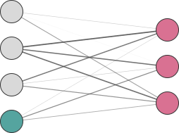
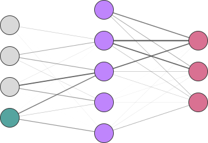

# Perceptrons

---

## Mathematical Foundations

    

        
Calculus & Linear Algebra

        
Basis for optimization algorithms and machine learning model operations

    

    

        {{TIMELINE:timeline_calculus_linear_algebra}}
    

    

        
Probability & Statistics

        
Basis for Bayesian methods, statistical inference, and generative models

    

    

        {{TIMELINE:timeline_probability_statistics}}
    

    

        
Information & Computation

        
Foundations of algorithmic thinking and information theory

    

    

        {{TIMELINE:timeline_information_computation}}
    

---

## Early History of Neural Networks

    

        
Architectures & Layers

        
Evolution of network architectures and layer innovations

    

    

        {{TIMELINE:timeline_early_nn_architectures}}
    

    

        
Training & Optimization

        
Methods for efficient learning and gradient-based optimization

    

    

        {{TIMELINE:timeline_early_nn_training}}
    

    

        
Software & Datasets

        
Tools, platforms, and milestones that enabled practical deep learning

    

    

        {{TIMELINE:timeline_early_nn_software}}
    

---

## The Deep Learning Era

<!-- Layers & Architectures Timeline -->

    

        
Deep architectures

        
Deep architectures and generative models transforming AI capabilities

    

    

        {{TIMELINE:timeline_deep_architectures}}
    

    

        
Training & Optimization

        
Advanced learning techniques and representation learning breakthroughs

    

    

        {{TIMELINE:timeline_deep_training}}
    

    

        
Software & Applications

        
Practical deployment and mainstream adoption of deep learning systems

    

    

        {{TIMELINE:timeline_deep_software}}
    

---

## McCulloch-Pitts Neuron (1943)

    
    
https://github.com/acids-ircam/creative_ml

---

## McCulloch-Pitts Neuron (1943)

    

        
        
https://github.com/acids-ircam/creative_ml

    

    

        Neuron is the weighted $w_i$ sum of its inputs $x_i$ and fires if the sum exceeds a threshold $T$:
        

            $$
                y = 
                \begin{cases} 
                    1 & \text{if } \sum_{i=1}^{N} w_i x_i \geq T \\ 
                    0 & \text{otherwise}
                \end{cases}
            $$
        

    

$$
    y = 
    \begin{cases} 
        1 & \text{if } \sum_{i=1}^{N} w_i x_i \geq T \\ 
        0 & \text{otherwise}
    \end{cases}
    \quad\to\quad
    y = \phi\left( \sum_{i=1}^{N} w_i x_i - T \right)\text{ where } \phi(z) = 
    \begin{cases} 
        1 & \text{if } z \geq 0 \\
        0 & \text{otherwise}
    \end{cases}
$$

---

## Frank Rosenblatt's Perceptron (1958)

    
    
The Perceptron Model

What are the learnable parameters in this model?

---

## Frank Rosenblatt's Perceptron (1958)

    
    
The Perceptron Model

---

## Frank Rosenblatt's Perceptron (1958)

    

        
    

    

        The perceptron introduces a bias term $b$ to shift the activation threshold:
        

            $$
                y = \phi\left( \sum_{i=1}^{N} w_i x_i + b \right) \\
                \text{where } \phi(z) = 
                \begin{cases} 
                    1 & \text{if } z \geq 0 \\
                    0 & \text{otherwise}
                \end{cases}
            $$
        

    

    

        In vector notation, this can be expressed as:
    

    

    $$
        y = \phi\left( \mathbf{w}^\top \mathbf{x} + b \right)
    $$
    

    

        Or if $\mathbf{x}$ includes a bias input $x_{0} = 1$, we can fold $b$ into the weights:
    

    

    $$
        y = \phi\left( \mathbf{w}^\top \mathbf{x} \right) \text{ where }  \mathbf{x} = [1, x_1, x_2, \ldots, x_N]^\top \text{ and } \mathbf{w} = [b, w_1, w_2, \ldots, w_N]^\top
    $$

---

## Recall: Simple Linear Regression

- **Function**: $f_{\boldsymbol{\theta}}(x): \mathbb{R} \to \mathbb{R}$ defined as:

$$
f_{\boldsymbol{\theta}}(x) = \theta_0 + \theta_1 x
$$

- **Parameter space**: $\Theta = \mathbb{R}^2$ with parameters $\boldsymbol{\theta} = (\theta_0, \theta_1)$
- **Dataset**: $D = \lbrace(x_i, y_i)\rbrace$ for $i = 1, \ldots, N$
- **Input space**: $\mathcal{X} = \mathbb{R}$
- **Output space**: $\mathcal{Y} = \mathbb{R}$
- **Loss function**: Mean Squared Error (MSE):

$$
\mathcal{L}(\boldsymbol{\theta}) = \frac{1}{N} \sum_{i=1}^{N} (y_i - f_{\boldsymbol{\theta}}(x_i))^2
$$

---

## Example: Simple Linear Regression

    <video width="70%" data-autoplay loop muted controls>
        <source src="assets/videos/02-machine_learning_fundamentals/1080p60/LinearRegressionSimple.mp4" type="video/mp4">
        Your browser does not support the video tag.
    </video>

---

## Comparison to Linear Regression

$$
\begin{aligned}
\text{Perceptron: } & \quad f_{\mathbf{w}}(\mathbf{x}) = \phi\left( \mathbf{w}^\top \mathbf{x} \right), \quad \phi(z) = \begin{cases} 1 & \text{if } z \geq 0 \\ 0 & \text{otherwise} \end{cases}\\
\text{Linear Regression: } & \quad f_{\boldsymbol{\theta}}(\mathbf{x}) = \boldsymbol{\theta}^\top \mathbf{x} \text{, with } \mathbf{x} = [1, x_1, x_2, \ldots, x_N]^\top
\end{aligned}
$$

**Key Differences**:

- **Output space**: Perceptron outputs binary labels $\mathcal{Y} = \{0, 1\}$; Linear regression outputs continuous values $\mathcal{Y} = \mathbb{R}$
- **Function space**: Both belong to $\mathcal{F}_1^{(n)}$ **before** activation — perceptron adds non-linearity via $\phi$

---

## Example: Binary Classification

- **Function**: $f_{\boldsymbol{\theta}}(x): \mathbb{R}^2 \to \mathbb{R}$ defined as:

$$
f_{\boldsymbol{\theta}}(x) = \theta_0 + \theta_1 x_1 + \theta_2 x_2 \text{, with } \hat{y} = \text{sign}(f_{\boldsymbol{\theta}}(x))
$$

- **Parameter space**: $\Theta = \mathbb{R}^3$ with parameters $\boldsymbol{\theta} = (\theta_0, \theta_1, \theta_2)$
- **Dataset**: $D = \lbrace(x_i, y_i)\rbrace$ for $i = 1, \ldots, N$
- **Input space**: $\mathcal{X} = \mathbb{R}^2$
- **Output space**: $\mathcal{Y} = \lbrace -1, +1 \rbrace$ (binary labels)
- **Loss function**: Mean hinge loss:

$$
\mathcal{L}(\boldsymbol{\theta}) = \frac{1}{N} \sum_{i=1}^{N} \max(0, 1 - y_i f_{\boldsymbol{\theta}}(x_i))
$$

---

## Binary Classification

    <video width="70%" data-autoplay loop muted controls>
        <source src="assets/videos/02-machine_learning_fundamentals/1080p60/BinaryClassificationSimple.mp4" type="video/mp4">
        Your browser does not support the video tag.
    </video>

---

## Comparison to Binary Classification

Both the perceptron and linear binary classifiers perform **binary classification** using linear decision boundaries:

$$
\begin{aligned}
\text{Perceptron: } & \quad f_{\mathbf{w}}(\mathbf{x}) = \phi\left( \mathbf{w}^\top \mathbf{x} \right), \quad \phi(z) = \begin{cases} 1 & \text{if } z \geq 0 \\ 0 & \text{otherwise} \end{cases}\\
\text{Linear Classifier: } & \quad f_{\boldsymbol{\theta}}(\mathbf{x}) = \boldsymbol{\theta}^\top \mathbf{x} \text{, with } \hat{y} = \text{sign}(f_{\boldsymbol{\theta}}(\mathbf{x})) = \begin{cases} +1 & \text{if } f_{\boldsymbol{\theta}}(\mathbf{x}) \geq 0 \\ -1 & \text{otherwise} \end{cases}
\end{aligned}
$$

**Key Similarities**:

- **Decision boundary**: Both use a linear hyperplane to separate classes
- **Function space**: Both belong to $\mathcal{F}_1^{(n)}$ before applying the output function

If we change the perceptron activation to a sign function, both models become equivalent!

→ This means we can use the same training algorithm for both models!

---

## Differentiable Activation Functions

To enable gradient flow through the activation as well, we can use differentiable alternatives such as:

<table>
<thead>
<tr>
<th>Activation</th>
<th>Function</th>
<th>Derivative</th>
</tr>
</thead>
<tbody>
<tr class="fragment" data-fragment-index="1">
<td><strong>Sigmoid</strong></td>
<td>$\sigma(z) = \frac{1}{1 + e^{-z}}$</td>
<td>$\frac{d\sigma}{dz} = \sigma(z)(1 - \sigma(z))$</td>
</tr>
<tr class="fragment" data-fragment-index="3">
<td><strong>Tanh</strong></td>
<td>$\tanh(z) = \frac{e^{z} - e^{-z}}{e^{z} + e^{-z}}$</td>
<td>$\frac{d\tanh}{dz} = 1 - \tanh^2(z)$</td>
</tr>
<tr class="fragment" data-fragment-index="5">
<td><strong>ReLU</strong></td>
<td>$\text{ReLU}(z) = \max(0, z)$</td>
<td>$\frac{d\text{ReLU}}{dz} = \begin{cases} 1 & \text{if } z > 0 \\ 0 & \text{otherwise} \end{cases}$</td>
</tr>
<tr class="fragment" data-fragment-index="7">
<td><strong>Leaky ReLU</strong></td>
<td>$\text{LeakyReLU}(z) = \max(\alpha z, z)$</td>
<td>$\frac{d\text{LeakyReLU}}{dz} = \begin{cases} 1 & \text{if } z > 0 \\ \alpha & \text{otherwise} \end{cases}$</td>
</tr>
</tbody>
</table>

    <video width="100%" data-autoplay loop muted controls>
        <source src="assets/videos/03-perceptrons/1080p60/SigmoidActivationVisualization.mp4" type="video/mp4">
        Your browser does not support the video tag.
    </video>

    <video width="100%" data-autoplay loop muted controls>
        <source src="assets/videos/03-perceptrons/1080p60/TanhActivationVisualization.mp4" type="video/mp4">
        Your browser does not support the video tag.
    </video>

    <video width="100%" data-autoplay loop muted controls>
        <source src="assets/videos/03-perceptrons/1080p60/ReLUActivationVisualization.mp4" type="video/mp4">
        Your browser does not support the video tag.
    </video>

    <video width="100%" data-autoplay loop muted controls>
        <source src="assets/videos/03-perceptrons/1080p60/LeakyReLUActivationVisualization.mp4" type="video/mp4">
        Your browser does not support the video tag.
    </video>

Our gradients can now flow through the activation function! 
→ We can use loss functions that depend on the final output of the perceptron! 
→ We can chain multiple perceptrons together to form multi-layer perceptrons (MLPs)!

---

## Example: Binary Classification with MSE

- **Function**: $f_{\boldsymbol{\theta}}(x): \mathbb{R}^2 \to (-1, 1)$ defined as:

$$
f_{\boldsymbol{\theta}}(x) = \tanh(w_0 + w_1 x_1 + w_2 x_2)
$$

- **Parameter space**: $\Theta = \mathbb{R}^3$ with parameters $\boldsymbol{\theta} = (w_0, w_1, w_2)$
- **Dataset**: $D = \lbrace(x_i, y_i)\rbrace$ for $i = 1, \ldots, N$
- **Input space**: $\mathcal{X} = \mathbb{R}^2$
- **Output space**: $\mathcal{Y} = (-1, 1)$
- **Loss function**: Mean squared error (MSE):

$$
\mathcal{L}(\boldsymbol{\theta}) = \frac{1}{N} \sum_{i=1}^{N} \left(y_i - \hat{y}_i \right)^2
$$

---

## Example: Binary Classification with Sigmoid

- **Function**: $f_{\boldsymbol{\theta}}(x): \mathbb{R}^2 \to (0, 1)$ defined as:

$$
f_{\boldsymbol{\theta}}(x) = \sigma(w_0 + w_1 x_1 + w_2 x_2) \text{, with } \sigma(z) = \frac{1}{1 + e^{-z}}
$$

- **Parameter space**: $\Theta = \mathbb{R}^3$ with parameters $\boldsymbol{\theta} = (w_0, w_1, w_2)$
- **Dataset**: $D = \lbrace(x_i, y_i)\rbrace$ for $i = 1, \ldots, N$
- **Input space**: $\mathcal{X} = \mathbb{R}^2$
- **Output space**: $\mathcal{Y} = (0, 1)$ (probabilistic outputs)
- **Loss function**: Binary cross-entropy loss:

$$
\mathcal{L}(\boldsymbol{\theta}) = -\frac{1}{N} \sum_{i=1}^{N} \left[ y_i \log(\hat{y}_i) + (1 - y_i) \log(1 - \hat{y}_i) \right]
$$

    <video width="100%" data-autoplay loop muted controls>
        <source src="assets/videos/03-perceptrons/1080p60/CrossEntropyLossVisualization.mp4" type="video/mp4">
        Your browser does not support the video tag.
    </video>

---

## Multilayer Perceptrons

    
    
    

    
    

        <strong>Input Values</strong>: $$\mathbf{x} = [x_1, x_2, \ldots, x_N]^\top$$ represent the features fed into the perceptron.
    

    
    

        <strong>Bias Term</strong>: $$1$$ is added to the input vector to allow shifting the activation threshold.
    

    
    

        <strong>Output Values</strong>: $$\hat{\mathbf{y}} = [\hat{y}_1, \hat{y}_2, \ldots, \hat{y}_K]^\top$$ represent the predicted outputs of the perceptron.
    

    
    

        <strong>Hidden Units</strong>: $$\mathbf{h}^{(l)} = [h_1^{(l)}, h_2^{(l)}, \ldots, h_{M^{(l)}}^{(l)}]^\top$$ represent intermediate computations within the $l$-th layer.
    

Generated with https://alexlenail.me/NN-SVG/

---

## Forward Propagation

**Hidden Layer Computation:**

$$
\begin{aligned}
\mathbf{z}^{(l)} & = \mathbf{W}^{(l)} \mathbf{h}^{(l-1)} + \mathbf{b}^{(l)}\text{ or} \\
\mathbf{z}^{(l)} & = \mathbf{W}^{(l)} \mathbf{h}^{(l-1)}\\
\mathbf{h}^{(l)} & = \sigma(\mathbf{z}^{(l)})
\end{aligned}
$$

where:
- $\mathbf{W}^{(l)} \in \mathbb{R}^{M \times M'}$ is the weight matrix
- $\mathbf{b}^{(l)} \in \mathbb{R}^{M}$ is the bias vector
- $\sigma(\cdot)$ is the activation function
- $\mathbf{h}^{(0)} = \mathbf{x}$ (input layer)

**Output Layer Computation:**

$$
\begin{aligned}
\mathbf{z}^{(L)} & = \mathbf{W}^{(L)} \mathbf{h}^{(L-1)} + \mathbf{b}^{(L)} \text{ or} \\
\mathbf{z}^{(L)} & = \mathbf{W}^{(L)} \mathbf{h}^{(L)}\\
\hat{\mathbf{y}} & = \sigma_{L}(\mathbf{z}^{(L)})
\end{aligned}
$$

where:
- $\mathbf{W}^{(L)} \in \mathbb{R}^{K \times M}$ is the output weight matrix
- $\mathbf{b}^{(L)} \in \mathbb{R}^{K}$ is the output bias vector
- $\sigma_{L}(\cdot)$ is the output activation
- $L$ is the index of the last hidden layer

In element-wise form, each neuron computes:

$$
\begin{aligned}
z_j^{(l)} & = \sum_{i=1}^{M'} W_{ji}^{(l)} h_i^{(l-1)} + b_j^{(l)} \\
h_j^{(l)} & = \sigma(z_j^{(l)})
\end{aligned}
$$

where:

- $i$ indexes neurons in the previous layer
- $j$ indexes neurons in the current layer

---

## Backpropagation: The Chain Rule

    

**The Challenge**: How do we train a multilayer perceptron with potentially many layers?

**Goal**: Compute gradients $\frac{\partial \mathcal{L}}{\partial \mathbf{W}^{(l)}}$ and $\frac{\partial \mathcal{L}}{\partial \mathbf{b}^{(l)}}$ for **each layer** $l$ to update parameters using gradient descent.

**The Problem**: The loss $\mathcal{L}$ depends on the output $\hat{\mathbf{y}}$, which depends on the last layer's weights $\mathbf{W}^{(L)}$, which depends on the previous layer's output $\mathbf{h}^{(L-1)}$, which depends on $\mathbf{W}^{(L-1)}$, and so on...

**The Solution**: **Backpropagation** - an efficient algorithm that uses the **chain rule** to compute gradients by propagating errors backwards through the network.

**Chain Rule Reminder**: If $y = f(g(x))$, then $\frac{dy}{dx} = \frac{df}{dg} \cdot \frac{dg}{dx}$

For neural networks: $\mathcal{L} = f(\mathbf{h}^{(L)}(\mathbf{h}^{(L-1)}(...\mathbf{h}^{(1)}(\mathbf{x}))))$

We apply the chain rule **recursively** to compute how the loss changes with respect to parameters in **any layer**.

---

## Backpropagation: Output Layer

For a **regression task** with MSE loss: $\mathcal{L} = \frac{1}{2}\|\mathbf{y} - \hat{\mathbf{y}}\|^2$

**Step 1**: Compute gradient with respect to output layer pre-activation $\mathbf{z}^{(L)}$

We need to apply the **chain rule** since $\mathcal{L}$ depends on $\mathbf{z}^{(L)}$ through $\hat{\mathbf{y}}$:

$$
\frac{\partial \mathcal{L}}{\partial \mathbf{z}^{(L)}} = \frac{\partial \mathcal{L}}{\partial \hat{\mathbf{y}}} \odot \frac{\partial \hat{\mathbf{y}}}{\partial \mathbf{z}^{(L)}}
$$

where $\odot$ denotes element-wise multiplication (Hadamard product).

**Computing each term**:
- Loss gradient: $\frac{\partial \mathcal{L}}{\partial \hat{\mathbf{y}}} = \frac{\partial}{\partial \hat{\mathbf{y}}} \left[\frac{1}{2}\|\mathbf{y} - \hat{\mathbf{y}}\|^2\right] = -(\mathbf{y} - \hat{\mathbf{y}})$ (prediction error)
- Activation derivative: $\frac{\partial \hat{\mathbf{y}}}{\partial \mathbf{z}^{(L)}} = \sigma'(\mathbf{z}^{(L)})$ (how sensitive the activation is)

Combining these gives us the **error term** $\boldsymbol{\delta}^{(L)}$:

$$
\boldsymbol{\delta}^{(L)} = \frac{\partial \mathcal{L}}{\partial \mathbf{z}^{(L)}} = -(\mathbf{y} - \hat{\mathbf{y}}) \odot \sigma'(\mathbf{z}^{(L)})
$$

$\boldsymbol{\delta}^{(L)}$ tells us **how much each output neuron's pre-activation should change** to reduce the loss.

---

## Backpropagation: Output Layer (cont.)

**Step 2**: Compute gradients with respect to weights and biases

Now that we have $\boldsymbol{\delta}^{(L)} = \frac{\partial \mathcal{L}}{\partial \mathbf{z}^{(L)}}$, we can find how the loss changes with respect to the parameters.

**Recall the forward pass**: $\mathbf{z}^{(L)} = \mathbf{W}^{(L)} \mathbf{h}^{(L-1)} + \mathbf{b}^{(L)}$

Applying the chain rule again:

$$
\frac{\partial \mathcal{L}}{\partial \mathbf{W}^{(L)}} = \frac{\partial \mathcal{L}}{\partial \mathbf{z}^{(L)}} \frac{\partial \mathbf{z}^{(L)}}{\partial \mathbf{W}^{(L)}} = \boldsymbol{\delta}^{(L)} (\mathbf{h}^{(L-1)})^\top
$$

**Interpretation**: The gradient for weight $W_{ji}^{(L)}$ is proportional to:
- How much neuron $j$ needs to change ($\delta_j^{(L)}$)
- How active the input from neuron $i$ was ($h_i^{(L-1)}$)

For the bias term:

$$
\frac{\partial \mathcal{L}}{\partial \mathbf{b}^{(L)}} = \frac{\partial \mathcal{L}}{\partial \mathbf{z}^{(L)}} \frac{\partial \mathbf{z}^{(L)}}{\partial \mathbf{b}^{(L)}} = \boldsymbol{\delta}^{(L)}
$$

**Interpretation**: Bias gradient equals the error term directly (since $\frac{\partial \mathbf{z}^{(L)}}{\partial \mathbf{b}^{(L)}} = \mathbf{I}$)

---

## Backpropagation: Hidden Layers

**Step 3**: Propagate error backwards to hidden layer $l$:

$$
\begin{aligned}
\frac{\partial \mathcal{L}}{\partial \mathbf{z}^{(l)}} & = \frac{\partial \mathcal{L}}{\partial \mathbf{h}^{(l)}} \odot \frac{\partial \mathbf{h}^{(l)}}{\partial \mathbf{z}^{(l)}} \\
& = \frac{\partial \mathcal{L}}{\partial \mathbf{z}^{(l+1)}} \frac{\partial \mathbf{z}^{(l+1)}}{\partial \mathbf{h}^{(l)}} \odot \sigma'(\mathbf{z}^{(l)}) \\
& = \left[(\mathbf{W}^{(l+1)})^\top \boldsymbol{\delta}^{(l+1)}\right] \odot \sigma'(\mathbf{z}^{(l)}) \\
& = \boldsymbol{\delta}^{(l)}
\end{aligned}
$$

**Step 4**: Compute gradients with respect to weights and biases:

$$
\begin{aligned}
\frac{\partial \mathcal{L}}{\partial \mathbf{W}^{(l)}} & = \boldsymbol{\delta}^{(l)} (\mathbf{h}^{(l-1)})^\top \\
\frac{\partial \mathcal{L}}{\partial \mathbf{b}^{(l)}} & = \boldsymbol{\delta}^{(l)}
\end{aligned}
$$

---

## Backpropagation: Algorithm Summary

**Forward Pass**:
1. Input: $\mathbf{h}^{(0)} = \mathbf{x}$
2. For $l = 1, \ldots, L$:
   - $\mathbf{z}^{(l)} = \mathbf{W}^{(l)} \mathbf{h}^{(l-1)} + \mathbf{b}^{(l)}$
   - $\mathbf{h}^{(l)} = \sigma(\mathbf{z}^{(l)})$
3. Output: $\hat{\mathbf{y}} = \mathbf{h}^{(L)}$
4. Loss: $\mathcal{L}(\mathbf{y}, \hat{\mathbf{y}})$

**Backward Pass**:
1. Output layer: $\boldsymbol{\delta}^{(L)} = \frac{\partial \mathcal{L}}{\partial \hat{\mathbf{y}}} \odot \sigma'(\mathbf{z}^{(L)})$
2. For $l = L-1, \ldots, 1$:
   - $\boldsymbol{\delta}^{(l)} = [(\mathbf{W}^{(l+1)})^\top \boldsymbol{\delta}^{(l+1)}] \odot \sigma'(\mathbf{z}^{(l)})$
3. Gradients for all layers:
   - $\frac{\partial \mathcal{L}}{\partial \mathbf{W}^{(l)}} = \boldsymbol{\delta}^{(l)} (\mathbf{h}^{(l-1)})^\top$
   - $\frac{\partial \mathcal{L}}{\partial \mathbf{b}^{(l)}} = \boldsymbol{\delta}^{(l)}$

**Weight Update** (Gradient Descent):

$$
\begin{aligned}
\mathbf{W}^{(l)} & \leftarrow \mathbf{W}^{(l)} - \eta \frac{\partial \mathcal{L}}{\partial \mathbf{W}^{(l)}} \\
\mathbf{b}^{(l)} & \leftarrow \mathbf{b}^{(l)} - \eta \frac{\partial \mathcal{L}}{\partial \mathbf{b}^{(l)}}
\end{aligned}
$$

where $\eta$ is the learning rate.

---

## Backpropagation: Element-wise View

For a single neuron $j$ in layer $l$, the gradient with respect to its weight $W_{ji}^{(l)}$ is:

$$
\frac{\partial \mathcal{L}}{\partial W_{ji}^{(l)}} = \delta_j^{(l)} h_i^{(l-1)}
$$

where the error term $\delta_j^{(l)}$ is computed as:

$$
\delta_j^{(l)} = \begin{cases}
\left(\frac{\partial \mathcal{L}}{\partial \hat{y}_j}\right) \sigma'(z_j^{(L)}) & \text{if } l = L \text{ (output layer)} \\
\\
\left(\sum_{k=1}^{M^{(l+1)}} W_{kj}^{(l+1)} \delta_k^{(l+1)}\right) \sigma'(z_j^{(l)}) & \text{if } l < L \text{ (hidden layer)}
\end{cases}
$$

**Key Insight**: Each neuron's error $\delta_j^{(l)}$ depends on:
1. The weighted sum of errors from neurons in the next layer
2. The derivative of its own activation function

This recursive structure enables efficient gradient computation through the chain rule!

---

## Backpropagation & Weight Updates

