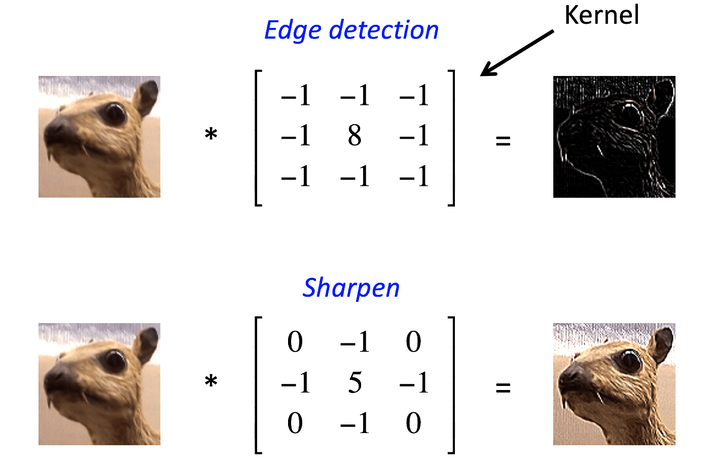
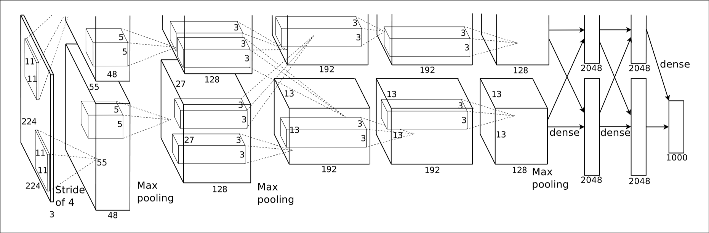
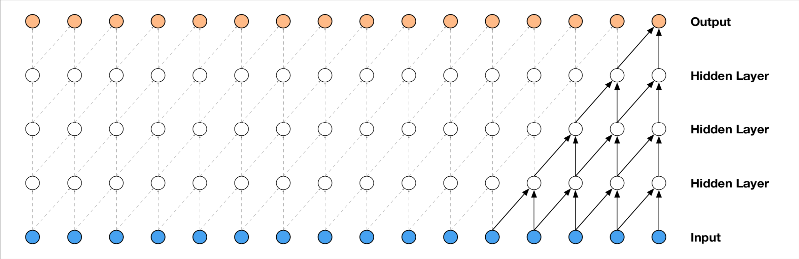
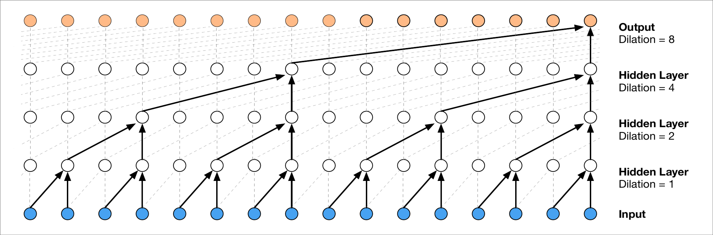
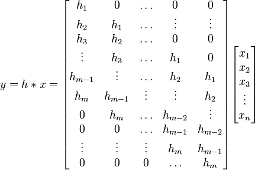

# Convolutional Layers

---

## Mathematical Foundations

<div class="timeline-container" style="flex-direction: row;">
    <div style="width: 20%;">
        <div class="timeline-title">Calculus & Linear Algebra</div>
        <div class="timeline-text">Basis for optimization algorithms and machine learning model operations</div>
    </div>
    <div class="timeline" style="width: 80%; --start-year: 1676; --end-year: 1951;" data-timeline-fragments-select="1676:0,1805:0,1809:0,1847:0,1951:0">
        {{TIMELINE:timeline_calculus_linear_algebra}}
    </div>
</div>

<div class="timeline-container" style="flex-direction: row;">
    <div style="width: 20%;">
        <div class="timeline-title">Probability & Statistics</div>
        <div class="timeline-text">Basis for Bayesian methods, statistical inference, and generative models</div>
    </div>
    <div class="timeline" style="width: 80%; --start-year: 1676; --end-year: 1951;" data-timeline-fragments-select="1815:0">
        {{TIMELINE:timeline_probability_statistics}}
    </div>
</div>

<div class="timeline-container" style="flex-direction: row;">
    <div style="width: 20%;">
        <div class="timeline-title">Information & Computation</div>
        <div class="timeline-text">Foundations of algorithmic thinking and information theory</div>
    </div>
    <div class="timeline" style="width: 80%; --start-year: 1676; --end-year: 1951;" data-timeline-fragments-select="1843:0,1936:0,1947:0,1948:0">
        {{TIMELINE:timeline_information_computation}}
    </div>
</div>

<div class="fragment" data-fragment-index="1"></div>

---

## Early History of Neural Networks

<div class="timeline-container" style="flex-direction: row;">
    <div style="width: 20%;">
        <div class="timeline-title">Architectures & Layers</div>
        <div class="timeline-text">Evolution of network architectures and layer innovations</div>
    </div>
    <div class="timeline" style="width: 80%; --start-year: 1943; --end-year: 2012;" data-timeline-fragments-select="1943:0,1957:0,1965:0,1979:1,2012:1">
        {{TIMELINE:timeline_early_nn_architectures}}
    </div>
</div>

<div class="timeline-container" style="flex-direction: row;">
    <div style="width: 20%;">
        <div class="timeline-title">Training & Optimization</div>
        <div class="timeline-text">Methods for efficient learning and gradient-based optimization</div>
    </div>
    <div class="timeline" style="width: 80%; --start-year: 1943; --end-year: 2012;" data-timeline-fragments-select="1967:0,1970:0,1986:0,1992:0,2009:1,2010:0,2012:0">
        {{TIMELINE:timeline_early_nn_training}}
    </div>
</div>

<div class="timeline-container" style="flex-direction: row;">
    <div style="width: 20%;">
        <div class="timeline-title">Software & Datasets</div>
        <div class="timeline-text">Tools, platforms, and milestones that enabled practical deep learning</div>
    </div>
    <div class="timeline" style="width: 80%; --start-year: 1943; --end-year: 2012;" data-timeline-fragments-select="2002:0">
        {{TIMELINE:timeline_early_nn_software}}
    </div>
</div>

<div class="fragment" data-fragment-index="2"></div>

---

## The Deep Learning Era

<!-- Layers & Architectures Timeline -->
<div class="timeline-container" style="flex-direction: row;">
    <div style="width: 20%;">
        <div class="timeline-title">Deep architectures</div>
        <div class="timeline-text">Deep architectures and generative models transforming AI capabilities</div>
    </div>
    <div class="timeline" style="width: 80%; --start-year: 2013; --end-year: 2023;" data-timeline-fragments-select="2016:1">
        {{TIMELINE:timeline_deep_architectures}}
    </div>
</div>

<div class="timeline-container" style="flex-direction: row;">
    <div style="width: 20%;">
        <div class="timeline-title">Training & Optimization</div>
        <div class="timeline-text">Advanced learning techniques and representation learning breakthroughs</div>
    </div>
    <div class="timeline" style="width: 80%; --start-year: 2013; --end-year: 2023;" data-timeline-fragments-select="2015:0,2016:0">
        {{TIMELINE:timeline_deep_training}}
    </div>
</div>

<div class="timeline-container" style="flex-direction: row;">
    <div style="width: 20%;">
        <div class="timeline-title">Software & Applications</div>
        <div class="timeline-text">Practical deployment and mainstream adoption of deep learning systems</div>
    </div>
    <div class="timeline" style="width: 80%; --start-year: 2013; --end-year: 2023;" data-timeline-fragments-select="2017:0">
        {{TIMELINE:timeline_deep_software}}
    </div>
</div>

---

## Recap: Linear Layers

<div class="fragment appear-vanish" data-fragment-index="0">

- Linear layers are the building blocks of neural networks, consisting of weights and biases
- A linear layer with one output and a step activation function is named a perceptron
- In order to stack multiple linear layers and learn complex patterns, we need a differentiable non-linear activation function
- Common activation functions include ReLU, sigmoid, and tanh

</div>

<div class="fragment" data-fragment-index="0">

- The forward pass of a multi-layer perceptron (MLP) consists of multiple linear transformations followed by non-linear activations
- In the backward pass, we "go back" through the network to update the weights using gradient descent.

</div>

<div class="fragment" data-fragment-index="1" style="font-size: 0.70em;">

<div style="display: flex; gap: 40px;">

<div style="flex: 1;">

**Forward Pass**:
1. Input: $\mathbf{h}^{(0)} = \mathbf{x}$
2. For $l = 1, \ldots, L$:
   - $\mathbf{z}^{(l)} = \mathbf{W}^{(l)} \mathbf{h}^{(l-1)} + \mathbf{b}^{(l)}$
   - $\mathbf{h}^{(l)} = \sigma(\mathbf{z}^{(l)})$
3. Output: $\hat{\mathbf{y}} = \mathbf{h}^{(L)}$
4. Loss: $\mathcal{L}(\mathbf{y}, \hat{\mathbf{y}})$

</div>

<div style="flex: 1;">

**Backward Pass**:

1. Output layer: $\boldsymbol{\delta}^{(L)} = \frac{\partial \mathcal{L}}{\partial \hat{\mathbf{y}}} \odot \sigma'(\mathbf{z}^{(L)})$
2. For $l = L-1, \ldots, 1$:
   - $\boldsymbol{\delta}^{(l)} = [(\mathbf{W}^{(l+1)})^\top \boldsymbol{\delta}^{(l+1)}] \odot \sigma'(\mathbf{z}^{(l)})$
3. Gradients for all layers:
   - $\frac{\partial \mathcal{L}}{\partial \mathbf{W}^{(l)}} = \boldsymbol{\delta}^{(l)} (\mathbf{h}^{(l-1)})^\top$
   - $\frac{\partial \mathcal{L}}{\partial \mathbf{b}^{(l)}} = \boldsymbol{\delta}^{(l)}$

</div>

</div>

</div>

<div class="image-overlay fragment highlight" style="width: 78%; text-align: left;">

Can linear layers retain temporal information?

- Yes, but limited: Linear layers learn position-specific patterns (e.g., "value at t=5 relates to value at t=8")
- No translation invariance—same pattern at different positions must be learned separately
- Fixed input length, parameters scale poorly with sequence length

</div>

---

## Recap: Finite Impulse Response (FIR) Filters

- Digital filters implemented by convolving the input signal with a finite impulse response

<div style="font-size: 0.85em;">

**Time domain:**

<div class="formula">
$$
y[n] = \sum_{k=0}^{M-1} h[k] x[n-k]
$$
</div>

where $y[n]$ is the output, $x[n]$ is the input, $h[k]$ is the impulse response, and $M$ is the filter order.

**Frequency domain (via DFT):**

<div class="formula">
$$
\begin{aligned}
H(e^{j\omega}) & = \sum_{k=0}^{M-1} h[k] e^{-j\omega k} \\
Y(e^{j\omega}) & = H(e^{j\omega}) X(e^{j\omega})
\end{aligned}
$$
</div>

</div>

<div class="image-overlay fragment highlight" style="width: 78%;">

FIR filters are inherently stable, meaning they do not produce unbounded output for a bounded input.

</div>

---

## FIR Filters Animation

<div style="text-align: center;">
    <video width="70%" data-autoplay loop muted controls>
        <source src="assets/videos/04-convolutional_layers/1080p60/FIRConvolution1D.mp4" type="video/mp4">
        Your browser does not support the video tag.
    </video>
</div>

---

## Convolutional Layers

<div style="font-size: 0.85em;">

- Convolutional layers apply learnable FIR filters to input data, enabling the model to capture local patterns
- They are translation invariant, meaning the same filter is applied across the entire input
- Convolutional layers can handle variable-length inputs and have fewer parameters compared to fully connected layers
- Commonly used in many audio tasks

**1D Convolution:**

<div class="formula">
$$
y[n] = \sum_{k=0}^{M-1} w[k] x[n-k] + b
$$
</div>

with learnable weights $w[k]$ of size $M$ and bias $b$. The output length is given by:

<div class="formula">
$$
L_{out} = L_{in} - M + 1
$$
</div>

---

## 2D Convolutional Layers

<div style="font-size: 0.85em;">

- 2D convolutional layers extend the concept of 1D convolutions to two-dimensional data, such as images
- They apply learnable 2D filters (kernels) to capture spatial patterns in the input
- Commonly used in computer vision tasks for feature extraction and pattern recognition

**2D Convolution:**

<div class="formula">
$$
y[m,n] = \sum_{i=0}^{M-1} \sum_{j=0}^{N-1} w[i,j] x[m-i,n-j] + b
$$
</div>

where $w[i,j]$ is the 2D filter of size $M \times N$ and $b$ is the bias.

The output has dimensions:

<div class="formula">
$$
H_{out} = H_{in} - M + 1, \quad W_{out} = W_{in} - N + 1
$$
</div>

</div>

</div>

<div class="fragment appear-vanish image-overlay" style="width: 45%; text-align: center;" data-fragment-index="0">
    
</div>

<div class="fragment appear-vanish image-overlay" style="width: 45%; text-align: center;" data-fragment-index="1">
    
    <div class="reference">Source: <a href="https://github.com/vdumoulin/conv_arithmetic/tree/master">https://github.com/vdumoulin/conv_arithmetic/tree/master</a></div>
</div>

<div class="fragment appear-vanish image-overlay" style="width: 45%; text-align: center;" data-fragment-index="2">
    
</div>

---

## Transposed Convolutional Layers

<div style="font-size: 0.85em;">

- Transposed convolutional layers, also known as deconvolutional layers, are used for upsampling feature maps
- They reverse the spatial transformation of convolutional layers, increasing the spatial dimensions of the input
- Commonly used in generative models and image segmentation tasks

**1D Transposed Convolution:**
<div class="formula">
$$
y[n] = \sum_{k=0}^{M-1} w[k] \cdot x'\left[n+k\right] + b
$$
</div>

where $x'[i]$ is the input with $p = M - 1$ zeros at each edge. The output length is given by:

<div class="formula">
$$
L_{out} = L_{in} + M - 1
$$
</div>

<div class="fragment appear-vanish image-overlay" style="width: 45%; text-align: center;">
    
    <div class="reference">Source: <a href="https://github.com/vdumoulin/conv_arithmetic/tree/master">https://github.com/vdumoulin/conv_arithmetic/tree/master</a></div>
</div>

</div>

---

## Options in Convolutional Layers

<div style="display: flex; gap: 40px; align-items: flex-start;">

<div style="flex: 1;" class="fragment" data-fragment-index="0">

<span style="font-size: 0.85em"><strong>Padding</strong>: Adding $p$ extra points at the edges of the input to control the spatial dimensions of the output</span>

<div style="margin-top: 20px;">
    
</div>

</div>

<div style="flex: 1;" class="fragment" data-fragment-index="1">

<span style="font-size: 0.85em"><strong>Strides</strong>: The step size $s$ with which the filter moves across the input, affecting the output size</span>

<div style="margin-top: 20px;">
    
</div>

</div>

<div style="flex: 1;" class="fragment" data-fragment-index="2">

<span style="font-size: 0.85em"><strong>Dilations</strong>: Spacing out the filter elements by a factor of $d$ to increase the receptive field without increasing parameters</span>

<div style="margin-top: 20px;">
    
</div>

</div>

</div>

<div class="reference" style="text-align: center; margin-top: 20px;">Source: <a href="https://github.com/vdumoulin/conv_arithmetic/tree/master">https://github.com/vdumoulin/conv_arithmetic/tree/master</a></div>

<div class="fragment appear-vanish image-overlay" data-fragment-index="3" style="text-align: center; width: 80%;">

```python
class torch.nn.Conv1d(in_channels, out_channels, kernel_size,
                      stride=1, padding=0, dilation=1, groups=1,
                      bias=True, padding_mode='zeros', device=None,
                      dtype=None)
```

</div>

---

## Multi-Head Convolutional Layers

- Multi-head convolutional layers consist of multiple parallel convolutional kernels (heads) that process the input simultaneously
- Each head learns different features from the input, allowing the model to capture a diverse set of patterns
- Each kernel has its own set of weights and biases, and gets convolved with all input channels

**Multi-Head 1D Convolution:**

<div class="formula">
$$
y_{j}[n] = \sum_{i=0}^{C_{in}-1} \sum_{k=0}^{M-1} w_{i,j}[k] x_{i}[n-k] + b_{j}
$$
</div>

where $C_{in}$ is the number of input channels, $y_{j}[n]$ is the output of head $j$, $x_{i}[n]$ is the input from channel $i$, $w_{i,j}[k]$ are the weights for head $j$ and channel $i$, and $b_{j}$ is the bias for head $j$.

<div class="fragment appear-vanish image-overlay" style="width: 60%; text-align: center;">

Grouped convolutions are a special case of multi-head convolutions where each head processes a distinct subset of input channels.

</div>

---

## Options in Transposed Convolutional Layers

<div style="display: flex; gap: 40px; align-items: flex-start;">

<div style="flex: 1;" class="fragment" data-fragment-index="0">

<span style="font-size: 0.85em"><strong>Padding</strong>: Reduces the inherent padding of transposed convolution to $p' = M - 1 - p$</span>

<div style="margin-top: 20px;">
    
</div>

</div>

<div style="flex: 1;" class="fragment" data-fragment-index="1">

<span style="font-size: 0.85em"><strong>Strides</strong>: Inserts $(s-1)$ zeros between input elements</span>

<div style="margin-top: 20px;">
    
</div>

</div>

<div style="flex: 1;" class="fragment" data-fragment-index="2">

<span style="font-size: 0.85em"><strong>Dilations</strong>: Spacing out the filter elements by a factor of $d$ to increase the receptive field without increasing parameters</span>

<div style="margin-top: 20px;">
    
</div>

</div>

</div>

<div class="reference" style="text-align: center; margin-top: 20px;">Source: <a href="https://github.com/vdumoulin/conv_arithmetic/tree/master">https://github.com/vdumoulin/conv_arithmetic/tree/master</a></div>

<div class="fragment appear-vanish image-overlay" data-fragment-index="3" style="text-align: center; width: 80%;">

```python
class torch.nn.ConvTranspose1d(in_channels, out_channels, kernel_size,
                               stride=1, padding=0, output_padding=0,
                               groups=1, bias=True, dilation=1, 
                               padding_mode='zeros', device=None,
                               dtype=None)
```

</div>

---

## Ambiguities in Transposed Convolutions

- Transposed convolutions can lead to ambiguities in output size due to the interplay of padding, stride, and kernel size
- The `output_padding` parameter is used to resolve these ambiguities by specifying additional size to add to the output shape

<div style="font-size: 0.85em; width: 70%; top: 120%" class="fragment image-overlay" data-fragment-index="0">
<table style="width: 100%; border-collapse: collapse;">
    <thead>
        <tr>
            <th><strong>Standard Convolution</strong></th>
            <th><strong>Transposed Convolution</strong></th>
        </tr>
    </thead>
    <tbody>
        <tr>
            <td>Input size: 6×6, Kernel: 3×3, Stride: 2, Padding: 1<br>Output size: 3×3</td>
            <td>Input size: 3×3, Kernel: 3×3, Stride: 2, Padding: 1<br>Output size: 5×5 or 6×6?</td>
        </tr>
        <tr>
            <td style="text-align: center;"></td>
            <td style="text-align: center;"></td>
        </tr>
    </tbody>
</table>

<div class="reference" style="margin-top: 10px;">Source: <a href="https://github.com/vdumoulin/conv_arithmetic/tree/master">https://github.com/vdumoulin/conv_arithmetic/tree/master</a></div>

</div>

---

## AlexNet Example

- AlexNet is a pioneering convolutional neural network architecture that achieved significant success in image classification tasks
- Consists of: convolutional layers followed by fully connected layers, utilizing ReLU activations and max pooling for downsampling
- AlexNet marked a breakthrough in deep learning

<div style="text-align: center; margin-top: 40px;">
    
    <div class="reference" style="margin-top: 10px; text-align: center;">
        Krizhevsky, A., Sutskever, I., & Hinton, G. E. (2012). Imagenet classification with deep convolutional neural networks. Advances in neural information processing systems, 25.
    </div>
</div>

---

## Pooling Layers

- Pooling layers reduce the spatial dimensions of the input, helping to decrease computational load and control overfitting
- Common types of pooling include max pooling and average pooling

**1D Max Pooling:**

<div class="formula">
$$
y[n] = \max\limits_{0 \leq k < M} x[n \cdot s + k]
$$
</div>

where $M$ is the pool size and $s$ is the stride. The output length is given by:

<div class="formula">
$$
L_{out} = \left\lfloor \frac{L_{in} - M}{s} \right\rfloor + 1
$$
</div>

<div class="fragment appear-vanish image-overlay" style="width: 60%; text-align: center;">


<div style="margin-top: 40px;">2D Max Pooling with pool size 2x2 and stride 2.</div>

</div>

---

## WaveNet Example

- WaveNet is a deep generative model for raw audio waveforms that utilizes dilated causal convolutions to capture long-range temporal dependencies
- It employs multiple layers of dilated convolutions with increasing dilation factors, allowing the receptive field to grow exponentially with depth

<div style="text-align: center; margin-top: 40px;" class="fragment appear-vanish" data-fragment-index="0">
    
    <div class="reference" style="margin-top: 10px; text-align: center;">
        Oord, A. van den, Dieleman, S., Zen, H., Simonyan, K., Vinyals, O., Graves, A., Kalchbrenner, N., Senior, A., & Kavukcuoglu, K. (2016). WaveNet: A Generative Model for Raw Audio (No. arXiv:1609.03499). https://doi.org/10.48550/arXiv.1609.03499
    </div>
</div>

<div style="text-align: center; margin-top: 40px;" class="fragment appear-vanish" data-fragment-index="1">
    
    <div class="reference" style="margin-top: 10px; text-align: center;">
        Oord, A. van den, Dieleman, S., Zen, H., Simonyan, K., Vinyals, O., Graves, A., Kalchbrenner, N., Senior, A., & Kavukcuoglu, K. (2016). WaveNet: A Generative Model for Raw Audio (No. arXiv:1609.03499). https://doi.org/10.48550/arXiv.1609.03499
    </div>
</div>

---

## Recall: Backpropagation in MLPs

<div style="font-size: 0.70em;">

<div style="display: flex; gap: 40px;">

<div style="flex: 1;">

**Forward Pass**:
1. Input: $\mathbf{h}^{(0)} = \mathbf{x}$
2. For $l = 1, \ldots, L$:
   - $\mathbf{z}^{(l)} = \mathbf{W}^{(l)} \mathbf{h}^{(l-1)} + \mathbf{b}^{(l)}$
   - $\mathbf{h}^{(l)} = \sigma(\mathbf{z}^{(l)})$
3. Output: $\hat{\mathbf{y}} = \mathbf{h}^{(L)}$
4. Loss: $\mathcal{L}(\mathbf{y}, \hat{\mathbf{y}})$

</div>

<div style="flex: 1;">

**Backward Pass**:
1. Output layer: $\boldsymbol{\delta}^{(L)} = \frac{\partial \mathcal{L}}{\partial \hat{\mathbf{y}}} \odot \sigma'(\mathbf{z}^{(L)})$
2. For $l = L-1, \ldots, 1$:
   - $\boldsymbol{\delta}^{(l)} = [(\mathbf{W}^{(l+1)})^\top \boldsymbol{\delta}^{(l+1)}] \odot \sigma'(\mathbf{z}^{(l)})$
3. Gradients for all layers:
   - $\frac{\partial \mathcal{L}}{\partial \mathbf{W}^{(l)}} = \boldsymbol{\delta}^{(l)} (\mathbf{h}^{(l-1)})^\top$
   - $\frac{\partial \mathcal{L}}{\partial \mathbf{b}^{(l)}} = \boldsymbol{\delta}^{(l)}$

</div>

</div>

---

## Backpropagation in Convolutional Layers

<div class="highlight" style="margin-top: 150px; text-align: center;">
How do we compute gradients for convolutional layers?
</div>

<div class="fragment">
Like MLPs, we need to compute gradients of the loss $\mathcal{L}$ for <strong>each layer</strong> $l$ to update parameters:

<div class="formula" style="margin-top: 40px;">
$$
\frac{\partial \mathcal{L}}{\partial \mathbf{w}^{(l)}} \quad \text{and} \quad \frac{\partial \mathcal{L}}{\partial b^{(l)}}
$$
</div>

where $\mathbf{w}^{(l)}$ is the convolutional kernel and $b^{(l)}$ is the bias for layer $l$.

</div>

---

## Forward Propagation in Conv Layers

<div style="font-size: 0.70em;">

For layer $l$ in a **single-channel 1D convolution** the forward pass computes:

<div class="formula" style="margin-top: 40px;">
$$
\begin{aligned}
z^{(l)}[n] & = \sum_{k=0}^{M-1} w^{(l)}[k] \cdot h^{(l-1)}[n-k] + b^{(l)} \\
h^{(l)}[n] & = \sigma(z^{(l)}[n])
\end{aligned}
$$
</div>

where:
- $h^{(l-1)}[n]$ is the input from the previous layer
- $w^{(l)}[k]$ is the learnable kernel of size $M$
- $b^{(l)}$ is the learnable bias
- $\sigma(\cdot)$ is the activation function
- Output length: $L_{out} = L_{in} - M + 1$

</div>

<div class="fragment image-overlay" style="margin-top: 60px; font-size: 0.85em;">

**In vector notation** (treating convolution as matrix multiplication):

<div class="formula">
$$
\mathbf{z}^{(l)} = \mathbf{W}^{(l)} \mathbf{h}^{(l-1)} + b^{(l)} \mathbf{1}
$$
</div>

where $\mathbf{W}^{(l)}$ is a Toeplitz matrix representing the convolution operation.

</div>

<div class="fragment image-overlay">

<div class="reference" style="margin-top: 10px; text-align: center;">
    Source: <a href="https://stackoverflow.com/questions/34536264/how-can-i-generate-a-toeplitz-matrix-in-the-correct-form-for-performing-discrete">https://stackoverflow.com/questions/34536264/how-can-i-generate-a-toeplitz-matrix-in-the-correct-form-for-performing-discrete</a>
</div>

---

## Backpropagation: Output Layer

<div style="font-size: 0.80em;">

<div><strong>MSE Loss</strong>: $\mathcal{L} = \frac{1}{N}\sum_{i=1}^{N}\sum_{n}(y_i[n] - \hat{y}_i[n])^2$

**Step 1**: Compute gradient w.r.t. output layer pre-activation $z_i^{(L)}[n]$ for each sample $i$

<div class="fragment" data-fragment-index="1">

Apply the **chain rule**: $\mathcal{L}_i$ depends on $z_i^{(L)}[n]$ through $\hat{y}_i[n]$. For each sample $i$ and time step $n$:

<div class="formula" style="margin-top: 20px;">
$$
\frac{\partial \mathcal{L}_i}{\partial z_i^{(L)}[n]} = \color{#FF6B6B}{\frac{\partial \mathcal{L}_i}{\partial \hat{y}_i[n]}} \color{black}{\cdot} \color{#4ECDC4}{\frac{\partial \hat{y}_i[n]}{\partial z_i^{(L)}[n]}} \color{black}{=} \color{#FF6B6B}{\frac{2}{N}(\hat{y}_i[n] - y_i[n])} \color{black}{\cdot} \color{#4ECDC4}{\sigma'(z_i^{(L)}[n])}
$$
</div>

</div>

<div class="fragment" data-fragment-index="2">

This gives us the **error term** for each time step:

<div class="formula" style="margin-top: 20px;">
$$
\delta_i^{(L)}[n] = \frac{2}{N}(\hat{y}_i[n] - y_i[n]) \cdot \sigma'(z_i^{(L)}[n])
$$
</div>

In vector form: $\boldsymbol{\delta}_i^{(L)} = \frac{2}{N}(\hat{\mathbf{y}}_i - \mathbf{y}_i) \odot \sigma'(\mathbf{z}_i^{(L)})$

</div>

</div>

---

## Backpropagation: Output Layer Gradients

<div style="font-size: 0.80em;">

**Step 2**: Compute gradients w.r.t. kernel weights and bias for sample $i$

<div>
Given $\delta_i^{(L)}[n]$ and forward pass $z_i^{(L)}[n] = \sum_{k=0}^{M-1} w^{(L)}[k] \cdot h_i^{(L-1)}[n-k] + b^{(L)}$:
</div>

<div class="fragment" data-fragment-index="1">

**Kernel weight gradients**: Apply chain rule to $w^{(L)}[k]$ (weight at position $k$ in the kernel)

<div class="formula" style="margin-top: 20px;">
$$
\frac{\partial \mathcal{L}_i}{\partial w^{(L)}[k]} = \sum_{n} \color{#FF6B6B}{\frac{\partial \mathcal{L}_i}{\partial z_i^{(L)}[n]}} \color{black}{\cdot} \color{#4ECDC4}{\frac{\partial z_i^{(L)}[n]}{\partial w^{(L)}[k]}} \color{black}{=} \sum_{n} \color{#FF6B6B}{\delta_i^{(L)}[n]} \color{black}{\cdot} \color{#4ECDC4}{h_i^{(L-1)}[n-k]}
$$
</div>

<div style="margin-top: 20px;">

This is a **convolution** of the error signal with the input!

</div>

</div>

<div class="fragment" data-fragment-index="2">

**Bias gradient**: Apply chain rule to $b^{(L)}$

<div class="formula" style="margin-top: 20px;">
$$
\frac{\partial \mathcal{L}_i}{\partial b^{(L)}} = \sum_{n} \color{#FF6B6B}{\delta_i^{(L)}[n]} \color{black}{\cdot} \color{#4ECDC4}{\frac{\partial z_i^{(L)}[n]}{\partial b^{(L)}}} \color{black}{=} \sum_{n} \delta_i^{(L)}[n]
$$
</div>

The bias gradient is simply the **sum** of all error terms!

</div>

</div>

---

## Backpropagation: Hidden Layers

<div style="font-size: 0.75em;">

**Step 3**: Propagate error backwards to hidden layer $l$ for sample $i$

<div class="fragment" data-fragment-index="1">
In $\frac{\partial \mathcal{L}_i}{\partial h_i^{(l)}[n]}$, the loss depends on $h_i^{(l)}[n]$ through all positions in layer $l+1$ where this activation is used:

<div class="formula" style="margin-top: 20px;">
$$
\frac{\partial \mathcal{L}_i}{\partial h_i^{(l)}[n]} = \sum_{m} \color{#FF6B6B}{\frac{\partial \mathcal{L}_i}{\partial z_i^{(l+1)}[m]}} \color{black}{\cdot} \color{#4ECDC4}{\frac{\partial z_i^{(l+1)}[m]}{\partial h_i^{(l)}[n]}}
$$
</div>

</div>

<div class="fragment" data-fragment-index="2">

Since $z_i^{(l+1)}[m] = \sum_{k=0}^{M-1} w^{(l+1)}[k] \cdot h_i^{(l)}[m-k] + b^{(l+1)}$, we have:

<div class="formula" style="margin-top: 20px;">
$$
\begin{aligned}
\frac{\partial z_i^{(l+1)}[m]}{\partial h_i^{(l)}[n]} &= \begin{cases} w^{(l+1)}[m-n] & \text{if } 0 \leq m-n < M \\ 0 & \text{otherwise} \end{cases}\\
\rightarrow \frac{\partial \mathcal{L}_i}{\partial h_i^{(l)}[n]} &= \sum_{k=0}^{M-1} \delta_i^{(l+1)}[n+k] \cdot w^{(l+1)}[k]
\end{aligned}
$$
</div>

This is a **full convolution** (with flipped kernel) of the error with the weights!

</div>

</div>

---

## Backpropagation: Hidden Layer Gradients

<div style="font-size: 0.80em;">

**Step 4**: Compute error term and gradients for hidden layer $l$

<div class="fragment" data-fragment-index="1">

First, compute the error term by applying the activation derivative:

<div class="formula" style="margin-top: 20px;">
$$
\delta_i^{(l)}[n] = \color{#FF6B6B}{\frac{\partial \mathcal{L}_i}{\partial h_i^{(l)}[n]}} \color{black}{\cdot} \color{#4ECDC4}{\frac{\partial h_i^{(l)}[n]}{\partial z_i^{(l)}[n]}} \color{black}{=} \left(\sum_{k=0}^{M-1} \delta_i^{(l+1)}[n+k] \cdot w^{(l+1)}[k]\right) \cdot \sigma'(z_i^{(l)}[n])
$$
</div>

</div>

<div class="fragment" data-fragment-index="2">

**Kernel weight gradients**: Same as output layer!

<div class="formula" style="margin-top: 20px;">
$$
\frac{\partial \mathcal{L}_i}{\partial w^{(l)}[k]} = \sum_{n} \delta_i^{(l)}[n] \cdot h_i^{(l-1)}[n-k]
$$
</div>

</div>

<div class="fragment" data-fragment-index="3">

**Bias gradient**: Same as output layer!

<div class="formula" style="margin-top: 20px;">
$$
\frac{\partial \mathcal{L}_i}{\partial b^{(l)}} = \sum_{n} \delta_i^{(l)}[n]
$$
</div>

</div>

</div>

---

## Backpropagation: Algorithm Summary

<div style="font-size: 0.70em;">

<div style="display: flex; gap: 40px;">

<div style="flex: 1;">

**Forward Pass**:
1. Input: $\mathbf{h}^{(0)} = \mathbf{x}$
2. For $l = 1, \ldots, L$:
   - $z^{(l)}[n] = \sum_{k=0}^{M-1} w^{(l)}[k] h^{(l-1)}[n-k] + b^{(l)}$
   - $h^{(l)}[n] = \sigma(z^{(l)}[n])$
3. Output: $\hat{\mathbf{y}} = \mathbf{h}^{(L)}$
4. Loss: $\mathcal{L}(\mathbf{y}, \hat{\mathbf{y}})$

</div>

<div style="flex: 1;">

**Backward Pass**:
1. Output layer: $\delta^{(L)}[n] = \frac{\partial \mathcal{L}}{\partial \hat{y}[n]} \cdot \sigma'(z^{(L)}[n])$
2. For $l = L-1, \ldots, 1$:
   - $\delta^{(l)}[n] = \left[\sum_{k=0}^{M-1} \delta^{(l+1)}[n+k] w^{(l+1)}[k]\right] \sigma'(z^{(l)}[n])$
3. Gradients for all layers:
   - $\frac{\partial \mathcal{L}}{\partial w^{(l)}[k]} = \sum_{n} \delta^{(l)}[n] h^{(l-1)}[n-k]$
   - $\frac{\partial \mathcal{L}}{\partial b^{(l)}} = \sum_{n} \delta^{(l)}[n]$

</div>

</div>

</div>

<div class="fragment" data-fragment-index="1" style="font-size: 0.75em; margin-top: 40px;">

**Weight Update** (Gradient Descent):

<div class="formula">
$$
\begin{aligned}
w^{(l)}[k] & \leftarrow w^{(l)}[k] - \eta \frac{\partial \mathcal{L}}{\partial w^{(l)}[k]} \\
b^{(l)} & \leftarrow b^{(l)} - \eta \frac{\partial \mathcal{L}}{\partial b^{(l)}}
\end{aligned}
$$
</div>

where $\eta$ is the learning rate.

</div>

---

## Key Differences: Conv vs MLP Backprop

<table style="margin-top: 40px; font-size: 0.85em; width: 100%;">
<thead>
<tr>
<th><strong>Aspect</strong></th>
<th><strong>MLP</strong></th>
<th><strong>Convolutional Layer</strong></th>
</tr>
</thead>
<tbody>
<tr class="fragment" data-fragment-index="1">
<td><strong>Weight Gradients</strong></td>
<td>Outer product: $\boldsymbol{\delta}^{(l)} (\mathbf{h}^{(l-1)})^\top$</td>
<td>Convolution: $\sum_{n} \delta^{(l)}[n] h^{(l-1)}[n-k]$</td>
</tr>
<tr class="fragment" data-fragment-index="2">
<td><strong>Error Propagation</strong></td>
<td>Matrix-vector: $(\mathbf{W}^{(l+1)})^\top \boldsymbol{\delta}^{(l+1)}$</td>
<td>Full convolution:<br>$\sum_{k} \delta^{(l+1)}[n+k] w^{(l+1)}[k]$</td>
</tr>
<tr class="fragment" data-fragment-index="3">
<td><strong>Bias Gradients</strong></td>
<td>Direct error: $\boldsymbol{\delta}^{(l)}$</td>
<td>Sum of errors: $\sum_{n} \delta^{(l)}[n]$</td>
</tr>
<tr class="fragment" data-fragment-index="4">
<td><strong>Parameter Sharing</strong></td>
<td>Each weight unique to one connection</td>
<td>Same kernel weights reused across input</td>
</tr>
<tr class="fragment" data-fragment-index="5">
<td><strong>Computational Cost</strong></td>
<td>$\sim O(M \times M')$ per layer</td>
<td>$\sim O(L \times M)$ per layer<br>
(Much smaller with big input lengths!)</td>
</tr>
</tbody>
</table>

<div class="fragment image-overlay highlight" data-fragment-index="6" style="width: 80%; text-align: left;">

**Key Insight**: Convolution in the forward pass becomes convolution in the backward pass!

→ Weight gradients: convolve error with input<br>
→ Error propagation: full convolution of error with flipped kernel<br>
→ Parameter sharing means fewer gradients to compute for the same number of connections

</div>

---

## Multi-Channel Backpropagation

<div style="font-size: 0.65em;">

**Forward pass** for multi-channel convolution:

<div class="formula">
$$
z_j^{(l)}[n] = \sum_{i=0}^{C_{in}-1} \sum_{k=0}^{M-1} w_{i,j}^{(l)}[k] h_i^{(l-1)}[n-k] + b_j^{(l)}
$$
</div>

where $i$ indexes input channels and $j$ indexes output channels (heads).

<div class="fragment" data-fragment-index="1" style="margin-top: 40px;">

**Gradients w.r.t. kernel weights**:

<div class="formula">
$$
\frac{\partial \mathcal{L}}{\partial w_{i,j}^{(l)}[k]} = \sum_{n} \delta_j^{(l)}[n] \cdot h_i^{(l-1)}[n-k]
$$
</div>

Compute separately for each input channel $i$ and output channel $j$ combination.

</div>

<div class="fragment" data-fragment-index="2" style="margin-top: 40px;">

**Error propagation to previous layer**:

<div class="formula">
$$
\frac{\partial \mathcal{L}}{\partial h_i^{(l-1)}[n]} = \sum_{j=0}^{C_{out}-1} \sum_{k=0}^{M-1} \delta_j^{(l)}[n+k] \cdot w_{i,j}^{(l)}[k]
$$
</div>

Sum contributions from all output channels $j$ that use input channel $i$.

</div>

</div>

---

## Backpropagation with Stride

<div style="font-size: 0.80em;">

**Stride $s > 1$**: Complicates gradient computation

Forward pass with stride:

<div class="formula" style="margin-top: 20px;">
$$
z^{(l)}[n] = \sum_{k=0}^{M-1} w^{(l)}[k] \cdot h^{(l-1)}[n \cdot s - k] + b^{(l)}
$$
</div>

Gradient w.r.t. input becomes **sparse**—only every $s$-th position receives gradients:

<div class="formula" style="margin-top: 20px;">
$$
\frac{\partial \mathcal{L}}{\partial h^{(l-1)}[m]} = \begin{cases}
\sum_{k} \delta^{(l)}[n] \cdot w^{(l)}[k] & \text{if } m = n \cdot s - k \\
0 & \text{otherwise}
\end{cases}
$$
</div>

</div>

---

## Backpropagation Through Pooling Layers

<div style="font-size: 0.80em;">

**Max Pooling** forward pass:

<div class="formula">
$$
y[n] = \max\limits_{0 \leq k < M} x[n \cdot s + k]
$$
</div>

<div class="fragment" data-fragment-index="1" style="margin-top: 40px;">

**Backward pass**: Gradient flows only to the **maximum element**

<div class="formula">
$$
\frac{\partial \mathcal{L}}{\partial x[m]} = \begin{cases}
\frac{\partial \mathcal{L}}{\partial y[n]} & \text{if } x[m] = y[n] \text{ and } m = n \cdot s + k^* \\
0 & \text{otherwise}
\end{cases}
$$
</div>

where $k^* = \arg\max\limits_{k} x[n \cdot s + k]$

**Routing gradients**: Must track which positions were selected during forward pass!

</div>

</div>

---

## Transposed Convolution Backpropagation

<div style="font-size: 0.80em;">

**Forward pass** (transposed convolution):

<div class="formula">
$$
y[n] = \sum_{k=0}^{M-1} w[k] \cdot x'[n+k] + b
$$
</div>

where $x'$ is input with padding $p = M - 1$ at edges.

<div class="fragment" data-fragment-index="1" style="margin-top: 40px;">

**Backward pass**: The gradient w.r.t. input becomes a **standard convolution**!

<div class="formula">
$$
\frac{\partial \mathcal{L}}{\partial x[m]} = \sum_{k=0}^{M-1} \delta[m-k] \cdot w[k]
$$
</div>

</div>

<div class="fragment" data-fragment-index="2" style="margin-top: 40px;">

**Weight gradients**: Convolution of error with padded input

<div class="formula">
$$
\frac{\partial \mathcal{L}}{\partial w[k]} = \sum_{n} \delta[n] \cdot x'[n+k]
$$
</div>

</div>

<div class="fragment image-overlay highlight" data-fragment-index="3" style="width: 80%; text-align: left;">

**Key Insight**: Transposed convolution and standard convolution are **transpose operations** of each other!

→ Forward transposed conv = Backward standard conv<br>
→ Backward transposed conv = Forward standard conv

</div>

</div>

---

## Computational Graph Perspective

<div style="text-align: center;">

<div class="fragment" data-fragment-index="1" style="margin-top: 80px;">

Each output node $z[n]$ depends on:

↓

**Local input window**: $h[n-k]$ for $k = 0, \ldots, M-1$

↓

**Shared weights**: $w[k]$ for $k = 0, \ldots, M-1$

↓

**Shared bias**: $b$

</div>

<div class="fragment image-overlay highlight" data-fragment-index="2" style="width: 80%; text-align: left;">

**Gradient accumulation**: Since each weight is used multiple times (weight sharing), we must **sum** gradients from all positions:

<div class="formula">
$$
\frac{\partial \mathcal{L}}{\partial w[k]} = \sum_{n} \frac{\partial \mathcal{L}}{\partial z[n]} \cdot \frac{\partial z[n]}{\partial w[k]} = \sum_{n} \delta[n] \cdot h[n-k]
$$
</div>

This is why weight gradients are computed via convolution!

</div>

</div>

---

# Python Implementation