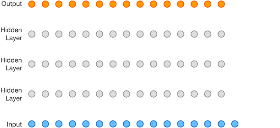
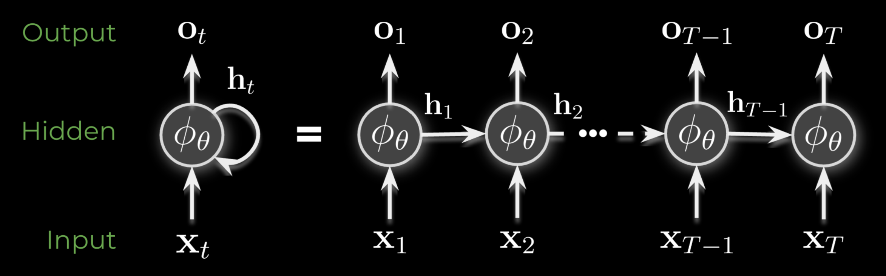
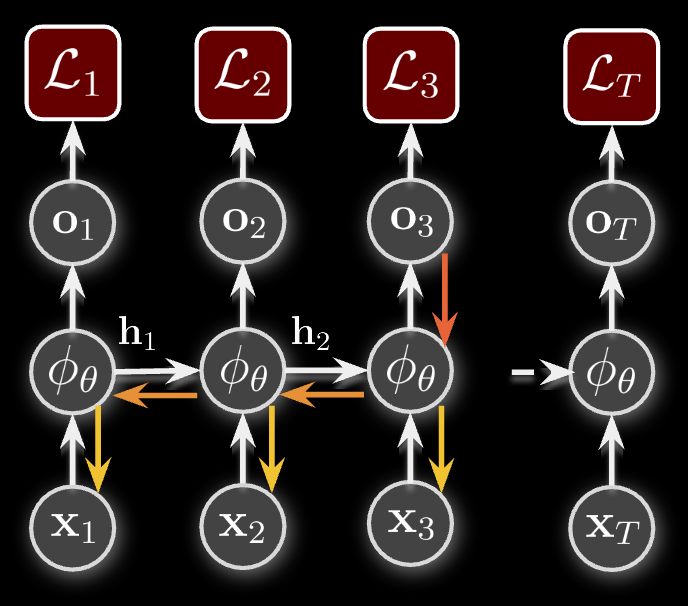
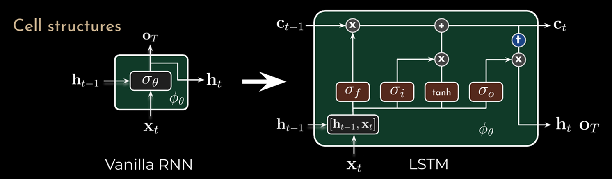

# Recurrent Layers

---

## Mathematical Foundations

    

        
Calculus & Linear Algebra

        
Basis for optimization algorithms and machine learning model operations

    

    

        {{TIMELINE:timeline_calculus_linear_algebra}}
    

    

        
Probability & Statistics

        
Basis for Bayesian methods, statistical inference, and generative models

    

    

        {{TIMELINE:timeline_probability_statistics}}
    

    

        
Information & Computation

        
Foundations of algorithmic thinking and information theory

    

    

        {{TIMELINE:timeline_information_computation}}
    

---

## Early History of Neural Networks

    

        
Architectures & Layers

        
Evolution of network architectures and layer innovations

    

    

        {{TIMELINE:timeline_early_nn_architectures}}
    

    

        
Training & Optimization

        
Methods for efficient learning and gradient-based optimization

    

    

        {{TIMELINE:timeline_early_nn_training}}
    

    

        
Software & Datasets

        
Tools, platforms, and milestones that enabled practical deep learning

    

    

        {{TIMELINE:timeline_early_nn_software}}
    

---

## The Deep Learning Era

<!-- Layers & Architectures Timeline -->

    

        
Deep architectures

        
Deep architectures and generative models transforming AI capabilities

    

    

        {{TIMELINE:timeline_deep_architectures}}
    

    

        
Training & Optimization

        
Advanced learning techniques and representation learning breakthroughs

    

    

        {{TIMELINE:timeline_deep_training}}
    

    

        
Software & Applications

        
Practical deployment and mainstream adoption of deep learning systems

    

    

        {{TIMELINE:timeline_deep_software}}
    

---

## Recap: Linear Layers

- Linear layers are the building blocks of neural networks, consisting of weights and biases
- A linear layer with one output and a step activation function is named a perceptron
- In order to stack multiple linear layers and learn complex patterns, we need a differentiable non-linear activation function
- Common activation functions include ReLU, sigmoid, and tanh

- The forward pass of a multi-layer perceptron (MLP) consists of multiple linear transformations followed by non-linear activations
- In the backward pass, we "go back" through the network to update the weights using gradient descent.

**Forward Pass**:
1. Input: $\mathbf{h}^{(0)} = \mathbf{x}$
2. For $l = 1, \ldots, L$:
   - $\mathbf{z}^{(l)} = \mathbf{W}^{(l)} \mathbf{h}^{(l-1)} + \mathbf{b}^{(l)}$
   - $\mathbf{h}^{(l)} = \sigma(\mathbf{z}^{(l)})$
3. Output: $\hat{\mathbf{y}} = \mathbf{h}^{(L)}$
4. Loss: $\mathcal{L}(\mathbf{y}, \hat{\mathbf{y}})$

**Backward Pass**:

1. Output layer: $\boldsymbol{\delta}^{(L)} = \frac{\partial \mathcal{L}}{\partial \hat{\mathbf{y}}} \odot \sigma'(\mathbf{z}^{(L)})$
2. For $l = L-1, \ldots, 1$:
   - $\boldsymbol{\delta}^{(l)} = [(\mathbf{W}^{(l+1)})^\top \boldsymbol{\delta}^{(l+1)}] \odot \sigma'(\mathbf{z}^{(l)})$
3. Gradients for all layers:
   - $\frac{\partial \mathcal{L}}{\partial \mathbf{W}^{(l)}} = \boldsymbol{\delta}^{(l)} (\mathbf{h}^{(l-1)})^\top$
   - $\frac{\partial \mathcal{L}}{\partial \mathbf{b}^{(l)}} = \boldsymbol{\delta}^{(l)}$

Linear layers have limitations in modeling sequential data!

---

## Recap: Convolutional Layers

- Convolutional layers apply learnable FIR filters, enabling translation invariance and local pattern recognition

- They handle variable-length inputs with fewer parameters than fully connected layers
- Multi-channel convolutions learn diverse features through parallel kernels applied across all input channels
- Options include padding, stride, and dilation to control receptive field and output dimensions
- Pooling layers (max/average) reduce spatial dimensions, helping decrease computational load

- Transposed convolutions upsample feature maps for generative models and segmentation tasks
- In backpropagation, weight gradients are computed via convolution, and error propagation uses full convolution with flipped kernels

**Forward Pass**:
1. Input: $\mathbf{h}^{(0)} = \mathbf{x}$
2. For $l = 1, \ldots, L$:
   - $z^{(l)}[n] = \sum_{k=0}^{M-1} w^{(l)}[k] h^{(l-1)}[n-k] + b^{(l)}$
   - $h^{(l)}[n] = \sigma(z^{(l)}[n])$
3. Output: $\hat{\mathbf{y}} = \mathbf{h}^{(L)}$
4. Loss: $\mathcal{L}(\mathbf{y}, \hat{\mathbf{y}})$

**Backward Pass**:

1. Output layer: $\delta^{(L)}[n] = \frac{\partial \mathcal{L}}{\partial \hat{y}[n]} \cdot \sigma'(z^{(L)}[n])$
2. For $l = L-1, \ldots, 1$:
   - $\delta^{(l)}[n] = \left[\sum_{k=0}^{M-1} \delta^{(l+1)}[n+k] w^{(l+1)}[k]\right] \sigma'(z^{(l)}[n])$
3. Gradients for all layers:
   - $\frac{\partial \mathcal{L}}{\partial w^{(l)}[k]} = \sum_{n} \delta^{(l)}[n] h^{(l-1)}[n-k]$
   - $\frac{\partial \mathcal{L}}{\partial b^{(l)}} = \sum_{n} \delta^{(l)}[n]$

Can convolutional layers capture long-range temporal dependencies?

- Limited: Standard convolutions have fixed, small receptive fields (kernel size $M$)
- Stacking layers increases receptive field, but grows linearly with depth
- Dilated convolutions expand receptive field exponentially, but still bound to fixed context windows

---

## WaveNet: Dilated Causal Convolutions

    
    

        Oord, A. van den, Dieleman, S., Zen, H., Simonyan, K., Vinyals, O., Graves, A., Kalchbrenner, N., Senior, A., & Kavukcuoglu, K. (2016). WaveNet: A Generative Model for Raw Audio (No. arXiv:1609.03499). https://doi.org/10.48550/arXiv.1609.03499
    

---

## Vanilla Recurrent Layers

- Recurrent layers are designed to handle sequential data by maintaining a hidden state that captures information from previous time steps
- They process input sequences one element at a time, updating the hidden state at each step
- The hidden state allows the network to retain memory of past inputs, enabling it to learn temporal dependencies

    
    
Source: https://github.com/acids-ircam/creative_ml

---

## Vanilla Recurrent Layers

- Recurrent layers are designed to handle sequential data by maintaining a hidden state that captures information from previous time steps
- They process input sequences one element at a time, updating the hidden state at each step
- The hidden state allows the network to retain memory of past inputs, enabling it to learn temporal dependencies

$$
\begin{aligned}
\mathbf{h}_t &= f_{\boldsymbol{\theta}}(\mathbf{x}_t, \mathbf{h}_{t-1}) \\
\mathbf{h}_t &= \sigma(\mathbf{W}_{xh} \mathbf{x}_t + \mathbf{b}_{x} + \mathbf{W}_{hh} \mathbf{h}_{t-1} + \mathbf{b}_h)
\end{aligned}
$$

$$
\begin{aligned}
\mathbf{h}_t &= f_{\boldsymbol{\theta}}(\mathbf{x}_t, \mathbf{h}_{t-1}) \\
\mathbf{h}_t &= \sigma(\mathbf{W}_{xh} \mathbf{x}_t + \mathbf{W}_{hh} \mathbf{h}_{t-1} + \mathbf{b})
\end{aligned}
$$

---

## Vanilla Recurrent Layer - Forward Propagation

**Forward Pass** (compute hidden states for $t = 1, \ldots, T$):

$$
\begin{aligned}
\mathbf{z}_t &= \mathbf{W}_{xh} \mathbf{x}_t + \mathbf{W}_{hh} \mathbf{h}_{t-1} + \mathbf{b} \\
\mathbf{h}_t &= \sigma(\mathbf{z}_t)
\end{aligned}
$$

where:
- $\mathbf{W}_{xh} \in \mathbb{R}^{M \times N}$ maps input to hidden state
- $\mathbf{W}_{hh} \in \mathbb{R}^{M \times M}$ maps previous hidden to current hidden
- $\mathbf{b} \in \mathbb{R}^{M}$ is the bias vector
- $\sigma(\cdot)$ is the activation function (e.g., tanh, sigmoid)
- $\mathbf{h}_0$ is initialized (often to zeros)

---

## Backpropagation Through Time (BPTT)

How do we train a recurrent neural network across multiple time steps?

Compute gradients of the loss $\mathcal{L}$ with respect to parameters, accounting for dependencies across all time steps:

$$
\frac{\partial \mathcal{L}}{\partial \mathbf{W}_{hh}}, \quad \frac{\partial \mathcal{L}}{\partial \mathbf{W}_{xh}}, \quad \text{and} \quad \frac{\partial \mathcal{L}}{\partial \mathbf{b}}
$$

---

## BPTT: Temporal Dependency Chain

The loss $\mathcal{L}$ has a **temporal dependency chain**:

 
$\mathcal{L}$ depends on $\mathbf{h}_T$ (final hidden state)
 

 
↓ which depends on $\mathbf{W}_{hh}$, $\mathbf{W}_{xh}$, $\mathbf{b}$, and $\mathbf{h}_{T-1}$
 

 
↓ which depends on $\mathbf{W}_{hh}$, $\mathbf{W}_{xh}$, $\mathbf{b}$, and $\mathbf{h}_{T-2}$
 

 
↓ and so on back to $\mathbf{h}_0$...
 

BPTT: Temporal Dependency Chain extends backpropagation to handle temporal dependencies by unrolling the recurrent network through time!

---

## BPTT: Temporal Dependency Chain

    
    
Source: https://github.com/acids-ircam/creative_ml

---

## BPTT: Output Layer

<strong>MSE Loss</strong>: $\mathcal{L} = \frac{1}{N}\sum_{i=1}^{N}\Vert\mathbf{y}_i - \hat{\mathbf{y}}_i\Vert^2 = \frac{1}{N}\sum_{i=1}^{N}\sum_{j}(y_{ij} - \hat{y}_{ij})^2$

**Step 1**: Compute gradient w.r.t. final hidden state pre-activation $\mathbf{z}_T$ assuming we have only one sample $N=1$.

Apply the **chain rule**: $\mathcal{L}$ depends on $\mathbf{z}_T$ through $\mathbf{h}_T$ and then $\hat{\mathbf{y}}$. For each hidden unit $k$, output dimension $j$:

$$
\frac{\partial \mathcal{L}}{\partial z_{T,k}} = \sum_{j=1}^{M_{\text{out}}} \color{#FF6B6B}{\frac{\partial \mathcal{L}}{\partial \hat{y}_j}} \color{black}{\cdot} \color{#95E1D3}{\frac{\partial \hat{y}_j}{\partial h_{T,k}}} \color{black}{\cdot} \color{#4ECDC4}{\frac{\partial h_{T,k}}{\partial z_{T,k}}}
$$

where $\color{#FF6B6B}{\frac{\partial \mathcal{L}}{\partial \hat{y}_j} = 2(\hat{y}_{j} - y_{j})}$, $\color{#95E1D3}{\frac{\partial \hat{y}_k}{\partial h_{T,k}} = W_{hy,kj}}$ (from $\hat{\mathbf{y}} = \mathbf{W}_{hy} \mathbf{h}_T + \mathbf{b}_y$), and $\color{#4ECDC4}{\frac{\partial h_{T,k}}{\partial z_{T,k}} = \sigma'(z_{T,k})}$.

In vector form for a single sample, this gives us the **error term**:

$$
\boldsymbol{\delta}_T = \left[\mathbf{W}_{hy}^\top (\hat{\mathbf{y}} - \mathbf{y})\right] \odot \sigma'(\mathbf{z}_T)
$$

where $\odot$ is element-wise multiplication.

---

## BPTT: Final Time Step

**Step 2**: Compute gradients w.r.t. weights and biases at final time step $T$

Given $\boldsymbol{\delta}_T = \frac{\partial \mathcal{L}}{\partial \mathbf{z}_T}$ and forward pass $z_{T,k} = \sum_{i} W_{xh,ki} x_{T,i} + \sum_{l} W_{hh,kl} h_{T-1,l} + b_k$:

**Input-to-hidden weight gradients**: Apply chain rule to $W_{xh,ki}$

$$
\frac{\partial \mathcal{L}}{\partial W_{xh,ki}} = \color{#FF6B6B}{\frac{\partial \mathcal{L}}{\partial z_{T,k}}} \color{black}{\cdot} \color{#4ECDC4}{\frac{\partial z_{T,k}}{\partial W_{xh,ki}}} \color{black}{=} \color{#FF6B6B}{\delta_{T,k}} \color{black}{\cdot} \color{#4ECDC4}{x_{T,i}}
$$

In matrix form: $\frac{\partial \mathcal{L}}{\partial \mathbf{W}_{xh}} = \boldsymbol{\delta}_T \mathbf{x}_T^\top$ (contribution from time $T$)

**Bias gradients**: Apply chain rule to $b_k$

$$
\frac{\partial \mathcal{L}}{\partial b_k} = \color{#FF6B6B}{\frac{\partial \mathcal{L}}{\partial z_{T,k}}} \color{black}{\cdot} \color{#4ECDC4}{\frac{\partial z_{T,k}}{\partial b_k}} \color{black}{=} \color{#FF6B6B}{\delta_{T,k}} \color{black}{\cdot} \color{#4ECDC4}{1} \color{black}{=} \delta_{T,k}
$$

**Hidden-to-hidden weight gradients**: Apply chain rule to $W_{hh,kl}$

$$
\frac{\partial \mathcal{L}}{\partial W_{hh,kl}} = \color{#FF6B6B}{\frac{\partial \mathcal{L}}{\partial z_{T,k}}} \color{black}{\cdot} \color{#4ECDC4}{\frac{\partial z_{T,k}}{\partial W_{hh,kl}}} \color{black}{=} \color{#FF6B6B}{\delta_{T,k}} \color{black}{\cdot} \color{#4ECDC4}{h_{T-1,l}}
$$

In matrix form: $\frac{\partial \mathcal{L}}{\partial \mathbf{W}_{hh}} = \boldsymbol{\delta}_T \mathbf{h}_{T-1}^\top$ (contribution from time $T$)

---

## BPTT: Hidden Time Steps

**Step 3**: Propagate error backwards from time $t$ to time $t-1$

To compute $\frac{\partial \mathcal{L}}{\partial z_{t-1,l}}$, we use the chain rule through time step $t$, as $\mathcal{L}$ depends on $z_{t-1,l}$ via all hidden units at time $t$:

$$
\frac{\partial \mathcal{L}}{\partial z_{t-1,l}} = \sum_{k=1}^{M_{\text{hidden}}} \color{#FF6B6B}{\frac{\partial \mathcal{L}}{\partial z_{t,k}}} \color{black}{\cdot} \color{#95E1D3}{\frac{\partial z_{t,k}}{\partial h_{t-1,l}}} \color{black}{\cdot} \color{#4ECDC4}{\frac{\partial h_{t-1,l}}{\partial z_{t-1,l}}}
$$

where $\color{#FF6B6B}{\delta_{t,k}}$ = error at next time step, $\color{#95E1D3}{\frac{\partial z_{t,k}}{\partial h_{t-1,l}} = W_{hh,kl}}$ = recurrent weight connecting time steps and $\color{#4ECDC4}{\frac{\partial h_{t-1,l}}{\partial z_{t-1,l}} = \sigma'(z_{t-1,l})}$

This gives us the **error term** for time $t-1$:

$$
\delta_{t-1,l} = \left(\sum_{k=1}^{M_{\text{hidden}}} W_{hh,kl} \delta_{t,k}\right) \sigma'(z_{t-1,l})
$$

In vector form: $\boldsymbol{\delta}_{t-1} = \left[\mathbf{W}_{hh}^\top \boldsymbol{\delta}_t\right] \odot \sigma'(\mathbf{z}_{t-1})$

---

## BPTT: Hidden Time Steps

**Step 4**: Compute gradients w.r.t. weights and biases at time step $t$ (same as final time step!)

Given $\boldsymbol{\delta}_t = \frac{\partial \mathcal{L}}{\partial \mathbf{z}_t}$ and forward pass $z_{t,k} = \sum_{i} W_{xh,ki} x_{t,i} + \sum_{l} W_{hh,kl} h_{t-1,l} + b_k$:

**Input-to-hidden weight gradients**: Apply chain rule to $W_{xh,ki}$

$$
\frac{\partial \mathcal{L}}{\partial W_{xh,ki}} = \color{#FF6B6B}{\frac{\partial \mathcal{L}}{\partial z_{t,k}}} \color{black}{\cdot} \color{#4ECDC4}{\frac{\partial z_{t,k}}{\partial W_{xh,ki}}} \color{black}{=} \color{#FF6B6B}{\delta_{t,k}} \color{black}{\cdot} \color{#4ECDC4}{x_{t,i}}
$$

In matrix form: $\frac{\partial \mathcal{L}}{\partial \mathbf{W}_{xh}} = \boldsymbol{\delta}_t \mathbf{x}_t^\top$ (contribution from time $t$)

**Bias gradients**: Apply chain rule to $b_j$

$$
\frac{\partial \mathcal{L}}{\partial b_j} = \color{#FF6B6B}{\frac{\partial \mathcal{L}}{\partial z_{t,k}}} \color{black}{\cdot} \color{#4ECDC4}{\frac{\partial z_{t,k}}{\partial b_j}} \color{black}{=} \color{#FF6B6B}{\delta_{t,k}} \color{black}{\cdot} \color{#4ECDC4}{1} \color{black}{=} \delta_{t,k}
$$

**Hidden-to-hidden weight gradients**: Apply chain rule to $W_{hh,kl}$

$$
\frac{\partial \mathcal{L}}{\partial W_{hh,kl}} = \color{#FF6B6B}{\frac{\partial \mathcal{L}}{\partial z_{t,k}}} \color{black}{\cdot} \color{#4ECDC4}{\frac{\partial z_{t,k}}{\partial W_{hh,kl}}} \color{black}{=} \color{#FF6B6B}{\delta_{t,k}} \color{black}{\cdot} \color{#4ECDC4}{h_{t-1,l}}
$$

In matrix form: $\frac{\partial \mathcal{L}}{\partial \mathbf{W}_{hh}} = \boldsymbol{\delta}_t \mathbf{h}_{t-1}^\top$ (contribution from time $t$)

---

## BPTT: Total Gradient Computation

**Step 5**: Sum gradients across all time steps

Since the <strong>same weights</strong> $\mathbf{W}_{hh}$, $\mathbf{W}_{xh}$, and $\mathbf{b}$ are used at every time step, the total gradient is the sum of contributions from all time steps:

$$
\begin{aligned}
\frac{\partial \mathcal{L}}{\partial \mathbf{W}_{hh}} &= \sum_{t=1}^{T} \boldsymbol{\delta}_t \mathbf{h}_{t-1}^\top \\
\frac{\partial \mathcal{L}}{\partial \mathbf{W}_{xh}} &= \sum_{t=1}^{T} \boldsymbol{\delta}_t \mathbf{x}_t^\top \\
\frac{\partial \mathcal{L}}{\partial \mathbf{b}} &= \sum_{t=1}^{T} \boldsymbol{\delta}_t
\end{aligned}
$$

---

## BPTT: Algorithm Summary

<strong>Forward Pass</strong>:
<ol>
<li>Initialize: $\mathbf{h}_0 = \mathbf{0}$ (or learned)</li>
<li>For $t = 1, \ldots, T$:
<ul>
<li>$\mathbf{z}_t = \mathbf{W}_{xh} \mathbf{x}_t + \mathbf{W}_{hh} \mathbf{h}_{t-1} + \mathbf{b}$</li>
<li>$\mathbf{h}_t = \sigma(\mathbf{z}_t)$</li>
</ul>
</li>
<li>Output: $\hat{\mathbf{y}} = \mathbf{W}_{hy} \mathbf{h}_T + \mathbf{b}_y$</li>
<li>Loss: $\mathcal{L}(\mathbf{y}, \hat{\mathbf{y}})$</li>
</ol>

<strong>Backward Pass</strong>:
<ol>
<li>Output gradient: $\frac{\partial \mathcal{L}}{\partial \mathbf{h}_T}$ (from output layer)</li>
<li>Final time: $\boldsymbol{\delta}_T = \frac{\partial \mathcal{L}}{\partial \mathbf{h}_T} \odot \sigma'(\mathbf{z}_T)$</li>
<li>For $t = T-1, \ldots, 1$:
<ul>
<li>$\boldsymbol{\delta}_t = [\mathbf{W}_{hh}^\top \boldsymbol{\delta}_{t+1}] \odot \sigma'(\mathbf{z}_t)$</li>
</ul>
</li>
<li>Accumulate gradients:
<ul>
<li>$\frac{\partial \mathcal{L}}{\partial \mathbf{W}_{hh}} = \sum_{t=1}^{T} \boldsymbol{\delta}_t \mathbf{h}_{t-1}^\top$</li>
<li>$\frac{\partial \mathcal{L}}{\partial \mathbf{W}_{xh}} = \sum_{t=1}^{T} \boldsymbol{\delta}_t \mathbf{x}_t^\top$</li>
<li>$\frac{\partial \mathcal{L}}{\partial \mathbf{b}} = \sum_{t=1}^{T} \boldsymbol{\delta}_t$</li>
</ul>
</li>
</ol>

---

## BPTT: Algorithm Summary

**Weight Update** (Gradient Descent):

$$
\begin{aligned}
\mathbf{W}_{hh} & \leftarrow \mathbf{W}_{hh} - \eta \frac{\partial \mathcal{L}}{\partial \mathbf{W}_{hh}} \\
\mathbf{W}_{xh} & \leftarrow \mathbf{W}_{xh} - \eta \frac{\partial \mathcal{L}}{\partial \mathbf{W}_{xh}} \\
\mathbf{b} & \leftarrow \mathbf{b} - \eta \frac{\partial \mathcal{L}}{\partial \mathbf{b}}
\end{aligned}
$$

where $\eta$ is the learning rate.

---

## The Vanishing Gradient Problem

**Problem**: Gradients become exponentially small as they propagate back through time

To compute the gradient at time $t$, we apply the chain rule through all time steps from $t+1$ to $T$:

$$
\frac{\partial \mathcal{L}}{\partial \mathbf{h}_t} = \frac{\partial \mathcal{L}}{\partial \mathbf{h}_T} \prod_{k=t+1}^{T} \frac{\partial \mathbf{h}_k}{\partial \mathbf{h}_{k-1}}
$$

where each term comes from the RNN forward pass ($\mathbf{h}_k = \sigma(\mathbf{W}_{xh}\mathbf{x}_k + \mathbf{W}_{hh}\mathbf{h}_{k-1} + \mathbf{b})$):

$$
\frac{\partial \mathbf{h}_k}{\partial \mathbf{h}_{k-1}} = \text{diag}(\sigma'(\mathbf{z}_k)) \mathbf{W}_{hh}
$$

This gives us the product of gradients:

$$
\prod_{k=t+1}^{T} \frac{\partial \mathbf{h}_k}{\partial \mathbf{h}_{k-1}} = \prod_{k=t+1}^{T} \text{diag}(\sigma'(\mathbf{z}_k)) \mathbf{W}_{hh}
$$

**When does it vanish?**

- If $\|\mathbf{W}_{hh}\| < 1$ and activation derivatives $\sigma'(\mathbf{z}_k) < 1$ (e.g., sigmoid/tanh)
- After $T-t$ time steps, gradient magnitude: $\|\text{gradient}\| \approx (\|\mathbf{W}_{hh}\| \cdot \max_k \sigma'(\mathbf{z}_k))^{T-t}$
- For sigmoid: $\sigma'(z) \leq 0.25$, for tanh: $\tanh'(z) \leq 1$

<strong>Consequences</strong>:
<ul>
<li>Network cannot learn long-term dependencies (typically > 10-20 time steps)</li>
<li>Early layers receive negligible gradient updates</li>

---

## The Exploding Gradient Problem

**Problem**: Gradients become exponentially large as they propagate back through time

$$
\prod_{k=t+1}^{T} \frac{\partial \mathbf{h}_k}{\partial \mathbf{h}_{k-1}} = \prod_{k=t+1}^{T} \text{diag}(\sigma'(\mathbf{z}_k)) \mathbf{W}_{hh}
$$

**When does it explode?**

- If $\|\mathbf{W}_{hh}\| > 1$ and the product of derivatives grows unbounded
- Gradient magnitude: $\|\text{gradient}\| \approx (\|\mathbf{W}_{hh}\| \cdot \max_k \sigma'(\mathbf{z}_k))^{T-t}$
- Even with bounded activation derivatives, large $\|\mathbf{W}_{hh}\|$ can cause explosion

**Common Solution: Gradient Clipping** - Limit gradient magnitude before parameter update:

$$
\mathbf{g} \leftarrow \begin{cases}
\mathbf{g} & \text{if } \|\mathbf{g}\| \leq \theta \\
\theta \cdot \frac{\mathbf{g}}{\|\mathbf{g}\|} & \text{if } \|\mathbf{g}\| > \theta
\end{cases}
$$

where $\mathbf{g}$ is the gradient vector and $\theta$ is the clipping threshold.

<strong>Consequences</strong>:
<ul>
<li>Parameter updates become extremely large</li>
<li>Network weights oscillate wildly</li>
<li>Training becomes unstable, leading to NaN values</li>
<li>Model fails to converge</li>
</ul>

---

## Long Short-Term Memory (LSTM) Networks

- LSTMs are a type of recurrent neural network designed to mitigate the vanishing gradient problem and capture long-term dependencies in sequential data
- They use a memory cell with gating mechanisms (input, forget, output gates) to control information flow and maintain long-term dependencies

    
    
Source: https://github.com/acids-ircam/creative_ml

---

## LSTM: Forget Gate

<strong>Forget Gate</strong>: Controls how much information from the previous cell state $\mathbf{c}_{t-1}$ is retained in current cell state $\mathbf{c}_t$.

$$\mathbf{f}_t = \sigma(\mathbf{W}_{xf} \mathbf{x}_t + \mathbf{W}_{hf} \mathbf{h}_{t-1} + \mathbf{b}_f)$$

where $\mathbf{f}_t$ is the forget gate vector (values between 0 and 1).

    
    
Source: https://github.com/acids-ircam/creative_ml

---

## LSTM: Input Gate

<strong>Input Gate</strong>: Controls how much new information from the current input $\mathbf{x}_t$ and previous hidden state $\mathbf{h}_{t-1}$ is added to the cell state $\mathbf{c}_t$.

$$\begin{aligned}
\mathbf{i}_t &= \sigma(\mathbf{W}_{xi} \mathbf{x}_t + \mathbf{W}_{hi} \mathbf{h}_{t-1} + \mathbf{b}_i) \\
\tilde{\mathbf{c}}_t &= \tanh(\mathbf{W}_{xc} \mathbf{x}_t + \mathbf{W}_{hc} \mathbf{h}_{t-1} + \mathbf{b}_c)
\end{aligned}$$

where $\mathbf{i}_t$ is the input gate vector (values between 0 and 1) and $\tilde{\mathbf{c}}_t$ is the candidate cell state.

    
    
Source: https://github.com/acids-ircam/creative_ml

---

## LSTM: Cell State Update

<strong>Cell State Update</strong>: Combines the previous cell state $\mathbf{c}_{t-1}$ (modulated by forget gate) and the candidate cell state $\tilde{\mathbf{c}}_t$ (modulated by input gate) to form the new cell state $\mathbf{c}_t$.

$$\mathbf{c}_t = \mathbf{f}_t \odot \mathbf{c}_{t-1} + \mathbf{i}_t \odot \tilde{\mathbf{c}}_t$$

where $\odot$ denotes element-wise multiplication.

    
    
Source: https://github.com/acids-ircam/creative_ml

---

## LSTM: Output Gate and Hidden State

<strong>Output Gate and Hidden State</strong>: Controls how much of the cell state $\mathbf{c}_t$ is exposed to the hidden state $\mathbf{h}_t$.

$$\begin{aligned}
\mathbf{o}_t &= \sigma(\mathbf{W}_{xo} \mathbf{x}_t + \mathbf{W}_{ho} \mathbf{h}_{t-1} + \mathbf{b}_o) \\
\mathbf{h}_t &= \mathbf{o}_t \odot \tanh(\mathbf{c}_t)
\end{aligned}$$

where $\mathbf{o}_t$ is the output gate vector (values between 0 and 1).

    
    
Source: https://github.com/acids-ircam/creative_ml

---

## LSTM: Summary of Equations

The complete set of LSTM equations at time step $t$:

$$\begin{aligned}
\mathbf{f}_t &= \sigma(\mathbf{W}_{xf} \mathbf{x}_t + \mathbf{W}_{hf} \mathbf{h}_{t-1} + \mathbf{b}_f) \\
\mathbf{i}_t &= \sigma(\mathbf{W}_{xi} \mathbf{x}_t + \mathbf{W}_{hi} \mathbf{h}_{t-1} + \mathbf{b}_i) \\
\tilde{\mathbf{c}}_t &= \tanh(\mathbf{W}_{xc} \mathbf{x}_t + \mathbf{W}_{hc} \mathbf{h}_{t-1} + \mathbf{b}_c) \\
\mathbf{o}_t &= \sigma(\mathbf{W}_{xo} \mathbf{x}_t + \mathbf{W}_{ho} \mathbf{h}_{t-1} + \mathbf{b}_o) \\
\mathbf{c}_t &= \mathbf{f}_t \odot \mathbf{c}_{t-1} + \mathbf{i}_t \odot \tilde{\mathbf{c}}_t \\
\mathbf{h}_t &= \mathbf{o}_t \odot \tanh(\mathbf{c}_t)
\end{aligned}$$

    <strong>PyTorch Documentation</strong>: <a href="https://pytorch.org/docs/stable/generated/torch.nn.LSTM.html" target="_blank">torch.nn.LSTM</a>

---

## Gated Recurrent Unit (GRU)

- GRUs are a simplified variant of LSTMs that combine the forget and input gates into a single "update gate"
- They use fewer parameters than LSTMs while maintaining comparable performance
- GRUs have two gates: reset gate and update gate, making them computationally more efficient

    
    
Source: https://github.com/acids-ircam/creative_ml

---

## GRU: Forward Propagation - Reset Gate

<strong>Reset Gate</strong>: Controls how much of the previous hidden state $\mathbf{h}_{t-1}$ should be forgotten when computing the candidate hidden state.

$$\mathbf{r}_t = \sigma(\mathbf{W}_{xr} \mathbf{x}_t + \mathbf{W}_{hr} \mathbf{h}_{t-1} + \mathbf{b}_r)$$

where $\mathbf{r}_t$ is the reset gate vector (values between 0 and 1).

    
    
Source: https://github.com/acids-ircam/creative_ml

---

## GRU: Forward Propagation - Update Gate

<strong>Update Gate</strong>: Controls how much of the previous hidden state $\mathbf{h}_{t-1}$ to keep and how much of the candidate hidden state $\tilde{\mathbf{h}}_t$ to add.

$$\mathbf{z}_t = \sigma(\mathbf{W}_{xz} \mathbf{x}_t + \mathbf{W}_{hz} \mathbf{h}_{t-1} + \mathbf{b}_z)$$

where $\mathbf{z}_t$ is the update gate vector (values between 0 and 1).

    
    
Source: https://github.com/acids-ircam/creative_ml

---

## GRU: Forward Propagation - Candidate Hidden State

<strong>Candidate Hidden State</strong>: Computes new information that could be added to the hidden state, using the reset gate to selectively forget parts of $\mathbf{h}_{t-1}$.

$$\tilde{\mathbf{h}}_t = \tanh(\mathbf{W}_{xh} \mathbf{x}_t + \mathbf{W}_{hh} (\mathbf{r}_t \odot \mathbf{h}_{t-1}) + \mathbf{b}_h)$$

where $\tilde{\mathbf{h}}_t$ is the candidate hidden state and $\mathbf{r}_t \odot \mathbf{h}_{t-1}$ applies the reset gate to the previous hidden state.

    
    
Source: https://github.com/acids-ircam/creative_ml

---

## GRU: Forward Propagation - Hidden State Update

<strong>Hidden State Update</strong>: Combines the previous hidden state $\mathbf{h}_{t-1}$ and candidate hidden state $\tilde{\mathbf{h}}_t$ using the update gate $\mathbf{z}_t$.

$$\mathbf{h}_t = (1 - \mathbf{z}_t) \odot \mathbf{h}_{t-1} + \mathbf{z}_t \odot \tilde{\mathbf{h}}_t$$

where:
- $(1 - \mathbf{z}_t) \odot \mathbf{h}_{t-1}$ keeps parts of the old hidden state
- $\mathbf{z}_t \odot \tilde{\mathbf{h}}_t$ adds parts of the new candidate hidden state

    
    
Source: https://github.com/acids-ircam/creative_ml

---

## GRU: Summary of Equations

The complete set of GRU equations at time step $t$:

$$\begin{aligned}
\mathbf{r}_t &= \sigma(\mathbf{W}_{xr} \mathbf{x}_t + \mathbf{W}_{hr} \mathbf{h}_{t-1} + \mathbf{b}_r) \\
\mathbf{z}_t &= \sigma(\mathbf{W}_{xz} \mathbf{x}_t + \mathbf{W}_{hz} \mathbf{h}_{t-1} + \mathbf{b}_z) \\
\tilde{\mathbf{h}}_t &= \tanh(\mathbf{W}_{xh} \mathbf{x}_t + \mathbf{W}_{hh} (\mathbf{r}_t \odot \mathbf{h}_{t-1}) + \mathbf{b}_h) \\
\mathbf{h}_t &= (1 - \mathbf{z}_t) \odot \mathbf{h}_{t-1} + \mathbf{z}_t \odot \tilde{\mathbf{h}}_t
\end{aligned}$$

    <strong>PyTorch Documentation</strong>: <a href="https://pytorch.org/docs/stable/generated/torch.nn.GRU.html" target="_blank">torch.nn.GRU</a>

**Key differences from LSTM**:
- No separate cell state — hidden state serves both roles
- Fewer parameters: 3 weight matrices per gate vs. 4 in LSTM
- Update gate implicitly combines forget and input gates: $(1 - \mathbf{z}_t)$ forgets, $\mathbf{z}_t$ adds new info

---

## Gates Beyond LSTM and GRU

- Gating mechanisms can be integrated into other architectures, such as convolutional neural networks (CNNs) and transformer models
- Gates help control information flow, improve gradient propagation, and enhance model performance across various tasks
- Examples include attention gates in transformers and gated convolutional layers in CNNs

---

# Python Implementation

