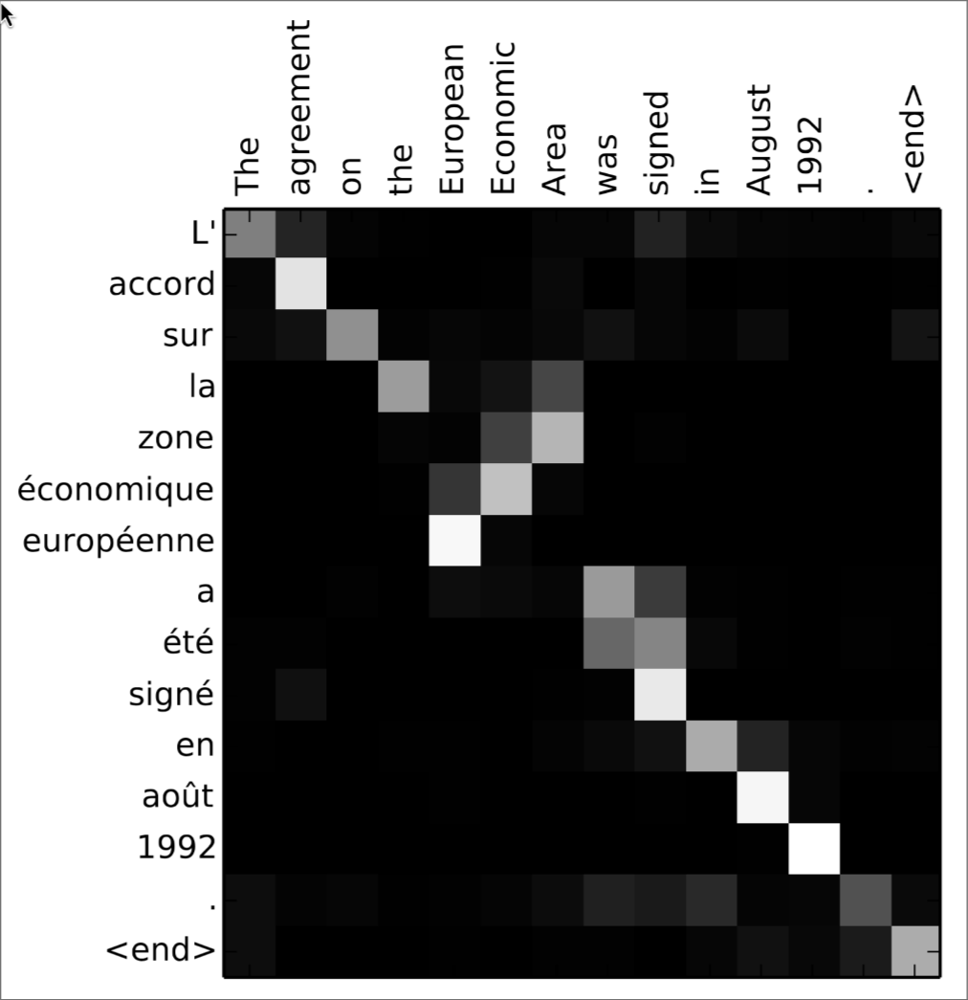

# Attention and Transformers

---

## Mathematical Foundations

    

        
Calculus & Linear Algebra

        
Basis for optimization algorithms and machine learning model operations

    

    

        {{TIMELINE:timeline_calculus_linear_algebra}}
    

    

        
Probability & Statistics

        
Basis for Bayesian methods, statistical inference, and generative models

    

    

        {{TIMELINE:timeline_probability_statistics}}
    

    

        
Information & Computation

        
Foundations of algorithmic thinking and information theory

    

    

        {{TIMELINE:timeline_information_computation}}
    

---

## Early History of Neural Networks

    

        
Architectures & Layers

        
Evolution of network architectures and layer innovations

    

    

        {{TIMELINE:timeline_early_nn_architectures}}
    

    

        
Training & Optimization

        
Methods for efficient learning and gradient-based optimization

    

    

        {{TIMELINE:timeline_early_nn_training}}
    

    

        
Software & Datasets

        
Tools, platforms, and milestones that enabled practical deep learning

    

    

        {{TIMELINE:timeline_early_nn_software}}
    

---

## The Deep Learning Era

<!-- Layers & Architectures Timeline -->

    

        
Deep architectures

        
Deep architectures and generative models transforming AI capabilities

    

    

        {{TIMELINE:timeline_deep_architectures}}
    

    

        
Training & Optimization

        
Advanced learning techniques and representation learning breakthroughs

    

    

        {{TIMELINE:timeline_deep_training}}
    

    

        
Software & Applications

        
Practical deployment and mainstream adoption of deep learning systems

    

    

        {{TIMELINE:timeline_deep_software}}
    

---

## Recurrent Layers: Recap

**Vanilla RNN**:

<ul>
<li>Maintains hidden state across time steps to capture temporal dependencies</li>
<li>Suffers from vanishing/exploding gradients for long sequences</li>
<li>Formula: $\mathbf{h}_t = \sigma\left(\mathbf{W}_{xh} \mathbf{x}_t + \mathbf{W}_{hh} \mathbf{h}_{t-1} + \mathbf{b}\right)$</li>
</ul>

**LSTM (Long Short-Term Memory)**:

- Uses gating mechanisms (forget, input, output gates) and separate cell state
- Better at capturing long-term dependencies, mitigates vanishing gradients
- More parameters and computational cost than vanilla RNN

**GRU (Gated Recurrent Unit)**:

- Simplified variant with reset and update gates (no separate cell state)
- Fewer parameters and computational cost than LSTM while maintaining comparable performance

Limitations of Recurrent Layers:
<ul>
<li>Recurrent layer do only have direct connections to the previous time step, limiting long-range dependency capture</li>
<li>Sequential processing hinders parallelization, leading to long training times</li>
</ul>

---

## Attention Mechanism

- Introduced to address limitations of recurrent layers by allowing direct connections between all time steps
- Computes a weighted sum of all input representations, where weights are determined by a compatibility function (attention scores)
- Enables modeling of long-range dependencies and parallel processing

    
    

        Bahdanau, D., Cho, K., & Bengio, Y. (2016). Neural Machine Translation by Jointly Learning to Align and Translate (No. arXiv:1409.0473). arXiv. https://doi.org/10.48550/arXiv.1409.0473
    

---

# Python Implementation
