# Attention and Transformers

---

## Mathematical Foundations

    

        
Calculus & Linear Algebra

        
Basis for optimization algorithms and machine learning model operations

    

    

        {{TIMELINE:timeline_calculus_linear_algebra}}
    

    

        
Probability & Statistics

        
Basis for Bayesian methods, statistical inference, and generative models

    

    

        {{TIMELINE:timeline_probability_statistics}}
    

    

        
Information & Computation

        
Foundations of algorithmic thinking and information theory

    

    

        {{TIMELINE:timeline_information_computation}}
    

---

## Early History of Neural Networks

    

        
Architectures & Layers

        
Evolution of network architectures and layer innovations

    

    

        {{TIMELINE:timeline_early_nn_architectures}}
    

    

        
Training & Optimization

        
Methods for efficient learning and gradient-based optimization

    

    

        {{TIMELINE:timeline_early_nn_training}}
    

    

        
Software & Datasets

        
Tools, platforms, and milestones that enabled practical deep learning

    

    

        {{TIMELINE:timeline_early_nn_software}}
    

---

## The Deep Learning Era

<!-- Layers & Architectures Timeline -->

    

        
Deep architectures

        
Deep architectures and generative models transforming AI capabilities

    

    

        {{TIMELINE:timeline_deep_architectures}}
    

    

        
Training & Optimization

        
Advanced learning techniques and representation learning breakthroughs

    

    

        {{TIMELINE:timeline_deep_training}}
    

    

        
Software & Applications

        
Practical deployment and mainstream adoption of deep learning systems

    

    

        {{TIMELINE:timeline_deep_software}}
    

---

## Recurrent Layers: Recap

**Vanilla RNN**:

<ul>
<li>Maintains hidden state across time steps to capture temporal dependencies</li>
<li>Suffers from vanishing/exploding gradients for long sequences</li>
<li>Formula: $\mathbf{h}_t = \sigma\left(\mathbf{W}_{xh} \mathbf{x}_t + \mathbf{W}_{hh} \mathbf{h}_{t-1} + \mathbf{b}\right)$</li>
</ul>

**LSTM (Long Short-Term Memory)**:

- Uses gating mechanisms (forget, input, output gates) and separate cell state
- Better at capturing long-term dependencies, mitigates vanishing gradients
- More parameters and computational cost than vanilla RNN

**GRU (Gated Recurrent Unit)**:

- Simplified variant with reset and update gates (no separate cell state)
- Fewer parameters and computational cost than LSTM while maintaining comparable performance

Limitations of Recurrent Layers:
<ul>
<li>Recurrent layer do only have direct connections to the previous time step, limiting long-range dependency capture</li>
<li>Sequential processing hinders parallelization, leading to long training times</li>
</ul>

---

## Attention Mechanism

- Addresses limitations of recurrent layers by allowing direct connections between all time steps
- Computes queries and keys to determine relevance between different positions in the sequence
- Enriches value representations by aggregating information from relevant time steps
- Enables modeling of long-range dependencies and parallel processing at once

    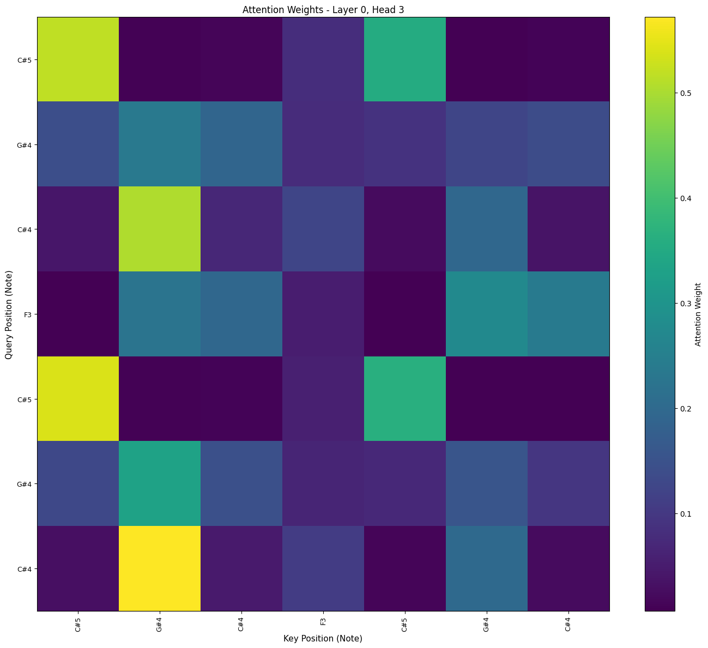

---

## Attention is All You Need (2017)

- Introduced the Transformer architecture, which relies solely on attention mechanisms, eliminating the need for recurrent or convolutional layers
- Utilizes multi-head self-attention to capture different aspects of relationships between tokens in a sequence
- Employs positional encoding to retain the order of tokens in the input sequence
- Achieved state-of-the-art results in machine translation tasks, significantly outperforming previous models
- Large language models like BERT, GPT, LLaMA, and others are based on the Transformer architecture

    
    

    Source: <a href="https://arxiv.org/abs/1706.03762" target="_blank">Attention is All You Need</a>
    

---

## Embedding Layers

    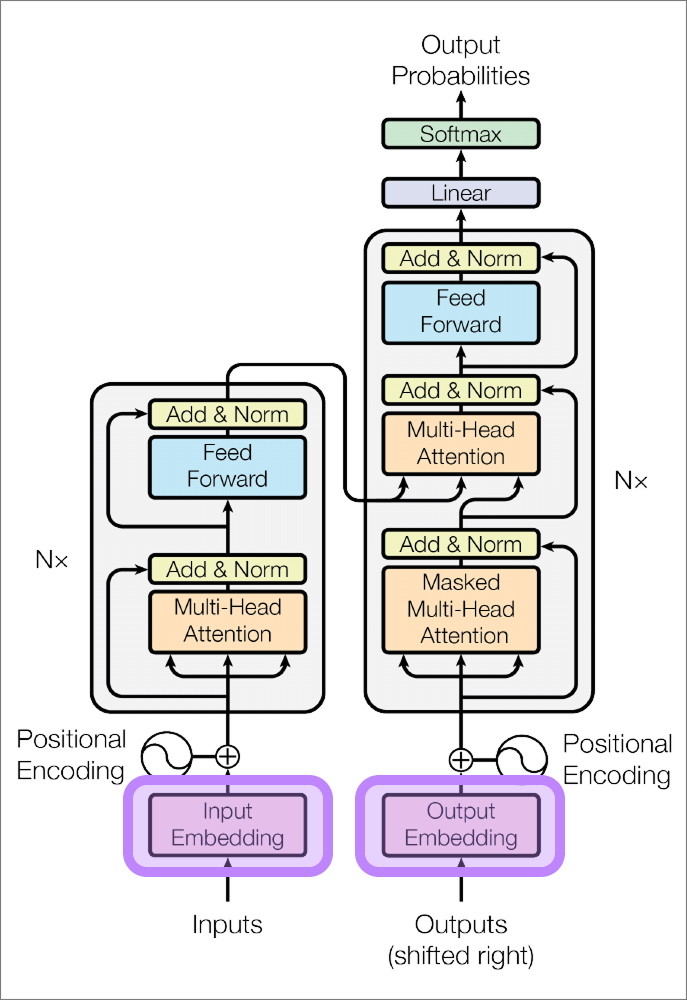
    

    Source: <a href="https://arxiv.org/abs/1706.03762" target="_blank">Attention is All You Need</a>
    

- Convert discrete tokens (words, subwords, characters, midi notes) into continuous vector representations
- Capture semantic relationships and contextual information
- Learned during training to optimize task performance
- Similar to a lookup table where each token maps to a dense vector
- Linear layer without bias and with one-hot encoded inputs

$$
\begin{aligned}
\mathbf{y}(i = \text{token index}) &= \mathbf{e}_{i}^{\top} \mathbf{W} \\
&= \begin{bmatrix}0 & \cdots & 1 & \cdots & 0\end{bmatrix} \mathbf{W} \\
&= \mathbf{W}_{i, :}
\end{aligned}
$$

where $\mathbf{W} \in \mathbb{R}^{V \times D}$ is the embedding matrix, $V$ is the vocabulary size, and $D$ is the embedding dimension.

---

## Output Projection

    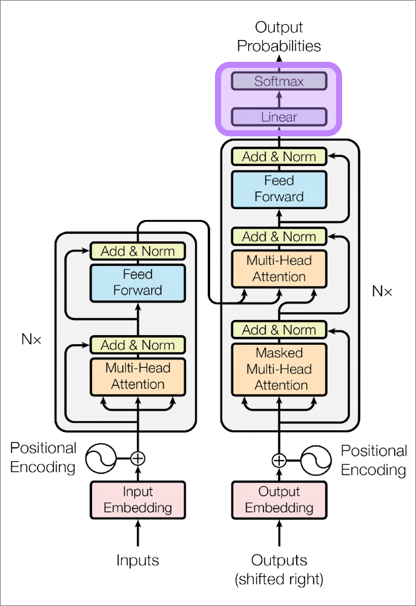
    

    Source: <a href="https://arxiv.org/abs/1706.03762" target="_blank">Attention is All You Need</a>
    

- Maps the decoder's output back to the vocabulary space for token prediction
- Typically implemented as a linear layer followed by a softmax activation
- Shares weights with the embedding layer to reduce the number of parameters and improve performance (Press & Wolf, 2017)
- Converts the decoder's continuous representations into logits for each token in the vocabulary

$$
\begin{aligned}
\mathbf{y}(\mathbf{h}_t) &= \mathbf{h}_t \mathbf{W}^{\top} + \mathbf{b} \\
&= \mathbf{h}_t \mathbf{W}^{\top} \quad \text{(if weights are shared, } \mathbf{b} = 0\text{)}\\
\mathbf{p}_t(\mathbf{h}_t) &= \mathrm{softmax}(\mathbf{y}) \quad \text{where} \quad [\mathbf{p}_t]_i = \frac{\exp(y_i)}{\sum_{j=1}^{V} \exp(y_j)}
\end{aligned}
$$

where $\mathbf{W} \in \mathbb{R}^{V \times D}$ is the shared weight matrix from the embedding layer, $V$ is the vocabulary size, and $D$ is the model dimension.

---

## Positional Encoding

    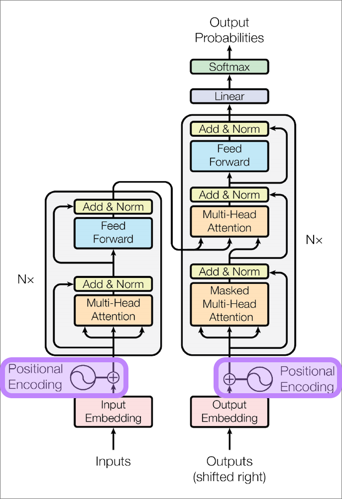
    

    Source: <a href="https://arxiv.org/abs/1706.03762" target="_blank">Attention is All You Need</a>
    

- Since Transformers do not have inherent sequential processing, positional encodings are added to input embeddings to provide information about the order of tokens
- Can be implemented using fixed sinusoidal functions or learned embeddings
- Enables the model to capture the relative and absolute positions of tokens in the sequence

**Vanilla sinusoidal positional encoding formula:**

$$
\begin{aligned}
\mathrm{PE}(t, 2i) &= \sin\left(\frac{t}{10000^{2i/d_{\text{model}}}}\right) \\
\mathrm{PE}(t, 2i+1) &= \cos\left(\frac{t}{10000^{2i/d_{\text{model}}}}\right)
\end{aligned}
$$

where $t$ is the token position, $i$ is the dimension index, and $d_{\text{model}}$ is the model dimension.

    

---

## Self-Attention Mechanism

    
    

    Source: <a href="https://arxiv.org/abs/1706.03762" target="_blank">Attention is All You Need</a>
    

    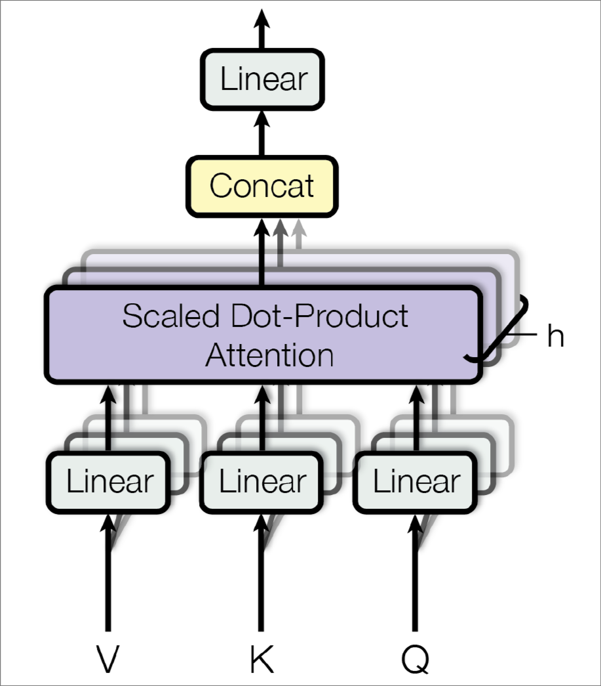
    

    Source: <a href="https://arxiv.org/abs/1706.03762" target="_blank">Attention is All You Need</a>
    

Self-attention allows each token in the input sequence to attend to all other tokens, enabling the model to capture dependencies regardless of their distance in the sequence

**Step 1: Compute Queries, Keys, and Values** 

    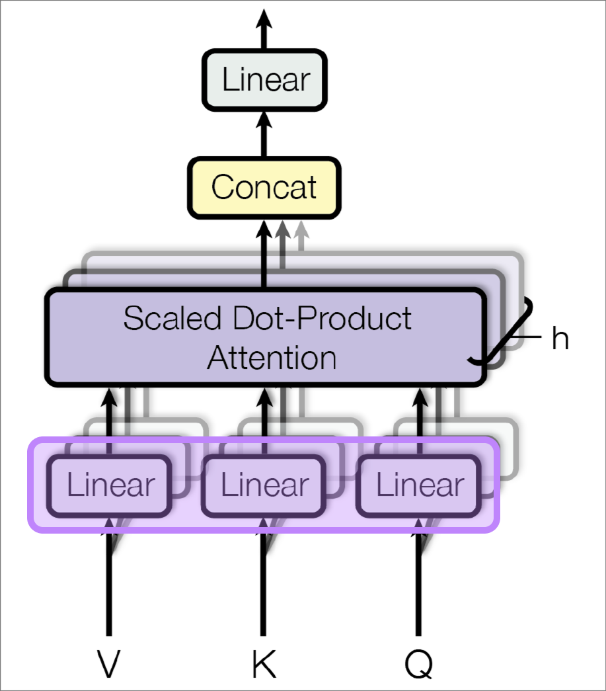
    

    Source: <a href="https://arxiv.org/abs/1706.03762" target="_blank">Attention is All You Need</a>
    

For each token, compute query ($\mathbf{Q}$), key ($\mathbf{K}$), and value ($\mathbf{V}$) vectors using learned linear projections.

$$
\mathbf{Q} = \mathbf{X} \mathbf{W}_Q, \quad \mathbf{K} = \mathbf{X} \mathbf{W}_K, \quad \mathbf{V} = \mathbf{X} \mathbf{W}_V
$$

where $\mathbf{X} \in \mathbb{R}^{T \times D}$ is the input sequence matrix, and $\mathbf{W}_Q \in \mathbb{R}^{D \times D_k}$, $\mathbf{W}_K \in \mathbb{R}^{D \times D_k}$, $\mathbf{W}_V \in \mathbb{R}^{D \times D_v}$ are learned weight matrices. Each token has dimension $D$, and the sequence length is $T$.

---

## Scaled Dot-Product Attention

**Step 2: Compute Attention Scores**

    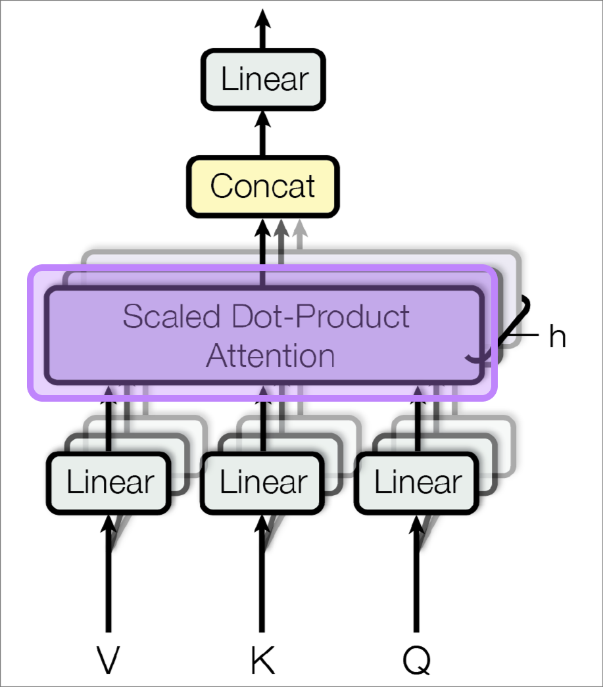
    

    Source: <a href="https://arxiv.org/abs/1706.03762" target="_blank">Attention is All You Need</a>
    

    
    

    Source: <a href="https://arxiv.org/abs/1706.03762" target="_blank">Attention is All You Need</a>
    

    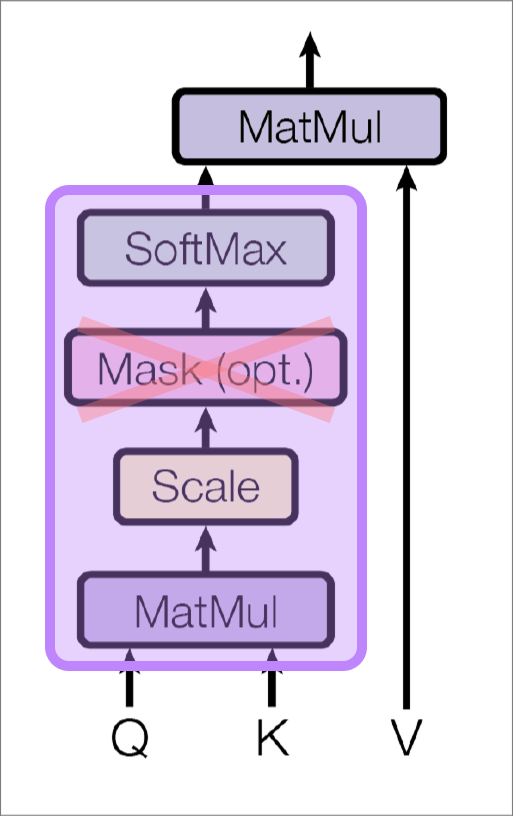
    

    Source: <a href="https://arxiv.org/abs/1706.03762" target="_blank">Attention is All You Need</a>
    

$$
\mathbf{A} = \mathrm{softmax}\left(\frac{\mathbf{Q} \mathbf{K}^{\top}}{\sqrt{D_k}}\right)
$$

where $d_k$ is the dimension of the key vectors, used for scaling to prevent large dot-product values that could lead to small gradients. $\mathbf{A} \in \mathbb{R}^{T \times T}$ contains the attention weights for each token pair in the sequence.

    

**Step 3: Compute Weighted Sum of Values**

    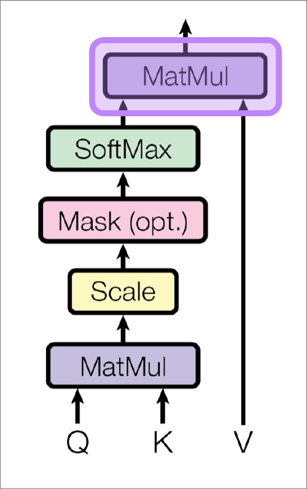
    

    Source: <a href="https://arxiv.org/abs/1706.03762" target="_blank">Attention is All You Need</a>
    

$$
\mathbf{Z} = \mathbf{A} \mathbf{V}
$$

$\mathbf{Z} \in \mathbb{R}^{T \times D_v}$ captures information from all tokens in the sequence, weighted by their relevance to the query token

---

## Linear Output Layer

**Step 4: Final Linear Projection** 

    
    

    Source: <a href="https://arxiv.org/abs/1706.03762" target="_blank">Attention is All You Need</a>
    

- After obtaining the output from the self-attention mechanism, a linear layer is applied to project the output back to the model dimension
- This linear transformation allows the model to learn complex combinations of the attended information
- The output of this layer is then passed through subsequent layers in the Transformer architecture

$$
\mathbf{h}_{\text{out}} = \mathbf{Z} \mathbf{W}_O + \mathbf{b}_O
$$

---

## Masked / Causal Self-Attention Mechanism

    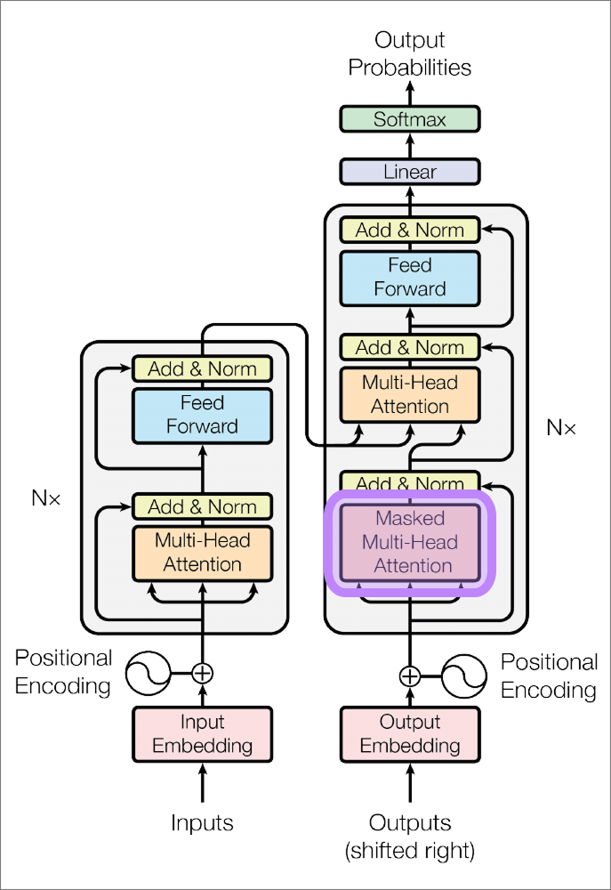
    

    Source: <a href="https://arxiv.org/abs/1706.03762" target="_blank">Attention is All You Need</a>
    

- In autoregressive models, causal self-attention ensures that each token can only attend to previous tokens in the sequence, preventing information leakage from future tokens
- This is typically implemented by applying a mask to the attention scores before the softmax operation

    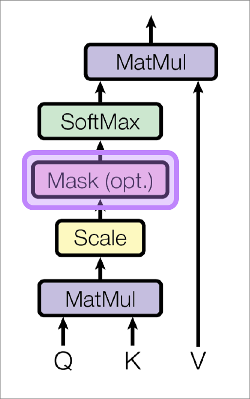
    

    Source: <a href="https://arxiv.org/abs/1706.03762" target="_blank">Attention is All You Need</a>
    

The masked attention scores are computed as follows:

$$
\begin{aligned}
\mathbf{M}_{i,j} &= \begin{cases}
0 & \text{if } j \leq i \\
-\infty & \text{if } j > i
\end{cases} \\
\mathbf{A}_{\text{masked}} &= \mathrm{softmax}\left(\frac{\mathbf{Q} \mathbf{K}^{\top}}{\sqrt{D_k}} + \mathbf{M}\right)
\end{aligned}
$$

    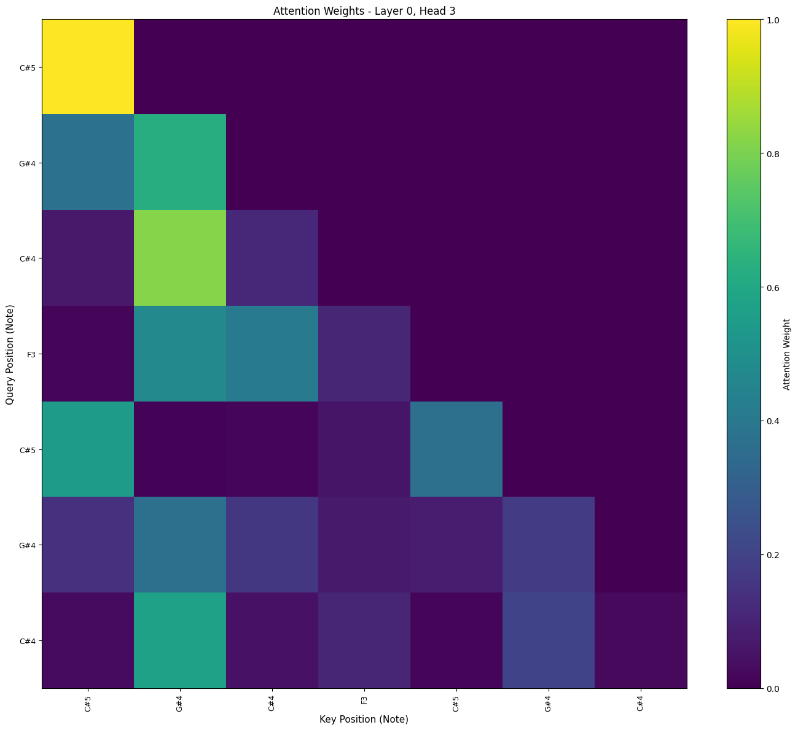
    

    Source: <a href="https://arxiv.org/abs/1706.03762" target="_blank">Attention is All You Need</a>
    

---

## Multi-Head Self-Attention Mechanism

- Instead of performing a single attention function, multi-head attention runs multiple attention operations in parallel
- Each "head" learns different attention patterns, allowing the model to capture various aspects of relationships (e.g., syntactic, semantic) between tokens
- Enables the model to jointly attend to information from different representation subspaces

    
    

    Source: <a href="https://arxiv.org/abs/1706.03762" target="_blank">Attention is All You Need</a>
    

    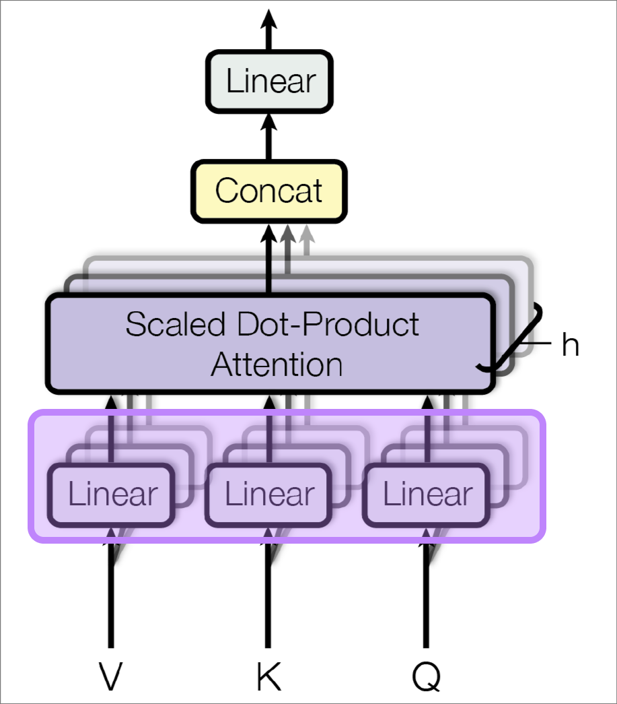
    

    Source: <a href="https://arxiv.org/abs/1706.03762" target="_blank">Attention is All You Need</a>
    

**Step 1: Project inputs to multiple heads**

For each head $i$, compute separate Q, K, V projections:

$$
\mathbf{Q}_i = \mathbf{X} \mathbf{W}_Q^i, \quad \mathbf{K}_i = \mathbf{X} \mathbf{W}_K^i, \quad \mathbf{V}_i = \mathbf{X} \mathbf{W}_V^i
$$

where $\mathbf{W}_Q^i \in \mathbb{R}^{D \times D_k}$, $\mathbf{W}_K^i \in \mathbb{R}^{D \times D_k}$, $\mathbf{W}_V^i \in \mathbb{R}^{D \times D_v}$ are unique weight matrices for head $i$

---

## Multi-Head Self-Attention Mechanism

**Step 2: Compute attention for each head**

    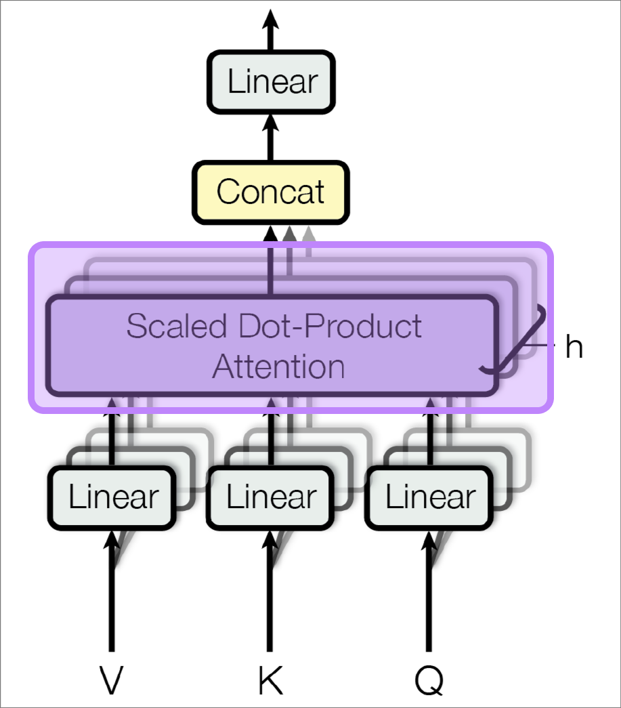
    

    Source: <a href="https://arxiv.org/abs/1706.03762" target="_blank">Attention is All You Need</a>
    

$$
\begin{aligned}
\mathbf{A}_i &= \mathrm{softmax}\left(\frac{\mathbf{Q}_i \mathbf{K}_i^{\top}}{\sqrt{D_k}}\right) \\
\mathbf{Z}_i &= \mathbf{A}_i \mathbf{V}_i
\end{aligned}
$$

where $\mathbf{A}_i$ are the attention weights for head $i$, and $\mathbf{Z}_i$ is the output of head $i$

**Step 3: Concatenate heads and project**

    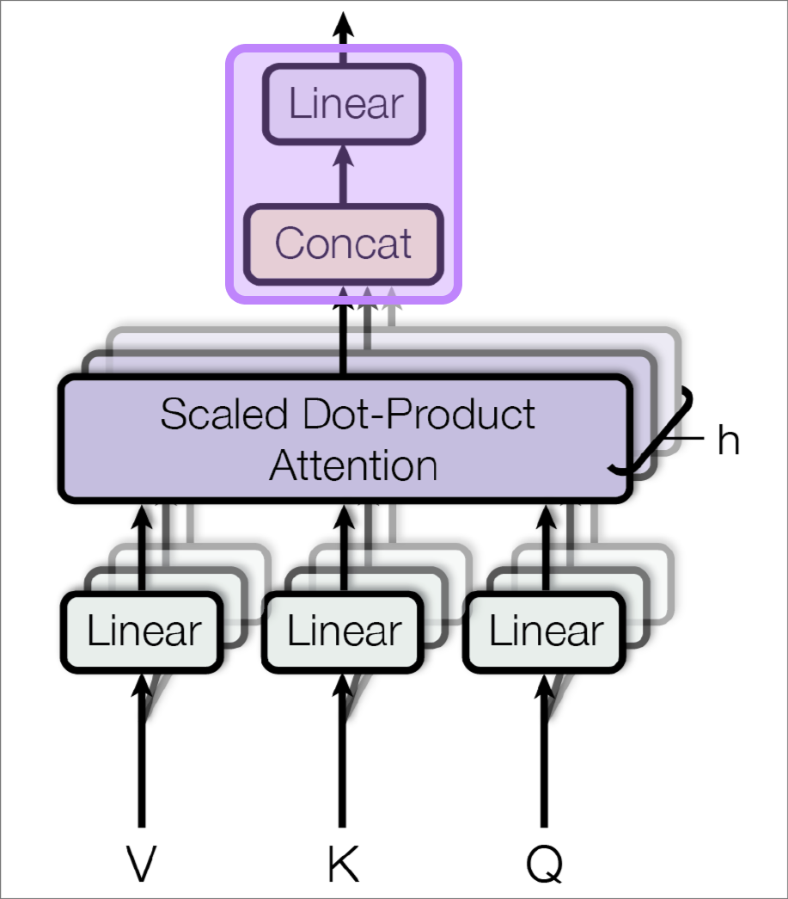
    

    Source: <a href="https://arxiv.org/abs/1706.03762" target="_blank">Attention is All You Need</a>
    

$$
\begin{aligned}
\mathbf{Z}_{\text{concat}} &= \mathrm{Concat}(\mathbf{Z}_1, \mathbf{Z}_2, \ldots, \mathbf{Z}_h) \\
\mathbf{h}_{\text{out}} &= \mathbf{Z}_{\text{concat}} \mathbf{W}_O + \mathbf{b}_O
\end{aligned}
$$

where $h$ is the number of heads, and $\mathbf{W}_O \in \mathbb{R}^{h \cdot D_v \times D}$ projects the concatenated outputs back to the model dimension

    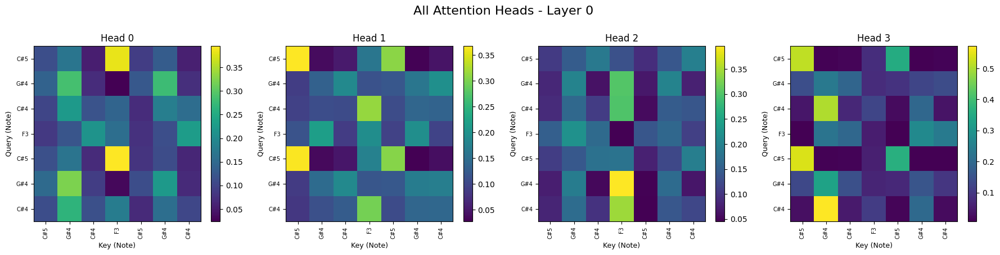
    

---

## Cross-Attention Mechanism

    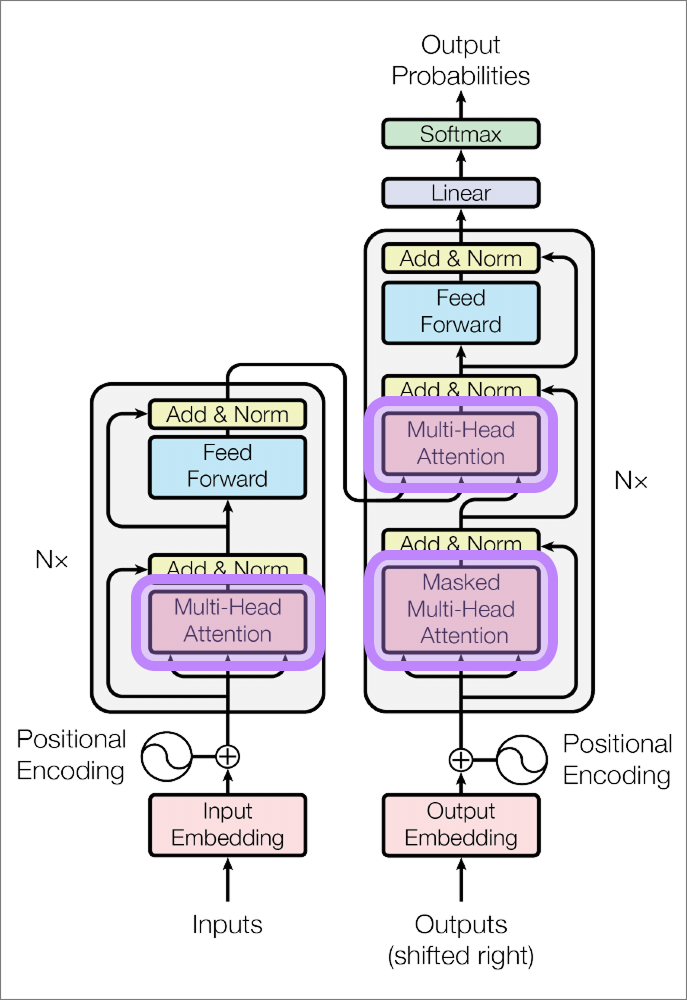
    

    Source: <a href="https://arxiv.org/abs/1706.03762" target="_blank">Attention is All You Need</a>
    

- Cross-attention allows to attend to a different sequence (e.g., encoder outputs) rather than the same sequence (as in self-attention)
- Is used to integrate information from the encoder into the decoder in sequence-to-sequence tasks like machine translation, but can also be used in other contexts where two different sequences need to interact

**Cross-attention formula:**

$$
\begin{aligned}
\mathbf{Q} &= \mathbf{X}_{\text{decoder}} \mathbf{W}_Q \\
\mathbf{K} &= \mathbf{X}_{\text{encoder}} \mathbf{W}_K \\
\mathbf{V} &= \mathbf{X}_{\text{encoder}} \mathbf{W}_V
\end{aligned}
$$

where $\mathbf{X}_{\text{decoder}} \in \mathbb{R}^{T_{\text{decoder}} \times D}$ are the decoder inputs and $\mathbf{X}_{\text{encoder}} \in \mathbb{R}^{T_{\text{encoder}} \times D}$ are the encoder outputs. The resulting $\mathbf{Q} \in \mathbb{R}^{T_{\text{decoder}} \times D_k}$, $\mathbf{K} \in \mathbb{R}^{T_{\text{encoder}} \times D_k}$, and $\mathbf{V} \in \mathbb{R}^{T_{\text{encoder}} \times D_v}$ are then used in the scaled dot-product attention as usual.

---

## Residual Connections

    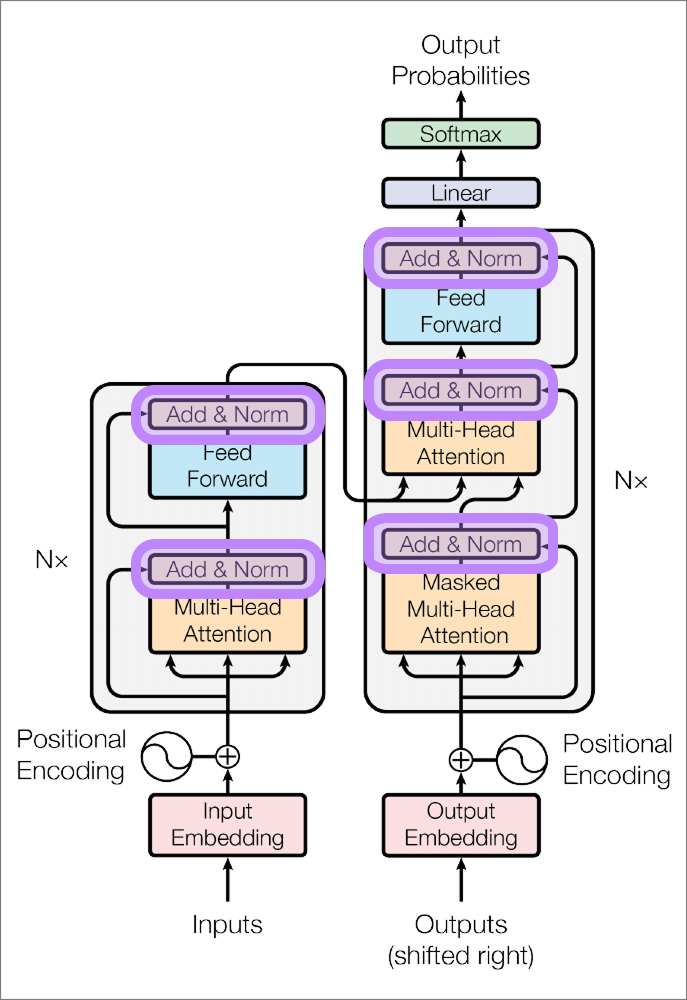
    

    Source: <a href="https://arxiv.org/abs/1706.03762" target="_blank">Attention is All You Need</a>
    

- Solve vanishing gradients with direct gradient path to earlier layers, enabling training of very deep networks
- Network learns small adjustments instead of full transformations which simplifies optimization
- Preserves information since layers can pass data unchanged or refine it without information loss

$$
\mathbf{y} = \mathbf{x} + \mathrm{Sublayer}(\mathbf{x})
$$

---

## Layer Normalization

    
    

    Source: <a href="https://arxiv.org/abs/1706.03762" target="_blank">Attention is All You Need</a>
    

- Stabilizes and accelerates training by normalizing inputs across features for each data point
- Reduces internal covariate shift, making training less sensitive to initialization and learning rates

$$
\mathbf{y}(\mathbf{x}) = \frac{\mathbf{x} - \mu}{\sigma} \odot \boldsymbol{\gamma} + \boldsymbol{\beta}
$$

where $\mu$ and $\sigma$ are the mean and standard deviation of the features in $\mathbf{x}$, and $\boldsymbol{\gamma} \in \mathbb{R}^D$, $\boldsymbol{\beta} \in \mathbb{R}^D$ are learnable parameters for scaling and shifting.

---

## Position-wise Feedforward Networks

    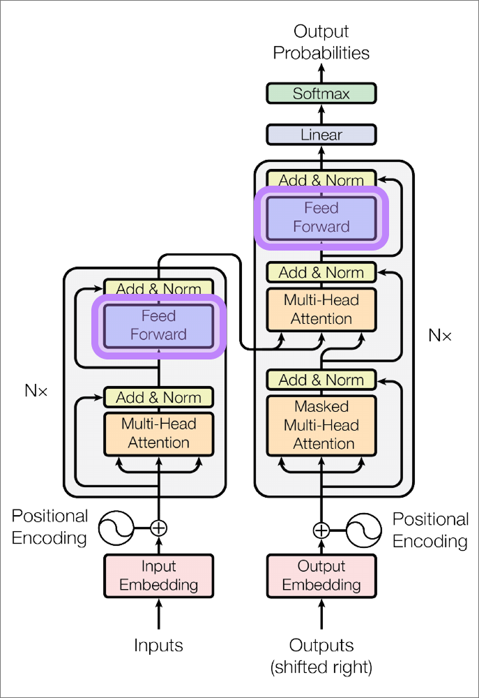
    

    Source: <a href="https://arxiv.org/abs/1706.03762" target="_blank">Attention is All You Need</a>
    

- Applied independently to each position in the sequence, allowing for non-linear transformations of the token representations
- Consists of two linear layers with a ReLU activation in between, enabling the model to learn complex feature interactions

$$
\mathbf{y}(\mathbf{x}) = \mathrm{ReLU}(\mathbf{x} \mathbf{W}_1 + \mathbf{b}_1) \mathbf{W}_2 + \mathbf{b}_2
$$

where $\mathbf{W}_1 \in \mathbb{R}^{D \times D_{ff}}$, $\mathbf{W}_2 \in \mathbb{R}^{D_{ff} \times D}$ are weight matrices, and $\mathbf{b}_1 \in \mathbb{R}^{D_{ff}}$, $\mathbf{b}_2 \in \mathbb{R}^{D}$ are bias vectors. $D_{ff}$ is the dimension of the feedforward layer, typically larger than the model dimension $D$.

---

## Key Components of Original Transformer

<ul>
<li class="fragment" data-fragment-index="1"><strong>Embedding layers</strong> convert discrete tokens to continuous vector representations</li>
<li class="fragment" data-fragment-index="2"><strong>Output projection</strong> maps decoder outputs back to vocabulary space for token prediction</li>
<li class="fragment" data-fragment-index="3"><strong>Positional encodings</strong> (sinusoidal or learned) provide sequence order information</li>
<li class="fragment" data-fragment-index="4"><strong>Multi-head self-attention</strong> captures dependencies between all tokens in parallel</li>
<li class="fragment" data-fragment-index="5"><strong>Masked multi-head self-attention</strong> prevents future token leakage in autoregressive generation</li>
<li class="fragment" data-fragment-index="6"><strong>Multi-head cross-attention</strong> (encoder-decoder) enables decoder to attend to encoder outputs</li>
<li class="fragment" data-fragment-index="7"><strong>Residual connections</strong> enable deep network training by providing direct gradient paths</li>
<li class="fragment" data-fragment-index="8"><strong>Layer normalization</strong> stabilizes training and reduces sensitivity to initialization</li>
<li class="fragment" data-fragment-index="9"><strong>Position-wise feedforward networks</strong> apply non-linear transformations to each token</li>
</ul>

    
    

    Source: <a href="https://arxiv.org/abs/1706.03762" target="_blank">Attention is All You Need</a>
    

    
    

    Source: <a href="https://arxiv.org/abs/1706.03762" target="_blank">Attention is All You Need</a>
    

    
    

    Source: <a href="https://arxiv.org/abs/1706.03762" target="_blank">Attention is All You Need</a>
    

    
    

    Source: <a href="https://arxiv.org/abs/1706.03762" target="_blank">Attention is All You Need</a>
    

    
    

    Source: <a href="https://arxiv.org/abs/1706.03762" target="_blank">Attention is All You Need</a>
    

    
    

    Source: <a href="https://arxiv.org/abs/1706.03762" target="_blank">Attention is All You Need</a>
    

    
    

    Source: <a href="https://arxiv.org/abs/1706.03762" target="_blank">Attention is All You Need</a>
    

    
    

    Source: <a href="https://arxiv.org/abs/1706.03762" target="_blank">Attention is All You Need</a>
    

    
    

    Source: <a href="https://arxiv.org/abs/1706.03762" target="_blank">Attention is All You Need</a>
    

    
    

    Source: <a href="https://arxiv.org/abs/1706.03762" target="_blank">Attention is All You Need</a>
    

---

## Summary of Original Transformer

**Key Advantages**

- **Parallelizable architecture** enables efficient training on large datasets by processing all tokens simultaneously
- **Long-range dependencies** captured through direct attention connections between any token pair
- **Scalability** to billions of parameters, forming the foundation for modern LLMs (BERT, GPT, LLaMA)

**Applications**

- **Transfer learning** through pretraining on large corpora followed by fine-tuning for specific tasks
- **Versatile across domains** including NLP, computer vision, and audio processing

---

## Decoder Only Example: GPT

- The GPT architecture is a decoder-only Transformer model that utilizes masked self-attention to generate text autoregressively
- Consists of multiple layers of masked multi-head self-attention followed by position-wise feedforward networks, with residual connections and layer normalization applied throughout
- GPT models are pretrained on large text corpora using a language modeling objective, learning to predict the next token in a sequence given the previous tokens

    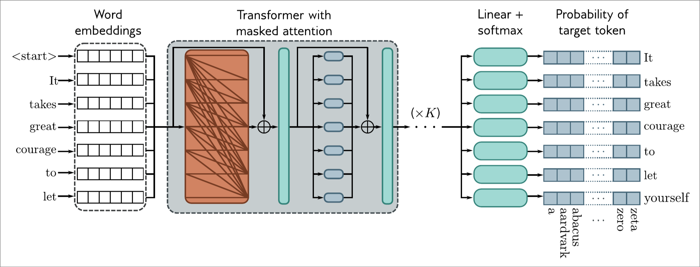
    

    Source: <a href="https://github.com/udlbook/udlbook" target="_blank">Understanding Deep Learning (Prince)</a>
    

<table style="font-size: 0.8em; width: 100%;">
<thead>
<tr>
<th>Component</th>
<th>Parameters per Layer</th>
<th>Total Parameters</th>
<th>Calculation</th>
</tr>
</thead>
<tbody>
<tr>
<td><strong>Embedding</strong></td>
<td>6.4B</td>
<td>6.4B</td>
<td>$V \times D = 50{,}257 \times 12{,}288$</td>
</tr>
<tr>
<td><strong>Multi-Head Attention</strong></td>
<td>603M</td>
<td>57.9B</td>
<td>$4 \times D^2 = 4 \times 12{,}288^2$ (split into 96 heads with Q, K, V, and O per layer × 96 layers)</td>
</tr>
<tr>
<td><strong>Layer Normalization</strong></td>
<td>24K</td>
<td>4.7M</td>
<td>$2 \times D = 2 \times 12{,}288$ (2 per layer × 96 layers)</td>
</tr>
<tr>
<td><strong>Feedforward Network</strong></td>
<td>1.2B</td>
<td>115.3B</td>
<td>$2 \times D \times D_{\text{ff}} = 2 \times 12{,}288 \times 49{,}152$ (2 per layer × 96 layers)</td>
</tr>
<tr>
<td><strong>Output Projection</strong></td>
<td>—</td>
<td>(shared)</td>
<td>Shares weights with embedding layer</td>
</tr>
<tr style="border-top: 2px solid #666;">
<td colspan="2"><strong>Total</strong></td>
<td><strong>≈175B</strong></td>
<td>6.4B + 57.9B + 4.7M + 115.3B ≈ 179.6B</td>
</tr>
</tbody>
</table>

Where: $D = 12{,}288$ (model dimension), $D_{\text{ff}} = 4D = 49{,}152$ (feedforward dimension), $V = 50{,}257$ (vocabulary size), 96 layers, 96 attention heads

---

## Encoder Only Example: BERT

- The BERT architecture is an encoder-only Transformer model that utilizes bidirectional self-attention to generate contextualized token representations
- Consists of multiple layers of multi-head self-attention followed by position-wise feedforward networks, with residual connections and layer normalization applied throughout
- BERT models are pretrained on large text corpora using a masked language modeling objective, learning to predict randomly masked tokens in a sequence based on their surrounding context

    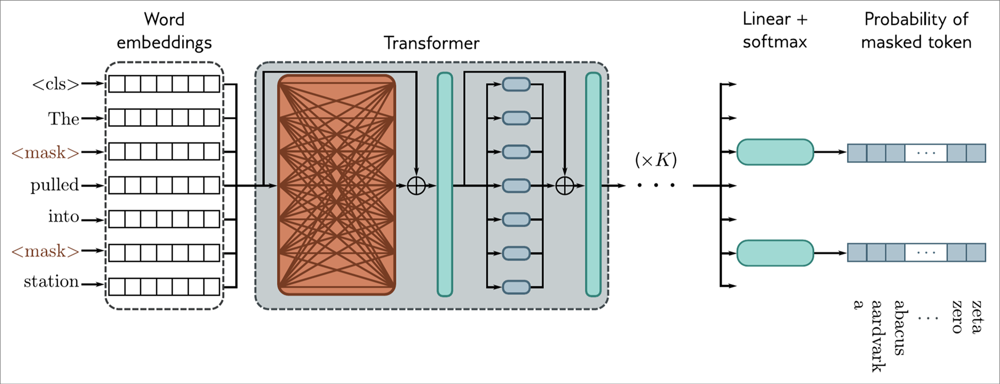
    

        Source: <a href="https://github.com/udlbook/udlbook" target="_blank">Understanding Deep Learning (Prince)</a>
    

- Then they are fine-tuned for specific downstream tasks such as text classification or named entity recognition

    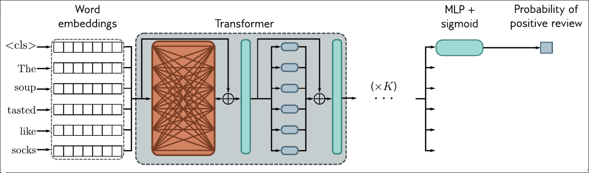
    

        Source: <a href="https://github.com/udlbook/udlbook" target="_blank">Understanding Deep Learning (Prince)</a>
    

    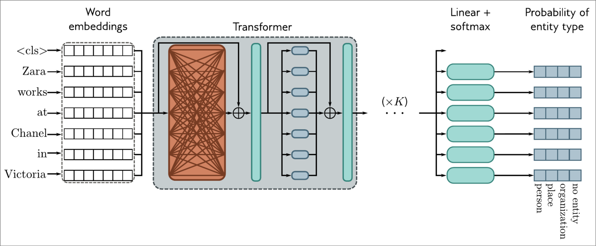
    

        Source: <a href="https://github.com/udlbook/udlbook" target="_blank">Understanding Deep Learning (Prince)</a>
    

---

## Encoder-Decoder Example: Original Transformer

- The original Transformer architecture consists of an encoder-decoder structure where the encoder processes the input sequence and the decoder generates the output sequence
- The encoder is composed of multiple layers of multi-head self-attention and position-wise feedforward networks, while the decoder includes masked multi-head self-attention, cross-attention to the encoder outputs, and position-wise feedforward networks
- This architecture is particularly effective for sequence-to-sequence tasks such as machine translation

    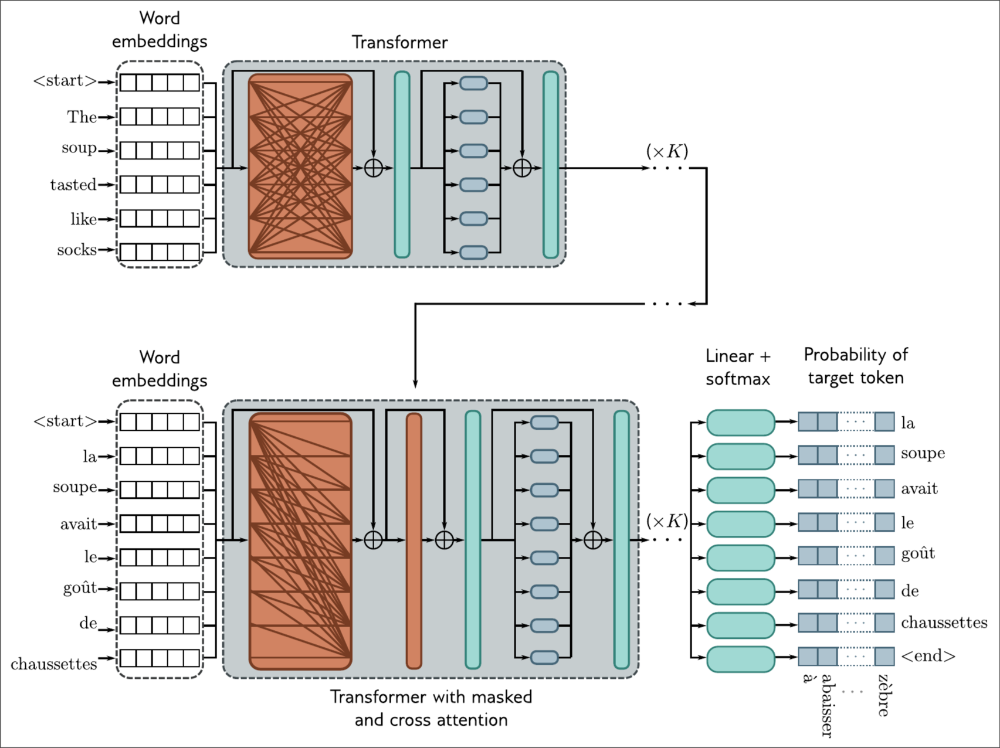
    

        Source: <a href="https://github.com/udlbook/udlbook" target="_blank">Understanding Deep Learning (Prince)</a>
    

---

## Continuous Encoder Example: Vision Transformer

- Vision Transformer (ViT) applies Transformer architecture to image classification by treating images as sequences of patches
- Input images are divided into fixed-size patches, flattened and linearly projected into continuous patch embeddings
- Patch embeddings are continuous vectors unlike discrete token embeddings in NLP
- A special [CLS] token is prepended to the sequence to aggregate information for classification
- Positional encodings preserve spatial information before processing through the Transformer encoder
- A classification head applied to the [CLS] token output performs the final classification

    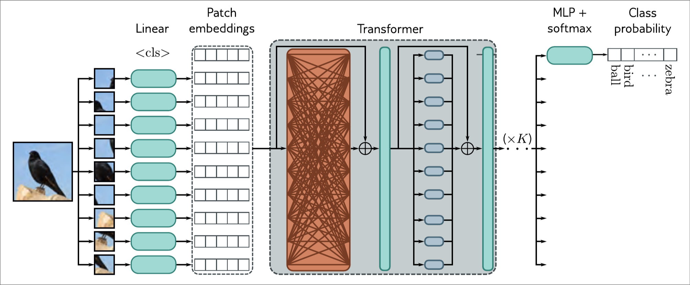
    

        Source: <a href="https://github.com/udlbook/udlbook" target="_blank">Understanding Deep Learning (Prince)</a>
    

---

## Continuous Encoder-Decoder Example: pGESAM

- The pGESAM architecture is an encoder-decoder Transformer for continuous timbre and pitch embeddings
- The encoder processes timbre (2D float via linear projection) and pitch (1D via learned embedding) representations
- The decoder autoregressively generates audio codec tokens using masked self-attention
- Cross-attention conditions generation on the encoder's continuous timbre-pitch representations

    
    

        Source: Limberg, C., Schulz, F., Zhang, Z., & Weinzierl, S. (2025). Pitch-Conditioned Instrument Sound Synthesisfrom an Interactive Timbre Latent Space. <em>28th International Conference on Digital Audio Effects (DAFx25)</em>, 1–8. https://dafx.de/paper-archive/2025/DAFx25_paper_58.pdf
    

---

# Python Implementation
