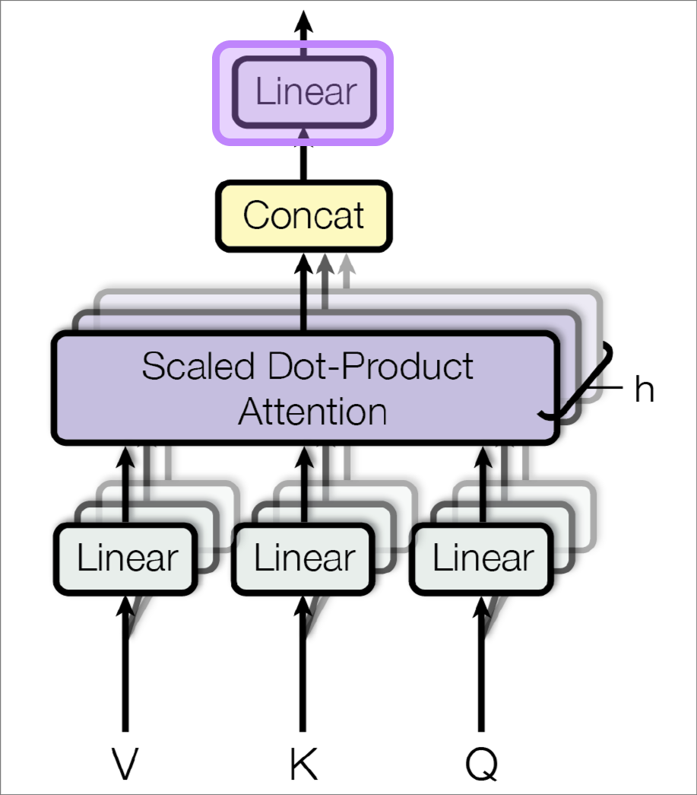

# Attention and Transformers

---

## Mathematical Foundations

    

        
Calculus & Linear Algebra

        
Basis for optimization algorithms and machine learning model operations

    

    

        {{TIMELINE:timeline_calculus_linear_algebra}}
    

    

        
Probability & Statistics

        
Basis for Bayesian methods, statistical inference, and generative models

    

    

        {{TIMELINE:timeline_probability_statistics}}
    

    

        
Information & Computation

        
Foundations of algorithmic thinking and information theory

    

    

        {{TIMELINE:timeline_information_computation}}
    

---

## Early History of Neural Networks

    

        
Architectures & Layers

        
Evolution of network architectures and layer innovations

    

    

        {{TIMELINE:timeline_early_nn_architectures}}
    

    

        
Training & Optimization

        
Methods for efficient learning and gradient-based optimization

    

    

        {{TIMELINE:timeline_early_nn_training}}
    

    

        
Software & Datasets

        
Tools, platforms, and milestones that enabled practical deep learning

    

    

        {{TIMELINE:timeline_early_nn_software}}
    

---

## The Deep Learning Era

<!-- Layers & Architectures Timeline -->

    

        
Deep architectures

        
Deep architectures and generative models transforming AI capabilities

    

    

        {{TIMELINE:timeline_deep_architectures}}
    

    

        
Training & Optimization

        
Advanced learning techniques and representation learning breakthroughs

    

    

        {{TIMELINE:timeline_deep_training}}
    

    

        
Software & Applications

        
Practical deployment and mainstream adoption of deep learning systems

    

    

        {{TIMELINE:timeline_deep_software}}
    

---

## Recurrent Layers: Recap

**Vanilla RNN**:

<ul>
<li>Maintains hidden state across time steps to capture temporal dependencies</li>
<li>Suffers from vanishing/exploding gradients for long sequences</li>
<li>Formula: $\mathbf{h}_t = \sigma\left(\mathbf{W}_{xh} \mathbf{x}_t + \mathbf{W}_{hh} \mathbf{h}_{t-1} + \mathbf{b}\right)$</li>
</ul>

**LSTM (Long Short-Term Memory)**:

- Uses gating mechanisms (forget, input, output gates) and separate cell state
- Better at capturing long-term dependencies, mitigates vanishing gradients
- More parameters and computational cost than vanilla RNN

**GRU (Gated Recurrent Unit)**:

- Simplified variant with reset and update gates (no separate cell state)
- Fewer parameters and computational cost than LSTM while maintaining comparable performance

Limitations of Recurrent Layers:
<ul>
<li>Recurrent layer do only have direct connections to the previous time step, limiting long-range dependency capture</li>
<li>Sequential processing hinders parallelization, leading to long training times</li>
</ul>

---

## Attention Mechanism

- Addresses limitations of recurrent layers by allowing direct connections between all time steps
- Computes queries and keys to determine relevance between different positions in the sequence
- Enriches value representations by aggregating information from relevant time steps
- Enables modeling of long-range dependencies and parallel processing at once

    

---

## Attention is All You Need (2017)

- Introduced the Transformer architecture, which relies solely on attention mechanisms, eliminating the need for recurrent or convolutional layers
- Utilizes multi-head self-attention to capture different aspects of relationships between tokens in a sequence
- Employs positional encoding to retain the order of tokens in the input sequence
- Achieved state-of-the-art results in machine translation tasks, significantly outperforming previous models
- Large language models like BERT, GPT, LLaMA, and others are based on the Transformer architecture

    
    

    Source: <a href="https://arxiv.org/abs/1706.03762" target="_blank">Attention is All You Need</a>
    

---

## Embedding Layers

    
    

    Source: <a href="https://arxiv.org/abs/1706.03762" target="_blank">Attention is All You Need</a>
    

- Convert discrete tokens (words, subwords, characters, midi notes) into continuous vector representations
- Capture semantic relationships and contextual information
- Learned during training to optimize task performance
- Similar to a lookup table where each token maps to a dense vector
- Linear layer without bias and with one-hot encoded inputs

$$
\begin{aligned}
\mathtt{nn.Embedding}(i = \text{token index}) &= \mathbf{e}_{i}^{\top} \mathbf{W} \\
&= \begin{bmatrix}0 & \cdots & 1 & \cdots & 0\end{bmatrix} \mathbf{W} \\
&= \mathbf{W}_{i, :}
\end{aligned}
$$

where $\mathbf{W} \in \mathbb{R}^{V \times D}$ is the embedding matrix, $V$ is the vocabulary size, and $D$ is the embedding dimension.

---

## Output Projection

    
    

    Source: <a href="https://arxiv.org/abs/1706.03762" target="_blank">Attention is All You Need</a>
    

- Maps the decoder's output back to the vocabulary space for token prediction
- Typically implemented as a linear layer followed by a softmax activation
- Shares weights with the embedding layer to reduce the number of parameters and improve performance (Press & Wolf, 2017)
- Converts the decoder's continuous representations into logits for each token in the vocabulary

$$
\begin{aligned}
\mathtt{nn.Linear}(\mathbf{h}_t) &= \mathbf{h}_t \mathbf{W}^{\top} + \mathbf{b} \\
&= \mathbf{h}_t \mathbf{W}^{\top} \quad \text{(if weights are shared, } \mathbf{b} = 0\text{)}\\
\mathbf{p}_t &= \mathrm{softmax}(\mathbf{h}_t \mathbf{W}^{\top}) = \frac{\exp(\mathbf{h}_t \mathbf{W}^{\top})}{\sum_{j=1}^{V} \exp((\mathbf{h}_t \mathbf{W}^{\top})_j)}
\end{aligned}
$$

where $\mathbf{W} \in \mathbb{R}^{V \times D}$ is the shared weight matrix from the embedding layer, $V$ is the vocabulary size, and $D$ is the model dimension.

---

## Positional Encoding

    
    

    Source: <a href="https://arxiv.org/abs/1706.03762" target="_blank">Attention is All You Need</a>
    

- Since Transformers do not have inherent sequential processing, positional encodings are added to input embeddings to provide information about the order of tokens
- Can be implemented using fixed sinusoidal functions or learned embeddings
- Enables the model to capture the relative and absolute positions of tokens in the sequence
- **Vanilla sinusoidal positional encoding formula:**

$$
\begin{aligned}
\mathrm{PE}(pos, 2i) &= \sin\left(\frac{pos}{10000^{2i/d_{\text{model}}}}\right) \\
\mathrm{PE}(pos, 2i+1) &= \cos\left(\frac{pos}{10000^{2i/d_{\text{model}}}}\right)
\end{aligned}
$$

    

---

## Self-Attention Mechanism

    
    

    Source: <a href="https://arxiv.org/abs/1706.03762" target="_blank">Attention is All You Need</a>
    

Self-attention allows each token in the input sequence to attend to all other tokens, enabling the model to capture dependencies regardless of their distance in the sequence

**Step 1: Compute Queries, Keys, and Values** 

    
    

    Source: <a href="https://arxiv.org/abs/1706.03762" target="_blank">Attention is All You Need</a>
    

    
    

    Source: <a href="https://arxiv.org/abs/1706.03762" target="_blank">Attention is All You Need</a>
    

For each token, compute query ($\mathbf{Q}$), key ($\mathbf{K}$), and value ($\mathbf{V}$) vectors using learned linear projections.

$$
\mathbf{Q} = \mathbf{X} \mathbf{W}_Q, \quad \mathbf{K} = \mathbf{X} \mathbf{W}_K, \quad \mathbf{V} = \mathbf{X} \mathbf{W}_V
$$

where $\mathbf{X} \in \mathbb{R}^{T \times D}$ is the input sequence matrix, and $\mathbf{W}_Q \in \mathbb{R}^{D \times D_k}$, $\mathbf{W}_K \in \mathbb{R}^{D \times D_k}$, $\mathbf{W}_V \in \mathbb{R}^{D \times D_v}$ are learned weight matrices. Each token has dimension $D$, and the sequence length is $T$.

---

## Scaled Dot-Product Attention

**Step 2: Compute Attention Scores**

    
    

    Source: <a href="https://arxiv.org/abs/1706.03762" target="_blank">Attention is All You Need</a>
    

    
    

    Source: <a href="https://arxiv.org/abs/1706.03762" target="_blank">Attention is All You Need</a>
    

    
    

    Source: <a href="https://arxiv.org/abs/1706.03762" target="_blank">Attention is All You Need</a>
    

Calculate attention scores using the scaled dot-product of queries and keys:

$$
\mathbf{A} = \mathrm{softmax}\left(\frac{\mathbf{Q} \mathbf{K}^{\top}}{\sqrt{D_k}}\right)
$$

where $d_k$ is the dimension of the key vectors, used for scaling to prevent large dot-product values that could lead to small gradients. $\mathbf{A} \in \mathbb{R}^{T \times T}$ contains the attention weights for each token pair in the sequence.

    

**Step 3: Compute Weighted Sum of Values**

    
    

    Source: <a href="https://arxiv.org/abs/1706.03762" target="_blank">Attention is All You Need</a>
    

Finally, compute the output as a weighted sum of the value vectors:

$$
\mathbf{Z} = \mathbf{A} \mathbf{V}
$$

$\mathbf{Z} \in \mathbb{R}^{T \times D_v}$ captures information from all tokens in the sequence, weighted by their relevance to the query token

---

## Linear Output Layer

**Step 4: Final Linear Projection** 

    
    

    Source: <a href="https://arxiv.org/abs/1706.03762" target="_blank">Attention is All You Need</a>
    

- After obtaining the output from the self-attention mechanism, a linear layer is applied to project the output back to the model dimension
- This linear transformation allows the model to learn complex combinations of the attended information
- The output of this layer is then passed through subsequent layers in the Transformer architecture

$$
\mathbf{h}_{\text{out}} = \mathbf{Z} \mathbf{W}_O + \mathbf{b}_O
$$

---

## Causal Self-Attention

    
    

    Source: <a href="https://arxiv.org/abs/1706.03762" target="_blank">Attention is All You Need</a>
    

- In autoregressive models, causal self-attention ensures that each token can only attend to previous tokens in the sequence, preventing information leakage from future tokens
- This is typically implemented by applying a mask to the attention scores before the softmax operation

    
    

    Source: <a href="https://arxiv.org/abs/1706.03762" target="_blank">Attention is All You Need</a>
    

The masked attention scores are computed as follows:

$$
\begin{aligned}
\mathbf{M}_{i,j} &= \begin{cases}
0 & \text{if } j \leq i \\
-\infty & \text{if } j > i
\end{cases} \\
\mathbf{A}_{\text{masked}} &= \mathrm{softmax}\left(\frac{\mathbf{Q} \mathbf{K}^{\top}}{\sqrt{D_k}} + \mathbf{M}\right)
\end{aligned}
$$

    

---

## Multi-Head Attention

    
    

    Source: <a href="https://arxiv.org/abs/1706.03762" target="_blank">Attention is All You Need</a>
    

- Instead of performing a single attention function, multi-head attention runs multiple attention operations in parallel
- Each "head" learns different attention patterns, allowing the model to capture various aspects of relationships
- Enables the model to jointly attend to information from different representation subspaces

    
    

    Source: <a href="https://arxiv.org/abs/1706.03762" target="_blank">Attention is All You Need</a>
    

    
    

    Source: <a href="https://arxiv.org/abs/1706.03762" target="_blank">Attention is All You Need</a>
    

**Step 1: Project inputs to multiple heads**

For each head $i$, compute separate Q, K, V projections:

$$
\mathbf{Q}_i = \mathbf{X} \mathbf{W}_Q^i, \quad \mathbf{K}_i = \mathbf{X} \mathbf{W}_K^i, \quad \mathbf{V}_i = \mathbf{X} \mathbf{W}_V^i
$$

where $\mathbf{W}_Q^i \in \mathbb{R}^{D \times D_k}$, $\mathbf{W}_K^i \in \mathbb{R}^{D \times D_k}$, $\mathbf{W}_V^i \in \mathbb{R}^{D \times D_v}$ are unique weight matrices for head $i$

    
    

    Source: <a href="https://arxiv.org/abs/1706.03762" target="_blank">Attention is All You Need</a>
    

**Step 2: Compute attention for each head**

$$
\begin{aligned}
\mathbf{A}_i &= \mathrm{softmax}\left(\frac{\mathbf{Q}_i \mathbf{K}_i^{\top}}{\sqrt{D_k}}\right) \\
\mathbf{Z}_i &= \mathbf{A}_i \mathbf{V}_i
\end{aligned}
$$

    
    

    Source: <a href="https://arxiv.org/abs/1706.03762" target="_blank">Attention is All You Need</a>
    

**Step 3: Concatenate heads and project**

$$
\begin{aligned}
\mathbf{Z}_{\text{concat}} &= \mathrm{Concat}(\mathbf{Z}_1, \mathbf{Z}_2, \ldots, \mathbf{Z}_h) \\
\mathbf{h}_{\text{out}} &= \mathbf{Z}_{\text{concat}} \mathbf{W}_O + \mathbf{b}_O
\end{aligned}
$$

where $h$ is the number of heads, and $\mathbf{W}_O \in \mathbb{R}^{h \cdot D_v \times D}$ projects the concatenated outputs back to the model dimension

---

# Python Implementation
