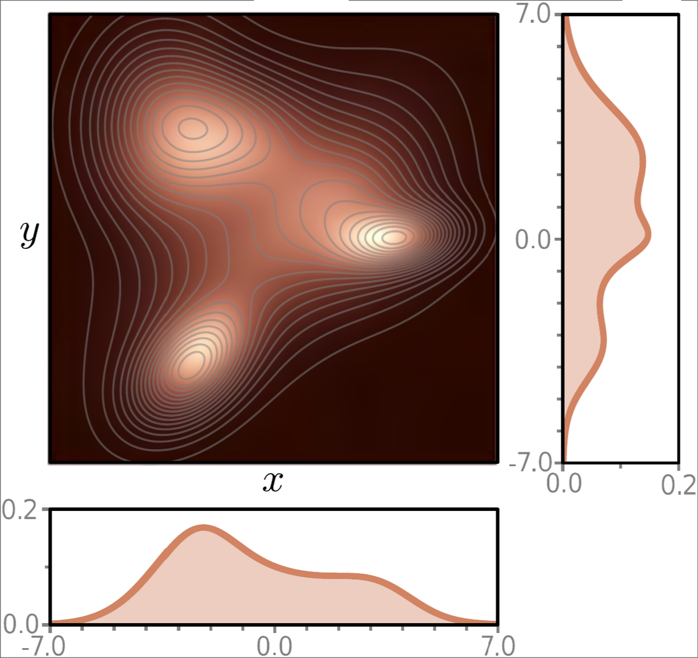
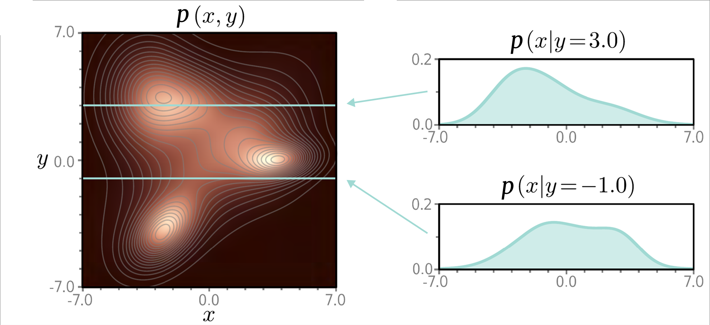
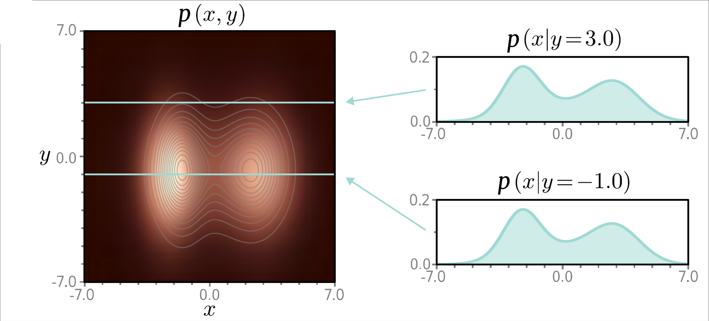

# Probability Fundamentals

---

## Mathematical Foundations

    

        
Calculus & Linear Algebra

        
Basis for optimization algorithms and machine learning model operations

    

    

        {{TIMELINE:timeline_calculus_linear_algebra}}
    

    

        
Probability & Statistics

        
Basis for Bayesian methods, statistical inference, and generative models

    

    

        {{TIMELINE:timeline_probability_statistics}}
    

    

        
Information & Computation

        
Foundations of algorithmic thinking and information theory

    

    

        {{TIMELINE:timeline_information_computation}}
    

---

## Early History of Neural Networks

    

        
Architectures & Layers

        
Evolution of network architectures and layer innovations

    

    

        {{TIMELINE:timeline_early_nn_architectures}}
    

    

        
Training & Optimization

        
Methods for efficient learning and gradient-based optimization

    

    

        {{TIMELINE:timeline_early_nn_training}}
    

    

        
Software & Datasets

        
Tools, platforms, and milestones that enabled practical deep learning

    

    

        {{TIMELINE:timeline_early_nn_software}}
    

---

## The Deep Learning Era

<!-- Layers & Architectures Timeline -->

    

        
Deep architectures

        
Deep architectures and generative models transforming AI capabilities

    

    

        {{TIMELINE:timeline_deep_architectures}}
    

    

        
Training & Optimization

        
Advanced learning techniques and representation learning breakthroughs

    

    

        {{TIMELINE:timeline_deep_training}}
    

    

        
Software & Applications

        
Practical deployment and mainstream adoption of deep learning systems

    

    

        {{TIMELINE:timeline_deep_software}}
    

---

## Probability Theory in Deep Learning

*Probability theory provides a framework for modeling uncertainty in data, predictions, and model parameters*

**Supervised Learning:**

- Loss functions such as cross-entropy and mean squared error are derived from probabilistic principles
- Softmax outputs represent conditional class probabilities

**Unsupervised Learning:**

- Variational Autoencoders (VAEs) learn latent representations to approximate the probability distributions of input data
- Generative Adversarial Networks (GANs) implicitly model the data distribution through adversarial training
- Diffusion models learn to reverse a gradual noising process to generate samples from the data distribution

---

## Key Probability Concepts

- **Experiment**: A procedure that yields one of several possible outcomes
- **Sample Space** ($\Omega$): The set of all possible elementary outcomes of an experiment
- **Outcome** ($\omega \in \Omega$): A single possible result of an experiment
- **$\sigma$-Algebra** ($\mathcal{F}$): A collection of subsets of $\Omega$ that contains $\Omega$ and is closed under complementation and countable unions
- **Event** ($A \in \mathcal{F}$): A measurable subset of the sample space (an element of the σ-algebra)
- **Probability Measure** ($P: \mathcal{F} \to [0,1]$): A function assigning probabilities to events

---

## Probability Axioms

1. **Non-negativity**: For any event $A \in \mathcal{F}$, $P(A) \geq 0$
2. **Normalization**: $P(\Omega) = 1$
3. **Additivity**: For any countable sequence of mutually exclusive/disjoint events $A_1, A_2, \ldots \in \mathcal{F}$:

   $$P\left(\bigcup_{i=1}^{\infty} A_i\right) = \sum_{i=1}^{\infty} P(A_i)$$

with $\bigcup_{i=1}^{n} = A_1 \cup A_2 \cup \ldots \cup A_n$ and $A_i \cap A_j = \emptyset$ for $i \neq j$.

---

## Event Relationships

<table>
  <thead>
    <tr>
      <th>Category</th>
      <th>Condition</th>
      <th>Formula</th>
      <th>Meaning</th>
    </tr>
  </thead>
  <tbody>
    <tr>
      <td>Disjoint/Mutually Exclusive</td>
      <td>Cannot both occur</td>
      <td>$A \cap B = \emptyset$</td>
      <td>$P(A \cap B) = 0$</td>
    </tr>
    <tr>
      <td>Overlapping</td>
      <td>Can both occur</td>
      <td>$A \cap B \neq \emptyset$</td>
      <td>$P(A \cap B) > 0$</td>
    </tr>
    <tr>
      <td>Independent</td>
      <td>Don't affect each other</td>
      <td>$P(A \cap B) = P(A)P(B)$</td>
      <td>$P(A|B) = P(A)$</td>
    </tr>
    <tr>
      <td>Dependent</td>
      <td>Affect each other</td>
      <td>$P(A \cap B) \neq P(A)P(B)$</td>
      <td>$P(A|B) \neq P(A)$</td>
    </tr>
    <tr>
      <td>Conditional Independence</td>
      <td>Independent given C</td>
      <td>$P(A \cap B|C) = P(A|C)P(B|C)$</td>
      <td>$P(A|B,C) = P(A|C)$</td>
    </tr>
  </tbody>
</table>

---

## Random Variables

A **random variable** $X: \Omega \to \mathbb{R}$ is a measurable function that assigns a numerical value to each outcome

**Discrete Random Variable**

Takes on a finite or countably infinite set of values

*Examples:*
- Number of heads in 10 coin flips
- Class label in classification (0, 1, 2, ...)
- Word token index in a vocabulary

**Continuous Random Variable**

Takes on any value within an interval or the entire real line

*Examples:*
- Audio sample amplitude
- Pixel intensity (0.0 to 1.0)
- Latent vector components in VAEs

---

## Probability Mass Function (PMF)

For a **discrete** random variable $X$, the PMF $p_X: \mathbb{R} \to [0,1]$ gives the probability of each value:

$$p_X(x) = P(\omega \in \Omega : X(\omega) = x)$$

**Properties:**

1. $p_X(x) \geq 0$ for all $x$
2. $\sum_{x} p_X(x) = 1$ (sums over all possible values)
3. $P(X \in A) = \sum_{x \in A} p_X(x)$

**Example:** Fair die roll

| $x$ | 1 | 2 | 3 | 4 | 5 | 6 |
|-----|---|---|---|---|---|---|
| $p_X(x)$ | $\frac{1}{6}$ | $\frac{1}{6}$ | $\frac{1}{6}$ | $\frac{1}{6}$ | $\frac{1}{6}$ | $\frac{1}{6}$ |

---

## Probability Density Function (PDF)

For a **continuous** random variable $X$, the PDF $p_X: \mathbb{R} \to [0, \infty)$ describes the density of probability:

$$P(\{\omega \in \Omega : a \leq X(\omega) \leq b\}) = \int_a^b p_X(x) \, dx$$

**Properties:**

1. $p_X(x) \geq 0$ for all $x$
2. $\int_{-\infty}^{\infty} p_X(x) \, dx = 1$
3. $P(\{\omega \in \Omega : X(\omega) = x\}) = 0$ for any specific value (probability is in intervals, not points)

**Example:** Standard Normal Distribution

$$p_X(x) = \frac{1}{\sqrt{2\pi}} e^{-\frac{x^2}{2}}$$

---

## PMF vs PDF

| Property | PMF (Discrete) | PDF (Continuous) |
|----------|----------------|------------------|
| Notation | $p_X(x)$ | $p_X(x)$ |
| Value meaning | Actual probability | Probability density |
| Summing/Integrating | $\sum_x p_X(x) = 1$ | $\int_{-\infty}^{\infty} p_X(x) dx = 1$ |
| Point probability | $P(X=x) = p_X(x)$ | $P(X=x) = 0$ |
| Interval probability | $\sum_{x \in [a,b]} p_X(x)$ | $\int_a^b p_X(x) dx$ |
| Range of values | $[0, 1]$ | $[0, \infty)$ |

**Key insight:** For continuous variables, the PDF can exceed 1 (it's a density, not a probability), but the integral over any region is always $\leq 1$.

---

## Types of Distributions

**Discrete Distributions**

- **Bernoulli Distribution**: Models a single binary outcome (success/failure)
- **Binomial Distribution**: Models the number of successes in a fixed number of independent Bernoulli trials
- **Poisson Distribution**: Models the number of events occurring in a fixed interval of time/space

**Continuous Distributions**

- **Normal Distribution**: Models a continuous variable with a bell-shaped curve
- **Exponential Distribution**: Models the time between events in a Poisson process
- **Uniform Distribution**: Models a variable with equal probability over an interval

    <video width="100%" data-autoplay loop muted controls>
        <source src="assets/videos/08-probability_fundamentals/1080p60/BernoulliDistributionVisualization.mp4" type="video/mp4">
        Your browser does not support the video tag.
    </video>

    <video width="100%" data-autoplay loop muted controls>
        <source src="assets/videos/08-probability_fundamentals/1080p60/NormalDistributionVisualization.mp4" type="video/mp4">
        Your browser does not support the video tag.
    </video>

---

## Expected Value

The **expected value** (or **expectation**) of a random variable is the probability-weighted average of all possible values.

**Discrete Random Variable**

$$\mathbb{E}[X] = \sum_{x} x \cdot p_X(x)$$

**Continuous Random Variable**

$$\mathbb{E}[X] = \int_{-\infty}^{\infty} x \cdot p_X(x) \, dx$$

**Expectation of a Function:**

$$\mathbb{E}[g(X)] = \sum_{x} g(x) \cdot p_X(x) \quad \text{or} \quad \mathbb{E}[g(X)] = \int_{-\infty}^{\infty} g(x) \cdot p_X(x) \, dx$$

---

## Properties of Expectation

| Property | Formula | Note |
|----------|---------|------|
| Linearity of Expectation | $\mathbb{E}[aX + bY] = a\mathbb{E}[X] + b\mathbb{E}[Y]$ | Holds for *any* $X$ and $Y$, even if dependent! |
| Expectation of a Constant | $\mathbb{E}[c] = c$ | |
| Product of Independent Variables | $\mathbb{E}[XY] = \mathbb{E}[X] \cdot \mathbb{E}[Y]$ | Only if $X$ and $Y$ are independent |
| Conditional Expectation (Discrete) | $\mathbb{E}[X \| Y = y] = \sum_{x} x \cdot p_{X\|Y}(x\|y)$ | |
| Conditional Expectation (Continuous) | $\mathbb{E}[X \| Y = y] = \int_{-\infty}^{\infty} x \cdot p_{X\|Y}(x\|y) \, dx$ | |

---

## Joint Distributions

For continuous multiple random variables $X$ and $Y$, the **joint distribution** describes the probability of their combined outcomes.

$$
\begin{aligned}
P(a \leq X \leq b, c \leq Y \leq d) &= \int_{a}^{b} \int_{c}^{d} p_{X,Y}(x,y) \, dy \, dx \\
P(A) &= \iint_{(x,y) \in A} p_{X,Y}(x,y) \, dy \, dx, \quad A \subseteq \mathbb{R}^2 \\
\text{where } p_{X,Y}(x,y) &\geq 0 \\
\int_{-\infty}^{\infty} \int_{-\infty}^{\infty} p_{X,Y}(x,y) \, dy \, dx &= 1
\end{aligned}
$$

For $n$ random variables, the joint PDF is $p_{X_1, X_2, \ldots, X_n}(x_1, x_2, \ldots, x_n)$.

    
    

        Source: <a href="https://github.com/udlbook/udlbook" target="_blank">Understanding Deep Learning (Prince)</a>
    

---

## Marginal Distributions

The **marginal distribution** of a random variable is obtained by integrating the joint distribution over the other variable(s).

$$
\begin{aligned}
p_X(x) &= \int_{-\infty}^{\infty} p_{X,Y}(x,y) \, dy \\
p_Y(y) &= \int_{-\infty}^{\infty} p_{X,Y}(x,y) \, dx
\end{aligned}
$$

This process is called **marginalization**. It is also applicable higher dimensions: for $n$ variables, integrate over $n-1$ variables to get the marginal of one variable.

---

## Conditional Distributions

The **conditional distribution** of a random variable given another is derived from the joint distribution.

$$
\begin{aligned}
p_{X|Y}(x|y) &= \frac{p_{X,Y}(x,y)}{p_Y(y)} \quad \text{or} \quad p_{Y|X}(y|x) &= \frac{p_{X,Y}(x,y)}{p_X(x)}
\end{aligned}
$$

**Interpretation of $p_{X|Y}(x|y)$:**

**As a function of $x$ (with $y$ fixed)**

This is the conditional probability distribution of $X$ given $Y=y$. It describes the probability distribution over $X$ when we know $Y=y$.

Must integrate/sum to 1: $\int p_{X|Y}(x|y) \, dx = 1$

**As a function of $y$ (with $x$ fixed)**

This is the **likelihood** $L(y; x)$ of $y$ given the observed value $X=x$. It measures the relative support for different values of $y$.

Does **NOT** sum to 1 over $y$.

    
    

        Source: <a href="https://github.com/udlbook/udlbook" target="_blank">Understanding Deep Learning (Prince)</a>
    

---

## Independence of Random Variables

Two random variables $X$ and $Y$ are **independent** if knowing the value of one provides no information about the other:

$$
\begin{aligned}
p_{X,Y}(x,y) &= p_X(x) \cdot p_Y(y) \\
p_{X|Y}(x|y) &= p_X(x) \\
p_{Y|X}(y|x) &= p_Y(y)
\end{aligned}
$$

    
    

        Source: <a href="https://github.com/udlbook/udlbook" target="_blank">Understanding Deep Learning (Prince)</a>
    

---

## Bayes' Theorem

**Bayes' theorem** relates the conditional and marginal probabilities of random variables.

We can derive it from the definition of conditional probability:

$$
p_{X,Y}(x,y) = p_{X|Y}(x|y) \cdot p_Y(y) = p_{Y|X}(y|x) \cdot p_X(x)
$$

Rearranging gives Bayes' theorem:

$$
p_{Y|X}(y|x) = \frac{p_{X|Y}(x|y) \cdot p_Y(y)}{p_X(x)}
$$

---

## Bayes' Theorem Components

$$
\underbrace{p_{Y|X}(y|x)}_{\color{#BF85FC}{\textbf{Posterior}}} = \frac{\overbrace{p_{X|Y}(x|y)}^{\color{#55A49F}{\textbf{Likelihood}}} \cdot \overbrace{p_Y(y)}^{\color{#FE938C}{\textbf{Prior}}}}{\underbrace{p_X(x)}_{\color{#77af49}{\textbf{Evidence}}}}
$$

<table>
  <thead>
    <tr>
      <th>Component</th>
      <th>Term</th>
      <th>Description</th>
    </tr>
  </thead>
  <tbody>
    <tr>
      <td><strong style="color: var(--fs-highlight-background);">Posterior</strong></td>
      <td>$p_{Y|X}(y | x)$</td>
      <td>Updated belief about $Y$ after observing $X=x$</td>
    </tr>
    <tr>
      <td><strong style="color: var(--fs-link-color);">Likelihood</strong></td>
      <td>$p_{X|Y}(x | y)$</td>
      <td>Probability of observing $X=x$ given $Y=y$</td>
    </tr>
    <tr>
      <td><strong style="color: var(--fs-link-color-hover);">Prior</strong></td>
      <td>$p_Y(y)$</td>
      <td>Initial belief about $Y$ before observing any data</td>
    </tr>
    <tr>
      <td><strong style="color: var(--fs-fragment-select-color-1);">Evidence</strong></td>
      <td>$p_X(x)$</td>
      <td>Normalizing constant ensuring posterior sums to 1</td>
    </tr>
  </tbody>
</table>

---

## Example: Audio Event Detection

**Scenario:** A smart speaker detects an audio event and needs to classify it

**Classes:** $y \in \{\text{doorbell}, \text{dog bark}, \text{glass breaking}\}$

**Prior** $p_Y(y)$ — How often each event occurs:
- $p_Y(\text{doorbell}) = 0.6$
- $p_Y(\text{dog bark}) = 0.35$
- $p_Y(\text{glass breaking}) = 0.05$

**Likelihood** $p_{X|Y}(x|y)$ — Audio features given event:
- $p_{X|Y}(\text{high freq burst}|\text{doorbell}) = 0.3$
- $p_{X|Y}(\text{high freq burst}|\text{dog bark}) = 0.1$
- $p_{X|Y}(\text{high freq burst}|\text{glass breaking}) = 0.9$

---

## Example: Audio Event Detection

**Observed:** Audio contains high-frequency burst pattern

**Applying Bayes' theorem:**

| Event | Prior × Likelihood | Posterior |
|-------|-------------------|-----------|
| Doorbell | $0.6 \times 0.3 = 0.18$ | $0.18/0.26 = 0.69$ |
| Dog bark | $0.35 \times 0.1 = 0.035$ | $0.035/0.26 = 0.14$ |
| Glass breaking | $0.05 \times 0.9 = 0.045$ | $0.045/0.26 = 0.17$ |

Evidence: $p_X(x) = 0.18 + 0.035 + 0.045 = 0.26$

**Result:** Despite glass breaking having the highest likelihood (0.9), the **doorbell** has the highest posterior (0.69) because it's much more common!

**The prior matters!**

---

## From Probabilities to Predictions

**From our audio example, we now have:**
- $p_{Y|X}(\text{doorbell}|x) = 0.69$
- $p_{Y|X}(\text{dog bark}|x) = 0.14$
- $p_{Y|X}(\text{glass breaking}|x) = 0.17$

**Question:** Which class should we actually predict?

**We need a decision rule!**

The **Bayesian Decision Rule** provides a principled way to make predictions based on posterior probabilities and a specified loss function.

---

## Bayesian Decision Rule

**Goal:** Choose class $\hat{y}$ that maximizes some criterion based on posterior probabilities

$$\hat{y} = \arg\min_{\hat{y}} \sum_{y} \mathcal{L}(y, \hat{y}) \cdot p_{Y|X}(y|x)$$

We iterate over all possible true classes $y$ to compute expected loss for predicting $\hat{y}$. What if the true class is $y$ but we predicted $\hat{y}$?

**Where:**
$\mathcal{L}(y, \hat{y})$ = loss incurred for predicting $\hat{y}$ when true class is $y$. I.e, 0-1 loss:

$$\mathcal{L}(y, \hat{y}) = \begin{cases}
0 & \text{if } y = \hat{y} \\
1 & \text{if } y \neq \hat{y}
\end{cases}$$

---

## From Bayesian Decision Rule to MAP

**Recall:** Bayesian Decision Rule with 0-1 loss

$$\hat{y} = \arg\min_{\hat{y}} \sum_{y} \mathcal{L}(y, \hat{y}) \cdot p_{Y|X}(y|x)$$

**Step 1:** With 0-1 loss, $\mathcal{L}(y, \hat{y}) = 0$ when $y = \hat{y}$, and $1$ otherwise

$$\sum_{y} \mathcal{L}(y, \hat{y}) \cdot p_{Y|X}(y|x) = \sum_{y \neq \hat{y}} 1 \cdot p_{Y|X}(y|x) = \sum_{y \neq \hat{y}} p_{Y|X}(y|x)$$

**Step 2:** Since probabilities sum to 1: $\displaystyle\sum_{y} p_{Y|X}(y|x) = p_{Y|X}(\hat{y}|x) + \sum_{y \neq \hat{y}} p_{Y|X}(y|x) = 1$

$$\sum_{y \neq \hat{y}} p_{Y|X}(y|x) = 1 - p_{Y|X}(\hat{y}|x)$$

---

## Maximum A Posteriori (MAP)

**Step 3:** The expected loss simplifies to:

$$\text{Expected Loss} = 1 - p_{Y|X}(\hat{y}|x)$$

**Minimizing** $1 - p_{Y|X}(\hat{y}|x)$ $\Leftrightarrow$ **Maximizing** $p_{Y|X}(\hat{y}|x)$

$$\hat{y}_{\text{MAP}} = \arg\max_{\hat{y}} p_{Y|X}(\hat{y}|x)$$

**By Bayes' theorem:**

$$\hat{y}_{\text{MAP}} = \arg\max_{\hat{y}} \frac{p_{X|Y}(x|\hat{y}) \cdot p_Y(\hat{y})}{p_X(x)} = \arg\max_{\hat{y}} p_{X|Y}(x|\hat{y}) \cdot p_Y(\hat{y})$$

(Can drop $p_X(x)$ since it is the same for all classes)

---

## MAP Components

**Uses both:**

1. **Likelihood** $p_{X|Y}(x|y)$: "How well does this class explain the audio features?"
2. **Prior** $p_Y(y)$: "How common is this sound event?"
3. **MAP Prediction**: Choose class maximizing the product of likelihood and prior

**Audio Event Detection with MAP:**

- $p_{X|Y}(x|\text{doorbell}) \times p_Y(\text{doorbell}) = 0.3 \times 0.6 = 0.18$
- $p_{X|Y}(x|\text{dog bark}) \times p_Y(\text{dog bark}) = 0.1 \times 0.35 = 0.035$
- $p_{X|Y}(x|\text{glass breaking}) \times p_Y(\text{glass breaking}) = 0.9 \times 0.05 = 0.045$

**MAP prediction: doorbell** ✓ (despite glass breaking having highest likelihood!)

**After normalization**: Devide by evidence $p_X(x) = 0.26$ to get posteriors => $p_{Y|X}(\text{doorbell}|x) = 0.69$

---

## Maximum Likelihood (ML)

**MAP requires knowing the prior** $p_Y(y)$

- What if we don't know the prior?
- What if we want to ignore it?
- What if all classes are equally likely?

**Starting from MAP:**

$$\hat{y}_{\text{MAP}} = \arg\max_{\hat{y}} p_{X|Y}(x|\hat{y}) \cdot p_Y(\hat{y})$$

**If we ignore $p_Y(\hat{y})$ (or assume uniform prior):**

$$\hat{y}_{\text{ML}} = \arg\max_{\hat{y}} p_{X|Y}(x|\hat{y})$$

This is Maximum Likelihood (ML)

---

## ML Properties

$$\hat{y}_{\text{ML}} = \arg\max_{\hat{y}} p_{X|Y}(x|\hat{y})$$

**Properties:**

- Choose class that makes the data **most likely**
- **Only** uses the likelihood
- **Ignores** prior probabilities

**Audio Event Detection with ML:**

- Glass breaking: $p_{X|Y}(\text{high freq burst}|\text{glass}) = 0.9$ ← highest!
- Doorbell: $0.3$, Dog bark: $0.1$

**ML predicts: glass breaking** (ignores that glass breaking is rare!)

---

## MAP vs ML: Key Difference

<table>
  <thead>
    <tr>
      <th>Method</th>
      <th>Formula</th>
      <th>Uses Prior?</th>
    </tr>
  </thead>
  <tbody>
    <tr>
      <td><strong>MAP</strong></td>
      <td>$\arg\max_{\hat{y}} p_{X|Y}(x|\hat{y}) \cdot p_Y(\hat{y})$</td>
      <td>✓ Yes</td>
    </tr>
    <tr>
      <td><strong>ML</strong></td>
      <td>$\arg\max_{\hat{y}} p_{X|Y}(x|\hat{y})$</td>
      <td>✗ No</td>
    </tr>
  </tbody>
</table>

**Key insight:** ML is just MAP with an assumption (uniform prior)

$$\boxed{\text{ML} \subset \text{MAP}}$$

---

## Decision Rules Hierarchy

**The complete picture:**

$$
\begin{aligned}
&\textbf{Bayesian Decision Rule} \text{ (most general)}\\\\
&\quad\downarrow\text{ Special case: 0-1 loss}\\\\
&\textbf{MAP} \text{ (uses prior + likelihood)}\\\\
&\quad\downarrow \text{ Special case: uniform prior}\\\\
&\textbf{ML} \text{ (likelihood only)}
\end{aligned}
$$

**Each level is a simplification of the one above!**

---

## ML/MAP for Parameter Estimation

**Two Applications of ML/MAP:**

**Classification/Prediction**
- Given: The probabilistic model $p_{Y|X}(y|x, \theta)$ (defined by parameters $\theta$)
- Goal: Predict class $y$ for new data $x$
- Method (MAP): $\arg\max_{\hat{y}} p_{Y|X}(\hat{y}|x, \theta)$
- Method (ML): $\arg\max_{\hat{y}} p_{X|Y}(x|\hat{y}, \theta)$

**Parameter Learning/Training**
- Given: Training data $\mathcal{D}$
- Goal: Learn the model parameters $\theta$
- Method (MAP): $\arg\max_\theta p_{\Theta|\mathcal{D}}(\theta|\mathcal{D})$
- Method (ML): $\arg\max_\theta p_{\mathcal{D}|\Theta}(\mathcal{D}|\theta)$

**Same principles, different purposes!**

**About the notation:**
- $p_{Y,X}(y,x)$ ← joint distribution **of** $Y$ and $X$ (no conditioning)
- $p_{Y|X}(y|x)$ ← distribution of $Y$ **given** $X$ (conditioning on $X$)
- $p_{Y|X,\Theta}(y|x,\theta)$ ← distribution of $Y$ **given** $X$ and $\Theta$ (conditioning on their joint)

The comma after the bar means "AND" — we condition on both simultaneously.

---

## Which Parameters?

**Parameters** $\boldsymbol{\theta}$ define your model (recall from Lecture 2):

| Model | Parameters $\boldsymbol{\theta}$ |
|-------|-------------------|
| Simple linear regression | $f_{\boldsymbol{\theta}}(x) = \theta_0 + \theta_1 x$ |
| Binary classifier | $f_{\boldsymbol{\theta}}(\mathbf{x}) = \theta_0 + \theta_1 x_1 + \theta_2 x_2$ |
| Perceptron | Weights $\mathbf{w}$ and bias $b$ in $\phi(\mathbf{w}^\top \mathbf{x} + b)$ |
| MLP / Neural network | All weights and biases across layers |
| Other NN architectures | Various weights, biases, convolution filters, etc. |

**Goal:** Find the best $\boldsymbol{\theta}^*$ that explains the training data!

---

## From MAP to MLE for Parameters

**Starting point: MAP estimate**

$$\boldsymbol{\theta}_{\text{MAP}} = \arg\max_{\boldsymbol{\theta}} p_{\Theta|\mathcal{D}}(\boldsymbol{\theta}|\mathcal{D})$$

**Apply Bayes' theorem to the parameters:**

$$p_{\Theta|\mathcal{D}}(\boldsymbol{\theta}|\mathcal{D}) = \frac{p_{\mathcal{D}|\Theta}(\mathcal{D}|\boldsymbol{\theta}) \cdot p_\Theta(\boldsymbol{\theta})}{p_\mathcal{D}(\mathcal{D})}$$

**Simplify the MAP objective:**

$$\boldsymbol{\theta}_{\text{MAP}} = \arg\max_{\boldsymbol{\theta}} \frac{p_{\mathcal{D}|\Theta}(\mathcal{D}|\boldsymbol{\theta}) \cdot p_\Theta(\boldsymbol{\theta})}{p_\mathcal{D}(\mathcal{D})}$$

---

## From MAP to MLE (continued)

Since $p_\mathcal{D}(\mathcal{D})$ doesn't depend on $\boldsymbol{\theta}$, we can drop it:

$$\boldsymbol{\theta}_{\text{MAP}} = \arg\max_{\boldsymbol{\theta}} p_{\mathcal{D}|\Theta}(\mathcal{D}|\boldsymbol{\theta}) \cdot p_\Theta(\boldsymbol{\theta})$$

**Two components:**
- $p_{\mathcal{D}|\Theta}(\mathcal{D}|\boldsymbol{\theta})$ = **Likelihood** of data given parameters
- $p_\Theta(\boldsymbol{\theta})$ = **Prior** on parameters

**What if we have no prior knowledge?** Or assume a uniform prior over $\boldsymbol{\theta}$?

$$p_\Theta(\boldsymbol{\theta}) = \text{constant}$$

Then MAP reduces to:

$$\boldsymbol{\theta}_{\text{MLE}} = \arg\max_{\boldsymbol{\theta}} p_{\mathcal{D}|\Theta}(\mathcal{D}|\boldsymbol{\theta})$$

**This is Maximum Likelihood Estimation (MLE)!**

---

## Maximum Likelihood Estimation (MLE)

**Idea:** Choose parameters that make the observed data most likely

Given training data $\mathcal{D} = \{(\mathbf{x}_1, y_1), \ldots, (\mathbf{x}_n, y_n)\}$:

$$\boldsymbol{\theta}_{\text{MLE}} = \arg\max_{\boldsymbol{\theta}} p_{\mathcal{D}|\Theta}(\mathcal{D}|\boldsymbol{\theta}) = \arg\max_{\boldsymbol{\theta}} \prod_{i=1}^n p_{Y|X,\Theta}(y_i|\mathbf{x}_i, \boldsymbol{\theta})$$

**But why does this equality hold?** Let's derive it step by step...

---

## Deriving the MLE Formula

**Step 1: Define the dataset**

$$\mathcal{D} = \{(\mathbf{x}_1, y_1), (\mathbf{x}_2, y_2), \ldots, (\mathbf{x}_n, y_n)\}$$

We can separate into inputs and outputs: $\mathcal{D} = (X, Y)$ where:
- $X = \{\mathbf{x}_1, \mathbf{x}_2, \ldots, \mathbf{x}_n\}$ (all inputs)
- $Y = \{y_1, y_2, \ldots, y_n\}$ (all outputs)

**Step 2: What does $p_{\mathcal{D}|\Theta}(\mathcal{D}|\boldsymbol{\theta})$ mean?**

$$p_{\mathcal{D}|\Theta}(\mathcal{D}|\boldsymbol{\theta}) = p_{X,Y|\Theta}(X, Y|\boldsymbol{\theta})$$

This is the joint probability of observing all inputs **and** outputs given parameters $\boldsymbol{\theta}$.

---

## Deriving the MLE Formula (continued)

**Step 3: Apply conditional probability**

$$p_{X,Y|\Theta}(X, Y|\boldsymbol{\theta}) = p_{Y|X,\Theta}(Y|X, \boldsymbol{\theta}) \cdot p_{X|\Theta}(X|\boldsymbol{\theta})$$

**Key assumption in supervised learning:** We assume inputs $X$ are given/fixed (not modeled by $\boldsymbol{\theta}$), so we focus only on modeling $Y$ given $X$:

$$p_{\mathcal{D}|\Theta}(\mathcal{D}|\boldsymbol{\theta}) \propto p_{Y|X,\Theta}(Y|X, \boldsymbol{\theta})$$

**Step 4: Expand the joint probability of all outputs**

$$p_{Y|X,\Theta}(Y|X, \boldsymbol{\theta}) = p_{Y|X,\Theta}(y_1, y_2, \ldots, y_n|\mathbf{x}_1, \mathbf{x}_2, \ldots, \mathbf{x}_n, \boldsymbol{\theta})$$

---

## Deriving the MLE Formula (continued)

**Step 5: Apply i.i.d. assumption**

**Critical assumption:** Data points are **independent and identically distributed** (i.i.d.)

**Independence means:** Given $\mathbf{x}_i$ and $\boldsymbol{\theta}$, the output $y_i$ doesn't depend on other data points:

$$p_{Y|X,\Theta}(y_i|\mathbf{x}_1, \ldots, \mathbf{x}_n, y_1, \ldots, y_{i-1}, y_{i+1}, \ldots, y_n, \boldsymbol{\theta}) = p_{Y|X,\Theta}(y_i|\mathbf{x}_i, \boldsymbol{\theta})$$

**Because of independence, the joint probability factorizes:**

$$p_{Y|X,\Theta}(y_1, \ldots, y_n|\mathbf{x}_1, \ldots, \mathbf{x}_n, \boldsymbol{\theta}) = \prod_{i=1}^n p_{Y|X,\Theta}(y_i|\mathbf{x}_i, \boldsymbol{\theta})$$

**This is the product form in MLE!** The comma in $p_{Y|X,\Theta}$ indicates conditioning on both $X$ and parameters $\Theta$, not a joint distribution.

---

## MLE in Practice

In practice, use **log-likelihood** (easier to optimize):

$$\boldsymbol{\theta}_{\text{MLE}} = \arg\max_{\boldsymbol{\theta}} \sum_{i=1}^n \log p_{Y|X,\Theta}(y_i|\mathbf{x}_i, \boldsymbol{\theta})$$

**Why logarithm?**
- Products become sums (easier to compute gradients)
- Prevents numerical underflow with small probabilities
- Doesn't change the argmax (log is monotonic)

---

## Example: Audio Event Detection

**Setup:**
- Data: $\mathcal{D} = \{(\mathbf{x}_1, y_1), \ldots, (\mathbf{x}_n, y_n)\}$
- $\mathbf{x}_i \in \mathbb{R}^d$: audio features (MFCCs, spectral centroid, zero-crossing rate, etc.)
- $y_i \in \{0, 1\}$: label (1 = glass breaking, 0 = not glass breaking)
- $\boldsymbol{\theta} = \mathbf{w} \in \mathbb{R}^d$: weight vector

**Model:**

$$p_{Y|X,\Theta}(y=1|\mathbf{x}, \mathbf{w}) = \sigma(\mathbf{w}^\top \mathbf{x}) = \frac{1}{1 + e^{-\mathbf{w}^\top \mathbf{x}}}$$

where $\sigma$ is the sigmoid function.

---

## Applying MLE

**Likelihood for one example** (handles both $y_i = 0$ and $y_i = 1$):

$$p_{Y|X,\Theta}(y_i|\mathbf{x}_i, \mathbf{w}) = \sigma(\mathbf{w}^\top \mathbf{x}_i)^{y_i} \cdot (1-\sigma(\mathbf{w}^\top \mathbf{x}_i))^{1-y_i}$$

**Why this form?** The exponents act as "switches" (Bernoulli trick):

| $y_i$ | Formula becomes | Result |
|-------|-----------------|--------|
| 1 | $\sigma(\cdot)^1 \cdot (1-\sigma(\cdot))^0$ | $\sigma(\mathbf{w}^\top \mathbf{x}_i)$ |
| 0 | $\sigma(\cdot)^0 \cdot (1-\sigma(\cdot))^1$ | $1 - \sigma(\mathbf{w}^\top \mathbf{x}_i)$ |

**Full log-likelihood** (assuming i.i.d. data):

$$L(\mathbf{w}) = \sum_{i=1}^n \left[ y_i \log \sigma(\mathbf{w}^\top \mathbf{x}_i) + (1-y_i) \log(1-\sigma(\mathbf{w}^\top \mathbf{x}_i)) \right]$$

**This is the binary cross-entropy loss!**

**MLE solution** (no closed form → use gradient descent):

$$\mathbf{w}_{\text{MLE}} = \arg\max_{\mathbf{w}} \sum_{i=1}^n \left[ y_i \log \sigma(\mathbf{w}^\top \mathbf{x}_i) + (1-y_i) \log(1-\sigma(\mathbf{w}^\top \mathbf{x}_i)) \right]$$

---

## Example: Audio Event Detection

**Data:**

| Audio Sample | Features $\mathbf{x}_i$ | Label $y_i$ |
|--------------|------------------------|-------------|
| 1 | [high freq, short burst, sharp onset] | 1 (glass) |
| 2 | [mid freq, sustained, smooth onset] | 0 (not glass) |
| 3 | [high freq, impulse, broadband] | 1 (glass) |

**Goal:** Find weights $\mathbf{w}$ that maximize $\displaystyle\prod_{i=1}^3 p_{Y|X,\Theta}(y_i|\mathbf{x}_i, \mathbf{w})$, such that:

- $\sigma(\mathbf{w}^\top \mathbf{x}_1) \approx 1$ (high probability of glass breaking for sample 1)
- $\sigma(\mathbf{w}^\top \mathbf{x}_2) \approx 0$ (low probability for sample 2)
- $\sigma(\mathbf{w}^\top \mathbf{x}_3) \approx 1$ (high probability of glass breaking for sample 3)

---

## MAP for Parameters

**Idea:** Choose parameters with highest posterior probability given data

**Apply Bayes' theorem to parameters:**

$$p_{\Theta|\mathcal{D}}(\boldsymbol{\theta}|\mathcal{D}) = \frac{p_{\mathcal{D}|\Theta}(\mathcal{D}|\boldsymbol{\theta}) \cdot p_\Theta(\boldsymbol{\theta})}{p_\mathcal{D}(\mathcal{D})}$$

**MAP estimate:**

$$\boldsymbol{\theta}_{\text{MAP}} = \arg\max_{\boldsymbol{\theta}} p_{\Theta|\mathcal{D}}(\boldsymbol{\theta}|\mathcal{D}) = \arg\max_{\boldsymbol{\theta}} p_{\mathcal{D}|\Theta}(\mathcal{D}|\boldsymbol{\theta}) \cdot p_\Theta(\boldsymbol{\theta})$$

**Relationship:** $\boxed{\text{MAP} = \text{MLE} + \text{Prior on parameters}}$

---

## Example: Audio Event Detection

**Recall MLE objective:**

$$\mathbf{w}_{\text{MLE}} = \arg\max_{\mathbf{w}} \sum_{i=1}^n \left[ y_i \log \sigma(\mathbf{w}^\top \mathbf{x}_i) + (1-y_i) \log(1-\sigma(\mathbf{w}^\top \mathbf{x}_i)) \right]$$

**Add a prior:** Assume weights are Gaussian $p_W(\mathbf{w}) = \mathcal{N}(\mathbf{0}, \lambda^{-1}\mathbf{I})$

$$\log p_W(\mathbf{w}) = -\frac{\lambda}{2}\|\mathbf{w}\|^2 + \text{const}$$

**MAP objective** (log-posterior = log-likelihood + log-prior):

$$\mathbf{w}_{\text{MAP}} = \arg\max_{\mathbf{w}} \left[\underbrace{\mathbf{w}_{\text{MLE}}}_{\text{cross-entropy (from likelihood)}} - \underbrace{\frac{\lambda}{2}\|\mathbf{w}\|^2}_{\text{L2 regularization (from prior)}} \right]$$

**This is regularized logistic regression for audio classification!**

---

## Regularization = Bayesian Prior

Regularization is just MAP estimation!

**MLE** (no regularization):

$$\mathbf{w}_{\text{MLE}} = \arg\max_{\mathbf{w}} \sum_{i=1}^n \left[ y_i \log \sigma(\mathbf{w}^\top \mathbf{x}_i) + (1-y_i) \log(1-\sigma(\mathbf{w}^\top \mathbf{x}_i)) \right]$$

This is **logistic regression with cross-entropy loss**!

**MAP** with Gaussian prior $p_W(\mathbf{w}) \sim \mathcal{N}(\mathbf{0}, \lambda^{-1}\mathbf{I})$:

$$\mathbf{w}_{\text{MAP}} = \arg\max_{\mathbf{w}} \left[ \sum_{i=1}^n \left[ y_i \log \sigma(\mathbf{w}^\top \mathbf{x}_i) + (1-y_i) \log(1-\sigma(\mathbf{w}^\top \mathbf{x}_i)) \right] - \frac{\lambda}{2}\|\mathbf{w}\|^2 \right]$$

This is **L2-regularized logistic regression**!

---

## Regularization Types and Priors

| Regularization | Prior Distribution | Effect on Audio Classifier |
|----------------|-------------------|---------------------------|
| None | Uniform (no prior) | MLE: weights can grow large |
| L2 (Ridge) | Gaussian $\mathcal{N}(\mathbf{0}, \sigma^2 \mathbf{I})$ | Prefer small weights for all audio features |
| L1 (Lasso) | Laplace | Prefer sparse weights (few features matter) |
| Elastic Net | Gaussian + Laplace | Combination of both |

**Key insight:**
$$\boxed{\text{Regularization} = \text{Prior belief about parameters}}$$

**Regularization strength $\lambda$** = How strongly you believe weights should be small

**For audio:** L1 might select only the most discriminative spectral features!

---

## Comparison: Both Applications

<table>
  <thead>
    <tr>
      <th>Aspect</th>
      <th>Parameter Learning</th>
      <th>Classification</th>
    </tr>
  </thead>
  <tbody>
    <tr>
      <td><strong>Phase</strong></td>
      <td>Training</td>
      <td>Testing/Inference</td>
    </tr>
    <tr>
      <td><strong>Unknown</strong></td>
      <td>Parameters $\theta$</td>
      <td>Class $y$</td>
    </tr>
    <tr>
      <td><strong>Given</strong></td>
      <td>Training data $\mathcal{D}$</td>
      <td>Features $x$, learned $\theta$</td>
    </tr>
    <tr>
      <td><strong>MLE/ML</strong></td>
      <td>$\arg\max_\theta p_{\mathcal{D}|\Theta}(\mathcal{D}|\theta)$</td>
      <td>$\arg\max_{\hat{y}} p_{X|Y}(x|\hat{y},\theta)$</td>
    </tr>
    <tr>
      <td><strong>MAP</strong></td>
      <td>$\arg\max_\theta p_{\Theta|\mathcal{D}}(\theta|\mathcal{D})$</td>
      <td>$\arg\max_{\hat{y}} p_{Y|X}(\hat{y}|x,\theta)$</td>
    </tr>
  </tbody>
</table>

---

## Key Takeaways

1. **Probabilistic ML** provides a principled framework for handling uncertainty

2. **Bayesian classification** uses Bayes' theorem to compute $p_{Y|X}(y|x)$

3. **Decision rules** (ML, MAP, Bayesian) tell us how to make predictions

4. **Same principles apply** to both classification (predict $y$) and parameter learning (estimate $\theta$)

5. **MAP is generally better** than ML because it uses more information

6. **Regularization is Bayesian:** It's just MAP with a prior on parameters!

7. **Hierarchy:** Bayesian Decision → MAP → ML (each is a special case)

