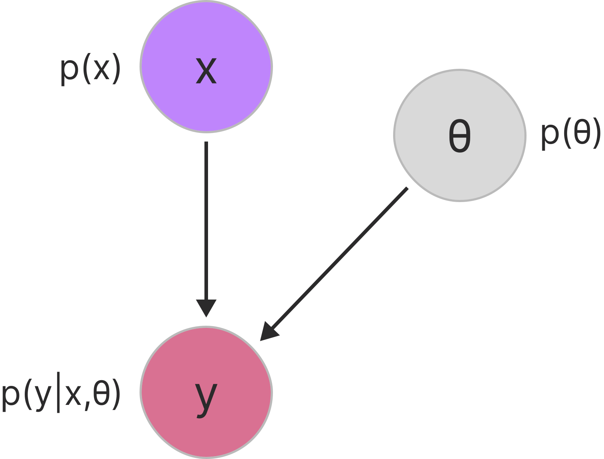
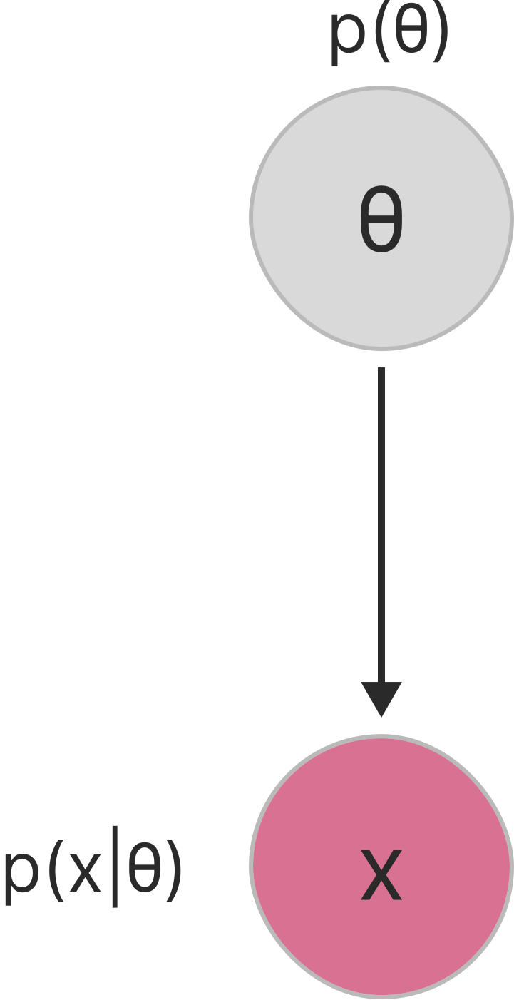
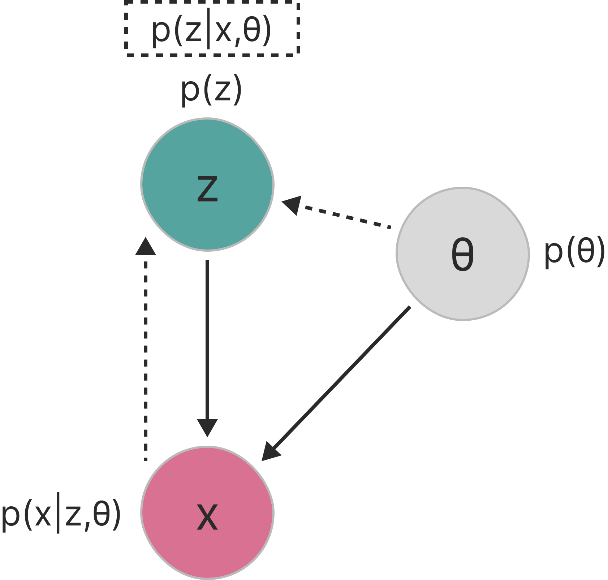

# Latent Models
---

## Mathematical Foundations

<div class="timeline-container" style="flex-direction: row;">
    <div style="width: 20%;">
        <div class="timeline-title">Calculus & Linear Algebra</div>
        <div class="timeline-text">Basis for optimization algorithms and machine learning model operations</div>
    </div>
    <div class="timeline" style="width: 80%; --start-year: 1676; --end-year: 1951;" data-timeline-fragments-select="1676:0,1805:0,1809:0,1847:0,1951:0">
        {{TIMELINE:timeline_calculus_linear_algebra}}
    </div>
</div>

<div class="timeline-container" style="flex-direction: row;">
    <div style="width: 20%;">
        <div class="timeline-title">Probability & Statistics</div>
        <div class="timeline-text">Basis for Bayesian methods, statistical inference, and generative models</div>
    </div>
    <div class="timeline" style="width: 80%; --start-year: 1676; --end-year: 1951;" data-timeline-fragments-select="1763:0,1812:0,1815:0,1922:0">
        {{TIMELINE:timeline_probability_statistics}}
    </div>
</div>

<div class="timeline-container" style="flex-direction: row;">
    <div style="width: 20%;">
        <div class="timeline-title">Information & Computation</div>
        <div class="timeline-text">Foundations of algorithmic thinking and information theory</div>
    </div>
    <div class="timeline" style="width: 80%; --start-year: 1676; --end-year: 1951;" data-timeline-fragments-select="1843:0,1936:0,1947:0,1948:0">
        {{TIMELINE:timeline_information_computation}}
    </div>
</div>

<div class="fragment" data-fragment-index="1"></div>

---

## Early History of Neural Networks

<div class="timeline-container" style="flex-direction: row;">
    <div style="width: 20%;">
        <div class="timeline-title">Architectures & Layers</div>
        <div class="timeline-text">Evolution of network architectures and layer innovations</div>
    </div>
    <div class="timeline" style="width: 80%; --start-year: 1943; --end-year: 2012;" data-timeline-fragments-select="1943:0,1957:0,1965:0,1979:0,1982:0,1989:0,2012:0">
        {{TIMELINE:timeline_early_nn_architectures}}
    </div>
</div>

<div class="timeline-container" style="flex-direction: row;">
    <div style="width: 20%;">
        <div class="timeline-title">Training & Optimization</div>
        <div class="timeline-text">Methods for efficient learning and gradient-based optimization</div>
    </div>
    <div class="timeline" style="width: 80%; --start-year: 1943; --end-year: 2012;" data-timeline-fragments-select="1967:0,1970:0,1986:0,1992:0,2009:0,2010:0,2012:0">
        {{TIMELINE:timeline_early_nn_training}}
    </div>
</div>

<div class="timeline-container" style="flex-direction: row;">
    <div style="width: 20%;">
        <div class="timeline-title">Software & Datasets</div>
        <div class="timeline-text">Tools, platforms, and milestones that enabled practical deep learning</div>
    </div>
    <div class="timeline" style="width: 80%; --start-year: 1943; --end-year: 2012;" data-timeline-fragments-select="2002:0,2007:0,">
        {{TIMELINE:timeline_early_nn_software}}
    </div>
</div>

<div class="fragment" data-fragment-index="2"></div>

---

## The Deep Learning Era

<!-- Layers & Architectures Timeline -->
<div class="timeline-container" style="flex-direction: row;">
    <div style="width: 20%;">
        <div class="timeline-title">Deep architectures</div>
        <div class="timeline-text">Deep architectures and generative models transforming AI capabilities</div>
    </div>
    <div class="timeline" style="width: 80%; --start-year: 2013; --end-year: 2023;" data-timeline-fragments-select="2015:0,2016:0,2017:0,2021:0">
        {{TIMELINE:timeline_deep_architectures}}
    </div>
</div>

<div class="timeline-container" style="flex-direction: row;">
    <div style="width: 20%;">
        <div class="timeline-title">Training & Optimization</div>
        <div class="timeline-text">Advanced learning techniques and representation learning breakthroughs</div>
    </div>
    <div class="timeline" style="width: 80%; --start-year: 2013; --end-year: 2023;" data-timeline-fragments-select="2013:0,2014:0,2015:0,2016:0">
        {{TIMELINE:timeline_deep_training}}
    </div>
</div>

<div class="timeline-container" style="flex-direction: row;">
    <div style="width: 20%;">
        <div class="timeline-title">Software & Applications</div>
        <div class="timeline-text">Practical deployment and mainstream adoption of deep learning systems</div>
    </div>
    <div class="timeline" style="width: 80%; --start-year: 2013; --end-year: 2023;" data-timeline-fragments-select="2017:0,2018:0,2020:0,2022:0,2023:0">
        {{TIMELINE:timeline_deep_software}}
    </div>
</div>


---

## Recap: Probability Fundamentals

<div style="font-size: 0.75em;">

**Foundation:** Random variables ($X$, $Y$) with distributions (PMF/PDF), characterized by expectation, joint/marginal/conditional probabilities

**Bayes' Theorem:** $p_{Y|X}(\mathbf{y}|\mathbf{x}) = \frac{p_{X|Y}(\mathbf{x}|\mathbf{y}) \cdot p_Y(\mathbf{y})}{p_X(\mathbf{x})}$ — connects posterior, likelihood, and prior

**Decision Rules (Classification):**
- Bayesian: $\arg\min_{\hat{\mathbf{y}}} \sum_{\mathbf{y}} \mathcal{L}(\mathbf{y}, \hat{\mathbf{y}}) \cdot p_{Y|X}(\mathbf{y}|\mathbf{x})$ (minimize expected loss)
- MAP: $\arg\max_{\hat{\mathbf{y}}} p_{X|Y}(\mathbf{x}|\hat{\mathbf{y}}) p_Y(\hat{\mathbf{y}})$ (0-1 loss → maximize posterior)
- ML: $\arg\max_{\hat{\mathbf{y}}} p_{X|Y}(\mathbf{x}|\hat{\mathbf{y}})$ (uniform prior → maximize likelihood)

**Parameter Estimation (Training):**
- Bayesian: $p_{\Theta|\mathcal{D}}(\boldsymbol{\theta}|\mathcal{D}) = \frac{p_{\mathcal{D}|\Theta}(\mathcal{D}|\boldsymbol{\theta}) \cdot p_\Theta(\boldsymbol{\theta})}{p_{\mathcal{D}}(\mathcal{D})}$ (full posterior distribution)
- MAP: $\arg\max_{\boldsymbol{\theta}} \prod_{i=1}^n p_{Y|X,\Theta}(\mathbf{y}_i|\mathbf{x}_i, \boldsymbol{\theta}) \cdot p_\Theta(\boldsymbol{\theta})$ (mode of posterior = **regularization**)
- MLE: $\arg\max_{\boldsymbol{\theta}} \prod_{i=1}^n p_{Y|X,\Theta}(\mathbf{y}_i|\mathbf{x}_i, \boldsymbol{\theta})$ (uniform prior)

**Key:** Same probabilistic framework applies to both **what to predict** (classification) and **how to learn** (training)

</div>

---

## Supervised Learning

<div style="font-size: 0.75em;">



Our previous machine learning models were primarily focused on supervised learning tasks.

**Dataset Structure:**

In supervised learning, we have access to a labeled dataset:

<div class="formula" style="width: 60%; margin-left: 0;">
  $$
\mathcal{D} = \{(\mathbf{x}_i, \mathbf{y}_i)\}_{i=1}^n
  $$
</div>

where each input $\mathbf{x}_i$ is paired with a corresponding output $\mathbf{y}_i$.

<div class="fragment appear-vanish" data-fragment-index="1">

**Probabilistic Formulation:**

We can frame supervised learning probabilistically by assuming the data is generated from some conditional distribution $p_{Y|X,\Theta}(\mathbf{y}|\mathbf{x}, \boldsymbol{\theta})$ parameterized by $\boldsymbol{\theta}$. Using Bayes' theorem, the posterior distribution over parameters is:

<div class="formula">
  $$
  p_{\Theta|X,Y}(\boldsymbol{\theta}|\mathbf{X}, \mathbf{Y}) = \frac{p_{X,Y|\Theta}(\mathbf{X}, \mathbf{Y}|\boldsymbol{\theta}) \cdot p_\Theta(\boldsymbol{\theta})}{p_{X,Y}(\mathbf{X}, \mathbf{Y})}
  $$
</div>

</div>

<div class="fragment appear" data-fragment-index="2">

**Parameter Estimation:**

In practice, we typically estimate a single "best" parameter value rather than computing the full posterior. We can use techniques like Maximum Likelihood Estimation (MLE) or Maximum A Posteriori (MAP):

<div class="formula">
  $$
\theta_{\text{MAP}} = \arg\max_{\boldsymbol{\theta}} \prod_{i=1}^n p_{Y|X,\Theta}(\mathbf{y}_i|\mathbf{x}_i, \boldsymbol{\theta}) \cdot p_\Theta(\boldsymbol{\theta})
  $$
</div>

</div>

</div>

---

## Unsupervised Learning

<div style="font-size: 0.75em;">



In unsupervised learning, we work with unlabeled data and aim to discover hidden structure.

**Dataset Structure:**

We only have access to observations without corresponding labels:

<div class="formula" style="width: 60%; margin-left: 0;">
  $$
\mathcal{D} = \{\mathbf{x}_i\}_{i=1}^n
  $$
</div>

<div class="fragment appear-vanish" data-fragment-index="1">

**Probabilistic Formulation:**

We model the data distribution directly as $p_{X|\Theta}(\mathbf{x}|\boldsymbol{\theta})$. The goal is to find parameters that explain the observed data:

<div class="formula">
  $$
  p_{\Theta|X}(\boldsymbol{\theta}|\mathbf{X}) = \frac{p_{X|\Theta}(\mathbf{X}|\boldsymbol{\theta}) \cdot p_\Theta(\boldsymbol{\theta})}{p_X(\mathbf{X})}
  $$
</div>

</div>

<div class="fragment appear" data-fragment-index="2">

**Parameter Estimation:**

Using Maximum Likelihood Estimation, we find parameters that maximize the probability of observing the data:

<div class="formula">
  $$
\boldsymbol{\theta}_{\text{MLE}} = \arg\max_{\boldsymbol{\theta}} \prod_{i=1}^n p_{X|\Theta}(\mathbf{x}_i|\boldsymbol{\theta})
  $$
</div>

</div>

</div>

---

## Latent Variables

<div style="font-size: 0.75em;">



But sometimes, it is difficult to model the data distribution directly. Instead, we can introduce latent (hidden) variables that capture underlying factors and try to model the joint distribution of observed and latent variables.

The latent variable model assumes that each observation $\mathbf{x}$ is generated from a latent variable $\mathbf{z}$ through a conditional distribution $p_{X|Z,\Theta}(\mathbf{x}|\mathbf{z}, \boldsymbol{\theta})$.

We can express the marginal likelihood of the observed data by integrating out the latent variables:

<div class="formula" style="width: 63%; margin-left: 0;">
  $$
p_{X|\Theta}(\mathbf{x}|\boldsymbol{\theta}) = \int p_{X|Z,\Theta}(\mathbf{x}|\mathbf{z}, \boldsymbol{\theta}) \cdot p_{Z|\Theta}(\mathbf{z}|\boldsymbol{\theta}) \, d\mathbf{z}
  $$
</div>

<div class="fragment appear" data-fragment-index="1">

**Parameter Estimation:**

To estimate the parameters $\boldsymbol{\theta}$ in the presence of latent variables, we can use Maximum Likelihood Estimation (MLE) by maximizing the marginal likelihood:

<div class="formula">
  $$
\boldsymbol{\theta}_{\text{MLE}} = \arg\max_{\boldsymbol{\theta}} \prod_{i=1}^n p_{X|\Theta}(\mathbf{x}_i|\boldsymbol{\theta}) = \arg\max_{\boldsymbol{\theta}} \prod_{i=1}^n \int p_{X|Z,\Theta}(\mathbf{x}_i|\mathbf{z}, \boldsymbol{\theta}) \cdot p_{Z|\Theta}(\mathbf{z}|\boldsymbol{\theta}) \, d\mathbf{z}
  $$
</div>

</div>

</div>

---

## From Latent Variables to Clustering

<div style="font-size: 0.75em;">

**The Challenge:** The integral $\int p(\mathbf{x}|\mathbf{z}, \boldsymbol{\theta}) \cdot p(\mathbf{z}|\boldsymbol{\theta}) \, d\mathbf{z}$ is often intractable for continuous $\mathbf{z}$.

<div class="fragment appear" data-fragment-index="1">

**Simplification:** What if $\mathbf{z}$ is **discrete**? Let $z \in \{1, 2, ..., K\}$ represent a cluster assignment.

The integral becomes a tractable **sum**:

<div class="formula">
  $$
p_{X|\Theta}(\mathbf{x}|\boldsymbol{\theta}) = \sum_{k=1}^K p_{X|Z,\Theta}(\mathbf{x}|z=k, \boldsymbol{\theta}) \cdot p_{Z|\Theta}(z=k|\boldsymbol{\theta})
  $$
</div>

</div>

<div class="fragment appear" data-fragment-index="2">

**Gaussian Mixture Model (GMM):** Choose Gaussian components with mixing weights $\pi_k$:

<div class="formula">
  $$
p(\mathbf{x}|\boldsymbol{\theta}) = \sum_{k=1}^K \pi_k \cdot \mathcal{N}(\mathbf{x}|\boldsymbol{\mu}_k, \boldsymbol{\Sigma}_k)
  $$
</div>

| Latent Variable Model | Gaussian Mixture Model |
|:----------------------|:-----------------------|
| $p_{Z\|\Theta}(\mathbf{z}\|\boldsymbol{\theta})$ | $\pi_k$ (mixing weights, $\sum_k \pi_k = 1$) |
| $p_{X\|Z,\Theta}(\mathbf{x}\|\mathbf{z}, \boldsymbol{\theta})$ | $\mathcal{N}(\mathbf{x}\|\boldsymbol{\mu}_k, \boldsymbol{\Sigma}_k)$ |

</div>

</div>

---

## The GMM Optimization Problem

<div style="font-size: 0.75em;">

**MLE Objective:** Maximize the log-likelihood over all data points:

<div class="formula">
  $$
\boldsymbol{\theta}_{\text{MLE}} = \arg\max_{\boldsymbol{\theta}} \sum_{i=1}^n \log \left( \sum_{k=1}^K \pi_k \cdot \mathcal{N}(\mathbf{x}_i|\boldsymbol{\mu}_k, \boldsymbol{\Sigma}_k) \right)
  $$
</div>

<div class="fragment appear" data-fragment-index="1">

**The Problem:** The **log of the sum** prevents closed-form solutions!

Taking the derivative with respect to $\boldsymbol{\mu}_k$ using the chain rule:

<div class="formula">
  $$
\frac{\partial \mathcal{L}}{\partial \boldsymbol{\mu}_k} = \sum_{i=1}^n \frac{\pi_k \cdot \mathcal{N}(\mathbf{x}_i|\boldsymbol{\mu}_k, \boldsymbol{\Sigma}_k)}{\sum_{j=1}^K \pi_j \cdot \mathcal{N}(\mathbf{x}_i|\boldsymbol{\mu}_j, \boldsymbol{\Sigma}_j)} \cdot \boldsymbol{\Sigma}_k^{-1}(\mathbf{x}_i - \boldsymbol{\mu}_k)
  $$
</div>

</div>

<div class="fragment appear" data-fragment-index="2">

Setting to zero and solving, we get a **circular dependency**:

<div class="formula">
  $$
\boldsymbol{\mu}_k = \frac{\sum_{i=1}^n \gamma_{ik} \mathbf{x}_i}{\sum_{i=1}^n \gamma_{ik}} \quad \text{where} \quad \gamma_{ik} = \frac{\pi_k \cdot \mathcal{N}(\mathbf{x}_i|\boldsymbol{\mu}_k, \boldsymbol{\Sigma}_k)}{\sum_{j=1}^K \pi_j \cdot \mathcal{N}(\mathbf{x}_i|\boldsymbol{\mu}_j, \boldsymbol{\Sigma}_j)}
  $$
</div>

<div>
$\boldsymbol{\mu}_k$ appears on <strong>both sides</strong> — the solution depends on $\gamma_{ik}$, which depends on $\boldsymbol{\mu}_k$ itself!
</div>

</div>

</div>

---

## Contrast: Single Gaussian vs. Mixture

<div style="font-size: 0.75em;">

**Single Gaussian** (no mixture, no sum inside log):

<div class="formula">
  $$
\log p(\mathbf{x}|\boldsymbol{\mu}, \boldsymbol{\Sigma}) = -\frac{1}{2}(\mathbf{x} - \boldsymbol{\mu})^\top \boldsymbol{\Sigma}^{-1} (\mathbf{x} - \boldsymbol{\mu}) + \text{const}
  $$
</div>

<div class="fragment appear" data-fragment-index="1">

Taking derivative and setting to zero gives a **clean closed-form**:

<div class="formula">
  $$
\boldsymbol{\mu}_{\text{MLE}} = \frac{1}{n} \sum_{i=1}^n \mathbf{x}_i
  $$
</div>

</div>

<div class="fragment appear" data-fragment-index="2">

**Gaussian Mixture** (sum inside log):

The log doesn't "pass through" to individual components. All parameters remain coupled in the denominator of $\gamma_{ik}$, creating the circular dependency.

**Key Insight:** If we **knew the cluster assignments** $z_i$, we could reduce each cluster to a single Gaussian problem!

- Each $\boldsymbol{\mu}_k$ would just be the mean of points assigned to cluster $k$
- But we don't know $z_i$ — that's what we're trying to learn!

</div>

</div>

---

## The EM Algorithm: Intuition

<div style="font-size: 0.75em;">

**Chicken-and-egg problem:**
- If we knew **parameters** $\boldsymbol{\theta}$, we could compute cluster assignments $z_i$
- If we knew **assignments** $z_i$, we could easily estimate parameters $\boldsymbol{\theta}$

<div class="fragment appear" data-fragment-index="1">

**EM Solution:** Alternate between the two!

<div style="display: flex; justify-content: space-around; margin: 20px 0;">
  <div style="text-align: center; padding: 15px; border: 2px solid #4CAF50; border-radius: 10px; width: 40%;">
    <strong>E-Step (Expectation)</strong><br>
    Given current $\boldsymbol{\theta}^{(t)}$,<br>
    compute <em>soft</em> cluster assignments<br>
    $\gamma_{ik} = p(z_i = k | \mathbf{x}_i, \boldsymbol{\theta}^{(t)})$
  </div>
  <div style="font-size: 2em; align-self: center;">→</div>
  <div style="text-align: center; padding: 15px; border: 2px solid #2196F3; border-radius: 10px; width: 40%;">
    <strong>M-Step (Maximization)</strong><br>
    Given responsibilities $\gamma_{ik}$,<br>
    update parameters<br>
    $\boldsymbol{\theta}^{(t+1)}$
  </div>
</div>

</div>

<div class="fragment appear" data-fragment-index="2">

**Guaranteed Properties:**
- Log-likelihood **never decreases** at each iteration
- Converges to a **local maximum** (not necessarily global)

</div>

</div>

---

## EM for Gaussian Mixture Models

<div style="font-size: 0.7em;">

**E-Step:** Compute responsibilities (posterior probability that point $i$ belongs to cluster $k$):

<div class="formula">
  $$
\gamma_{ik} = \frac{\pi_k \cdot \mathcal{N}(\mathbf{x}_i|\boldsymbol{\mu}_k, \boldsymbol{\Sigma}_k)}{\sum_{j=1}^K \pi_j \cdot \mathcal{N}(\mathbf{x}_i|\boldsymbol{\mu}_j, \boldsymbol{\Sigma}_j)}
  $$
</div>

<div class="fragment appear" data-fragment-index="1">

**M-Step:** Update parameters using weighted statistics:

<div class="formula">
  $$
\begin{aligned}
N_k &= \sum_{i=1}^n \gamma_{ik} & &\text{(effective number of points in cluster } k \text{)} \\[0.5em]
\boldsymbol{\mu}_k^{\text{new}} &= \frac{1}{N_k} \sum_{i=1}^n \gamma_{ik} \mathbf{x}_i & &\text{(weighted mean)} \\[0.5em]
\boldsymbol{\Sigma}_k^{\text{new}} &= \frac{1}{N_k} \sum_{i=1}^n \gamma_{ik} (\mathbf{x}_i - \boldsymbol{\mu}_k^{\text{new}})(\mathbf{x}_i - \boldsymbol{\mu}_k^{\text{new}})^\top & &\text{(weighted covariance)} \\[0.5em]
\pi_k^{\text{new}} &= \frac{N_k}{n} & &\text{(mixing weight)}
\end{aligned}
  $$
</div>

</div>

</div>

---

## EM Algorithm: Summary

<div style="font-size: 0.75em;">

```
Initialize: θ⁽⁰⁾ = {μₖ, Σₖ, πₖ} randomly or with k-means

Repeat until convergence:
    
    E-Step: For each point i and cluster k, compute:
            γᵢₖ = P(zᵢ = k | xᵢ, θ⁽ᵗ⁾)
    
    M-Step: Update parameters:
            μₖ ← weighted mean of points
            Σₖ ← weighted covariance
            πₖ ← fraction of responsibility
    
    Check: Δ log-likelihood < ε → stop
```

<div class="fragment appear" data-fragment-index="1">

**K-Means as a Special Case:**

| GMM with EM | K-Means |
|:------------|:--------|
| Soft assignments $\gamma_{ik} \in [0,1]$ | Hard assignments $\gamma_{ik} \in \{0,1\}$ |
| Full covariance $\boldsymbol{\Sigma}_k$ | Spherical: $\boldsymbol{\Sigma}_k = \sigma^2 \mathbf{I}$ |
| Probabilistic model | Distance-based heuristic |

K-means is the limit of GMM-EM as $\sigma \to 0$ (hard assignments)

</div>

</div>

---

