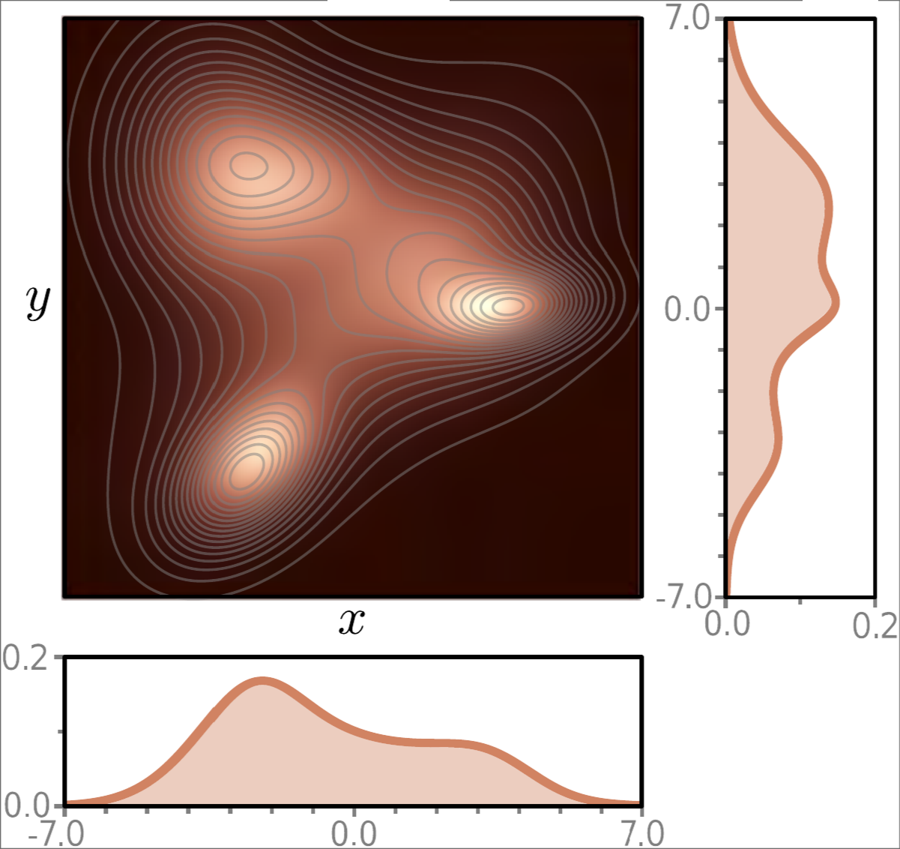
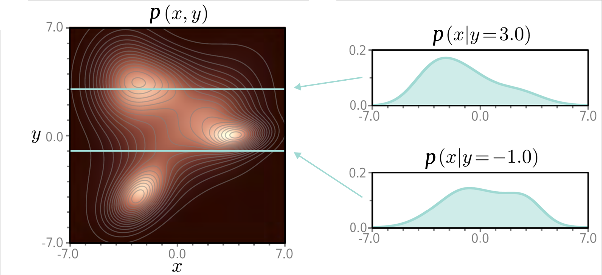
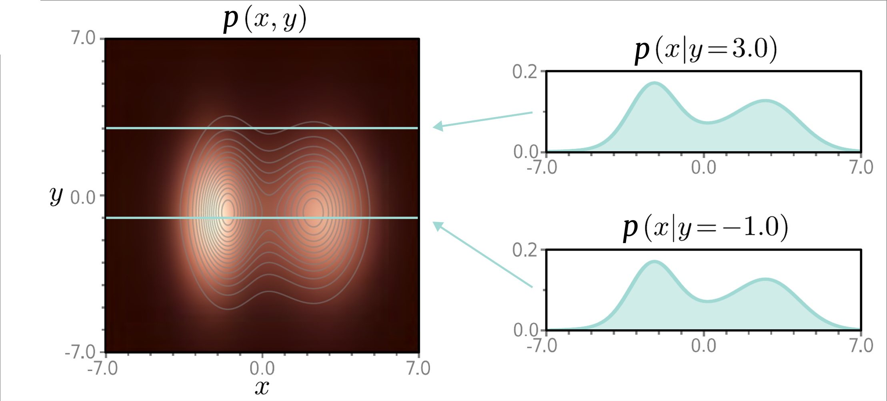
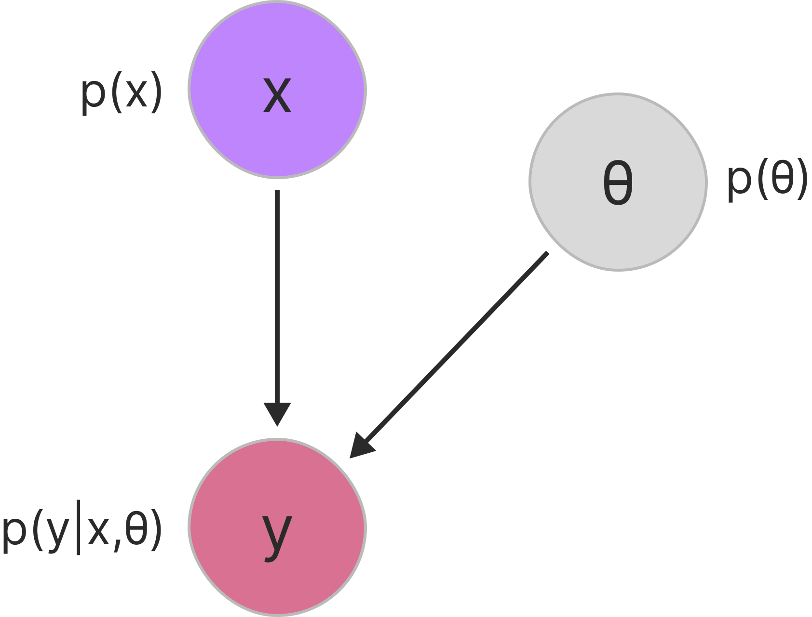
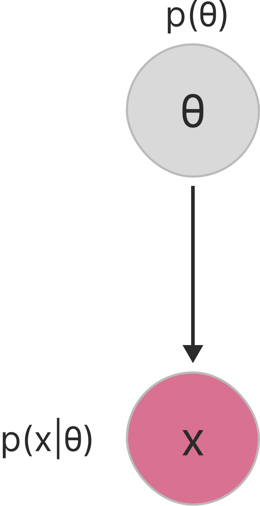
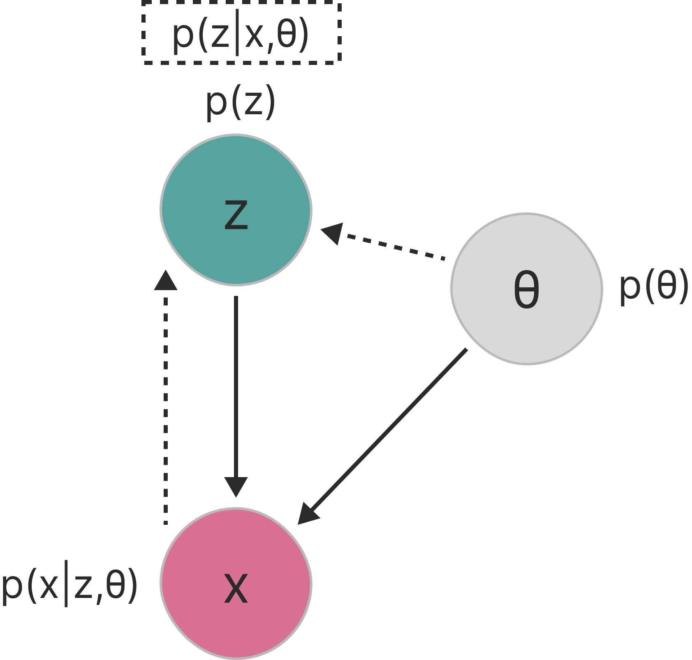

# Probability & Latent Variable Models

---

## Mathematical Foundations

<div class="timeline-container" style="flex-direction: row;">
    <div style="width: 20%;">
        <div class="timeline-title">Calculus & Linear Algebra</div>
        <div class="timeline-text">Basis for optimization algorithms and machine learning model operations</div>
    </div>
    <div class="timeline" style="width: 80%; --start-year: 1676; --end-year: 1951;" data-timeline-fragments-select="1676:0,1805:0,1809:0,1847:0,1951:0">
        {{TIMELINE:timeline_calculus_linear_algebra}}
    </div>
</div>

<div class="timeline-container" style="flex-direction: row;">
    <div style="width: 20%;">
        <div class="timeline-title">Probability & Statistics</div>
        <div class="timeline-text">Basis for Bayesian methods, statistical inference, and generative models</div>
    </div>
    <div class="timeline" style="width: 80%; --start-year: 1676; --end-year: 1951;" data-timeline-fragments-select="1763:1,1812:1,1815:0,1922:1">
        {{TIMELINE:timeline_probability_statistics}}
    </div>
</div>

<div class="timeline-container" style="flex-direction: row;">
    <div style="width: 20%;">
        <div class="timeline-title">Information & Computation</div>
        <div class="timeline-text">Foundations of algorithmic thinking and information theory</div>
    </div>
    <div class="timeline" style="width: 80%; --start-year: 1676; --end-year: 1951;" data-timeline-fragments-select="1843:0,1936:0,1947:0,1948:0">
        {{TIMELINE:timeline_information_computation}}
    </div>
</div>

<div class="fragment" data-fragment-index="1"></div>

---

## Early History of Neural Networks

<div class="timeline-container" style="flex-direction: row;">
    <div style="width: 20%;">
        <div class="timeline-title">Architectures & Layers</div>
        <div class="timeline-text">Evolution of network architectures and layer innovations</div>
    </div>
    <div class="timeline" style="width: 80%; --start-year: 1943; --end-year: 2012;" data-timeline-fragments-select="1943:0,1957:0,1965:0,1979:0,1982:0,1989:0,2012:0">
        {{TIMELINE:timeline_early_nn_architectures}}
    </div>
</div>

<div class="timeline-container" style="flex-direction: row;">
    <div style="width: 20%;">
        <div class="timeline-title">Training & Optimization</div>
        <div class="timeline-text">Methods for efficient learning and gradient-based optimization</div>
    </div>
    <div class="timeline" style="width: 80%; --start-year: 1943; --end-year: 2012;" data-timeline-fragments-select="1967:0,1970:0,1986:0,1992:0,2009:0,2010:0,2012:0">
        {{TIMELINE:timeline_early_nn_training}}
    </div>
</div>

<div class="timeline-container" style="flex-direction: row;">
    <div style="width: 20%;">
        <div class="timeline-title">Software & Datasets</div>
        <div class="timeline-text">Tools, platforms, and milestones that enabled practical deep learning</div>
    </div>
    <div class="timeline" style="width: 80%; --start-year: 1943; --end-year: 2012;" data-timeline-fragments-select="2002:0,2007:0,">
        {{TIMELINE:timeline_early_nn_software}}
    </div>
</div>

<div class="fragment" data-fragment-index="2"></div>

---

## The Deep Learning Era

<!-- Layers & Architectures Timeline -->
<div class="timeline-container" style="flex-direction: row;">
    <div style="width: 20%;">
        <div class="timeline-title">Deep architectures</div>
        <div class="timeline-text">Deep architectures and generative models transforming AI capabilities</div>
    </div>
    <div class="timeline" style="width: 80%; --start-year: 2013; --end-year: 2023;" data-timeline-fragments-select="2015:0,2016:0,2017:0,2021:0">
        {{TIMELINE:timeline_deep_architectures}}
    </div>
</div>

<div class="timeline-container" style="flex-direction: row;">
    <div style="width: 20%;">
        <div class="timeline-title">Training & Optimization</div>
        <div class="timeline-text">Advanced learning techniques and representation learning breakthroughs</div>
    </div>
    <div class="timeline" style="width: 80%; --start-year: 2013; --end-year: 2023;" data-timeline-fragments-select="2013:0,2014:0,2015:0,2016:0">
        {{TIMELINE:timeline_deep_training}}
    </div>
</div>

<div class="timeline-container" style="flex-direction: row;">
    <div style="width: 20%;">
        <div class="timeline-title">Software & Applications</div>
        <div class="timeline-text">Practical deployment and mainstream adoption of deep learning systems</div>
    </div>
    <div class="timeline" style="width: 80%; --start-year: 2013; --end-year: 2023;" data-timeline-fragments-select="2017:0,2018:0,2020:0,2022:0,2023:0">
        {{TIMELINE:timeline_deep_software}}
    </div>
</div>

---

## Probability Theory in Deep Learning

<div style="font-size: 0.9em;">
<p><em>Probability theory provides a framework for modeling uncertainty in data, predictions, and model parameters</em></p>
<p><strong>Supervised Learning:</strong></p>
<ul>
<li>Loss functions such as cross-entropy and mean squared error are derived from probabilistic principles</li>
<li>Softmax outputs represent conditional class probabilities</li>
</ul>
<p><strong>Unsupervised Learning:</strong></p>
<ul>
<li>Variational Autoencoders (VAEs) learn latent representations to approximate the probability distributions of input data</li>
<li>Generative Adversarial Networks (GANs) implicitly model the data distribution through adversarial training</li>
<li>Diffusion models learn to reverse a gradual noising process to generate samples from the data distribution</li>
</ul>
</div>

---

## Key Concepts & Axioms

<div style="font-size: 0.8em;">
<p><strong>Building blocks:</strong></p>
<ul>
<li><strong>Sample Space</strong> ($\Omega$): set of all possible elementary outcomes; <strong>Outcome</strong> ($\omega \in \Omega$): a single result</li>
<li><strong>Event</strong> ($A \in \mathcal{F}$): a measurable subset of $\Omega$ (element of the $\sigma$-algebra $\mathcal{F}$)</li>
<li><strong>Probability Measure</strong> ($P: \mathcal{F} \to [0,1]$): assigns probabilities to events</li>
</ul>
</div>

<div class="fragment" style="font-size: 0.85em;">
<p><strong>The three axioms (Kolmogorov):</strong></p>
<ol>
<li><strong>Non-negativity</strong>: $P(A) \geq 0$ for any event $A$</li>
<li><strong>Normalization</strong>: $P(\Omega) = 1$</li>
<li><strong>Additivity</strong>: for mutually exclusive $A_1, A_2, \ldots$ (with $A_i \cap A_j = \emptyset$):</li>
</ol>
<div class="formula">
$$
P\left(\bigcup_{i=1}^{\infty} A_i\right) = \sum_{i=1}^{\infty} P(A_i)
$$
</div>
</div>

---

## Random Variables

<p>A <strong>random variable</strong> $X: \Omega \to \mathbb{R}$ is a measurable function that assigns a numerical value to each outcome.</p>

<div style="display: flex; gap: 2em;">
<div style="flex: 1;">
<p><strong>Discrete Random Variable</strong></p>
<p>Takes on a finite or countably infinite set of values.</p>
<p><em>Examples:</em></p>
<ul>
<li>Number of heads in 10 coin flips</li>
<li>Class label in classification (0, 1, 2, ...)</li>
<li>Word token index in a vocabulary</li>
</ul>
</div>
<div style="flex: 1;">
<p><strong>Continuous Random Variable</strong></p>
<p>Takes on any value within an interval or the entire real line.</p>
<p><em>Examples:</em></p>
<ul>
<li>Audio sample amplitude</li>
<li>Pixel intensity (0.0 to 1.0)</li>
<li>Latent vector components in VAEs</li>
</ul>
</div>
</div>

---

## PMF and PDF

<div style="font-size: 0.8em; display: flex; gap: 2em;">
<div style="flex: 1;">
<p><strong>Probability Mass Function</strong> (discrete $X$)</p>
<p>$p_X: \mathbb{R} \to [0,1]$ gives the probability of each value:</p>
<div class="formula">
$$
p_X(x) = P(X = x)
$$
</div>
<ul>
<li>$p_X(x) \geq 0$, and $\sum_{x} p_X(x) = 1$</li>
<li>$P(X \in A) = \sum_{x \in A} p_X(x)$</li>
</ul>
</div>
<div style="flex: 1;">
<p><strong>Probability Density Function</strong> (continuous $X$)</p>
<p>$p_X: \mathbb{R} \to [0, \infty)$ describes probability <em>density</em>:</p>
<div class="formula">
$$
P(a \leq X \leq b) = \int_a^b p_X(x) \, dx
$$
</div>
<ul>
<li>$p_X(x) \geq 0$, and $\int_{-\infty}^{\infty} p_X(x)\,dx = 1$</li>
<li>$P(X = x) = 0$ for any single point</li>
</ul>
</div>
</div>

<div class="fragment highlight" style="font-size: 0.85em;">
<p><strong>Key insight:</strong> A PDF can exceed 1 (it is a density, not a probability), but its integral over any region is always $\leq 1$.</p>
</div>

---

## Probability Notation

<div style="font-size: 0.8em; display: grid; grid-template-columns: 1fr 1fr; gap: 20px 60px; margin-top: 20px;">
    <div>
        <p><strong>Big P</strong> — probability of an <em>event</em> (a set or inequality); returns a number in $[0,1]$<br>
        $P(A),\ P(\Omega) = 1,\ P(a \leq X \leq b),\ P(X \in A)$</p>
        <p><strong>Small p</strong> — PMF (discrete) or PDF (continuous) of a random variable evaluated at a <em>value</em>; densities can exceed 1<br>
        $p_X(x),\ p_{X,Y}(x,y)$</p>
        <p><strong>Subscripts</strong> — identify <em>which</em> random variable(s) the distribution refers to; the arguments are the values they take. Often dropped when unambiguous: $p(x) \equiv p_X(x)$<br>
        $p_X(x),\ p_{X,Y}(x,y),\ p_{X|Y}(x \mid y)$</p>
    </div>
    <div>
        <p><strong>Conditional</strong> — $\mid$ reads "given"; a comma on the right of $\mid$ conditions on multiple variables at once<br>
        $p_{X|Y}(x \mid y),\ p_{Y|X,\Theta}(y \mid x, \boldsymbol{\theta})$</p>
        <p><strong>Sample space &amp; events</strong> — $\Omega$ sample space, $\omega \in \Omega$ outcome, $\mathcal{F}$ $\sigma$-algebra of events, $A \in \mathcal{F}$ event</p>
        <p><strong>Common objects</strong> — $\mathbb{E}[\cdot]$ expectation, $\mathcal{N}(\mu, \sigma^2)$ normal distribution, $\mathcal{D}$ dataset, $\boldsymbol{\theta} \in \Theta$ parameters<br>
        $\mathbb{E}[X],\ X \sim \mathcal{N}(0, 1),\ \mathcal{D} = \lbrace(\mathbf{x}_i, y_i)\rbrace_{i=1}^{N}$</p>
    </div>
</div>

---

## Expected Value

<div style="font-size: 0.85em;">
<p>The <strong>expected value</strong> is the probability-weighted average of all possible values:</p>
<div style="display: flex; gap: 2em;">
<div style="flex: 1;">
<p><strong>Discrete</strong></p>
<div class="formula">
$$
\mathbb{E}[X] = \sum_{x} x \cdot p_X(x)
$$
</div>
</div>
<div style="flex: 1;">
<p><strong>Continuous</strong></p>
<div class="formula">
$$
\mathbb{E}[X] = \int_{-\infty}^{\infty} x \cdot p_X(x) \, dx
$$
</div>
</div>
</div>
<p><strong>Expectation of a function:</strong> &nbsp; $\mathbb{E}[g(X)] = \sum_{x} g(x)\, p_X(x)$ &nbsp; (or the integral for continuous $X$)</p>
</div>

<div class="fragment" style="font-size: 0.75em;">
<table>
<thead>
<tr><th>Property</th><th>Formula</th><th>Note</th></tr>
</thead>
<tbody>
<tr><td>Linearity</td><td>$\mathbb{E}[aX + bY] = a\mathbb{E}[X] + b\mathbb{E}[Y]$</td><td>Holds even if $X, Y$ dependent!</td></tr>
<tr><td>Constant</td><td>$\mathbb{E}[c] = c$</td><td></td></tr>
<tr><td>Independence</td><td>$\mathbb{E}[XY] = \mathbb{E}[X]\,\mathbb{E}[Y]$</td><td>Only if $X \perp Y$</td></tr>
</tbody>
</table>
</div>

---

## Joint, Marginal & Conditional

<div style="font-size: 0.82em;">
<p>For random variables $X$ and $Y$:</p>

<div class="fragment" data-fragment-index="1">
<p><strong>Joint</strong> — probability of the combined outcomes</p>
<div class="formula">
$$
p_{X,Y}(x,y) \geq 0, \quad \iint p_{X,Y}(x,y)\,dx\,dy = 1
$$
</div>
</div>

<div class="fragment" data-fragment-index="3">
<p><strong>Marginal</strong> — integrate the other variable out</p>
<div class="formula">
$$
p_X(x) = \int_{-\infty}^{\infty} p_{X,Y}(x,y) \, dy
$$
</div>
</div>

<div class="fragment" data-fragment-index="5">
<p><strong>Conditional</strong> — a renormalized slice of the joint</p>
<div class="formula">
$$
p_{X|Y}(x|y) = \frac{p_{X,Y}(x,y)}{p_Y(y)}
$$
</div>
</div>

<div class="fragment" data-fragment-index="7">
<p><strong>Independence</strong> — one variable tells nothing about the other</p>
<div class="formula">
$$
p_{X,Y}(x,y) = p_X(x)\, p_Y(y)
$$
</div>
</div>
</div>

<div class="fragment appear-vanish image-overlay" data-fragment-index="2" style="width: 68%;">
    
    <div class="reference">
        Joint $p_{X,Y}(x,y)$. Source: <a href="https://github.com/udlbook/udlbook" target="_blank">Understanding Deep Learning (Prince)</a>
    </div>
</div>

<div class="fragment appear-vanish image-overlay" data-fragment-index="4" style="width: 68%;">
    
    <div class="reference">
        The marginals $p_X(x)$ and $p_Y(y)$ are the projections of the joint onto each axis. Source: <a href="https://github.com/udlbook/udlbook" target="_blank">Understanding Deep Learning (Prince)</a>
    </div>
</div>

<div class="fragment appear-vanish image-overlay" data-fragment-index="6" style="width: 68%;">
    
    <div class="reference">
        Conditional $p_{X|Y}(x|y)$ = a slice of the joint, renormalized. Source: <a href="https://github.com/udlbook/udlbook" target="_blank">Understanding Deep Learning (Prince)</a>
    </div>
</div>

<div class="fragment appear-vanish image-overlay" data-fragment-index="8" style="width: 68%;">
    
    <div class="reference">
        Independence: the joint factorizes into its marginals. Source: <a href="https://github.com/udlbook/udlbook" target="_blank">Understanding Deep Learning (Prince)</a>
    </div>
</div>

---

## Bayes' Theorem

<p>From the definition of conditional probability, $p_{X,Y}(x,y) = p_{X|Y}(x|y)\, p_Y(y) = p_{Y|X}(y|x)\, p_X(x)$, rearranging gives:</p>

<div class="formula">
$$
\underbrace{p_{Y|X}(y|x)}_{\color{#BF85FC}{\textbf{Posterior}}} = \frac{\overbrace{p_{X|Y}(x|y)}^{\color{#55A49F}{\textbf{Likelihood}}} \cdot \overbrace{p_Y(y)}^{\color{#FE938C}{\textbf{Prior}}}}{\underbrace{p_X(x)}_{\color{#77af49}{\textbf{Evidence}}}}
$$
</div>

<div style="font-size: 0.8em;">
<ul>
<li><strong>Posterior</strong> $p_{Y|X}(y|x)$ — updated belief about $Y$ after observing $X=x$</li>
<li><strong>Likelihood</strong> $p_{X|Y}(x|y)$ — probability of the observation given $Y=y$</li>
<li><strong>Prior</strong> $p_Y(y)$ — belief about $Y$ before observing data</li>
<li><strong>Evidence</strong> $p_X(x)$ — normalizing constant, $= \sum_y p_{X|Y}(x|y)\,p_Y(y)$</li>
</ul>
</div>

---

## Example: Audio Event Detection

<div style="font-size: 0.8em;">
<p>A smart speaker classifies an event $y \in \{\text{doorbell}, \text{dog bark}, \text{glass breaking}\}$ after observing a <strong>high-frequency burst</strong>.</p>
<div style="display: flex; gap: 2em;">
<div style="flex: 1;">
<p><strong>Prior</strong> $p_Y(y)$ — how common:</p>
<ul>
<li>doorbell $= 0.6$</li>
<li>dog bark $= 0.35$</li>
<li>glass breaking $= 0.05$</li>
</ul>
<p><strong>Likelihood</strong> $p_{X|Y}(x|y)$ — burst given event:</p>
<ul>
<li>doorbell $= 0.3$, dog bark $= 0.1$, glass $= 0.9$</li>
</ul>
</div>
<div style="flex: 1;">
<table>
<thead>
<tr><th>Event</th><th>Prior × Lik.</th><th>Posterior</th></tr>
</thead>
<tbody>
<tr><td>Doorbell</td><td>$0.18$</td><td>$0.69$</td></tr>
<tr><td>Dog bark</td><td>$0.035$</td><td>$0.14$</td></tr>
<tr><td>Glass</td><td>$0.045$</td><td>$0.17$</td></tr>
</tbody>
</table>
<p>Evidence $p_X(x) = 0.26$</p>
</div>
</div>
</div>

<div class="fragment highlight">
<p>Glass breaking has the highest <strong>likelihood</strong> (0.9), but doorbell has the highest <strong>posterior</strong> (0.69) — <strong>the prior matters!</strong></p>
</div>

---

## From Posterior to Prediction: Decision Rules

<div style="font-size: 0.8em;">
<p><strong>Bayesian Decision Rule</strong> — pick $\hat{y}$ minimizing expected loss:</p>
<div class="formula">
$$
\hat{y} = \arg\min_{\hat{y}} \sum_{y} \mathcal{L}(y, \hat{y}) \cdot p_{Y|X}(y|x)
$$
</div>
<div class="fragment">
<p>With <strong>0-1 loss</strong>, minimizing expected loss $\Leftrightarrow$ maximizing the posterior — <strong>MAP</strong>:</p>
<div class="formula">
$$
\hat{y}_{\text{MAP}} = \arg\max_{\hat{y}} p_{Y|X}(\hat{y}|x) = \arg\max_{\hat{y}} \; p_{X|Y}(x|\hat{y}) \cdot p_Y(\hat{y})
$$
</div>
</div>
<div class="fragment">
<p>Assuming a <strong>uniform prior</strong>, MAP reduces to <strong>Maximum Likelihood (ML)</strong>:</p>
<div class="formula">
$$
\hat{y}_{\text{ML}} = \arg\max_{\hat{y}} p_{X|Y}(x|\hat{y})
$$
</div>
</div>
</div>

<div class="fragment highlight" style="font-size: 0.85em;">
<p><strong>Hierarchy:</strong> Bayesian Decision $\xrightarrow{\text{0-1 loss}}$ MAP (prior + likelihood) $\xrightarrow{\text{uniform prior}}$ ML (likelihood only). For our example, ML would predict <em>glass breaking</em>; MAP predicts <em>doorbell</em>.</p>
</div>

---

## ML/MAP for Parameter Estimation

<div style="font-size: 0.8em;">
<p>The <strong>same principle</strong> applies to two very different questions:</p>
<div style="display: flex; gap: 2em;">
<div style="flex: 1;">
<p><strong>Classification / Prediction</strong> <em>(inference)</em></p>
<ul>
<li>Given: model $p_{Y|X,\Theta}(y|x, \boldsymbol{\theta})$</li>
<li>Unknown: class $y$ for new $x$</li>
<li>$\arg\max_{\hat{y}} p_{Y|X}(\hat{y}|x,\boldsymbol{\theta})$</li>
</ul>
</div>
<div style="flex: 1;">
<p><strong>Parameter Learning / Training</strong></p>
<ul>
<li>Given: dataset $\mathcal{D}$</li>
<li>Unknown: parameters $\boldsymbol{\theta}$</li>
<li>$\arg\max_{\boldsymbol{\theta}} p_{\Theta|\mathcal{D}}(\boldsymbol{\theta}|\mathcal{D})$</li>
</ul>
</div>
</div>
</div>

<div class="fragment highlight" style="font-size: 0.8em;">
<p>Parameters $\boldsymbol{\theta}$ define the model — e.g. weights &amp; biases of an MLP (recall Lecture 2). Applying Bayes to $\boldsymbol{\theta}$ and dropping the (constant) evidence $p_\mathcal{D}(\mathcal{D})$:</p>
<div class="formula">
$$
\boldsymbol{\theta}_{\text{MAP}} = \arg\max_{\boldsymbol{\theta}} \; \underbrace{p_{\mathcal{D}|\Theta}(\mathcal{D}|\boldsymbol{\theta})}_{\text{likelihood}} \cdot \underbrace{p_\Theta(\boldsymbol{\theta})}_{\text{prior}}, \qquad \boldsymbol{\theta}_{\text{MLE}} = \arg\max_{\boldsymbol{\theta}} p_{\mathcal{D}|\Theta}(\mathcal{D}|\boldsymbol{\theta})
$$
</div>
</div>

---

## Maximum Likelihood Estimation (MLE)

<div style="font-size: 0.85em;">
<p><strong>Idea:</strong> choose parameters that make the observed data most likely.</p>
<p>Assuming the data $\mathcal{D} = \{(\mathbf{x}_i, y_i)\}_{i=1}^n$ is <strong>i.i.d.</strong>, the likelihood factorizes:</p>
<div class="formula">
$$
\boldsymbol{\theta}_{\text{MLE}} = \arg\max_{\boldsymbol{\theta}} \prod_{i=1}^n p_{Y|X,\Theta}(y_i|\mathbf{x}_i, \boldsymbol{\theta}) = \arg\max_{\boldsymbol{\theta}} \sum_{i=1}^n \log p_{Y|X,\Theta}(y_i|\mathbf{x}_i, \boldsymbol{\theta})
$$
</div>
<p><strong>Why the log?</strong> Products become sums (easy gradients), it prevents numerical underflow, and $\log$ is monotonic so the $\arg\max$ is unchanged.</p>
</div>

---

## Example: MLE → Cross-Entropy

<div style="font-size: 0.8em;">
<p>Audio classifier, $y_i \in \{0,1\}$ (glass breaking or not), model $p(y=1|\mathbf{x}, \mathbf{w}) = \sigma(\mathbf{w}^\top \mathbf{x})$.</p>
<p>Per-example likelihood (Bernoulli trick): &nbsp; $p(y_i|\mathbf{x}_i, \mathbf{w}) = \sigma(\mathbf{w}^\top \mathbf{x}_i)^{y_i} (1-\sigma(\mathbf{w}^\top \mathbf{x}_i))^{1-y_i}$</p>
<div class="fragment">
<p>Taking the log over the i.i.d. dataset gives the <strong>log-likelihood</strong>:</p>
<div class="formula">
$$
L(\mathbf{w}) = \sum_{i=1}^n \left[ y_i \log \sigma(\mathbf{w}^\top \mathbf{x}_i) + (1-y_i) \log(1-\sigma(\mathbf{w}^\top \mathbf{x}_i)) \right]
$$
</div>
<p><strong>This is exactly the (negative) binary cross-entropy loss!</strong> No closed form → optimize with gradient descent.</p>
</div>
</div>

<div class="fragment highlight" style="font-size: 0.85em;">
<p>Loss functions are not arbitrary — <strong>cross-entropy is MLE</strong> for a Bernoulli/categorical model, just as <strong>MSE is MLE</strong> for a Gaussian model (we will reuse this for the VAE).</p>
</div>

---

## MAP & Regularization = Bayesian Prior

<div style="font-size: 0.8em;">
<p>Add a <strong>Gaussian prior</strong> on the weights, $p_W(\mathbf{w}) = \mathcal{N}(\mathbf{0}, \lambda^{-1}\mathbf{I})$, so $\log p_W(\mathbf{w}) = -\tfrac{\lambda}{2}\|\mathbf{w}\|^2 + \text{const}$. The MAP objective is log-likelihood $+$ log-prior:</p>
<div class="formula">
$$
\mathbf{w}_{\text{MAP}} = \arg\max_{\mathbf{w}} \Big[\; \underbrace{\sum_{i=1}^n \big[ y_i \log \sigma(\mathbf{w}^\top \mathbf{x}_i) + (1-y_i) \log(1-\sigma(\mathbf{w}^\top \mathbf{x}_i)) \big]}_{\text{cross-entropy (likelihood)}} - \underbrace{\tfrac{\lambda}{2}\|\mathbf{w}\|^2}_{\text{L2 penalty (prior)}} \Big]
$$
</div>
</div>

<div class="fragment" style="font-size: 0.8em;">
<table>
<thead>
<tr><th>Regularization</th><th>Prior</th><th>Effect</th></tr>
</thead>
<tbody>
<tr><td>None</td><td>Uniform</td><td>MLE — weights can grow large</td></tr>
<tr><td>L2 (Ridge)</td><td>Gaussian</td><td>Prefer small weights</td></tr>
<tr><td>L1 (Lasso)</td><td>Laplace</td><td>Prefer sparse weights (few features)</td></tr>
</tbody>
</table>
<div class="formula">
$$
\boxed{\text{Regularization} = \text{MAP with a prior on the parameters}}
$$
</div>
</div>

---

## Recap: The Probabilistic Toolkit

<div style="font-size: 0.78em;">
<p><strong>Bayes' Theorem:</strong> $p_{Y|X}(y|x) = \dfrac{p_{X|Y}(x|y)\, p_Y(y)}{p_X(x)}$ — connects posterior, likelihood, prior, evidence.</p>
<p><strong>Decision (what to predict):</strong> Bayesian $\to$ MAP (0-1 loss) $\to$ ML (uniform prior).</p>
<p><strong>Estimation (how to learn):</strong> MAP $\to$ MLE (uniform prior); regularization $=$ a prior on $\boldsymbol{\theta}$.</p>
<p><strong>Key:</strong> the same framework governs both <strong>inference</strong> and <strong>training</strong> — and it derives our loss functions (cross-entropy, MSE).</p>
</div>

<div class="fragment highlight">
<p>So far everything was <strong>supervised</strong>. What if we have no labels and want to model the data itself? → <strong>Latent variable models.</strong></p>
</div>

---

## Supervised vs. Unsupervised Learning

<div style="font-size: 0.75em; display: flex; gap: 2em;">
<div style="flex: 1;">
<p><strong>Supervised</strong></p>
<p>Labeled data $\mathcal{D} = \{(\mathbf{x}_i, \mathbf{y}_i)\}_{i=1}^n$</p>
<p>Model the conditional $p_{Y|X,\Theta}(\mathbf{y}|\mathbf{x}, \boldsymbol{\theta})$:</p>
<div class="formula">
$$
\boldsymbol{\theta}_{\text{MAP}} = \arg\max_{\boldsymbol{\theta}} \prod_{i=1}^n p_{Y|X,\Theta}(\mathbf{y}_i|\mathbf{x}_i, \boldsymbol{\theta})\, p_\Theta(\boldsymbol{\theta})
$$
</div>
<div style="text-align: center;"></div>
</div>
<div style="flex: 1;">
<p><strong>Unsupervised</strong></p>
<p>Unlabeled data $\mathcal{D} = \{\mathbf{x}_i\}_{i=1}^n$</p>
<p>Model the data distribution $p_{X|\Theta}(\mathbf{x}|\boldsymbol{\theta})$ directly:</p>
<div class="formula">
$$
\boldsymbol{\theta}_{\text{MLE}} = \arg\max_{\boldsymbol{\theta}} \prod_{i=1}^n p_{X|\Theta}(\mathbf{x}_i|\boldsymbol{\theta})
$$
</div>
<div style="text-align: center;"></div>
</div>
</div>

<div class="fragment highlight" style="font-size: 0.8em;">
<p>Goal of unsupervised learning: <strong>discover hidden structure</strong> in the data — clusters, factors of variation, a generative process.</p>
</div>

---

## Latent Variable Models

<div style="font-size: 0.78em;">

<p>Modeling $p(\mathbf{x})$ directly is often hard. Instead, introduce a <strong>latent (hidden) variable</strong> $\mathbf{z}$ capturing underlying factors: each observation $\mathbf{x}$ is generated from $\mathbf{z}$ via $p_{X|Z,\Theta}(\mathbf{x}|\mathbf{z}, \boldsymbol{\theta})$.</p>
<p>The <strong>marginal likelihood</strong> integrates the latents out:</p>
<div class="formula">
$$
p_{X|\Theta}(\mathbf{x}|\boldsymbol{\theta}) = \int p_{X|Z,\Theta}(\mathbf{x}|\mathbf{z}, \boldsymbol{\theta}) \, p_{Z|\Theta}(\mathbf{z}|\boldsymbol{\theta}) \, d\mathbf{z}
$$
</div>
<p>We then fit $\boldsymbol{\theta}$ by MLE on this marginal:</p>
<div class="formula">
$$
\boldsymbol{\theta}_{\text{MLE}} = \arg\max_{\boldsymbol{\theta}} \prod_{i=1}^n \int p_{X,Z | \Theta}(\mathbf{x}_i,\mathbf{z} |\boldsymbol{\theta}) \, d\mathbf{z}
$$
</div>
</div>

---

## From Latent Variables to Clustering (GMM)

<div style="font-size: 0.78em;">
<p>The integral $\int p_{X,Z|\Theta}(\mathbf{x},\mathbf{z}|\boldsymbol{\theta})\,d\mathbf{z}$ is usually <strong>intractable</strong> for continuous $\mathbf{z}$.</p>
<p><strong>Simplify:</strong> let $\mathbf{z}$ be <strong>discrete</strong>, $z \in \{1, \ldots, K\}$ (a cluster assignment). The integral becomes a tractable <strong>sum</strong>:</p>
<div class="formula">
$$
p_{X|\Theta}(\mathbf{x}|\boldsymbol{\theta}) = \sum_{k=1}^K p_{X|Z,\Theta}(\mathbf{x}|z=k, \boldsymbol{\theta}) \, p_{Z|\Theta}(z=k|\boldsymbol{\theta})
$$
</div>
<div class="fragment">
<p><strong>Gaussian Mixture Model:</strong> Gaussian components with mixing weights $\pi_k$:</p>
<div class="formula">
$$
p(\mathbf{x}|\boldsymbol{\theta}) = \sum_{k=1}^K \pi_k \cdot \mathcal{N}(\mathbf{x}|\boldsymbol{\mu}_k, \boldsymbol{\Sigma}_k), \qquad \sum_k \pi_k = 1
$$
</div>
<p>Here $p_{Z|\Theta}(\mathbf{z}|\boldsymbol{\theta}) \to \pi_k$ and $p_{X|Z,\Theta}(\mathbf{x}|\mathbf{z}, \boldsymbol{\theta}) \to \mathcal{N}(\mathbf{x}|\boldsymbol{\mu}_k, \boldsymbol{\Sigma}_k)$.</p>
</div>
</div>

---

## The GMM Optimization Problem

<div style="font-size: 0.78em;">
<p>MLE objective — maximize the log-likelihood:</p>
<div class="formula">
$$
\boldsymbol{\theta}_{\text{MLE}} = \arg\max_{\boldsymbol{\theta}} \sum_{i=1}^n \log \left( \sum_{k=1}^K \pi_k \cdot \mathcal{N}(\mathbf{x}_i|\boldsymbol{\mu}_k, \boldsymbol{\Sigma}_k) \right)
$$
</div>
<div class="fragment">
<p><strong>The problem:</strong> the <strong>log-of-a-sum</strong> prevents a closed-form solution. Setting $\partial \mathcal{L}/\partial \boldsymbol{\mu}_k = 0$ yields a <strong>circular dependency</strong>:</p>
<div class="formula">
$$
\boldsymbol{\mu}_k = \frac{\sum_{i} \gamma_{ik} \mathbf{x}_i}{\sum_{i} \gamma_{ik}}, \qquad \gamma_{ik} = \frac{\pi_k \, \mathcal{N}(\mathbf{x}_i|\boldsymbol{\mu}_k, \boldsymbol{\Sigma}_k)}{\sum_{j} \pi_j \, \mathcal{N}(\mathbf{x}_i|\boldsymbol{\mu}_j, \boldsymbol{\Sigma}_j)}
$$
</div>
<p>$\boldsymbol{\mu}_k$ appears on <strong>both sides</strong> — the solution depends on $\gamma_{ik}$, which depends on $\boldsymbol{\mu}_k$.</p>
</div>
</div>

---

## Single Gaussian vs. Mixture

<div style="font-size: 0.78em;">
<p><strong>Single Gaussian</strong> (no sum inside the log) → clean closed form:</p>
<div class="formula">
$$
\log p(\mathbf{x}|\boldsymbol{\mu}, \boldsymbol{\Sigma}) = -\tfrac{1}{2}(\mathbf{x} - \boldsymbol{\mu})^\top \boldsymbol{\Sigma}^{-1} (\mathbf{x} - \boldsymbol{\mu}) + \text{const} \;\Rightarrow\; \boldsymbol{\mu}_{\text{MLE}} = \tfrac{1}{n}\sum_{i} \mathbf{x}_i
$$
</div>
<div class="fragment highlight">
<p><strong>Key insight:</strong> If we <strong>knew the cluster assignments</strong> $z_i$, each cluster would reduce to a single-Gaussian problem — $\boldsymbol{\mu}_k$ is just the mean of its points. But we <strong>don't know</strong> $z_i$; that's what we're trying to learn.</p>
<p>This chicken-and-egg structure is exactly what the <strong>EM algorithm</strong> resolves.</p>
</div>
</div>

---

## The EM Algorithm: Intuition

<div style="font-size: 0.78em;">
<p><strong>Chicken-and-egg:</strong> knowing $\boldsymbol{\theta}$ lets us compute assignments $z_i$; knowing $z_i$ lets us estimate $\boldsymbol{\theta}$. <strong>EM alternates between the two:</strong></p>
<div style="display: flex; justify-content: space-around; margin: 20px 0;">
  <div style="text-align: center; padding: 15px; border: 2px solid #4CAF50; border-radius: 10px; width: 42%;">
    <strong>E-Step (Expectation)</strong><br>
    Given current $\boldsymbol{\theta}^{(t)}$,<br>
    compute <em>soft</em> assignments<br>
    $\gamma_{ik} = p(z_i = k | \mathbf{x}_i, \boldsymbol{\theta}^{(t)})$
  </div>
  <div style="font-size: 2em; align-self: center;">→</div>
  <div style="text-align: center; padding: 15px; border: 2px solid #2196F3; border-radius: 10px; width: 42%;">
    <strong>M-Step (Maximization)</strong><br>
    Given $\gamma_{ik}$,<br>
    update parameters<br>
    $\boldsymbol{\theta}^{(t+1)}$ via weighted MLE
  </div>
</div>
</div>

<div class="fragment highlight" style="font-size: 0.8em;">
<p>The E-step returns the <strong>full posterior</strong> over $z$ (soft assignments), not a single MAP guess. If it used hard assignments instead, EM would reduce to <strong>K-means</strong>.</p>
</div>

---

## EM for Gaussian Mixture Models

<div style="font-size: 0.72em;">
<p><strong>E-Step</strong> — responsibilities (posterior that point $i$ belongs to cluster $k$):</p>
<div class="formula">
$$
\gamma_{ik} = \frac{\pi_k \, \mathcal{N}(\mathbf{x}_i|\boldsymbol{\mu}_k, \boldsymbol{\Sigma}_k)}{\sum_{j=1}^K \pi_j \, \mathcal{N}(\mathbf{x}_i|\boldsymbol{\mu}_j, \boldsymbol{\Sigma}_j)}
$$
</div>
<p><strong>M-Step</strong> — update with weighted statistics ($N_k = \sum_i \gamma_{ik}$):</p>
<div class="formula">
$$
\boldsymbol{\mu}_k^{\text{new}} = \frac{1}{N_k} \sum_{i} \gamma_{ik} \mathbf{x}_i, \quad \boldsymbol{\Sigma}_k^{\text{new}} = \frac{1}{N_k} \sum_{i} \gamma_{ik} (\mathbf{x}_i - \boldsymbol{\mu}_k^{\text{new}})(\mathbf{x}_i - \boldsymbol{\mu}_k^{\text{new}})^\top, \quad \pi_k^{\text{new}} = \frac{N_k}{n}
$$
</div>
</div>

<div class="fragment image-overlay" data-fragment-index="2" style="text-align: center; width: 1200px; height: auto;">
    <video width="100%" data-autoplay loop muted controls>
        <source src="assets/videos/09-latent_models/1080p60/EMStepByStep.mp4" type="video/mp4">
        Your browser does not support the video tag.
    </video>
</div>

---

## EM Summary & K-Means

<div style="font-size: 0.72em;">

```text
Initialize: theta = {mu_k, Sigma_k, pi_k}  (randomly or with k-means)

Repeat until convergence:
    E-Step: gamma_ik = P(z_i = k | x_i, theta)     (soft assignments)
    M-Step: mu_k, Sigma_k, pi_k <- weighted mean / cov / responsibility
    Check:  delta log-likelihood < eps  ->  stop
```

<div class="fragment appear" data-fragment-index="1">
<table>
<thead>
<tr><th>GMM with EM</th><th>K-Means</th></tr>
</thead>
<tbody>
<tr><td>Soft assignments $\gamma_{ik} \in [0,1]$</td><td>Hard assignments $\gamma_{ik} \in \{0,1\}$</td></tr>
<tr><td>Full covariance $\boldsymbol{\Sigma}_k$</td><td>Spherical $\boldsymbol{\Sigma}_k = \sigma^2 \mathbf{I}$</td></tr>
<tr><td>Probabilistic model</td><td>Distance-based heuristic</td></tr>
</tbody>
</table>
</div>

</div>

<div class="fragment image-overlay" data-fragment-index="2" style="text-align: center; width: 1200px; height: auto;">
    <video width="100%" data-autoplay loop muted controls>
        <source src="assets/videos/09-latent_models/1080p60/EMVisualization1D.mp4" type="video/mp4">
        Your browser does not support the video tag.
    </video>
</div>

---

## Summary & Outlook

<div style="font-size: 0.8em;">
<p><strong>Probability &amp; estimation:</strong> Bayes' theorem unifies <strong>inference</strong> (Bayesian → MAP → ML) and <strong>training</strong> (MAP → MLE); loss functions and regularization fall out of it.</p>
<p><strong>Latent variable models:</strong> introduce hidden $\mathbf{z}$ to model $p(\mathbf{x}) = \int p(\mathbf{x},\mathbf{z}|\boldsymbol{\theta})\,d\mathbf{z}$; the <strong>log-of-sum</strong> blocks closed-form MLE.</p>
<p><strong>EM:</strong> alternate soft assignments (E) and weighted MLE (M) — the GMM works because $\mathbf{z}$ is discrete and the posterior is tractable.</p>
</div>

<div class="fragment highlight">
<p><strong>Next lecture:</strong> <em>Why</em> does EM actually work? The <strong>ELBO</strong> answers that — and generalizes to neural-network models where the posterior is intractable: the <strong>Variational Autoencoder</strong>.</p>
</div>
