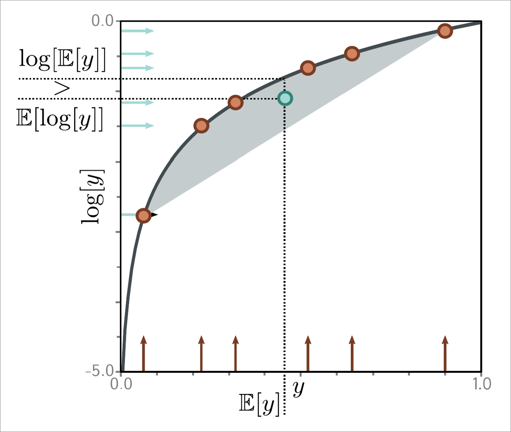
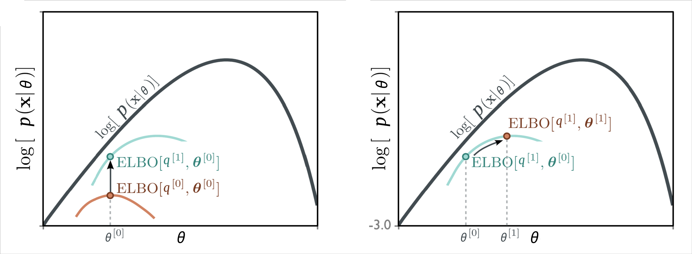

# Variational Inference & the VAE

---

## Mathematical Foundations

<div class="timeline-container" style="flex-direction: row;">
    <div style="width: 20%;">
        <div class="timeline-title">Calculus & Linear Algebra</div>
        <div class="timeline-text">Basis for optimization algorithms and machine learning model operations</div>
    </div>
    <div class="timeline" style="width: 80%; --start-year: 1676; --end-year: 1951;" data-timeline-fragments-select="1676:0,1805:0,1809:0,1847:0,1951:0">
        {{TIMELINE:timeline_calculus_linear_algebra}}
    </div>
</div>

<div class="timeline-container" style="flex-direction: row;">
    <div style="width: 20%;">
        <div class="timeline-title">Probability & Statistics</div>
        <div class="timeline-text">Basis for Bayesian methods, statistical inference, and generative models</div>
    </div>
    <div class="timeline" style="width: 80%; --start-year: 1676; --end-year: 1951;" data-timeline-fragments-select="1763:0,1812:0,1815:0,1922:0">
        {{TIMELINE:timeline_probability_statistics}}
    </div>
</div>

<div class="timeline-container" style="flex-direction: row;">
    <div style="width: 20%;">
        <div class="timeline-title">Information & Computation</div>
        <div class="timeline-text">Foundations of algorithmic thinking and information theory</div>
    </div>
    <div class="timeline" style="width: 80%; --start-year: 1676; --end-year: 1951;" data-timeline-fragments-select="1843:0,1936:0,1947:0,1948:0">
        {{TIMELINE:timeline_information_computation}}
    </div>
</div>

<div class="fragment" data-fragment-index="1"></div>

---

## Early History of Neural Networks

<div class="timeline-container" style="flex-direction: row;">
    <div style="width: 20%;">
        <div class="timeline-title">Architectures & Layers</div>
        <div class="timeline-text">Evolution of network architectures and layer innovations</div>
    </div>
    <div class="timeline" style="width: 80%; --start-year: 1943; --end-year: 2012;" data-timeline-fragments-select="1943:0,1957:0,1965:0,1979:0,1982:0,1989:0,2012:0">
        {{TIMELINE:timeline_early_nn_architectures}}
    </div>
</div>

<div class="timeline-container" style="flex-direction: row;">
    <div style="width: 20%;">
        <div class="timeline-title">Training & Optimization</div>
        <div class="timeline-text">Methods for efficient learning and gradient-based optimization</div>
    </div>
    <div class="timeline" style="width: 80%; --start-year: 1943; --end-year: 2012;" data-timeline-fragments-select="1967:0,1970:0,1986:0,1992:0,2009:0,2010:0,2012:0">
        {{TIMELINE:timeline_early_nn_training}}
    </div>
</div>

<div class="timeline-container" style="flex-direction: row;">
    <div style="width: 20%;">
        <div class="timeline-title">Software & Datasets</div>
        <div class="timeline-text">Tools, platforms, and milestones that enabled practical deep learning</div>
    </div>
    <div class="timeline" style="width: 80%; --start-year: 1943; --end-year: 2012;" data-timeline-fragments-select="2002:0,2007:0,">
        {{TIMELINE:timeline_early_nn_software}}
    </div>
</div>

<div class="fragment" data-fragment-index="2"></div>

---

## The Deep Learning Era

<!-- Layers & Architectures Timeline -->
<div class="timeline-container" style="flex-direction: row;">
    <div style="width: 20%;">
        <div class="timeline-title">Deep architectures</div>
        <div class="timeline-text">Deep architectures and generative models transforming AI capabilities</div>
    </div>
    <div class="timeline" style="width: 80%; --start-year: 2013; --end-year: 2023;" data-timeline-fragments-select="2013:1,2015:0,2016:0,2017:0,2021:0">
        {{TIMELINE:timeline_deep_architectures}}
    </div>
</div>

<div class="timeline-container" style="flex-direction: row;">
    <div style="width: 20%;">
        <div class="timeline-title">Training & Optimization</div>
        <div class="timeline-text">Advanced learning techniques and representation learning breakthroughs</div>
    </div>
    <div class="timeline" style="width: 80%; --start-year: 2013; --end-year: 2023;" data-timeline-fragments-select="2013:0,2014:0,2015:0,2016:0">
        {{TIMELINE:timeline_deep_training}}
    </div>
</div>

<div class="timeline-container" style="flex-direction: row;">
    <div style="width: 20%;">
        <div class="timeline-title">Software & Applications</div>
        <div class="timeline-text">Practical deployment and mainstream adoption of deep learning systems</div>
    </div>
    <div class="timeline" style="width: 80%; --start-year: 2013; --end-year: 2023;" data-timeline-fragments-select="2017:0,2018:0,2020:0,2022:0,2023:0">
        {{TIMELINE:timeline_deep_software}}
    </div>
</div>

---

## Recap: Latent Models & EM

<div style="font-size: 0.75em;">
<p><strong>Latent variable models:</strong> hidden $\mathbf{z}$ models complex data; marginal $p(\mathbf{x}|\boldsymbol{\theta}) = \int p(\mathbf{x}, \mathbf{z}|\boldsymbol{\theta}) \, d\mathbf{z}$.</p>
<p><strong>GMM (discrete latent):</strong> $p(\mathbf{x}|\boldsymbol{\theta}) = \sum_{k=1}^K \pi_k \, \mathcal{N}(\mathbf{x}|\boldsymbol{\mu}_k, \boldsymbol{\Sigma}_k)$ — tractable sum, but the <strong>log-of-sum</strong> blocks closed-form MLE.</p>
<p><strong>EM algorithm</strong> — iterate when direct MLE is intractable:</p>
<ul>
<li><strong>E-Step:</strong> responsibilities $\gamma_{ik} = p(z_i=k|\mathbf{x}_i, \boldsymbol{\theta}^{(t)})$ (soft assignments)</li>
<li><strong>M-Step:</strong> weighted MLE update of $\boldsymbol{\mu}_k, \boldsymbol{\Sigma}_k, \pi_k$</li>
</ul>
</div>

<div class="fragment highlight">
<p>We saw <em>that</em> EM works. Today: <strong>why</strong> does it work — and how does it generalize when the posterior becomes intractable?</p>
</div>

---

## Why Does EM Work?

<div style="font-size: 0.8em;">
<p>Our goal is to maximize the log marginal likelihood:</p>
<div class="formula">
$$
\log p_{X|\Theta}(\mathbf{X}|\boldsymbol{\theta}) = \sum_{i=1}^n \log \left( \sum_{k=1}^K \pi_k \cdot \mathcal{N}(\mathbf{x}_i|\boldsymbol{\mu}_k, \boldsymbol{\Sigma}_k) \right)
$$
</div>
</div>

<div class="fragment highlight">
<p>The obstacle is again the <strong>log of a sum</strong> — it couples all components and prevents a closed form. The fix: build a <strong>lower bound</strong> we <em>can</em> optimize.</p>
</div>

---

## Jensen's Inequality

<div style="font-size: 0.8em;">
<p>For a <strong>concave</strong> function $f$ (like $\log$) and any distribution $p$ over $z$:</p>
<div class="formula">
$$
f\left( \mathbb{E}_{z \sim p(z)}[g(z)] \right) \geq \mathbb{E}_{z \sim p(z)}\left[ f(g(z)) \right]
$$
</div>
<p>Applied to the logarithm with a discrete distribution:</p>
<div class="formula">
$$
\log \left( \sum_z p(z) \cdot g(z) \right) \geq \sum_z p(z) \cdot \log g(z)
$$
</div>
<p>The log of a weighted average is <strong>at least</strong> the weighted average of the logs.</p>
</div>

<div class="fragment appear-vanish image-overlay" data-fragment-index="2" style="top: 68%;">
    
    <div class="reference">
        Source: <a href="https://github.com/udlbook/udlbook" target="_blank">Understanding Deep Learning (Prince) - adapted</a>
    </div>
</div>

---

## The ELBO: Evidence Lower Bound

<div style="font-size: 0.68em;">
<p>Introduce a <strong>variational distribution</strong> $q(\mathbf{z}|\mathbf{x})$ over the latents and apply Jensen:</p>
<div class="formula">
$$
\begin{aligned}
\log p_{X|\Theta}(\mathbf{x}|\boldsymbol{\theta})
&= \log \left( \sum_{k} q(z=k|\mathbf{x}) \cdot \frac{p_{X,Z|\Theta}(\mathbf{x}, z=k|\boldsymbol{\theta})}{q(z=k|\mathbf{x})} \right) \\
&= \log \left( \mathbb{E}_{z \sim q(z|\mathbf{x})} \left[ \frac{p_{X,Z|\Theta}(\mathbf{x}, z|\boldsymbol{\theta})}{q(z|\mathbf{x})} \right] \right) \\
&\geq \mathbb{E}_{z \sim q(z|\mathbf{x})} \left[ \log \frac{p_{X,Z|\Theta}(\mathbf{x}, z|\boldsymbol{\theta})}{q(z|\mathbf{x})} \right] \quad \text{(Jensen)}
\end{aligned}
$$
</div>
<p>This lower bound is the <strong>Evidence Lower Bound (ELBO)</strong>:</p>
<div class="formula">
$$
\text{ELBO}(q, \boldsymbol{\theta}) = \mathbb{E}_{z \sim q(z|\mathbf{x})} \left[ \log \frac{p_{X,Z|\Theta}(\mathbf{x}, z|\boldsymbol{\theta})}{q(z|\mathbf{x})} \right]
$$
</div>
</div>

---

## Kullback–Leibler (KL) Divergence

<div style="font-size: 0.75em;">
<p>The <strong>KL divergence</strong> measures how different two distributions are:</p>
<div class="formula">
$$
D_{\text{KL}}(q \,\|\, p) = \mathbb{E}_{z \sim q(z)} \left[ \log \frac{q(z)}{p(z)} \right] = \sum_z q(z) \log \frac{q(z)}{p(z)}
$$
</div>
<table>
<thead>
<tr><th>Property</th><th>Meaning</th></tr>
</thead>
<tbody>
<tr><td>$D_{\text{KL}}(q \,\|\, p) \geq 0$</td><td>Always non-negative</td></tr>
<tr><td>$D_{\text{KL}}(q \,\|\, p) = 0 \iff q = p$</td><td>Zero only if the distributions are identical</td></tr>
<tr><td>$D_{\text{KL}}(q \,\|\, p) \neq D_{\text{KL}}(p \,\|\, q)$</td><td><strong>Not symmetric</strong> — order matters</td></tr>
</tbody>
</table>
</div>

---

## Evidence Decomposition

<div style="font-size: 0.68em;">
<p>Rewrite the ELBO using the chain rule $p(\mathbf{x}, z|\boldsymbol{\theta}) = p(z|\mathbf{x}, \boldsymbol{\theta}) \cdot p(\mathbf{x}|\boldsymbol{\theta})$:</p>
<div class="formula">
$$
\begin{aligned}
\text{ELBO}(q, \boldsymbol{\theta})
&= \mathbb{E}_{z \sim q} \left[ \log p(z|\mathbf{x}, \boldsymbol{\theta}) \right] + \log p(\mathbf{x}|\boldsymbol{\theta}) - \mathbb{E}_{z \sim q} \left[ \log q(z|\mathbf{x}) \right] \\
&= \log p(\mathbf{x}|\boldsymbol{\theta}) - D_{\text{KL}}\left( q(z|\mathbf{x}) \,\|\, p(z|\mathbf{x}, \boldsymbol{\theta}) \right)
\end{aligned}
$$
</div>
<p>Rearranging gives the <strong>fundamental decomposition</strong>:</p>
<div class="formula">
$$
\log p(\mathbf{x}|\boldsymbol{\theta}) = \text{ELBO}(q, \boldsymbol{\theta}) + D_{\text{KL}}\left( q(z|\mathbf{x}) \,\|\, p(z|\mathbf{x}, \boldsymbol{\theta}) \right)
$$
</div>
</div>

<div class="fragment highlight" style="font-size: 0.72em;">
<p>Since $D_{\text{KL}} \geq 0$, the ELBO is a <strong>lower bound</strong> on the evidence. The <strong>gap</strong> is the KL from $q$ to the true posterior — and it is <strong>zero (tight) exactly when</strong> $q = p(z|\mathbf{x}, \boldsymbol{\theta})$.</p>
</div>

---

## The E-Step: Making the Bound Tight

<div style="font-size: 0.72em;">
<p>At iteration $t$ with parameters $\boldsymbol{\theta}^{(t)}$, maximize the ELBO w.r.t. $q$. Since $\log p(\mathbf{x}|\boldsymbol{\theta}^{(t)})$ is constant in $q$, this <strong>minimizes the KL</strong>:</p>
<div class="formula">
$$
q^{(t+1)}(z|\mathbf{x}) = \arg\min_{q} D_{\text{KL}}\left( q(z|\mathbf{x}) \,\|\, p(z|\mathbf{x}, \boldsymbol{\theta}^{(t)}) \right) = p(z|\mathbf{x}, \boldsymbol{\theta}^{(t)})
$$
</div>
<p>For GMMs this is exactly the responsibility update:</p>
<div class="formula">
$$
q^{(t+1)}(z=k|\mathbf{x}_i) = \frac{\pi_k^{(t)} \, \mathcal{N}(\mathbf{x}_i|\boldsymbol{\mu}_k^{(t)}, \boldsymbol{\Sigma}_k^{(t)})}{\sum_{j} \pi_j^{(t)} \, \mathcal{N}(\mathbf{x}_i|\boldsymbol{\mu}_j^{(t)}, \boldsymbol{\Sigma}_j^{(t)})} = \gamma_{ik}
$$
</div>
<p>After the E-step the bound is <strong>tight</strong>: &nbsp; $\log p(\mathbf{x}|\boldsymbol{\theta}^{(t)}) = \text{ELBO}(q^{(t+1)}, \boldsymbol{\theta}^{(t)})$.</p>
</div>

<div class="fragment appear-vanish image-overlay" data-fragment-index="3" style="width: 88%;">
    
    <div class="reference">
        Source: <a href="https://github.com/udlbook/udlbook" target="_blank">Understanding Deep Learning (Prince) - adapted</a>
    </div>
</div>

---

## The M-Step: Raising the Bound

<div style="font-size: 0.72em;">
<p>Now fix $q = q^{(t+1)}$ and maximize the ELBO w.r.t. $\boldsymbol{\theta}$. The entropy term $-\mathbb{E}_q[\log q]$ is constant in $\boldsymbol{\theta}$, leaving the <strong>Q-function</strong> (expected complete-data log-likelihood):</p>
<div class="formula">
$$
\begin{aligned}
Q(\boldsymbol{\theta};\, \boldsymbol{\theta}^{(t)})
&= \sum_{i} \mathbb{E}_{z \sim q^{(t+1)}(z|\mathbf{x}_i)} \left[ \log p_{X,Z|\Theta}(\mathbf{x}_i, z|\boldsymbol{\theta}) \right] \\
&= \sum_{i} \sum_{k} \underbrace{q^{(t+1)}(z=k|\mathbf{x}_i)}_{=\, \gamma_{ik}} \; \log \underbrace{p_{X,Z|\Theta}(\mathbf{x}_i, z=k|\boldsymbol{\theta})}_{=\, \pi_k \, \mathcal{N}(\mathbf{x}_i | \boldsymbol{\mu}_k, \boldsymbol{\Sigma}_k)}
\end{aligned}
$$
</div>
<p>Substituting the E-step responsibilities $\gamma_{ik}$ and the factorized GMM joint:</p>
<div class="formula">
$$
\boldsymbol{\theta}^{(t+1)} = \arg\max_{\boldsymbol{\theta}} \sum_{i} \sum_{k} \gamma_{ik} \left[ \log \pi_k + \log \mathcal{N}(\mathbf{x}_i | \boldsymbol{\mu}_k, \boldsymbol{\Sigma}_k) \right]
$$
</div>
<div class="fragment" data-fragment-index="1">
<p>The log is now <strong>inside</strong> the sum over $k$ — each term involves only one component, so maximization is <strong>closed-form</strong> (the familiar weighted mean / covariance / mixing-weight updates). This <strong>raises</strong> the ELBO.</p>
</div>
</div>

---

## Why EM Converges

<div style="font-size: 0.72em;">
<p>Chaining the two steps:</p>
<div class="formula">
$$
\log p(\mathbf{x}|\boldsymbol{\theta}^{(t+1)}) \;\geq\; \text{ELBO}(q^{(t+1)}, \boldsymbol{\theta}^{(t+1)}) \;\geq\; \text{ELBO}(q^{(t+1)}, \boldsymbol{\theta}^{(t)}) \;=\; \log p(\mathbf{x}|\boldsymbol{\theta}^{(t)})
$$
</div>
<ul>
<li><strong>E-step</strong> makes the bound tight (KL $= 0$): last equality</li>
<li><strong>M-step</strong> raises the ELBO: middle inequality</li>
<li><strong>KL $\geq 0$</strong> at the new $\boldsymbol{\theta}$: first inequality</li>
</ul>
</div>

<div class="fragment highlight" style="font-size: 0.8em;">
<p>The log-likelihood is <strong>monotonically non-decreasing</strong> → EM converges to a local maximum. This E-then-M "tighten then raise" pattern is the template for the VAE.</p>
</div>

---

## Where the Likelihood Gain Comes From

<div style="font-size: 0.75em;">
<p>The likelihood is not manufactured from nothing — EM is <strong>coordinate ascent on one bounded objective</strong> $F(q, \boldsymbol{\theta}) = \mathbb{E}_q[\log p(\mathbf{x}, \mathbf{z}|\boldsymbol{\theta})] - \mathbb{E}_q[\log q]$.</p>
<ul>
<li><strong>E-step</strong> moves only $q$ → the log-likelihood $\log p(\mathbf{x}|\boldsymbol{\theta})$ is <strong>unchanged</strong>; it just sets $D_{\text{KL}} = 0$ and tightens the bound (no likelihood spent).</li>
<li><strong>M-step</strong> moves $\boldsymbol{\theta}$ → a genuine weighted-MLE fit to the <strong>data</strong> — this is the "fuel."</li>
</ul>
</div>

<div class="fragment" data-fragment-index="1" style="font-size: 0.72em;">
<p>Each round's gain splits into two non-negative but <strong>bounded</strong> pieces (after the M-step, $q$ is stale, so the KL gap reopens):</p>
<div class="formula">
$$
\underbrace{\log p(\mathbf{x}|\boldsymbol{\theta}^{(t+1)}) - \log p(\mathbf{x}|\boldsymbol{\theta}^{(t)})}_{\Delta \,\geq\, 0} = \underbrace{\big[F(q, \boldsymbol{\theta}^{(t+1)}) - F(q, \boldsymbol{\theta}^{(t)})\big]}_{\text{M-step raised the ELBO}} + \underbrace{D_{\text{KL}}\big(q \,\|\, p(\mathbf{z}|\mathbf{x}, \boldsymbol{\theta}^{(t+1)})\big)}_{\text{gap that reopened}}
$$
</div>
</div>

<div class="fragment highlight" data-fragment-index="2" style="font-size: 0.78em;">
<p>$\log p(\mathbf{x}|\boldsymbol{\theta})$ has a <strong>ceiling</strong> (fixed dataset) → a monotone, bounded sequence <strong>must converge</strong>. Not a perpetuum mobile but a ball <strong>relaxing to the bottom of a landscape</strong>: it moves while the parameters still mis-fit the data, and stops at a <strong>local</strong> optimum. The energy was in the data all along.</p>
</div>

---

## From GMM to Deep Latent Models

<div style="font-size: 0.72em;">
<p>GMM was tractable because the latent was <strong>discrete</strong> and the components <strong>Gaussian</strong>:</p>
<table>
<thead>
<tr><th>Component</th><th>GMM choice</th><th>Why tractable</th></tr>
</thead>
<tbody>
<tr><td>Latent $z$</td><td>Discrete $z \in \{1, ..., K\}$</td><td>Sum over $K$, not an integral</td></tr>
<tr><td>Prior $p(z)$</td><td>Categorical $\pi_k$</td><td>Simple mixing weights</td></tr>
<tr><td>Decoder $p(\mathbf{x}|z)$</td><td>Gaussian</td><td>Closed-form posterior</td></tr>
</tbody>
</table>
<div class="fragment" data-fragment-index="1">
<p><strong>We want more expressive models:</strong></p>
<ul>
<li><strong>Continuous latent</strong> $\mathbf{z} \in \mathbb{R}^d$ — smooth factors of variation</li>
<li><strong>Neural-network decoder</strong> $p(\mathbf{x}|\mathbf{z}, \boldsymbol{\theta}) = \mathcal{N}(\mathbf{x}|\boldsymbol{\mu}_{\boldsymbol{\theta}}(\mathbf{z}), \sigma^2 \mathbf{I})$ — mean is a network output</li>
</ul>
<p>This is the <strong>deep latent variable model</strong> — but what breaks?</p>
</div>
</div>

---

## The Intractable Posterior Problem

<div style="font-size: 0.72em;">
<p>The E-step needs the posterior $p(\mathbf{z}|\mathbf{x}, \boldsymbol{\theta})$:</p>
<div class="formula">
$$
p(\mathbf{z}|\mathbf{x}, \boldsymbol{\theta}) = \frac{p(\mathbf{x}|\mathbf{z}, \boldsymbol{\theta}) \, p(\mathbf{z})}{\int p(\mathbf{x}|\mathbf{z}', \boldsymbol{\theta}) \, p(\mathbf{z}') \, d\mathbf{z}'}
$$
</div>
<p><strong>The denominator is the problem:</strong></p>
<table>
<thead>
<tr><th>Model</th><th>Decoder</th><th>Marginal $p(\mathbf{x})$</th><th>Posterior $p(\mathbf{z}|\mathbf{x})$</th></tr>
</thead>
<tbody>
<tr><td>GMM</td><td>Gaussian</td><td>Finite sum</td><td><strong>Tractable</strong></td></tr>
<tr><td>Deep LVM</td><td>Neural network</td><td>Intractable integral</td><td><strong>Intractable</strong></td></tr>
</tbody>
</table>
</div>

<div class="fragment highlight" style="font-size: 0.75em;">
<p>With $\boldsymbol{\mu}_{\boldsymbol{\theta}}(\mathbf{z}) = \text{NeuralNet}(\mathbf{z})$ over a continuous $\mathbf{z}$, the marginal has <strong>no closed form</strong> — so we <strong>cannot compute the exact E-step</strong>.</p>
</div>

---

## Learn the Posterior Approximation

<div style="font-size: 0.72em;">
<p><strong>Key idea:</strong> if we can't compute $p(\mathbf{z}|\mathbf{x}, \boldsymbol{\theta})$, <strong>learn to approximate it</strong> with an <strong>encoder network</strong> $q(\mathbf{z}|\mathbf{x}, \boldsymbol{\phi})$:</p>
<div class="formula">
$$
q(\mathbf{z}|\mathbf{x}, \boldsymbol{\phi}) = \mathcal{N}\left(\mathbf{z} \,|\, \boldsymbol{\mu}_{\boldsymbol{\phi}}(\mathbf{x}), \text{diag}(\boldsymbol{\sigma}^2_{\boldsymbol{\phi}}(\mathbf{x}))\right)
$$
</div>
<ul>
<li>$\boldsymbol{\mu}_{\boldsymbol{\phi}}(\mathbf{x}), \boldsymbol{\sigma}_{\boldsymbol{\phi}}(\mathbf{x})$: neural networks outputting mean and standard deviation</li>
<li>A <strong>single encoder</strong> handles all datapoints — one forward pass per $\mathbf{x}$, and it generalizes to unseen data</li>
</ul>
</div>

<div class="fragment highlight" style="font-size: 0.75em;">
<p>This is <strong>amortized inference</strong>: instead of solving a separate optimization for each $\mathbf{x}$ (as EM's E-step does), we amortize the cost across the dataset by sharing encoder parameters $\boldsymbol{\phi}$.</p>
</div>

---

## VAE vs GMM: The Setup

<div style="font-size: 0.68em;">
<p>Same ELBO decomposition, &nbsp; $\log p(\mathbf{x}|\boldsymbol{\theta}) = \text{ELBO}(q, \boldsymbol{\theta}) + D_{\text{KL}}(q(\mathbf{z}|\mathbf{x}) \,\|\, p(\mathbf{z}|\mathbf{x}, \boldsymbol{\theta}))$, but:</p>
<table>
<thead>
<tr><th>Component</th><th>GMM</th><th>VAE</th></tr>
</thead>
<tbody>
<tr><td><strong>Latent</strong> $\mathbf{z}$</td><td>Discrete $z \in \{1, ..., K\}$</td><td>Continuous $\mathbf{z} \in \mathbb{R}^d$</td></tr>
<tr><td><strong>Prior</strong> $p(\mathbf{z})$</td><td>Categorical $\pi_k$</td><td>Standard Gaussian $\mathcal{N}(\mathbf{0}, \mathbf{I})$</td></tr>
<tr><td><strong>Decoder</strong> $p(\mathbf{x}|\mathbf{z}, \boldsymbol{\theta})$</td><td>Gaussian $\mathcal{N}(\boldsymbol{\mu}_k, \boldsymbol{\Sigma}_k)$</td><td>Neural network</td></tr>
<tr><td><strong>Posterior</strong> $q$</td><td>Exact: $q = p(z|\mathbf{x}, \boldsymbol{\theta})$</td><td>Learned encoder $q(\mathbf{z}|\mathbf{x}, \boldsymbol{\phi})$</td></tr>
<tr><td><strong>Parameters</strong></td><td>$\{\boldsymbol{\mu}_k, \boldsymbol{\Sigma}_k, \pi_k\}$</td><td>$\boldsymbol{\theta}$ (decoder), $\boldsymbol{\phi}$ (encoder)</td></tr>
</tbody>
</table>
</div>

<div class="fragment highlight" style="font-size: 0.75em;">
<p>Because we cannot make the bound tight, we no longer alternate E/M. Instead we optimize <strong>both</strong> $\boldsymbol{\theta}$ and $\boldsymbol{\phi}$ <strong>jointly</strong> by gradient ascent on the ELBO.</p>
</div>

---

## The VAE ELBO

<div style="font-size: 0.7em;">
<p>Start from the ELBO with the learned encoder and apply the chain rule $p(\mathbf{x}, \mathbf{z} | \boldsymbol{\theta}) = p(\mathbf{x}|\mathbf{z}, \boldsymbol{\theta}) \, p(\mathbf{z})$:</p>
<div class="formula">
$$
\text{ELBO}(\boldsymbol{\phi}, \boldsymbol{\theta}) = \underbrace{\mathbb{E}_{\mathbf{z} \sim q(\mathbf{z}|\mathbf{x}, \boldsymbol{\phi})} \left[ \log p(\mathbf{x}|\mathbf{z}, \boldsymbol{\theta}) \right]}_{\text{Reconstruction term}} - \underbrace{D_{\text{KL}}\left( q(\mathbf{z}|\mathbf{x}, \boldsymbol{\phi}) \,\|\, p(\mathbf{z}) \right)}_{\text{Regularization term}}
$$
</div>
<p>We maximize it jointly over both networks:</p>
<div class="formula">
$$
\boldsymbol{\phi}^*, \boldsymbol{\theta}^* = \arg\max_{\boldsymbol{\phi}, \boldsymbol{\theta}} \sum_{i=1}^{n} \text{ELBO}(\boldsymbol{\phi}, \boldsymbol{\theta}; \mathbf{x}_i)
$$
</div>
</div>

---

## Understanding the VAE Objective

<div style="font-size: 0.72em;">
<div class="formula">
$$
\text{ELBO} = \underbrace{\mathbb{E}_{\mathbf{z} \sim q(\mathbf{z}|\mathbf{x}, \boldsymbol{\phi})} \left[ \log p(\mathbf{x}|\mathbf{z}, \boldsymbol{\theta}) \right]}_{\text{Reconstruction}} - \underbrace{D_{\text{KL}}\left( q(\mathbf{z}|\mathbf{x}, \boldsymbol{\phi}) \,\|\, p(\mathbf{z}) \right)}_{\text{Regularization}}
$$
</div>
<div style="display: flex; gap: 2em;">
<div style="flex: 1;">
<p><strong>Reconstruction</strong> — how well the decoder rebuilds $\mathbf{x}$ from $\mathbf{z} \sim q$. Encourages the latent code to <strong>preserve information</strong> about $\mathbf{x}$.</p>
</div>
<div style="flex: 1;">
<p><strong>Regularization</strong> — how close the encoder is to the prior $\mathcal{N}(\mathbf{0}, \mathbf{I})$. Keeps the latent space <strong>well-structured</strong> and prevents the encoder from collapsing each $\mathbf{x}$ to a spike.</p>
</div>
</div>
</div>

<div class="fragment highlight" style="font-size: 0.75em;">
<p><strong>Trade-off:</strong> reconstruction wants $q$ specific to each $\mathbf{x}$; regularization wants $q$ near the prior. Two obstacles remain: the reconstruction <strong>expectation is intractable</strong>, and it <strong>depends on $\boldsymbol{\phi}$ through sampling</strong>.</p>
</div>

---

## Monte Carlo Estimation

<div style="font-size: 0.72em;">
<p>The reconstruction term is an intractable integral:</p>
<div class="formula">
$$
\mathbb{E}_{\mathbf{z} \sim q(\mathbf{z}|\mathbf{x}, \boldsymbol{\phi})} \left[ \log p(\mathbf{x}|\mathbf{z}, \boldsymbol{\theta}) \right] = \int q(\mathbf{z}|\mathbf{x}, \boldsymbol{\phi}) \log p(\mathbf{x}|\mathbf{z}, \boldsymbol{\theta}) \, d\mathbf{z}
$$
</div>
<div class="fragment" data-fragment-index="1">
<p><strong>Monte Carlo:</strong> approximate the expectation with samples $\mathbf{z}^{(l)} \sim q(\mathbf{z}|\mathbf{x}, \boldsymbol{\phi})$:</p>
<div class="formula">
$$
\mathbb{E}_{\mathbf{z} \sim q} \left[ \log p(\mathbf{x}|\mathbf{z}, \boldsymbol{\theta}) \right] \approx \frac{1}{L} \sum_{l=1}^{L} \log p(\mathbf{x}|\mathbf{z}^{(l)}, \boldsymbol{\theta})
$$
</div>
<p>Unbiased, variance $\propto 1/L$ (Law of Large Numbers). <strong>In practice $L=1$ suffices</strong> during training.</p>
</div>
</div>

<div class="fragment image-overlay" data-fragment-index="4" style="text-align: center; width: 1200px; height: auto;">
    <video width="100%" data-autoplay loop muted controls>
        <source src="assets/videos/10-variational_autoencoder/1080p60/MonteCarloConvergence.mp4" type="video/mp4">
        Your browser does not support the video tag.
    </video>
</div>

---

## Gradient w.r.t. Decoder $\boldsymbol{\theta}$

<div style="font-size: 0.72em;">
<p>The gradient w.r.t. the <strong>decoder</strong> is straightforward:</p>
<div class="formula">
$$
\nabla_{\boldsymbol{\theta}} \frac{1}{L} \sum_{l=1}^{L} \log p(\mathbf{x}|\mathbf{z}^{(l)}, \boldsymbol{\theta}) = \frac{1}{L} \sum_{l=1}^{L} \nabla_{\boldsymbol{\theta}} \log p(\mathbf{x}|\mathbf{z}^{(l)}, \boldsymbol{\theta})
$$
</div>
<ul>
<li>The samples $\mathbf{z}^{(l)}$ come from the <strong>encoder</strong> — from the decoder's view they are just a <strong>fixed input</strong></li>
<li>No sampling w.r.t. $\boldsymbol{\theta}$ → <strong>standard backpropagation</strong> works:</li>
</ul>
<div class="formula">
$$
\mathbf{z}^{(l)} \xrightarrow{\text{Decoder}_{\boldsymbol{\theta}}} \hat{\mathbf{x}} \xrightarrow{\text{loss}} \log p(\mathbf{x}|\mathbf{z}^{(l)}, \boldsymbol{\theta})
$$
</div>
</div>

---

## Gradient w.r.t. Encoder $\boldsymbol{\phi}$

<div style="font-size: 0.72em;">
<p>The <strong>encoder</strong> gradient is the hard one — the samples themselves depend on $\boldsymbol{\phi}$:</p>
<div class="formula">
$$
\nabla_{\boldsymbol{\phi}} \frac{1}{L} \sum_{l=1}^{L} \log p(\mathbf{x}|\mathbf{z}^{(l)}, \boldsymbol{\theta}), \qquad \mathbf{z}^{(l)} \sim q(\mathbf{z}|\mathbf{x}, \boldsymbol{\phi})
$$
</div>
<ul>
<li>Sampling $\mathbf{z} \sim q(\mathbf{z}|\mathbf{x}, \boldsymbol{\phi})$ is a <strong>stochastic operation</strong></li>
<li><strong>Gradients don't flow through random sampling</strong> — we cannot backpropagate through the sampling step</li>
</ul>
</div>

<div class="fragment highlight" style="font-size: 0.78em;">
<table>
<thead>
<tr><th>Parameter</th><th>Difficulty</th></tr>
</thead>
<tbody>
<tr><td>$\boldsymbol{\theta}$ (decoder)</td><td>Standard backprop — $\mathbf{z}$ is just an input</td></tr>
<tr><td>$\boldsymbol{\phi}$ (encoder)</td><td><strong>Blocked</strong> — $\mathbf{z}$ depends on $\boldsymbol{\phi}$ via sampling</td></tr>
</tbody>
</table>
</div>

---

## The Reparameterization Trick

<div style="font-size: 0.72em;">
<p><strong>Rewrite the sampling to separate randomness from parameters.</strong></p>
<div style="display: flex; gap: 2em;">
<div style="flex: 1;">
<p><strong>Before</strong> (non-differentiable):</p>
<div class="formula">
$$
\mathbf{z} \sim \mathcal{N}(\boldsymbol{\mu}_{\boldsymbol{\phi}}(\mathbf{x}), \text{diag}(\boldsymbol{\sigma}^2_{\boldsymbol{\phi}}(\mathbf{x})))
$$
</div>
</div>
<div style="flex: 1;">
<p><strong>After</strong> (differentiable):</p>
<div class="formula">
$$
\mathbf{z} = \boldsymbol{\mu}_{\boldsymbol{\phi}}(\mathbf{x}) + \boldsymbol{\sigma}_{\boldsymbol{\phi}}(\mathbf{x}) \odot \boldsymbol{\epsilon}, \quad \boldsymbol{\epsilon} \sim \mathcal{N}(\mathbf{0}, \mathbf{I})
$$
</div>
</div>
</div>
<ul>
<li>$\boldsymbol{\epsilon}$ is drawn from a <strong>fixed</strong> distribution, independent of $\boldsymbol{\phi}$</li>
<li>$\mathbf{z}$ is now a <strong>deterministic function</strong> of $\boldsymbol{\phi}$ given $\boldsymbol{\epsilon}$ — gradients flow through $\boldsymbol{\mu}_{\boldsymbol{\phi}}, \boldsymbol{\sigma}_{\boldsymbol{\phi}}$</li>
</ul>
</div>

<div class="fragment highlight" style="font-size: 0.75em;">
<p>The expectation becomes $\mathbb{E}_{\boldsymbol{\epsilon} \sim \mathcal{N}(\mathbf{0}, \mathbf{I})}\left[ f(\boldsymbol{\mu}_{\boldsymbol{\phi}} + \boldsymbol{\sigma}_{\boldsymbol{\phi}} \odot \boldsymbol{\epsilon}) \right]$ — now $\nabla_{\boldsymbol{\phi}}$ moves <strong>inside</strong> the expectation, and $L=1$ sample gives an unbiased gradient.</p>
</div>

---

## The KL Term: Closed Form

<div style="font-size: 0.7em;">
<p>For $q(\mathbf{z}|\mathbf{x}, \boldsymbol{\phi}) = \mathcal{N}(\boldsymbol{\mu}, \text{diag}(\boldsymbol{\sigma}^2))$ and prior $p(\mathbf{z}) = \mathcal{N}(\mathbf{0}, \mathbf{I})$, the KL between two Gaussians has a <strong>closed form</strong> — no Monte Carlo needed:</p>
<div class="formula">
$$
D_{\text{KL}}\left( q(\mathbf{z}|\mathbf{x}, \boldsymbol{\phi}) \,\|\, p(\mathbf{z}) \right) = \frac{1}{2} \sum_{j=1}^{d} \left( \sigma_j^2 + \mu_j^2 - 1 - \log \sigma_j^2 \right)
$$
</div>
<p>where $j$ indexes the $d$ dimensions of the latent vector $\mathbf{z} \in \mathbb{R}^d$. Gradients w.r.t. $\boldsymbol{\phi}$ are direct.</p>
</div>

<div class="fragment highlight" style="font-size: 0.75em;">
<p>So the two ELBO terms are handled differently: <strong>reconstruction</strong> via Monte Carlo + reparameterization, <strong>regularization</strong> via this closed form.</p>
</div>

---

## Decoder Likelihood: From Gaussian to MSE

<div style="font-size: 0.7em;">
<p>With a Gaussian decoder $p(\mathbf{x}|\mathbf{z}, \boldsymbol{\theta}) = \mathcal{N}(\mathbf{x} | \boldsymbol{\mu}_{\boldsymbol{\theta}}(\mathbf{z}), \sigma^2 \mathbf{I})$, take the log:</p>
<div class="formula">
$$
\log p(\mathbf{x}|\mathbf{z}, \boldsymbol{\theta}) = -\frac{1}{2\sigma^2} \|\mathbf{x} - \boldsymbol{\mu}_{\boldsymbol{\theta}}(\mathbf{z})\|^2 + \text{const}
$$
</div>
<p>Since $\sigma^2$ is a fixed constant:</p>
<div class="formula">
$$
\max_{\boldsymbol{\theta}} \log p(\mathbf{x}|\mathbf{z}, \boldsymbol{\theta}) \quad \Longleftrightarrow \quad \min_{\boldsymbol{\theta}} \|\mathbf{x} - \boldsymbol{\mu}_{\boldsymbol{\theta}}(\mathbf{z})\|^2
$$
</div>
</div>

<div class="fragment highlight" style="font-size: 0.75em;">
<p>Maximizing the Gaussian log-likelihood <strong>is</strong> minimizing <strong>mean squared error</strong> — exactly the MLE → loss link from Lecture 1, now applied to the decoder ($\hat{\mathbf{x}} = \boldsymbol{\mu}_{\boldsymbol{\theta}}(\mathbf{z})$).</p>
</div>

---

## The Practical VAE Loss

<div style="font-size: 0.68em;">
<p>Substituting the Gaussian decoder and negating the ELBO gives the loss:</p>
<div class="formula">
$$
\mathcal{L}_{\text{VAE}} = \underbrace{\|\mathbf{x} - \hat{\mathbf{x}}\|^2}_{\text{Reconstruction (MSE)}} + \underbrace{\beta \cdot D_{\text{KL}}(q(\mathbf{z}|\mathbf{x}, \boldsymbol{\phi}) \,\|\, p(\mathbf{z}))}_{\text{KL regularization}}
$$
</div>
<div class="fragment" data-fragment-index="1">
<table>
<thead>
<tr><th>$\beta$</th><th>Effect</th></tr>
</thead>
<tbody>
<tr><td>$\beta = 1$</td><td>Standard VAE (original formulation)</td></tr>
<tr><td>$\beta < 1$</td><td>Better reconstructions, less regularized latent space</td></tr>
<tr><td>$\beta > 1$</td><td><strong>$\beta$-VAE</strong>: stronger regularization, more disentangled latents</td></tr>
</tbody>
</table>
</div>
<div class="fragment" data-fragment-index="2">
<p>The relation $\beta = 2\sigma^2$ shows $\beta$ implicitly sets the assumed decoder variance — larger $\beta$ ⇒ noisier decoder.</p>
</div>
</div>

---

## VAE Training Algorithm

<div style="font-size: 0.68em;">

```text
Initialize: encoder parameters phi, decoder parameters theta

For each minibatch {x_1, ..., x_m}:

    # Encoder forward pass
    (mu_i, sigma_i) = Encoder_phi(x_i)

    # Reparameterize (sample latent codes)
    eps_i ~ N(0, I)
    z_i   = mu_i + sigma_i * eps_i

    # Decoder forward pass
    x_hat_i = Decoder_theta(z_i)

    # Loss
    L_recon = (1/m) sum_i || x_i - x_hat_i ||^2
    L_KL    = (1/m) sum_i sum_j (sigma_ij^2 + mu_ij^2 - 1 - log sigma_ij^2) / 2
    L       = L_recon + beta * L_KL

    # Backprop through decoder AND encoder (reparameterization), update theta, phi (Adam)
```

</div>

---

## GMM vs VAE: Optimization Comparison

<div style="font-size: 0.62em;">
<table>
<thead>
<tr><th align="left">Aspect</th><th align="left">GMM (EM)</th><th align="left">VAE</th></tr>
</thead>
<tbody>
<tr><td align="left"><strong>E-step / Encoder</strong></td><td align="left">Compute $\gamma_{ik}$ exactly</td><td align="left">Forward pass $(\boldsymbol{\mu}, \boldsymbol{\sigma}) = \text{Encoder}_{\boldsymbol{\phi}}(\mathbf{x})$</td></tr>
<tr><td align="left"><strong>Posterior</strong></td><td align="left">Exact (tractable)</td><td align="left">Approximate (learned)</td></tr>
<tr><td align="left"><strong>Sampling</strong></td><td align="left">Weighted sum over $K$</td><td align="left">Monte Carlo: $\mathbf{z} = \boldsymbol{\mu} + \boldsymbol{\sigma} \odot \boldsymbol{\epsilon}$</td></tr>
<tr><td align="left"><strong>M-step / Decoder</strong></td><td align="left">Closed-form weighted MLE</td><td align="left">Gradient descent on NN</td></tr>
<tr><td align="left"><strong>Joint optimization</strong></td><td align="left">Alternating (E then M)</td><td align="left">Simultaneous SGD on $\boldsymbol{\theta}, \boldsymbol{\phi}$</td></tr>
<tr><td align="left"><strong>KL gap</strong></td><td align="left">Zero (ELBO is tight)</td><td align="left">Non-zero (approximation gap)</td></tr>
</tbody>
</table>
</div>

<div class="fragment highlight" style="font-size: 0.78em;">
<p><strong>VAE trades exactness for expressiveness:</strong> GMM gives exact inference with a limited model; the VAE gives approximate inference with a powerful neural-network model.</p>
</div>

---

## Summary: Optimizing the VAE

<div style="font-size: 0.72em;">
<div class="formula">
$$
\text{ELBO}(\boldsymbol{\phi}, \boldsymbol{\theta}; \mathbf{x}) = \mathbb{E}_{\mathbf{z} \sim q(\mathbf{z}|\mathbf{x}, \boldsymbol{\phi})} \left[ \log p(\mathbf{x}|\mathbf{z}, \boldsymbol{\theta}) \right] - D_{\text{KL}}\left( q(\mathbf{z}|\mathbf{x}, \boldsymbol{\phi}) \,\|\, p(\mathbf{z}) \right)
$$
</div>
<table>
<thead>
<tr><th>Challenge</th><th>Solution</th></tr>
</thead>
<tbody>
<tr><td>Intractable posterior $p(\mathbf{z}|\mathbf{x})$</td><td>Learn an encoder $q(\mathbf{z}|\mathbf{x}, \boldsymbol{\phi})$ (amortized inference)</td></tr>
<tr><td>Intractable reconstruction expectation</td><td>Monte Carlo sampling ($L=1$ suffices)</td></tr>
<tr><td>Non-differentiable sampling</td><td>Reparameterization trick</td></tr>
<tr><td>KL to the prior</td><td>Closed form (Gaussian–Gaussian)</td></tr>
</tbody>
</table>
<p><strong>The through-line:</strong> EM's ELBO, generalized to intractable posteriors by learning the inference network.</p>
</div>

---

## VAE Architecture Overview

<div style="text-align: center; width: 100%; height: auto;">
    <video width="80%" data-autoplay loop muted controls>
        <source src="assets/videos/10-variational_autoencoder/1080p60/VAEArchitecture.mp4" type="video/mp4">
        Your browser does not support the video tag.
    </video>
</div>

---

# Questions?
